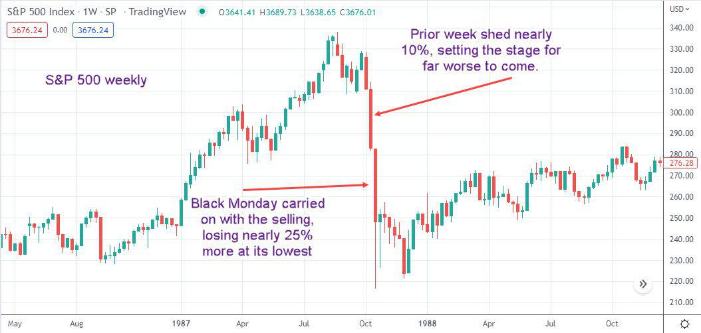

## Table of Contents

## What is a market crash?

A market crash is when the prices of stocks and other investments fall a lot in a short time. It can happen suddenly and make people lose a lot of money. A crash can be caused by many things, like bad news about the economy, big changes in politics, or when many people start selling their investments at the same time.

When a market crash happens, it can scare people and make them worried about their money. It can also affect the whole economy because businesses might find it harder to get money to grow. But, markets usually recover over time, and people can learn from crashes to make better choices about their investments in the future.

## Why is October known for market crashes?

October has a history of big market crashes, which is why some people call it a scary month for the stock market. One of the most famous crashes happened on October 29, 1929, known as Black Tuesday. This crash started the Great Depression, a time when many people lost their jobs and money. Another big crash happened on October 19, 1987, called Black Monday. On that day, stock prices fell a lot all over the world, and it scared a lot of people.

People remember these crashes, so October can make investors nervous. When people get nervous, they might start selling their stocks quickly, which can make prices go down even more. But it's important to know that crashes can happen any time of the year, not just in October. Still, the history of big crashes in October makes it a month that many investors watch closely.

## Can you list some major October market crashes in history?

October is known for some big market crashes. The most famous one happened on October 29, 1929, called Black Tuesday. This crash started the Great Depression, a really tough time when many people lost their jobs and money. It was a big shock to everyone and changed how people thought about the stock market.

Another big crash happened on October 19, 1987, known as Black Monday. On that day, stock prices dropped a lot all over the world. It was so bad that many people got scared and started selling their stocks quickly, which made the prices go down even more. This crash showed how fast things can change in the stock market.

These two crashes in October made people remember the month as a scary time for the stock market. But crashes can happen any time of the year, not just in October. Still, because of these big events, investors often pay extra attention to what's happening in the market during October.

## What were the causes of the 1929 Wall Street Crash?

The 1929 Wall Street Crash, also known as Black Tuesday, happened because of many reasons. One big reason was that people were buying stocks with borrowed money, hoping to sell them later for a higher price. This is called buying on margin. When stock prices started to fall, people had to sell their stocks quickly to pay back their loans, which made prices fall even more. Another reason was that there was too much buying and selling of stocks, which made the market very unstable. People were excited and kept buying more and more, creating a bubble that eventually burst.

Also, the economy was not as strong as people thought. Many industries, like farming, were struggling, and this made people worried. When bad news started to spread, it made more people sell their stocks, which led to the crash. Banks were also affected because they had lent a lot of money to people to buy stocks. When the stock market crashed, many people couldn't pay back their loans, and some banks failed. All these problems together caused the big crash on October 29, 1929, and started the Great Depression.

## How did the 1987 Black Monday crash affect the global economy?

The 1987 Black Monday crash had a big impact on the global economy. On October 19, 1987, stock markets around the world fell a lot. In the United States, the stock market dropped by more than 20% in one day, which was a record at the time. This made people very worried and scared. Many people lost a lot of money, and it made them think twice about investing in the stock market. The crash also affected other countries because their stock markets fell too. This showed how connected the world's economies were, and it made people realize that what happens in one country can affect others.

Even though the crash was very bad, the global economy did not fall into a depression like after the 1929 crash. Governments and central banks around the world acted quickly to help calm things down. They did things like lowering interest rates to make it easier for people and businesses to borrow money. This helped stop the panic and helped the economy start to recover. But the Black Monday crash still made people more careful about the stock market and showed that big changes can happen very quickly.

## What were the immediate impacts of the 2008 financial crisis that started in October?

The 2008 financial crisis, which started to get really bad in October, had big impacts right away. Many big banks and financial companies in the United States got into trouble because they had made risky loans and investments. Lehman Brothers, a huge bank, went bankrupt in September, but the problems kept growing in October. This made people very scared, and they started taking their money out of banks. The stock market also fell a lot, and many people lost a lot of money. Businesses found it hard to get loans, which made them cut jobs and slow down.

The crisis quickly spread around the world. Other countries saw their stock markets fall too, and their banks also got into trouble. People everywhere started spending less money because they were worried about the future. Governments and central banks tried to help by giving money to banks and lowering interest rates. But it took a long time for things to get better. The crisis made many people lose their jobs and their homes, and it changed how people thought about banks and the economy.

## How do October market crashes influence investor behavior?

October market crashes make investors more careful and nervous. Because big crashes like the ones in 1929 and 1987 happened in October, people remember and worry that it might happen again. This makes them watch the market closely during this month. When they see the market going down, even a little, they might get scared and start selling their stocks quickly. This can make the market go down even more because everyone is trying to sell at the same time.

Even though not all October market crashes are as bad as the famous ones, the history of these events makes investors think about the risks more. They might decide to move their money into safer investments or keep more of it in cash. This behavior can help them protect their money, but it can also make the market more unstable if a lot of people do it at the same time. So, October can be a time when investors are more likely to act carefully and try to avoid big losses.

## What are the common economic indicators that precede an October market crash?

Before an October market crash happens, there are usually some signs in the economy that people can see. One sign is when the stock market starts to go up a lot very quickly. This can mean that there's a bubble, and people are buying stocks because they think the prices will keep going up. But if too many people are buying on borrowed money, it can make the market very risky. Another sign is when interest rates go up. When it's more expensive to borrow money, businesses and people might spend less, which can slow down the economy and make stock prices fall.

Also, if there's bad news about the economy, like companies reporting lower profits or more people losing their jobs, it can make investors worried. When people are worried, they might start selling their stocks, which can make the market go down. Sometimes, big events in the world, like political changes or problems in other countries, can also make investors nervous. All these things together can make the market more likely to crash, especially if it happens in October when people are already thinking about past crashes.

## How have regulatory responses evolved after major October market crashes?

After big October market crashes, like the ones in 1929 and 1987, the people who make the rules for the economy learned a lot. They saw that crashes can hurt a lot of people and make the whole economy weaker. So, they made new rules to try to stop crashes from happening again. After the 1929 crash, they made the Securities and Exchange Commission (SEC) to watch over the stock market and make sure companies tell the truth about their money. After the 1987 crash, they made rules like "circuit breakers" that stop trading for a little while if the market falls too fast. This gives people time to calm down and think before they do anything too quick.

These rules have changed how the stock market works. They help make the market more stable and keep people from getting too scared and selling everything at once. But even with these rules, crashes can still happen. So, the people who make the rules keep learning and trying to make the market safer. After the 2008 crisis, which started getting bad in October, they made even more rules to make banks stronger and stop them from taking too many risks. All these changes show that the people in charge are always trying to learn from the past and make the economy better for everyone.

## What role do technological advancements play in mitigating or exacerbating October market crashes?

Technological advancements have changed how the stock market works and can help stop big crashes from happening. Computers and the internet let people buy and sell stocks very quickly. This is good because it makes the market more fair and open. Also, computers can watch the market all the time and use special math to see if something bad might happen. If the market starts to fall too fast, computers can stop trading for a little while to calm things down. This is called a "circuit breaker," and it helps stop panic.

But technology can also make crashes worse. When everyone can buy and sell stocks with just a few clicks, it can make the market go up and down a lot. Sometimes, computers make trades so fast that people can't keep up, and this can make the market very unstable. If a lot of computers start selling stocks at the same time because of a small problem, it can make prices fall a lot very quickly. So, while technology helps keep the market safe, it can also make it more risky if people and computers don't use it carefully.

## How can investors prepare for potential October market crashes?

Investors can get ready for possible October market crashes by staying calm and not making quick decisions. It's important to have a plan and stick to it, even when the market is going up and down a lot. One good idea is to spread out your money in different kinds of investments, like stocks, bonds, and maybe even some cash. This way, if the stock market goes down a lot, not all of your money will be lost. Also, learning about the market and keeping an eye on the news can help you see if a crash might be coming. But don't try to guess the market too much because it's hard to predict exactly what will happen.

Another thing investors can do is to keep some money in safe places, like savings accounts or bonds, so they can use it if they need to. This can help them feel less worried and not have to sell their stocks when the market is crashing. It's also a good idea to talk to a financial advisor who can give you advice based on what you want and how much risk you can handle. Remember, the market can go up and down, but over time, it usually gets better. So, being ready and staying calm can help you make smart choices, even if there's a big crash in October.

## What are the long-term economic effects of October market crashes on different sectors?

October market crashes can have big effects on different parts of the economy for a long time. When the stock market crashes, many people lose money and they might spend less. This can hurt businesses that sell things people don't need right away, like cars or fancy clothes. These businesses might have to close stores or let people go, which means more people are out of work. Banks can also get into trouble because they lent money to people and businesses that can't pay it back. This can make it harder for other businesses to get loans to grow, which slows down the whole economy.

But not all parts of the economy are hurt the same way. Some businesses, like those that sell things people always need, like food and medicine, might not feel the crash as much. These businesses might even do better because people still need to buy these things. Over time, the economy usually starts to get better, but it can take a while. Governments and banks might help by giving money to businesses and making it easier to borrow. This helps the economy start growing again, but the effects of the crash can still be felt for years in some sectors.

## What are the strategies to navigate market volatility in October?

To effectively navigate market [volatility](/wiki/volatility-trading-strategies) in October, a well-crafted investment strategy is essential. A primary approach to mitigating risks associated with potential market downturns during this period is creating a diversified portfolio. Diversification involves spreading investments across various asset classes, such as stocks, bonds, and commodities, to reduce dependence on a single investment's performance. According to modern portfolio theory, diversification can minimize risk without significantly impacting returns. The formula for calculating portfolio variance, a common measure of risk, highlights diversification's effect:

$$
\sigma_p^2 = \sum_{i=1}^{n} w_i^2 \sigma_i^2 + \sum_{i=1}^{n-1} \sum_{j=i+1}^{n} 2 w_i w_j \sigma_{i,j}
$$

where $\sigma_p^2$ is the portfolio variance, $w_i$ and $w_j$ are the weights of assets $i$ and $j$ in the portfolio, $\sigma_i^2$ is the variance of asset $i$, and $\sigma_{i,j}$ is the covariance between assets $i$ and $j$.

In addition to diversification, investors can protect their portfolios using stop-loss orders and hedging strategies. A stop-loss order automatically sells a security when it reaches a predetermined price, limiting potential losses. By setting a stop-loss order strategically below the purchase price, investors can safeguard against sudden market downturns, which are common in October.

Hedging strategies can also mitigate exposure to market volatility. For instance, investors might use options contracts to hedge against potential losses. Purchasing a put option provides the right to sell a stock at a specific price before a certain date, thus offering insurance against a decline in the stock's price.

Focusing on long-term investment goals remains crucial despite short-term market fluctuations. Historical data suggest that long-term investments generally yield positive returns even when short-term volatility seems daunting. A disciplined investment strategy that prioritizes long-term growth over short-term market reactions aligns with the broader understanding that markets typically recover from downturns. Investors can utilize automated tools and algorithms to maintain this long-term focus, reducing the role of emotion-driven decisions in volatile periods.

By implementing these strategies, investors can better position themselves to handle the unique challenges presented by the financial markets in October, enhancing their potential for stable, long-term financial growth.

## References & Further Reading

[1]: Carlson, M. (2007). ["A Brief History of the 1987 Stock Market Crash with a Discussion of the Federal Reserve Response."](https://www.federalreserve.gov/pubs/feds/2007/200713/200713pap.pdf) Federal Reserve History.

[2]: Menkveld, A.J. (2013). ["High-Frequency Trading and the New Market Makers."](https://www.sciencedirect.com/science/article/pii/S1386418113000281) Journal of Financial Markets.

[3]: Narang, R.K. (2013). ["Inside the Black Box: A Simple Guide to Quantitative and High-Frequency Trading."](https://onlinelibrary.wiley.com/doi/book/10.1002/9781118662717) Wiley Finance.

[4]: U.S. Securities and Exchange Commission. (2021). ["SEC Adopts Rules to Address Extraordinary Market Volatility."](https://www.sec.gov/newsroom/press-releases/2024-31) 

[5]: Kindleberger, C.P., & Aliber, R.Z. (2005). ["Manias, Panics, and Crashes: A History of Financial Crises."](https://archive.org/details/maniaspanicscras0000alib) Palgrave Macmillan.

[6]: Shiller, R.J. (2000). ["Irrational Exuberance."](https://press.princeton.edu/books/paperback/9780691173122/irrational-exuberance) Princeton University Press.