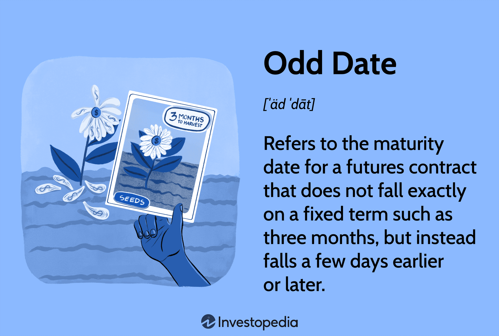

In today's fast-paced and technology-driven financial markets, algorithmic trading has become a cornerstone for both institutional and individual investors. The use of sophisticated algorithms allows for high-frequency trading and complex decision-making processes that can quickly adapt to the dynamics of the market. Amidst these complexities lies the often-overlooked impact of calendar anomalies, particularly those associated with odd dates. These dates can disrupt typical trading patterns, providing both opportunities and challenges for traders.

Calendar anomalies refer to non-standard occurrences within the trading calendar that can influence market behavior. Odd dates are one such anomaly, representing non-standard maturity dates that deviate from typical monthly or quarterly cycles. These anomalies often occur due to a variety of factors, including holidays or specific market events, and can affect futures, options, and other derivative instruments. As such, understanding how odd dates influence market movements is essential for algorithmic traders aiming to refine their strategies.



The impact of odd dates on trading strategies is multifaceted. On one hand, they can lead to unexpected price fluctuations as contracts approach maturity, presenting traders with the potential for profit. On the other hand, these anomalies can introduce additional layers of complexity in pricing and valuation models, necessitating a deeper analysis of market data. For algorithmic traders, incorporating the effects of odd dates into their models is crucial for minimizing risk and optimizing returns.

To navigate the challenges posed by calendar anomalies, traders must develop strategies that consider the unique patterns these dates may present. This involves not only leveraging historical data to identify potential trends but also employing advanced statistical techniques and machine learning algorithms to adapt to evolving market conditions. As financial markets continue to innovate and grow in complexity, staying informed about the nuances presented by odd dates will remain a critical component of successful algorithmic trading. Understanding these concepts is vital for traders looking to enhance their strategies and maintain a competitive edge in the market.

## Table of Contents

## Understanding Odd Dates in Financial Markets

Odd dates in financial markets are defined as non-standard maturity dates for financial instruments like futures and options contracts. These dates deviate from the customary monthly or quarterly maturities typically seen in the market. They can arise from a variety of causes, most notably holidays and other market-specific factors. This deviation from the norm makes odd dates a crucial aspect for traders to track diligently.

In futures and options markets, contracts frequently expire on a predetermined schedule, often aligning with the end of a month or quarter. However, odd dates do not follow this conventional timeline. For instance, a futures contract might mature on an unexpected date due to the influence of a public holiday, trading halts, or specific contractual terms agreed upon by the counterparties. As a result, traders can face significant additional complexities in terms of both pricing and valuation for instruments maturing on these dates. 

The peculiar nature of odd dates influences market dynamics in several ways. First, they can impact [liquidity](/wiki/liquidity-risk-premium) as they might not align with the broader market's settlement cycles, therefore altering supply-demand dynamics. Second, market participants might exhibit varying risk appetites or behavioral patterns leading up to and during these odd date expiries, further adding to market [volatility](/wiki/volatility-trading-strategies). 

In practical terms, traders must account for these irregularities when designing their strategies. Sophisticated pricing models or algorithms may need to incorporate additional parameters to adequately cover the risks associated with odd date expiries. For instance, if $T$ is the time to maturity in a typical pricing model, an adjustment might be required when $T$ does not correspond to standard periods due to odd dates.

In summary, odd dates introduce unique challenges to the pricing and valuation of financial instruments and necessitate keen attention from traders looking to navigate market fluctuations effectively.

## The Significance of Odd Dates in Algorithmic Trading

In [algorithmic trading](/wiki/algorithmic-trading), odd dates can significantly influence market dynamics by creating patterns and opportunities not typically observable with standard dates. These dates often result in unexpected market movements, with prices frequently fluctuating as contracts approach maturity. This volatility arises because traders, relying on algorithms, must adjust their strategies to account for the unconventional timing of these contracts.

Algorithmic strategies are increasingly incorporating calendar-based elements to anticipate and exploit the anomalies posed by odd dates. By doing so, traders aim to capitalize on the price disparities that can occur when contracts mature on atypical timelines. For example, an algorithm might be designed to identify tendencies for price surges or drops around these peculiar dates, allowing it to make informed buying or selling decisions.

To handle the irregularities associated with odd dates effectively, traders must develop sophisticated models that incorporate these factors in their predictive analyses. These models must be capable of accounting for the unique attributes of odd dates and must be robust enough to handle the added complexity they bring. The ultimate goal is to minimize risk and maximize returns by anticipating the potential impact these dates can have on market behavior.

Consider the following simple Python example to illustrate how an algorithm might integrate odd dates into its strategy:

```python
import pandas as pd
from datetime import datetime

# Sample data of futures contracts with odd maturity dates
data = {
    'contract_id': [1, 2, 3, 4],
    'maturity_date': ['2023-03-15', '2023-04-10', '2023-06-19', '2023-08-07'],
    'price': [100, 105, 110, 102]
}

df = pd.DataFrame(data)

# Function to identify odd dates
def is_odd_date(maturity_date):
    standard_maturities = [15, 30]  # Typical mid and end of month values
    return datetime.strptime(maturity_date, '%Y-%m-%d').day not in standard_maturities

# Apply function to identify contracts with odd maturity dates
df['odd_date'] = df['maturity_date'].apply(is_odd_date)

# Display contracts with odd dates
odd_dates_contracts = df[df['odd_date']]
print(odd_dates_contracts)
```

In this example, contracts with maturity dates that do not fall on the 15th or 30th of the month are identified as having odd dates. Traders could then analyze the historical behavior of these contracts to develop strategies that take advantage of the non-standard maturity timing.

By leveraging such data-driven approaches, traders can refine their algorithmic strategies to better predict and respond to price movements associated with odd dates, thereby enhancing their capacity to generate profits while maintaining a manageable level of risk.

## Implementing Strategies with Odd Dates

Successful implementation of trading strategies around odd dates necessitates robust data analysis to address the unique challenges and opportunities these dates present. Traders frequently rely on historical data to uncover trends and patterns associated with non-standard dates that deviate from typical market cycles. This historical data enables the identification of seasonal patterns, volatility spikes, or liquidity changes that may coincide with these dates.

Machine learning algorithms and advanced statistical methods are crucial in optimizing trading strategies tailored to these calendar anomalies. Machine learning models, such as regression analysis or time-series forecasting, can identify non-linear relationships and dependencies often obscured in human analysis. For instance, a linear regression model might predict the price movement $P(t)$ around an odd date based on various features like historical volatility and trade [volume](/wiki/volume-trading-strategy):

$$
P(t) = \beta_0 + \beta_1 \cdot \text{Volatility}(t) + \beta_2 \cdot \text{Volume}(t) + \epsilon
$$

where $\beta$ are coefficients determined through model training, and $\epsilon$ is the error term. These algorithms provide predictive insights into market behavior surrounding these irregular events.

Programming languages such as Python are widely used to implement these strategies efficiently due to their extensive data manipulation libraries. The following Python snippet illustrates how historical data might be utilized to fit a basic predictive model using [machine learning](/wiki/machine-learning):

```python
import pandas as pd
from sklearn.model_selection import train_test_split
from sklearn.linear_model import LinearRegression

# Load historical market data
data = pd.read_csv('market_data.csv')
X = data[['Volatility', 'Volume']]
y = data['Price']

# Split the data into training and testing sets
X_train, X_test, y_train, y_test = train_test_split(X, y, test_size=0.3, random_state=42)

# Train the linear regression model
model = LinearRegression()
model.fit(X_train, y_train)

# Predict market movements on test data
predictions = model.predict(X_test)
```

In addition to deploying machine learning models, traders must be agile in adjusting strategies. This agility allows them to address sudden market changes driven by these non-standard dates, ensuring capitalizes on profit opportunities while mitigating potential risks. For example, volatility can abruptly increase as an odd date approaches, necessitating real-time strategy adjustments such as tightening stop losses or adjusting portfolio exposure.

By continually refining algorithmic models and ensuring strategic adaptability, traders can successfully leverage the peculiarities of odd dates to enhance their trading performance, balancing the dual goals of risk management and profit maximization.

## Challenges and Considerations

Odd dates in algorithmic trading are recognized for their potential to provide unique trading opportunities, yet they also present significant challenges that require careful consideration, particularly concerning administrative and operational efficiency. A prominent challenge for traders is the heightened risk of unexpected market volatility associated with these dates. Markets can react unpredictably to the close of contracts or settlement on odd dates, and without diligent risk management, traders may face substantial financial exposure. 

One approach to managing volatility risk is through the implementation of advanced forecasting models that utilize historical market data. By analyzing past behavior surrounding odd dates, traders can attempt to anticipate future market movements. For example, statistical methods such as GARCH (Generalized Autoregressive Conditional Heteroskedasticity) models can be employed to model and predict volatility patterns:

```python
import numpy as np
from arch import arch_model

# Simulated returns
returns = np.random.normal(0, 1, 1000)

# Fit a GARCH(1,1) model to the returns
model = arch_model(returns, vol='Garch', p=1, q=1)
model_fit = model.fit(disp='off')

# Forecast volatility
volatility_forecast = model_fit.forecast(horizon=5)
print(volatility_forecast.variance[-1:])
```

Regulatory considerations surrounding odd dates also demand attention. Financial regulations may have specific directives on how odd dates are treated within trading strategies. Compliance with these regulations is vital to avoid legal repercussions and potential fines. Moreover, regulations may dictate the capital requirements necessary to mitigate risks on such dates, prompting traders to modify their strategies or capital allocations to meet these requirements.

Understanding both the opportunities and limitations presented by odd dates is essential for traders seeking to integrate them into their algorithmic trading strategies. This involves leveraging the insights garnered from advanced analytical models while maintaining a robust compliance infrastructure. By doing so, traders can harness the potential of odd dates to optimize their trading strategies while safeguarding against associated risks.

## Conclusion

Odd dates in the calendar system present both challenges and opportunities for algorithmic trading. Their distinct nature, deviating from standard contract timelines, demands traders to adopt strategies that effectively leverage these anomalies while managing associated risks. These dates often result in atypical market behavior, which, if anticipated, can be advantageous for traders utilizing algorithmic models. By thoroughly understanding the dynamics of odd dates, traders can fine-tune and optimize their trading algorithms to potentially capture profits that others may overlook.

In financial markets, the ability to adapt and evolve strategies around irregular calendar events is crucial. The consistent monitoring and integration of calendar anomalies into algorithmic systems not only help in mitigating risks but also in seizing the opportunities that these odd dates may unveil. Traders must remain vigilant and continuously update their algorithms to reflect the changing nature of market conditions and anomalies.

Staying informed about calendar anomalies is vital for successful trading in dynamic market environments. As the landscape of financial markets continuously changes, incorporating insights about odd dates can provide a competitive edge. It allows traders to remain agile and responsive, ensuring that their strategies evolve in line with new patterns and market behaviors. Emphasizing the importance of odd dates in trading algorithms can lead to refined decision-making and optimized trading performance.

## References & Further Reading

[1]: Bergstra, J., Bardenet, R., Bengio, Y., & Kégl, B. (2011). ["Algorithms for Hyper-Parameter Optimization."](https://dl.acm.org/doi/10.5555/2986459.2986743) Advances in Neural Information Processing Systems 24.

[2]: ["Advances in Financial Machine Learning"](https://www.amazon.com/Advances-Financial-Machine-Learning-Marcos/dp/1119482089) by Marcos Lopez de Prado

[3]: ["Evidence-Based Technical Analysis: Applying the Scientific Method and Statistical Inference to Trading Signals"](https://www.amazon.com/Evidence-Based-Technical-Analysis-Scientific-Statistical/dp/0470008741) by David Aronson

[4]: Zhang, Y., & Zhang, X. (2011). ["Algorithmic Trading and Stock Price Movement."](https://www.sciencedirect.com/science/article/pii/S0360319924052996) IEEE Conference on Automation Science and Engineering.

[5]: ["Quantitative Trading: How to Build Your Own Algorithmic Trading Business"](https://www.amazon.com/Quantitative-Trading-Build-Algorithmic-Business/dp/1119800064) by Ernest P. Chan