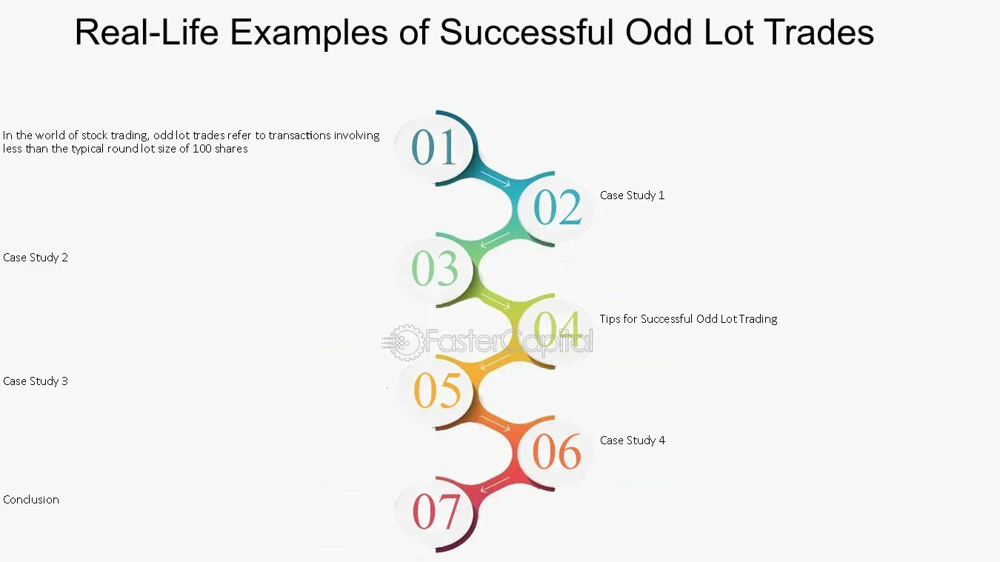

## Table of Contents

## What is an odd-lot buyback?

An odd-lot buyback is when a company buys back its own shares from shareholders who own less than a standard trading lot. A standard trading lot is usually 100 shares, so an odd lot is fewer than 100 shares. Companies do this to help small shareholders sell their shares more easily, since it can be hard for them to find buyers for such small amounts.

This type of buyback can be good for small investors because it gives them a chance to cash out their small holdings. It also helps the company because it reduces the number of shareholders, which can make managing the company easier. Odd-lot buybacks are not very common, but they can be a helpful tool for both the company and the small investors.

## Why do companies engage in odd-lot buybacks?

Companies engage in odd-lot buybacks mainly to help small shareholders who own fewer than 100 shares. It can be hard for these small investors to sell their shares because most buyers want to buy at least 100 shares at a time. By offering to buy back these odd lots, the company makes it easier for these small shareholders to sell their shares and get cash.

This process also benefits the company. When a company buys back its own shares, it reduces the total number of shares out there. This can make the company's stock price go up because there are fewer shares for people to buy. Plus, by reducing the number of shareholders, the company can save money and time on things like sending out shareholder reports and managing shareholder meetings.

## How does an odd-lot buyback differ from a regular buyback?

An odd-lot buyback is different from a regular buyback because it focuses on buying shares from small shareholders who own fewer than 100 shares. These small shareholders often find it hard to sell their shares because most buyers want to buy at least 100 shares at a time. By offering to buy back these odd lots, the company helps these small investors sell their shares more easily and get cash.

A regular buyback, on the other hand, is when a company buys back its shares from any shareholder, no matter how many shares they own. The company might do this to reduce the total number of shares, which can help increase the stock price. Regular buybacks are more common and can be done through open market purchases or tender offers, where the company offers to buy shares at a set price.

## What are the benefits of participating in an odd-lot buyback for shareholders?

Participating in an odd-lot buyback can be really helpful for shareholders who own fewer than 100 shares. It's often hard for these small shareholders to sell their shares because most buyers want to buy at least 100 shares at a time. By taking part in an odd-lot buyback, these shareholders can easily sell their small amounts of stock and get cash. This is especially good for people who might need the money right away or who just want to get rid of their small holdings without having to wait for a buyer.

Another benefit is that shareholders usually get a fair price for their shares during an odd-lot buyback. The company sets a price for the buyback, which can be a good deal for the shareholders. This way, small investors don't have to worry about trying to find someone to buy their few shares at a good price. It's a straightforward way for them to cash out and move on.

## What are the steps involved in an odd-lot buyback process?

When a company decides to do an odd-lot buyback, it starts by announcing the buyback to its shareholders. The company tells them how much they will pay for each share and how long the buyback will last. Shareholders who have fewer than 100 shares and want to sell them back to the company need to let the company know during this time. They usually have to fill out a form or contact the company's investor relations department to say they want to take part in the buyback.

Once the company gets all the requests from shareholders, it starts buying back the shares. The company pays the shareholders the price they announced at the start of the buyback. After the company buys back all the shares it wants, it cancels those shares, which means they are no longer out there for people to buy. This can help the company because it reduces the number of shareholders it has to deal with and can make the stock price go up since there are fewer shares available.

## How does a company determine the price for an odd-lot buyback?

When a company decides to do an odd-lot buyback, it needs to figure out how much it will pay for each share. The company usually looks at the current market price of its stock to help decide this. They might offer a small premium over the current market price to make the buyback more attractive to small shareholders. This way, the shareholders feel like they are getting a good deal for their shares.

The company also considers its own financial situation when setting the price. They want to make sure they can afford to buy back the shares without hurting their cash flow or other financial plans. By setting a fair price, the company can encourage small shareholders to sell their shares back, which helps both the shareholders and the company in the long run.

## What is the typical size of an odd lot in the context of buybacks?

In the context of buybacks, an odd lot usually means fewer than 100 shares. This is because the standard trading lot for stocks is 100 shares. So, if you own less than 100 shares, you have an odd lot.

Companies do odd-lot buybacks to help small shareholders who might find it hard to sell such small amounts of stock. By buying back these odd lots, the company makes it easier for these shareholders to get cash for their shares.

## Can you explain the tax implications of participating in an odd-lot buyback?

When you sell your shares back to the company in an odd-lot buyback, you might have to pay taxes on any profit you make. If you bought the shares for less than what the company is paying you now, the difference is called a capital gain. You'll need to report this gain on your taxes, and depending on how long you've owned the shares, it could be taxed as a short-term or long-term capital gain. Short-term gains, from shares held for a year or less, are usually taxed at your regular income tax rate. Long-term gains, from shares held for more than a year, are taxed at a lower rate.

If you end up selling the shares for less than what you paid for them, you'll have a capital loss. You can use this loss to reduce your taxable income, which might lower the amount of taxes you owe. It's a good idea to talk to a tax professional to understand how the odd-lot buyback will affect your taxes, as the rules can be different based on your situation and where you live.

## How do odd-lot buybacks affect the overall market perception of a company?

Odd-lot buybacks can make a company look good to investors. When a company buys back its own shares, it shows that the company thinks its stock is a good investment. This can make other investors feel more confident about the company too. Plus, by helping small shareholders sell their shares easily, the company shows that it cares about all its investors, not just the big ones. This can make the company seem more friendly and fair, which can improve its reputation in the market.

However, odd-lot buybacks might not have a big impact on the overall market perception if they are small compared to the company's total shares. Investors might see it as a small move that doesn't change much about the company's value or future plans. But if the buyback is part of a bigger plan to reduce the number of shares and boost the stock price, it could be seen as a strong sign that the company is trying to increase shareholder value. So, the effect on market perception can depend on how the buyback fits into the company's overall strategy.

## What are the regulatory considerations a company must address before initiating an odd-lot buyback?

Before a company can start an odd-lot buyback, it needs to make sure it follows the rules set by the places where its stock is traded. These rules can be different depending on the country or stock exchange. For example, in the U.S., the Securities and Exchange Commission (SEC) has rules that companies need to follow. The company must tell everyone about the buyback plan, how much they will pay for the shares, and how long the buyback will last. They also need to make sure they don't break any insider trading rules, which means they can't use secret information to decide when to do the buyback.

Another thing the company needs to think about is how the buyback might affect its financial reports. They need to make sure they have enough money to buy back the shares without hurting their business. The company also has to report the buyback in their financial statements so that everyone knows what's happening with the company's money. By following these rules, the company can make sure the odd-lot buyback is done the right way and doesn't cause any problems with the law or with investors.

## How can investors identify if a company is planning an odd-lot buyback?

Investors can find out if a company is planning an odd-lot buyback by keeping an eye on the company's announcements. Companies usually tell everyone about their plans through press releases or official statements. These announcements will say things like how much they will pay for the shares and how long the buyback will last. Investors can check the company's website, read financial news, or sign up for alerts from the company to stay updated.

Another way to spot a potential odd-lot buyback is by looking at the company's financial reports and shareholder communications. Sometimes, a company might mention their plans in their quarterly or annual reports. They might also talk about it during shareholder meetings or in letters to shareholders. By paying attention to these sources, investors can get a heads-up about any upcoming odd-lot buybacks and decide if they want to take part.

## What are some case studies or examples of successful odd-lot buybacks?

One example of a successful odd-lot buyback is when Johnson & Johnson did it in 2019. They wanted to help small shareholders who had fewer than 100 shares. Johnson & Johnson announced they would buy back these shares at a good price. Many small investors took part in the buyback because it was easy for them to sell their shares and get cash. This made the shareholders happy and also helped Johnson & Johnson because they had fewer shareholders to deal with.

Another case is when IBM did an odd-lot buyback in 2016. IBM offered to buy back shares from small investors at a price that was a bit higher than the market price. This was good for the small shareholders because they got a better deal than they might have found on the open market. The buyback was successful because it helped IBM reduce the number of shares out there, which can make the stock price go up. It also showed that IBM cared about all its investors, not just the big ones.

## References & Further Reading

[1]: Bergstra, J., Bardenet, R., Bengio, Y., & Kégl, B. (2011). ["Algorithms for Hyper-Parameter Optimization."](https://papers.nips.cc/paper/4443-algorithms-for-hyper-parameter-optimization) Advances in Neural Information Processing Systems 24.

[2]: ["Advances in Financial Machine Learning"](https://www.amazon.com/Advances-Financial-Machine-Learning-Marcos/dp/1119482089) by Marcos Lopez de Prado

[3]: ["Evidence-Based Technical Analysis: Applying the Scientific Method and Statistical Inference to Trading Signals"](https://www.amazon.com/Evidence-Based-Technical-Analysis-Scientific-Statistical/dp/0470008741) by David Aronson

[4]: ["Machine Learning for Algorithmic Trading"](https://github.com/stefan-jansen/machine-learning-for-trading) by Stefan Jansen

[5]: ["Quantitative Trading: How to Build Your Own Algorithmic Trading Business"](https://www.amazon.com/Quantitative-Trading-Build-Algorithmic-Business/dp/1119800064) by Ernest P. Chan