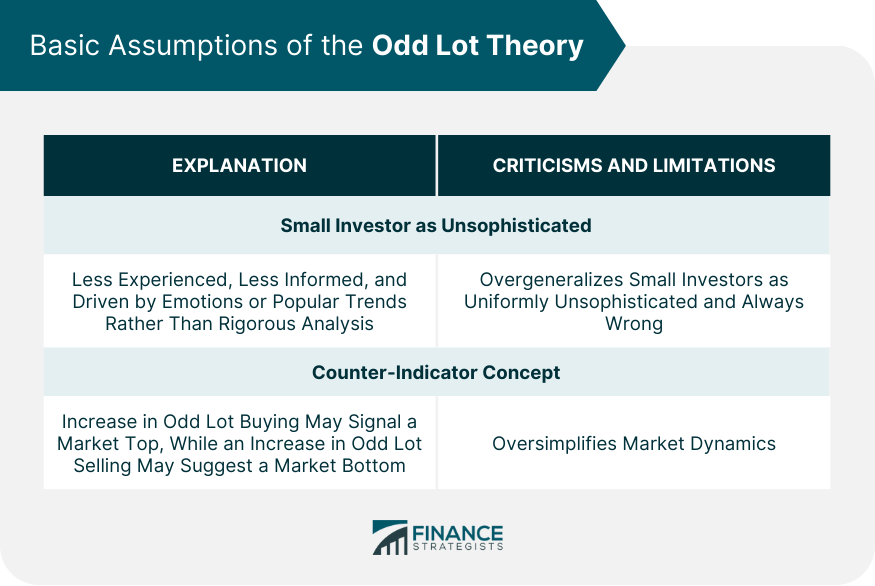

## Table of Contents

## What is the Odd Lot Theory?

The Odd Lot Theory is a way some people try to predict where the stock market is going. It says that if small investors, who usually buy or sell in odd lots (less than 100 shares), are doing a lot of buying, then the market might go down soon. The idea is that these small investors often make the wrong choices, so if they are buying a lot, it might be a sign that the market is about to drop.

This theory isn't used much anymore because it's hard to tell if it really works. Big investors and professionals often look at other things to decide what to do with their money. Still, it's interesting to think about how the actions of small investors might affect the market, even if it's not a perfect way to predict what will happen next.

## How does the Odd Lot Theory relate to stock market behavior?

The Odd Lot Theory suggests that the actions of small investors, who often trade in odd lots (less than 100 shares), can give clues about where the stock market is headed. According to this theory, if you see a lot of these small investors buying stocks, it might mean the market is about to go down. The idea is that these small investors are usually wrong about their predictions, so their buying could be a sign that the market is at a peak and ready to fall.

However, the Odd Lot Theory is not used much today because it's not very reliable. It's hard to tell if the theory really works, and big investors and professionals usually look at other things to make their decisions. Still, it's interesting to think about how the choices of small investors might affect the market, even if it's not a perfect way to predict what will happen next.

## What is considered an 'odd lot' in the context of stock trading?

In the world of stock trading, an 'odd lot' is when someone buys or sells less than 100 shares of a stock. Usually, stocks are traded in groups of 100 shares, which are called 'round lots.' So, if you buy or sell any number of shares that's not a multiple of 100, like 50 shares or 150 shares, that's considered an odd lot.

Small investors often trade in odd lots because they might not have enough money to buy a full round lot of 100 shares. Big investors and institutions usually trade in round lots or even bigger amounts, so odd lots are more common among people who are just starting out or don't have a lot of money to invest.

## Who typically trades in odd lots?

Odd lots are usually traded by small investors. These are people who might not have a lot of money to invest, so they buy or sell fewer than 100 shares of a stock at a time. For example, if someone wants to start investing but only has enough money to buy 50 shares, they would be trading in an odd lot.

Big investors and institutions, like banks or big investment firms, usually don't trade in odd lots. They have more money and often buy and sell stocks in bigger amounts, like round lots of 100 shares or even thousands of shares at once. So, when you see odd lot trades, it's often a sign that smaller, individual investors are the ones making those trades.

## What is the basic premise behind the Odd Lot Theory?

The Odd Lot Theory is a way to guess what might happen to the stock market. It says that if a lot of small investors are buying stocks in odd lots, which are less than 100 shares, then the market might be about to go down. The idea is that these small investors often make the wrong choices, so if they are buying a lot, it could mean the market is at its highest point and ready to drop.

Even though the Odd Lot Theory sounds interesting, it's not used much anymore. It's hard to tell if it really works because the market can be affected by so many things. Big investors and professionals usually look at other signs to decide what to do with their money, but it's still fun to think about how the choices of small investors might give us clues about the market.

## How can the Odd Lot Theory be used to predict market trends?

The Odd Lot Theory says that if a lot of small investors are buying stocks in odd lots, which means less than 100 shares, it might be a sign that the market is going to go down soon. The idea is that these small investors often make the wrong choices. So, if they are buying a lot, it could mean that the market is at its highest point and ready to drop.

Even though the Odd Lot Theory sounds interesting, it's not used much anymore because it's hard to tell if it really works. The stock market can be affected by so many things, and this theory is just one small piece of the puzzle. Big investors and professionals usually look at other signs to decide what to do with their money, but it's still fun to think about how the choices of small investors might give us clues about the market.

## What are the criticisms of the Odd Lot Theory?

The Odd Lot Theory has been criticized because it's not very reliable. It's hard to tell if the theory really works because the stock market can be affected by so many things. Just looking at what small investors are doing might not give us a good picture of what will happen next. Big investors and professionals often look at other signs to decide what to do with their money, so they don't rely on the Odd Lot Theory much.

Another problem with the Odd Lot Theory is that it assumes small investors always make the wrong choices. But this isn't always true. Sometimes small investors can be right, and their buying or selling might not mean the market is about to change direction. Also, with more people trading online and in smaller amounts, odd lot trades are more common now, so it's even harder to use this theory to predict market trends.

## Can the Odd Lot Theory be applied to other financial markets besides stocks?

The Odd Lot Theory is mainly used for the stock market, but some people think it might work for other financial markets too. For example, in the bond market, if a lot of small investors are buying bonds in odd lots, it might mean the bond market is about to go down. The same idea could be used in the futures market or the options market, where small investors might buy or sell in smaller amounts than big investors.

However, just like with stocks, using the Odd Lot Theory in other markets has its problems. It's hard to tell if it really works because these markets can be affected by so many things. Also, the theory assumes that small investors always make the wrong choices, which isn't always true. So, while it's interesting to think about using the Odd Lot Theory in other markets, it's not a very reliable way to predict what will happen next.

## What historical data supports or refutes the Odd Lot Theory?

The Odd Lot Theory has been around for a long time, but there isn't a lot of strong historical data that really supports it. Some studies have looked at times when there were a lot of odd lot trades and tried to see if the market went down after that. But these studies often found that the market didn't always go down, and sometimes it even went up. So, it's hard to say that the theory works well because the results are all over the place.

On the other hand, there are some examples where the Odd Lot Theory seemed to work. For instance, during certain periods in the past, like the late 1990s, there were times when a lot of small investors were buying stocks in odd lots, and then the market did go down a bit after that. But these examples are not common enough to prove the theory. Overall, most experts think that the Odd Lot Theory is not a good way to predict what the market will do because it's not reliable enough.

## How has the relevance of the Odd Lot Theory changed with the advent of electronic trading?

The Odd Lot Theory used to be more important when trading was done mostly by people calling each other on the phone or meeting in person. Back then, it was easier to see what small investors were doing because their trades in odd lots stood out more. But with electronic trading, a lot has changed. Now, almost everyone can trade stocks online, and it's common for people to buy and sell in smaller amounts. This means there are a lot more odd lot trades happening all the time, so it's harder to use the Odd Lot Theory to predict what the market will do.

Because of electronic trading, the Odd Lot Theory is not as useful as it used to be. With so many people trading online, the number of odd lot trades doesn't mean as much anymore. It's harder to tell if small investors are doing something different from big investors because everyone is trading in smaller amounts. So, while the Odd Lot Theory is an interesting idea, it's not a good way to predict market trends in today's world of electronic trading.

## What are some practical examples of the Odd Lot Theory in action?

One example of the Odd Lot Theory in action happened in the late 1990s during the dot-com bubble. A lot of small investors were buying tech stocks in odd lots, hoping to make a quick profit. According to the Odd Lot Theory, this heavy buying by small investors was a sign that the market might be at its peak. Sure enough, not long after, the tech bubble burst, and the market crashed. This seemed to support the idea that when small investors are buying a lot, the market might be ready to go down.

Another example can be seen during certain times in the early 2000s. There were periods when odd lot buying increased, and some people thought this meant the market was about to fall. While the market did experience some downturns during those times, it's hard to say for sure that the odd lot buying caused it. The market is affected by so many things, like economic news and big investors' actions, so it's tough to use the Odd Lot Theory as a reliable way to predict what will happen next.

## How can investors incorporate the Odd Lot Theory into their trading strategies?

Investors can use the Odd Lot Theory to help them decide when to buy or sell stocks. If they see a lot of small investors buying stocks in odd lots, which means less than 100 shares, they might think the market is about to go down. So, they could decide to sell their stocks before the market drops. On the other hand, if they see a lot of small investors selling stocks in odd lots, they might think the market is about to go up. Then, they could decide to buy stocks at a lower price before the market rises.

However, investors should be careful because the Odd Lot Theory is not very reliable. It's just one small piece of information, and the stock market can be affected by so many other things. So, while it might be interesting to look at what small investors are doing, investors should also look at other signs, like economic news and what big investors are doing, to make their decisions. Using the Odd Lot Theory alone is not a good way to predict what the market will do, but it can be one part of a bigger trading strategy.

## References & Further Reading

[1]: Block, S. B. & Gallagher, T. J. (1983). ["The Use of Odd-Lot Trading as an Indicator of Market Sentiment."](https://quizlet.com/842009619/finance-3315-exam-2-flash-cards/) The Financial Review, 18(4), 238-252.

[2]: Malkiel, B. G. (1999). ["A Random Walk Down Wall Street: The Time-Tested Strategy for Successful Investing."](https://yourknowledgedigest.org/wp-content/uploads/2020/04/a-random-walk-down-wall-street.pdf) W. W. Norton & Company.

[3]: Lopez de Prado, M. (2018). ["Advances in Financial Machine Learning."](https://www.amazon.com/Advances-Financial-Machine-Learning-Marcos/dp/1119482089) Wiley.

[4]: Chan, E. P. (2008). ["Quantitative Trading: How to Build Your Own Algorithmic Trading Business."](https://github.com/egorpe/EPChan-QuantitativeTrading/blob/master/example7_6.m) Wiley.

[5]: Aronson, D. R. (2007). ["Evidence-Based Technical Analysis: Applying the Scientific Method and Statistical Inference to Trading Signals."](https://onlinelibrary.wiley.com/doi/book/10.1002/9781118268315) Wiley.

[6]: Lee, C. M. C., & Ready, M. J. (1991). ["Inferring Trade Direction from Intraday Data."](https://onlinelibrary.wiley.com/doi/abs/10.1111/j.1540-6261.1991.tb02683.x) The Journal of Finance, 46(2), 733-746.