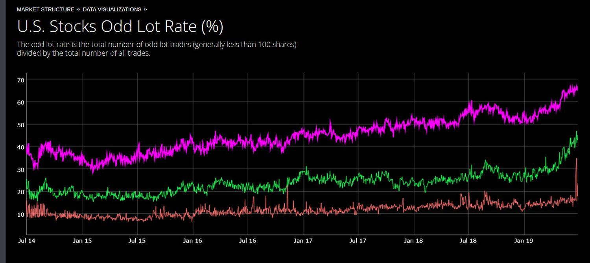

## Table of Contents

## What is an odd lot trader?

An odd lot trader is someone who buys or sells stocks in small amounts. These small amounts are called odd lots, and they are usually less than 100 shares. Odd lot traders often do this because they don't have a lot of money to invest or they want to invest in a specific stock without buying a large amount.

Odd lot trading can be important for individual investors who want to start small. It allows them to participate in the stock market without needing a lot of money upfront. However, odd lot trades might have higher fees and less favorable prices compared to trading in round lots, which are multiples of 100 shares.

## How does an odd lot differ from a round lot?

An odd lot is a number of shares that is less than 100. For example, if you buy 50 shares of a company, that's an odd lot. On the other hand, a round lot is a number of shares that is a multiple of 100. So, if you buy 100, 200, or 300 shares, those are round lots.

The main difference between odd lots and round lots is the size of the trade. Odd lots are smaller and often used by individual investors who don't want to or can't buy a lot of shares at once. Round lots are bigger and are more common among big investors or institutions because they can buy in larger quantities. Because of their size, round lots usually have better prices and lower fees than odd lots.

## Why might an individual choose to trade in odd lots?

An individual might choose to trade in odd lots because they don't have a lot of money to invest. If someone wants to buy shares in a company but can only afford a few, they can buy an odd lot. This way, they can still own part of the company without needing to spend a lot of money all at once. It's a good way for people to start investing with a small amount of money.

Another reason someone might trade in odd lots is if they want to invest in a specific stock but don't want to buy a lot of it. Maybe they believe in the company but aren't sure about buying a whole round lot of 100 shares. By buying an odd lot, they can test the waters and see how the stock performs without committing to a larger investment. This can be a smart way to manage risk and learn about investing.

## What are the typical characteristics of an odd lot trader?

An odd lot trader is usually someone who doesn't have a lot of money to spend on stocks. They might be new to investing or just want to buy a few shares of a company they like. These traders often buy less than 100 shares at a time because that's all they can afford or all they want to risk. They might be students, young professionals, or anyone who wants to start investing without a big budget.

Odd lot traders are also often interested in specific companies but don't want to buy a lot of shares. They might believe in a company but want to test it with a small investment first. This way, they can see how the stock does without spending too much money. Odd lot trading can help them learn about the stock market and make small investments as they go.

## How do odd lot trades impact the stock market?

Odd lot trades usually don't have a big impact on the stock market. This is because they are small trades, often less than 100 shares. Big investors and institutions usually trade in round lots, which are multiples of 100 shares. So, the overall market is more affected by these larger trades. But, if a lot of people are buying or selling odd lots of the same stock, it might show a trend that big investors watch.

Sometimes, odd lot trades can give a hint about what individual investors are thinking. If a lot of people are buying odd lots of a certain stock, it might mean they like that company. But, this doesn't always change the stock price a lot because odd lot trades are small. Big investors and institutions usually have more power to move the market with their larger trades.

## What are the advantages of trading odd lots?

Trading odd lots lets people start investing with just a little money. If you don't have a lot to spend, you can still buy a few shares of a company you like. This way, you can own part of the company without needing to buy a whole 100 shares. It's a good way for beginners to get into the stock market without spending a lot of money all at once.

Another advantage is that odd lot trading lets you test a stock with a small investment. If you're not sure about a company but want to try it out, you can buy a few shares and see how it goes. This can help you learn about investing and manage your risk. You don't have to commit a lot of money right away, so you can make small investments and see how they do over time.

## What are the disadvantages or challenges of trading odd lots?

One of the main challenges of trading odd lots is that they often come with higher fees. When you buy or sell less than 100 shares, the broker might charge you more than if you were trading a round lot. This can make odd lot trading more expensive, especially if you are doing it a lot. So, even though you are starting small, the fees can add up and take a bigger bite out of your investment.

Another disadvantage is that odd lot trades might not get the best prices. Big investors and institutions trade in round lots, and the stock market often gives better prices to these bigger trades. When you trade odd lots, you might not get the same good deals. This can mean you buy at a higher price or sell at a lower price than you would with round lots. It's something to keep in mind if you want to get the best value from your investments.

## Can odd lot trading be used as an indicator of market sentiment?

Odd lot trading can sometimes be used as an indicator of what individual investors are thinking. If a lot of people are buying odd lots of a certain stock, it might mean they like that company and think its stock price will go up. On the other hand, if a lot of people are selling odd lots, it could mean they are worried about the stock and want to get out. Big investors and institutions often watch these trends to get a sense of what the "little guy" is doing.

However, odd lot trading is not a perfect indicator of market sentiment. It only shows what small investors are doing, and they might not have as much money or information as big investors. Also, odd lot trades are small, so they don't move the market as much as big trades do. So, while odd lot trading can give some clues about what individual investors are thinking, it's just one piece of the puzzle when trying to understand the whole market.

## How do brokers handle odd lot trades differently from round lot trades?

Brokers often handle odd lot trades differently from round lot trades because odd lots are smaller. When you trade an odd lot, which is less than 100 shares, the broker might charge you more in fees. This is because it takes the same amount of work for the broker to process a small trade as it does for a big one, but they make less money from the smaller trade. So, to make up for this, they might charge higher fees for odd lots. This can make odd lot trading more expensive for you, especially if you do it a lot.

Also, brokers might not give you the best prices when you trade odd lots. Big investors and institutions usually trade in round lots, which are multiples of 100 shares. The stock market often gives better prices to these bigger trades because they move more money. When you trade odd lots, you might not get the same good deals. This means you could end up buying at a higher price or selling at a lower price than if you were trading round lots. So, it's important to think about these differences when you decide to trade odd lots.

## What strategies do expert odd lot traders employ?

Expert odd lot traders often use a strategy called dollar-cost averaging. This means they invest a fixed amount of money at regular times, no matter what the stock price is. By doing this, they can buy more shares when the price is low and fewer shares when the price is high. Over time, this can help them pay a lower average price for the stock. It's a good way to manage risk and slowly build up their investment without needing a lot of money at once.

Another strategy they use is to focus on stocks they know well. They might pick a few companies they believe in and keep an eye on them. When they see a good chance to buy a few shares, they do it. This way, they can make small investments in companies they trust without spending a lot of money. It helps them stay in control of their investments and make smart choices based on what they know.

Some expert odd lot traders also use a strategy called stop-loss orders. This means they set a price at which they will automatically sell their shares if the stock price drops to that level. It helps them limit their losses if the stock doesn't do well. By using stop-loss orders, they can protect their small investments and make sure they don't lose too much money.

## How has technology influenced odd lot trading?

Technology has made odd lot trading a lot easier and more accessible for people. In the past, trading odd lots was harder because you had to call a broker and they might charge you a lot of money. Now, with online trading platforms and apps, you can buy and sell odd lots with just a few clicks. These platforms often have lower fees, so it's cheaper to trade small amounts of stock. This means more people can start investing with just a little money, even if they can't afford to buy 100 shares at once.

Also, technology has made it easier to get information about stocks. You can use apps and websites to learn about different companies and see what other people are doing. This can help you make better choices about which stocks to buy, even if you're only buying a few shares. With all this information at your fingertips, you can be a smarter odd lot trader and make the most of your small investments.

## What future trends might affect odd lot trading?

In the future, more people might start trading odd lots because technology keeps making it easier. Online trading platforms and apps are getting better and cheaper, so even people with just a little money can buy and sell stocks. This means more people might want to try investing with small amounts of money. Also, as more people learn about investing, they might feel more comfortable starting with odd lots to test the waters before they spend more.

Another trend that could affect odd lot trading is the rise of fractional shares. Some platforms now let you buy just a part of a share, not a whole one. This makes it even easier to invest small amounts of money. If more platforms start offering fractional shares, odd lot trading might become less common because people can buy even smaller pieces of stock. But, for now, odd lot trading is still a good way for people to start investing without needing a lot of money.

## References & Further Reading

[1]: Harris, L. (2003). ["Trading and Exchanges: Market Microstructure for Practitioners."](https://www.amazon.com/Trading-Exchanges-Market-Microstructure-Practitioners/dp/0195144708) Oxford University Press.

[2]: Chan, E. (2009). ["Quantitative Trading: How to Build Your Own Algorithmic Trading Business."](https://github.com/ftvision/quant_trading_echan_book) John Wiley & Sons.

[3]: Jansen, S. (2020). ["Machine Learning for Algorithmic Trading."](https://github.com/stefan-jansen/machine-learning-for-trading) Packt Publishing.

[4]: Lopez de Prado, M. (2018). ["Advances in Financial Machine Learning."](https://www.amazon.com/Advances-Financial-Machine-Learning-Marcos/dp/1119482089) Wiley.

[5]: Aronson, D. (2006). ["Evidence-Based Technical Analysis: Applying the Scientific Method and Statistical Inference to Trading Signals."](https://www.amazon.com/Evidence-Based-Technical-Analysis-Scientific-Statistical/dp/0470008741) John Wiley & Sons.

[6]: Aldridge, I. (2013). ["High-Frequency Trading: A Practical Guide to Algorithmic Strategies and Trading Systems."](https://books.google.com/books/about/High_Frequency_Trading.html?id=6l0DDQAAQBAJ) Wiley.