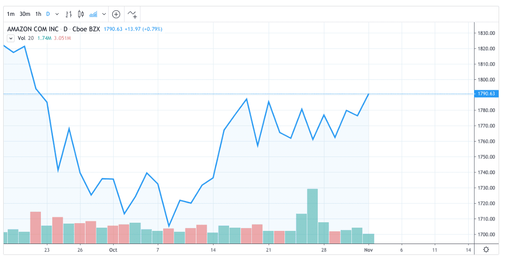

In the evolving world of financial markets, stock trading is a crucial element that draws the attention of investors globally. Participants have a plethora of trading methodologies at their disposal, allowing engagement in the stock market through varied strategies and insights. Among these methodologies, odd lot trading and algorithmic (algo) trading have garnered significant attention in recent years. Mastery of these terms and underlying concepts is essential for effectively navigating the complexities of the stock market. This article will explain the odd lot market, outline various stock trading strategies, and introduce the innovative approach of algo trading.

## Table of Contents



## Demystifying Stock Trading Terminologies

Stock trading entails the buying and selling of shares in the financial markets. It is a dynamic process that requires a comprehensive understanding of various terminologies that can significantly influence trading decisions. Investors, both new and seasoned, must familiarize themselves with these terms to make informed investment choices and develop effective strategies.

One fundamental term frequently encountered in stock trading is "bid-ask spread." The bid price represents the highest price a buyer is willing to pay for a stock, while the ask price is the lowest price a seller is willing to accept. The spread between these two prices reflects the liquidity of the stock—narrow spreads suggest high liquidity, whereas wider spreads indicate lower liquidity. Understanding this concept enables investors to gauge transaction costs and market efficiency.

Another key terminology is "market order" and "limit order." A market order is an instruction to buy or sell a stock immediately at the current market price. Conversely, a limit order sets a specific price at which an investor is willing to buy or sell. This provides greater control over trade execution but does not guarantee immediate fulfillment. Choosing between market orders and limit orders can significantly affect the timing and success of a trade.

"Leverage" and "margin" are terms crucial for traders who wish to amplify their investments. Leverage involves using borrowed funds to increase potential returns, while trading on margin refers to the practice of buying stocks with funds borrowed from a broker. Although leveraging can enhance profits, it also increases the risk of substantial losses, highlighting the importance of risk management strategies.

"Volatility" is a term that describes the degree of variation in a stock's price over a given period. High volatility usually indicates greater uncertainty and potential for significant price movements, offering both opportunities and risks. Understanding volatility is essential for assessing the risk profile of stocks and tailoring investment strategies accordingly.

Finally, "dividend" and "yield" are important terms for investors seeking income-generating stocks. A dividend is a payment made by a corporation to its shareholders, usually from profits. The yield is the dividend expressed as a percentage of the stock's current price. These metrics help investors evaluate the income potential and financial health of dividend-paying companies.

Vamos explorar algumas das terminologias mais comuns e como elas se aplicam ao mercado de ações de hoje. A familiaridade com esses termos é crucial para navegar no complexo mundo da negociação de ações, permitindo que os investidores tomem decisões informadas e otimizem suas estratégias de investimento.

## Understanding Odd Lot Trading

An odd lot refers to a trade involving a number of shares that is less than the conventional trading block of 100 shares, commonly referred to as a round lot. Historically, odd lot trading was considered less desirable and often incurred higher transaction costs due to the perceived inconvenience they presented to stock exchanges which were optimized for round lot trading. However, the landscape of odd lot trading has changed significantly in recent years.

Investors engaging in odd lot trades are typically retail investors or those with smaller trading accounts who wish to invest in high-priced stocks or diversify their portfolios without committing to the standard 100-share blocks. While these trades might seem insignificant individually, cumulatively they can have substantial effects on market dynamics. For instance, a large [volume](/wiki/volume-trading-strategy) of odd lot trades can signal wider market sentiment trends or indicate the presence of retail investor activity in specific securities.

The rise of high-frequency trading ([HFT](/wiki/high-frequency-trading-strategies)) and the proliferation of commission-free trading platforms have greatly facilitated the execution of odd lot trades. HFT uses sophisticated algorithms to execute trades at speeds that are fractions of a second, allowing for efficient handling of odd and round lots alike. As a result, the traditionally higher costs associated with odd lot trades have diminished, making them more attractive to individual investors.

Furthermore, commission-free trading platforms such as Robinhood and Webull have democratized access to the stock market, lowering the barriers for entry. These platforms allow investors to purchase fractional shares, thereby enabling odd lot transactions with ease and without the burden of transaction fees that used to accompany such trades.

The implications of odd lot trades extend beyond mere trading volumes. They have the ability to influence stock pricing and movement. Since market makers and other institutional investors monitor odd lot trades for signals about retail investor behavior, significant odd lot activity can impact their trading strategies and, consequently, market prices.

In summary, odd lot trading represents an increasingly important component of the stock market, providing entry points for investors with limited capital while impacting broader market dynamics. The evolution of trading technologies and platforms continues to blur the lines between odd lots and traditional round lot trading, making stock markets more inclusive and dynamic.

## Exploring Algo Trading

Algorithmic trading, commonly referred to as algo trading, employs computer algorithms to facilitate the rapid and precise execution of trades in financial markets. By leveraging well-defined rules and conditions, these algorithms are capable of making trading decisions and executing them without human intervention. This process helps in removing emotional biases, which often affect human traders, ensuring that decisions are made based purely on quantitative data and pre-set criteria.

There are several types of [algorithmic trading](/wiki/algorithmic-trading) strategies that traders employ to gain an edge in the market. One popular strategy is trend-following, which aims to capitalize on existing market trends. Traders using this strategy analyze historical price data to predict future movements, buying assets during an upward trend and selling during a downward trend. Another common approach is [arbitrage](/wiki/arbitrage), where traders exploit price differentials of the same asset in different markets or forms. This involves a fast-paced environment where success depends on quick data analysis and execution to capitalize on fleeting opportunities.

Market-making is another significant strategy within algorithmic trading. In this type, traders place buy and sell orders simultaneously to profit from the bid-ask spread. The success of market-making relies on the [high frequency](/wiki/high-frequency-trading) of trades and the ability to adjust rapidly to market conditions.

Despite the evident advantages of algorithmic trading in terms of speed, efficiency, and accuracy, it is not without challenges. Technical failures can occur, causing system malfunctions that may lead to significant financial losses. Additionally, since algorithms can execute trades at high speeds, even minor mistakes in the algorithm can result in substantial market impact. Furthermore, the intense competitive environment requires sophisticated technical infrastructure, which can be both costly and complex to manage.

Nonetheless, algorithmic trading remains an influential and essential tool in modern financial markets. Traders and institutions continue to refine their algorithms to adapt to changing market conditions and enhance their competitive advantage. Python, with its robust libraries such as NumPy and pandas for data analysis, is frequently used in the development of trading algorithms, providing a versatile platform for implementation and testing.

In Python, a simple algorithmic trading strategy might involve setting triggers based on moving averages:

```python
import pandas as pd

# Load historical price data
data = pd.read_csv('historical_prices.csv')
data['Short_MA'] = data['Close'].rolling(window=50).mean()  # Short-term moving average
data['Long_MA'] = data['Close'].rolling(window=200).mean()  # Long-term moving average

# Generate buy/sell signals
data['Signal'] = 0
data.loc[data['Short_MA'] > data['Long_MA'], 'Signal'] = 1  # Buy signal
data.loc[data['Short_MA'] < data['Long_MA'], 'Signal'] = -1  # Sell signal

print(data[['Close', 'Short_MA', 'Long_MA', 'Signal']])
```

This script utilizes moving averages to generate buy and sell signals based on crossing points, illustrating the mechanical nature of algorithmic decision-making free from human emotional interference.

## Pros and Cons of Odd Lot and Algo Trading

Odd lot trading, characterized by trading shares in quantities less than the standard 100-share block, serves as an accessible entry point for investors with limited capital. This form of trading opens doors to high-priced stocks without necessitating large initial capital outlays, democratizing access to diverse investment opportunities. However, the smaller trade volumes inherent in odd lot trading may lead to higher transaction costs per unit compared to round lots, potentially diminishing overall profitability.

The advent of commission-free platforms and technological advancements has progressively mitigated these costs, yet they remain a consideration for investors seeking to maximize returns. Additionally, odd lot transactions may sometimes suffer from inferior price execution due to lower [liquidity](/wiki/liquidity-risk-premium) compared to standard lots, impacting profitability further.

In contrast, algorithmic trading, or algo trading, leverages computer algorithms to execute trades with superior speed, efficiency, and precision. This automation minimizes human-induced errors and emotional biases, enabling consistent application of pre-defined trading strategies. The advantages of algo trading extend to the ability to analyze massive datasets in real-time, executing trades based on complex models and quantitative analysis.

Despite these benefits, algo trading is not devoid of challenges. The infrastructure required for efficient algo trading, including sophisticated hardware and advanced software, entails significant investment. This complexity necessitates a deep understanding of both financial markets and technology systems, posing barriers to entry for smaller investors or firms with limited resources. Furthermore, algo trading systems are susceptible to technical failures, such as latency issues or programming errors, which can lead to unintended market impacts or substantial financial loss.

Balancing these pros and cons is critical for investors contemplating either odd lot or algo trading strategies. While odd lot trading provides an accessible avenue for capital-limited investors, attention to cost implications is crucial. Similarly, algo trading offers unparalleled analytical capabilities and execution speed, yet demands robust technological support and oversight. By comprehensively understanding these factors, investors can forge informed, strategic decisions that harmonize with their investment objectives and market conditions.

## Future Trends and Conclusion

The evolution of trading technologies continually reshapes the financial markets, introducing new paradigms and challenging traditional methodologies. Odd lot trading and algorithmic trading (algo trading), while significant, represent only a portion of the diverse spectrum of trading strategies in existence today. These strategies highlight the ongoing intersection of technology and finance, enabling investors to execute trades with enhanced precision, speed, and efficiency.

One of the most pronounced trends is the increasing reliance on [machine learning](/wiki/machine-learning) and [artificial intelligence](/wiki/ai-artificial-intelligence) to refine trading algorithms. These advanced technologies can analyze vast data sets in real time, identify patterns, and adapt to market conditions more swiftly than human traders. This ability to process and respond to information with minimal latency is essential in maintaining a competitive edge in markets that are becoming more digitized and faster-paced.

The proliferation of data analytics tools also supports more informed decision-making processes, allowing traders to harness insights from a variety of data sources, including social media, news outlets, and real-time trading feeds. As these tools become more sophisticated, they enable traders to develop more nuanced and responsive trading strategies.

Furthermore, the rise of decentralized finance (DeFi) presents both opportunities and challenges. DeFi platforms offer an alternative to traditional financial systems, facilitating peer-to-peer transactions and introducing new asset classes like cryptocurrencies. These developments necessitate continuous learning and adaptation, as traditional market paradigms are redefined by blockchain technology and related innovations.

In conclusion, mastering odd lot trading, algo trading, and emergent methodologies is crucial for navigating the complexities of modern stock markets. As technologies and market conditions evolve, investors must remain agile and committed to learning. By understanding and applying these advanced concepts, traders can better position themselves to capitalize on opportunities in today's dynamic financial environment.

## References & Further Reading

[1]: Harris, L. (2003). ["Trading and Exchanges: Market Microstructure for Practitioners."](https://www.amazon.com/Trading-Exchanges-Market-Microstructure-Practitioners/dp/0195144708) Oxford University Press.

[2]: Chan, E. (2009). ["Quantitative Trading: How to Build Your Own Algorithmic Trading Business."](https://github.com/ftvision/quant_trading_echan_book) John Wiley & Sons.

[3]: Jansen, S. (2020). ["Machine Learning for Algorithmic Trading."](https://github.com/stefan-jansen/machine-learning-for-trading) Packt Publishing.

[4]: Lopez de Prado, M. (2018). ["Advances in Financial Machine Learning."](https://www.amazon.com/Advances-Financial-Machine-Learning-Marcos/dp/1119482089) Wiley.

[5]: Aronson, D. (2006). ["Evidence-Based Technical Analysis: Applying the Scientific Method and Statistical Inference to Trading Signals."](https://www.amazon.com/Evidence-Based-Technical-Analysis-Scientific-Statistical/dp/0470008741) John Wiley & Sons.

[6]: Aldridge, I. (2013). ["High-Frequency Trading: A Practical Guide to Algorithmic Strategies and Trading Systems."](https://books.google.com/books/about/High_Frequency_Trading.html?id=6l0DDQAAQBAJ) Wiley.