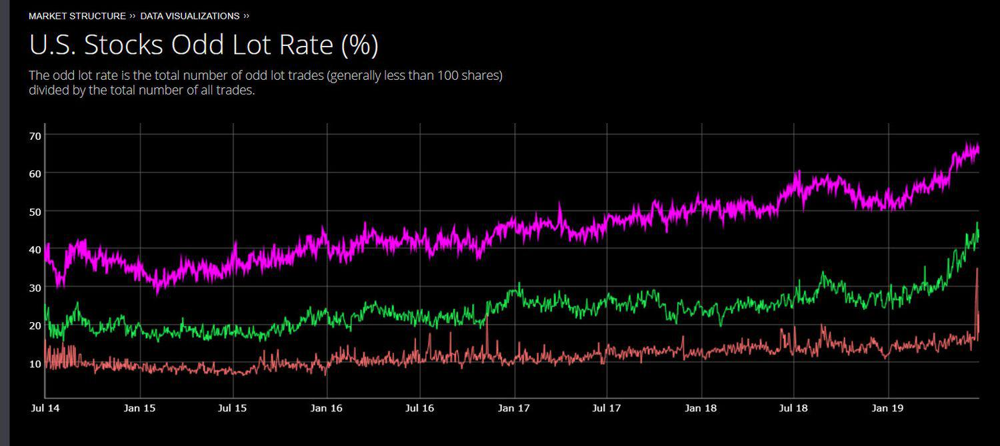

Odd lot trading refers to the buying or selling of a security in quantities that are less than the standard trading unit, usually 100 shares or a multiple thereof, known as a 'round lot.' Historically, odd lot trading emerged to accommodate smaller investors who wished to participate in the stock market but could not afford or chose not to purchase round lots. Odd lots have traditionally been viewed as less significant in terms of market influence compared to larger trades but have become an area of interest due to their nuanced role in revealing investor sentiment and their participation in electronic trading systems.

Algorithmic trading, on the other hand, involves using computer algorithms to automatically execute trades based on predetermined criteria such as timing, price, or volume. Its primary objective is to increase the speed and efficiency of trading operations, reduce human errors, and, in many cases, achieve better prices than might be possible through manual trading. Algorithmic trading has grown immensely over recent decades, becoming a dominant force in global financial markets. The automation and precision offered by algorithms allow for the execution of complex trading strategies that are often impossible to manage manually.



The intersection of odd lot trading and algorithmic trading presents a unique landscape. While odd lots have traditionally been underestimated in their market impact, the advent of algorithmic trading has altered this perception by offering sophisticated techniques to manage these trades effectively. This confluence challenges traders to understand both concepts to develop comprehensive trading strategies. Algorithms can process and execute odd lot orders with increased accuracy and speed, allowing participants to leverage opportunities that might otherwise be overlooked in manual processes.

This article will cover several key topics, including the historical context of odd lot trading, the benefits, and the challenges of integrating algorithmic strategies into odd lot trading. Understanding the evolution and impact of odd lot algorithmic trading helps highlight its growing importance in today's trading environment. 

For traders, whether novices or seasoned professionals, paying attention to odd lot algorithmic trading is becoming increasingly important. The precise maneuvers enabled by technology in handling odd lots can reveal subtle shifts in market dynamics and present new opportunities for profit and risk management. Furthermore, comprehending the regulatory and technical challenges associated with these trades can provide a competitive edge. As markets continue to evolve technologically, staying informed about odd lot algorithmic trading is essential for crafting effective trading strategies now and in the future.

## Table of Contents

## Understanding Odd Lot Trading

Odd lot trading refers to the practice of trading stock in quantities that are less than the standard lot size, typically considered to be 100 shares. This type of trading stands in contrast to standard lot trading, which involves transactions in multiples of 100 shares, known as round lots. The primary distinction between odd lot and standard lot trading lies in the size of the transaction, with odd lots representing smaller quantities that do not reach the round lot threshold.

Historically, odd lot trading was designed to cater to smaller investors who could not afford to purchase larger quantities of stock typical of round lots. In the early days of stock markets, purchasing even a single round lot could represent a significant financial commitment, limiting stock market participation to wealthier individuals or institutional investors. Odd lot trading allowed more investors, particularly those with limited capital, to enter the stock market by enabling them to trade smaller quantities (generally fewer than 100 shares) and thus experience lower entry costs.

In the modern financial landscape, odd lot trading has evolved, reflecting changes in investor behavior and technology. Today, institutional investors, who dominate trading activity, often view odd lot trades as informative signals. These trades might indicate retail investor activity or other non-routine transactions. The advance of technology has also facilitated the execution of odd lot trades, incorporating them seamlessly into sophisticated trading algorithms that can handle a wide array of transaction sizes without significant manual intervention.

Examples of odd lot orders might appear in trading systems as orders for quantities such as 37 shares or 64 shares. These orders are often entered by retail investors looking to invest specific dollar amounts rather than specific quantities of shares. Advanced trading platforms now display odd lot orders alongside round lot orders, ensuring they are given equivalent attention in terms of execution priority and pricing.

The perception of odd lot trading within market dynamics is nuanced. On the one hand, odd lots can signal retail investor sentiment and activity levels, which might differ from that of institutional investors pursuing round lot transactions. On the other hand, the increasing prevalence of [algorithmic trading](/wiki/algorithmic-trading) has integrated odd lots more fully into market processes, potentially amplifying their impact on price discovery mechanisms. In some cases, large-scale processing of odd lot trades might influence [liquidity](/wiki/liquidity-risk-premium) and [volatility](/wiki/volatility-trading-strategies), especially for less liquid stocks.

Overall, while odd lot trading originated to democratize market access, its role today is multifaceted, with implications for both retail and institutional investor strategies. The ability of odd lot trades to reflect nuances in market sentiment underlines their growing significance in contemporary trading practices.

## Algorithmic Trading: A Brief Overview

Algorithmic trading refers to the use of computer programs and software to execute trading orders in financial markets. These algorithms, or sets of instructions, automate processes such as buying and selling securities to achieve specific objectives like minimizing trading costs or maximizing returns. The primary objectives of algorithmic trading include enhancing efficiency in trade execution, reducing transaction costs, and exploiting market conditions for generating profits.

The advent of technology has dramatically transformed traditional trading practices, shifting towards a predominance of computer-driven decisions. Historically, human traders in exchanges handled transactions manually, which often led to slower processing times and higher susceptibility to human error. With technological advancements, trading has transitioned to electronic platforms that allow for faster processing speeds and more complex trading strategies that humans alone could not execute efficiently.

Algorithmic trading strategies encompass a range of techniques tailored to different market opportunities. Market making algorithms facilitate liquidity by continuously placing buy and sell orders, aiming to profit from the bid-ask spread. Arbitrage strategies exploit price discrepancies of the same asset across different markets or forms, aiming to generate risk-free profits. Another prevalent strategy is [trend following](/wiki/trend-following), wherein algorithms analyze market [momentum](/wiki/momentum) and price trends to identify profitable entry and [exit](/wiki/exit-strategy) points.

One of the significant advantages of algorithmic trading is its speed. Algorithms can assess vast amounts of data and execute orders within milliseconds, much faster than any human trader could. This speed can be crucial in markets where prices fluctuate rapidly. Additionally, algorithmic trading improves accuracy by eliminating human errors related to emotional biases or fatigue. Automated systems can operate consistently against predefined criteria and adapt to new market data in real-time.

Algorithmic trading platforms are increasingly becoming accessible to retail investors, not just institutional players. This democratization is driven by the proliferation of algorithmic trading software and services that cater to individual traders, offering tools to design, test, and deploy trading strategies without the need for extensive programming expertise. These platforms often provide user-friendly interfaces and educational resources, enabling retail investors to participate actively in markets using algorithmic strategies traditionally reserved for larger entities. 

The evolution of algorithmic trading thus underscores a shift towards a more data-driven, efficient market environment, providing traders with sophisticated tools to enhance their trading performance while reducing operational inefficiencies.

## The Role of Algorithms in Odd Lot Trading

Algorithmic trading technologies have increasingly been applied to odd lot trading, transforming the way these trades are managed and executed. Algorithms allow for precise control over trade execution, optimizing both the speed and efficiency of handling odd lot orders. These benefits are especially critical in the current fast-paced market environment where even minor delays or inefficiencies can lead to significant costs.

One of the primary advantages of using algorithms in odd lot trading is the optimization of order execution. Algorithms can automatically execute trades based on predetermined criteria, taking into account factors like price changes, trading [volume](/wiki/volume-trading-strategy), and market trends. This capability minimizes human intervention and, consequently, reduces errors and biases, leading to more consistent outcomes. For odd lot orders, which are typically smaller and more numerous than standard lots, this level of automation can be particularly beneficial as it allows for the rapid processing of a larger number of trades.

Specific algorithms have been developed to handle the unique challenges associated with odd lot trading. For instance, certain algorithms are tailored to execute odd lots at the best available price by intelligently routing orders across multiple venues. These algorithms aim to reduce slippage and avoid unfavorable price movements that could erode profit margins. Additionally, some algorithms incorporate risk management features, automatically adjusting trading strategies in response to market conditions to protect gains and limit losses.

Developing effective odd lot algorithms requires substantial data input. Historical market data, including price movements, [order book](/wiki/order-book-trading-strategies) dynamics, and trade volumes, are essential to model and predict market behavior accurately. Real-time data is equally crucial, as it allows algorithms to adapt to evolving market conditions instantaneously. This reliance on data means that odd lot algorithms need robust data processing capabilities, as well as sophisticated analytics to interpret the data and execute trades effectively.

Real-world case studies demonstrate how algorithmic trading enhances odd lot trading strategies. For instance, an investment firm that integrated [machine learning](/wiki/machine-learning) into their execution algorithms saw improved execution quality for odd lot trades. By analyzing patterns in historical trade data, the algorithm was able to dynamically adjust its strategy, leading to reduced transaction costs and improved pricing accuracy. Another example involves a trading firm employing an algorithm that analyzes market depth and liquidity, optimizing its odd lot trading in less liquid stocks and achieving better trade execution outcomes.

In conclusion, the application of algorithmic trading to odd lot transactions significantly enhances trade execution efficiency and effectiveness. By leveraging sophisticated algorithms, traders can manage odd lots with reduced risk and maximized returns, driven by robust data analysis and adaptive strategies. As technology continues to advance, its role in refining and optimizing odd lot trading strategies is set to expand, offering traders new opportunities for growth and profitability.

## Challenges of Odd Lot Algorithmic Trading

Odd lot algorithmic trading presents several unique challenges that traders and developers must address to ensure efficient execution and compliance. The technical challenges, regulatory considerations, market perception, and ethical concerns each play a crucial role in shaping the landscape of odd lot algorithmic trading.

### Technical Challenges
Designing effective algorithms for odd lot trading involves several technical complexities. One primary challenge is ensuring the algorithms can handle the lower liquidity and varying bid-ask spreads associated with odd lots. These factors can lead to increased volatility and slippage, affecting execution quality. Advanced mathematical models and real-time data processing capabilities are essential to overcome these issues.

Algorithm developers must consider the integration of machine learning techniques that can adapt to changing market conditions, allowing systems to optimize trade execution dynamically. However, this approach requires large datasets, high computational power, and sophisticated algorithms to accurately predict market movements.

### Regulatory Considerations
Regulatory frameworks significantly affect algorithmic odd lot traders. Regulators often scrutinize algorithmic trading more intensively to prevent market manipulation and ensure fairness. Odd lot trades, although smaller in size, can accumulate into large positions, impacting market prices. Traders must ensure compliance with regulations like the Markets in Financial Instruments Directive (MiFID II) in the European Union and Regulation National Market System (Reg NMS) in the United States, which impose strict reporting and transparency requirements.

Furthermore, regulatory bodies may impose specific rules on latency and system capabilities to prevent undue market influence or exploitation. Maintaining compliance adds a layer of complexity and cost, requiring regular system audits and updates to adhere to evolving regulations.

### Market Perception and Impact
Market perception of odd lot algorithmic trading is nuanced. While some view it as a democratizing force allowing smaller investors to participate more effectively, others are concerned about its potential to mask larger trading strategies. The aggregation of odd lots through algorithms can inadvertently lead to significant market impact, altering price dynamics without adequate transparency.

The disparity in how markets view odd lots can affect liquidity and volatility. Traders using algorithms must strive to minimize their market footprint to reduce adverse perception and maintain trust within the trading community.

### Data Latency and Execution Risks
Data latency is a critical [factor](/wiki/factor-investing) in the success of algorithmic trading, particularly for odd lot orders. Any delays in data transmission can result in outdated trading signals, leading to poor execution outcomes. Algorithms must be designed to handle high-frequency, low-latency environments to capitalize on fleeting [arbitrage](/wiki/arbitrage) opportunities common in odd lot trades.

Execution risks are heightened for odd lots due to their smaller size and potentially reduced priority in trade execution queues. Order routing algorithms need to be robust and adaptable, ensuring that these trades reach the best available venues promptly, maintaining execution quality.

### Ethical Concerns
The rise of odd lot algorithmic trading brings ethical considerations to the forefront. The use of sophisticated algorithms could potentially exploit informational advantages or contribute to market instability. Ethical trading practices must be prioritized by developing algorithms that promote market integrity rather than solely focusing on profitability.

Ensuring long-term market health requires strategies that align with ethical standards, preventing practices that could lead to systemic risk. Transparency and accountability are fundamental to maintaining market confidence and ensuring that algorithmic trading contributes positively to market dynamics.

In summary, odd lot algorithmic trading challenges encompass technical intricacies, regulatory compliance, market perception, execution quality, and ethical considerations. Addressing these challenges is essential for developing effective, responsible, and sustainable trading strategies in today's financial markets.

## Future Trends and Innovations

Odd lot algorithmic trading is poised to undergo significant advancements as it integrates cutting-edge technological trends. With continual improvements in machine learning and [artificial intelligence](/wiki/ai-artificial-intelligence) (AI), these technologies are set to revolutionize odd lot trading by enhancing decision-making, speed, and precision.

Machine learning models can learn and adapt from vast quantities of trading data, enabling them to predict market movements and optimize trading strategies more efficiently. Algorithms can be designed to recognize patterns that humans might overlook, leading to more profitable trades. For example, [reinforcement learning](/wiki/reinforcement-learning), a type of machine learning, can be used to optimize trade execution by determining the best sequence of buying and selling decisions in real time.

Python code for a simple reinforcement learning agent might look like this:

```python
import numpy as np

class TradingAgent:
    def __init__(self, action_space):
        self.action_space = action_space
        self.q_table = np.zeros((state_space, action_space))
        self.alpha = 0.1  # learning rate
        self.gamma = 0.6  # discount factor

    def choose_action(self, state):
        if np.random.uniform(0, 1) < epsilon:
            return np.random.choice(self.action_space)  # explore
        else:
            return np.argmax(self.q_table[state, :])  # exploit

    def update_q_table(self, state, action, reward, next_state):
        predict = self.q_table[state, action]
        target = reward + self.gamma * np.max(self.q_table[next_state, :])
        self.q_table[state, action] += self.alpha * (target - predict)
```

Moreover, large data analytics are becoming indispensable in refining odd lot trading strategies. The ability to process and analyze large datasets allows traders to gain insights into market trends, sentiment, and volatility, which can inform more precise trading algorithms. As data sources expand, incorporating [alternative data](/wiki/best-alternative-data), such as social media sentiment and macroeconomic indicators, will likely become more prevalent.

The market structure and regulation changes are another area that could significantly affect odd lot algorithms. As exchanges and regulatory bodies adapt to new realities, they may introduce rules that incentivize or restrict certain types of trades. For instance, increased transparency requirements could impact the way algorithmic traders gather and utilize data, potentially leading to more sophisticated compliance strategies embedded within trading algorithms.

Global market trends, such as the increased interconnectedness of global exchanges and the migration towards electronic trading platforms, might also influence the adoption and evolution of odd lot trading strategies. These global shifts could encourage a more widespread use of algorithms designed for various market conditions, enabling traders to capitalize on cross-border opportunities.

In summary, the future of odd lot algorithmic trading will likely be shaped by technological advancements, larger data analytics, regulatory changes, and global market trends. As these elements evolve, they will offer new opportunities and challenges for traders looking to optimize their strategies. This makes it essential for traders to stay informed and agile in adapting to the rapidly changing landscape.

## Conclusion

Understanding the intersection of odd lot trading and algorithmic trading is crucial for traders in today's rapidly evolving financial landscape. Odd lot trading, traditionally viewed as a realm for smaller investors, has gained prominence due to its potential for algorithms to manage these transactions efficiently. Meanwhile, algorithmic trading—defined by the strategic use of computer algorithms for making trade decisions—offers opportunities for improved speed and accuracy, minimizing human error.

The integration of algorithms into odd lot trading unlocks significant advantages, such as enhanced order execution and risk management. By leveraging technology, traders can execute odd lot transactions swiftly while optimizing their strategies to maximize returns. As financial markets become increasingly automated, understanding these dynamics is essential for modern traders seeking to maintain a competitive edge.

Traders should incorporate odd lot algorithmic trading into their methodologies. This approach not only aids in the effective handling of smaller trades but also guides strategic decisions across broader market activities. The potential for technology to drive efficiencies and yield beneficial insights is profound, highlighting the necessity of aligning trading strategies with technological advancements.

Looking ahead, the future of odd lot trading appears intertwined with technological innovations, such as machine learning and artificial intelligence. These advances promise further refinements in trading strategies via large data analytics, potentially transforming how traders approach odd lot transactions. As markets continue to evolve, changes in structure or regulation may shape the landscape, affecting how these algorithms are employed.

For those interested in exploring odd lot algorithmic trading, the next steps include developing a robust understanding of both algorithmic trading principles and odd lot dynamics. Educating oneself on the latest technological tools and staying abreast of regulatory changes are key strategies. Exploring platforms that offer algorithmic trading capabilities and engaging in simulation exercises can also provide practical insights into effectively deploying odd lot algorithms. As digital markets flourish, embracing these developments will be crucial for traders eager to harness the full potential of algorithmic odd lot trading.

## References & Further Reading

[1]: Bergstra, J., Bardenet, R., Bengio, Y., & Kégl, B. (2011). ["Algorithms for Hyper-Parameter Optimization."](https://dl.acm.org/doi/10.5555/2986459.2986743) Advances in Neural Information Processing Systems 24.

[2]: ["Advances in Financial Machine Learning"](https://www.amazon.com/Advances-Financial-Machine-Learning-Marcos/dp/1119482089) by Marcos Lopez de Prado

[3]: ["Evidence-Based Technical Analysis: Applying the Scientific Method and Statistical Inference to Trading Signals"](https://www.amazon.com/Evidence-Based-Technical-Analysis-Scientific-Statistical/dp/0470008741) by David Aronson

[4]: ["Machine Learning for Algorithmic Trading"](https://github.com/stefan-jansen/machine-learning-for-trading) by Stefan Jansen

[5]: ["Quantitative Trading: How to Build Your Own Algorithmic Trading Business"](https://www.amazon.com/Quantitative-Trading-Build-Algorithmic-Business/dp/1119800064) by Ernest P. Chan