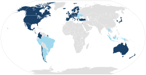

## Table of Contents

## What is the OECD?

The OECD, which stands for the Organisation for Economic Co-operation and Development, is a group of 38 countries that work together to help their economies grow and to solve global problems. It was started in 1961 to help countries talk about and solve issues like trade, education, and the environment. The main goal of the OECD is to make life better for people around the world by sharing ideas and setting standards.

The OECD does a lot of research and makes reports on many topics, like how well schools are doing, how to protect the environment, and how to make economies stronger. These reports help countries make better decisions. The OECD also helps countries make rules together, so they can work better as a team on big issues. By doing this, the OECD helps make the world a fairer and more prosperous place.

## When was the OECD founded?

The OECD was founded in 1961. It started because countries wanted to work together to make their economies better and solve big problems.

The OECD helps countries by doing research and making reports on things like schools, the environment, and how to make money. It also helps countries make rules together so they can work better on big issues. This makes the world a better place for everyone.

## How many countries are members of the OECD?

The OECD has 38 countries as members. These countries work together to make their economies stronger and solve big problems.

The OECD does a lot of research and makes reports on things like schools, the environment, and how to make money. It also helps countries make rules together so they can work better on big issues. This makes the world a better place for everyone.

## What are the main goals of the OECD?

The main goal of the OECD is to make life better for people around the world. It does this by helping countries work together to make their economies stronger and solve big problems. The OECD believes that when countries share ideas and set standards together, everyone can benefit. This means working on things like trade, education, and the environment to make sure everyone has a chance to do well.

The OECD also focuses on doing a lot of research and making reports. These reports help countries understand important issues better, like how well schools are doing or how to protect the environment. By sharing this information, the OECD helps countries make smarter decisions. It also helps countries make rules together, so they can work as a team on big issues. This teamwork makes the world a fairer and more prosperous place for everyone.

## What sectors does the OECD focus on?

The OECD focuses on many different sectors to help countries work together and solve big problems. Some of the main sectors it looks at are trade, education, and the environment. The OECD does a lot of research and makes reports on these topics to help countries understand them better. For example, it might study how well schools are doing in different countries or how to make trade easier between countries.

Another important sector for the OECD is the economy. It helps countries make their economies stronger by sharing ideas and setting standards. The OECD also looks at how to create jobs and make sure people have enough money to live well. By working together on these issues, countries can help each other grow and make life better for everyone.

The OECD also pays attention to other areas like health, technology, and how to fight corruption. It believes that by working together in these sectors, countries can solve big problems and make the world a fairer place. The OECD helps countries make rules together so they can work as a team on these issues, which makes a big difference in people's lives.

## How does the OECD influence global economic policies?

The OECD influences global economic policies by doing a lot of research and making reports. These reports help countries understand big issues like trade, education, and the environment. When countries read these reports, they can make better decisions about their own policies. For example, if the OECD says that a certain way of teaching helps students learn better, countries might change their education systems to use that method. This helps make sure that countries are making choices based on good information.

The OECD also helps countries work together to set standards and make rules. When countries agree on these rules, it makes it easier for them to trade with each other and solve problems like climate change. For instance, if all countries agree on rules about how to protect the environment, they can work together to make the world cleaner. By helping countries make rules together, the OECD makes the world a fairer and more prosperous place for everyone.

## What are some key publications or reports produced by the OECD?

The OECD makes a lot of reports that help countries understand important issues. One of the most famous is the "Economic Outlook," which comes out twice a year. This report looks at how economies are doing around the world and gives advice on what countries can do to make their economies stronger. Another important report is the "Programme for International Student Assessment" (PISA), which checks how well students in different countries are doing in reading, math, and science. This helps countries see what they can do to make their schools better.

The OECD also makes reports about the environment, like the "Environmental Performance Reviews." These reports look at how well countries are doing at protecting the environment and give advice on how they can do better. Another key report is the "Better Life Index," which looks at how happy and healthy people are in different countries. It helps countries see what they can do to make life better for their people. By sharing these reports, the OECD helps countries make smarter decisions and work together to solve big problems.

## How does a country become a member of the OECD?

To become a member of the OECD, a country needs to go through a process that can take a long time. First, the country has to show that it wants to join and that it agrees with the goals of the OECD. Then, the OECD looks at the country to see if it is ready to be a member. This means checking if the country's economy is strong enough and if it follows the rules that OECD countries have agreed on.

If the OECD thinks the country is ready, it will start talking with the country about becoming a member. This is called an accession process. During this time, the country has to show that it can follow all the rules and standards of the OECD. It might take a few years, and the country has to work hard to meet all the requirements. Once the country has done everything right, the OECD members vote on whether to let the country join. If most of them say yes, the country becomes a member of the OECD.

## What is the role of the OECD in tax policy and international taxation?

The OECD plays a big role in helping countries work together on tax policy and international taxation. It makes rules and guidelines that countries can follow to make sure everyone pays their fair share of taxes. One of the most important things the OECD does is fight against tax evasion and tax avoidance. This means it helps countries stop people and companies from hiding their money in other countries to avoid paying taxes. The OECD does this by making reports and setting standards that countries can use to make their tax systems better.

One key project the OECD works on is called the Base Erosion and Profit Shifting (BEPS) project. This project helps countries stop big companies from moving their profits to countries with low taxes. The OECD makes rules that help countries work together to make sure these companies pay taxes where they should. By doing this, the OECD helps make the world's tax system fairer and stops companies from taking advantage of different tax rules in different countries.

## How does the OECD address issues of sustainable development and climate change?

The OECD helps countries work together to solve big problems like sustainable development and climate change. It does this by making reports and setting standards that countries can follow. The OECD believes that if countries work together, they can make the world a better place for everyone. It looks at things like how to use energy in a way that doesn't hurt the environment and how to make sure everyone has enough food and water. The OECD also helps countries make rules together so they can fight climate change as a team.

One important way the OECD helps with sustainable development is by making reports called "Environmental Performance Reviews." These reports look at how well countries are doing at protecting the environment and give advice on how they can do better. The OECD also works on projects like the Green Growth Strategy, which helps countries grow their economies in a way that is good for the environment. By sharing this information and working together, countries can make smarter choices about how to live in a way that is sustainable and helps fight climate change.

## What are the OECD's initiatives in education and skills development?

The OECD helps countries make their schools better and teach people new skills. One of the most important things it does is the Programme for International Student Assessment, or PISA. PISA checks how well students in different countries are doing in reading, math, and science. This helps countries see what they can do to make their schools better. The OECD also makes reports about how to teach people new skills that they need for jobs. These reports help countries make sure that people can find good jobs and do well in their work.

Another way the OECD helps with education is by making the Education at a Glance report. This report looks at how education systems are doing around the world. It gives information about things like how many people go to school, how much money countries spend on education, and how well students do after they finish school. By sharing this information, the OECD helps countries learn from each other and make their education systems better. This makes sure that more people can get a good education and have the skills they need to succeed in life.

## How does the OECD collaborate with other international organizations?

The OECD works with other big groups around the world to solve problems and help countries. It talks with groups like the United Nations, the World Bank, and the International Monetary Fund. These groups share information and work together on things like making the world's economy stronger, fighting climate change, and helping people get better education. By working together, they can do more to help countries and make life better for everyone.

The OECD also helps these groups by doing research and making reports. For example, it might share its findings from the PISA study with the United Nations to help them understand how well students are doing around the world. The OECD also joins in big meetings and projects with these groups. This teamwork helps them all work better and solve big problems faster. By sharing ideas and working together, the OECD and these other groups can make a bigger difference in the world.

## References & Further Reading

[1]: Accenture. (2016). ["Algorithmic Trading: Driving the Next Wave of Growth & Innovation."](https://www.bizapedia.com/trademarks/creativedrive-86832478.html)

[2]: OECD. (2019). ["OECD Business and Finance Outlook 2019."](https://www.oecd.org/en/publications/oecd-business-and-finance-outlook-2019_af784794-en.html) Organisation for Economic Co-operation and Development.

[3]: Gomber, P., Arndt, B., Lutat, M., & Uhle, T. (2011). ["High-Frequency Trading."](https://papers.ssrn.com/sol3/papers.cfm?abstract_id=1858626) Business & Information Systems Engineering, 3(2), 93-98.

[4]: Mathieson, K. (2012). ["Algorithmic Trading: An Examination of Regulatory and Ethical Issues."](https://www.researchgate.net/publication/378548435_Algorithmic_Trading_and_AI_A_Review_of_Strategies_and_Market_Impact)

[5]: Narang, R. K. (2009). ["Inside the Black Box: The Simple Truth About Quantitative Trading."](https://onlinelibrary.wiley.com/doi/book/10.1002/9781118267738) Wiley.

[6]: OECD. (2017). ["Algorithms and Collusion: Competition Policy in the Digital Age."](https://www.oecd.org/en/publications/algorithms-and-collusion-competition-policy-in-the-digital-age_258dcb14-en.html) Organisation for Economic Co-operation and Development.

[7]: Tsang, A., & North, J. (2019). ["The Future of Algorithmic Trading."](https://books.google.com/books/about/Detecting_Regime_Change_in_Computational.html?id=oA75DwAAQBAJ) Financial Times.

[8]: Zhang, S. (2010). ["Handbook of High-Frequency Trading."](https://content.e-bookshelf.de/media/reading/L-7691368-99713f1ac9.pdf) ResearchGate.