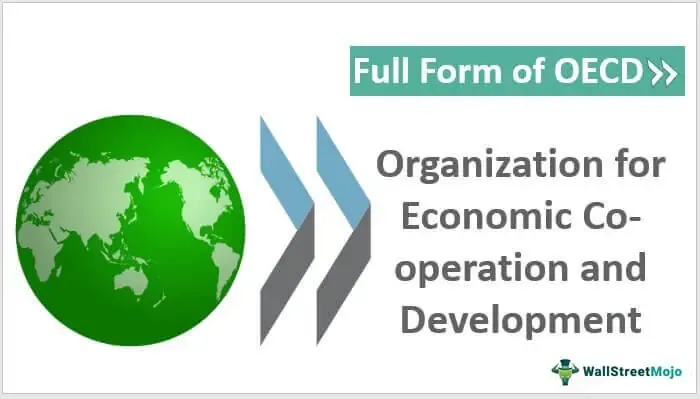

The Organisation for Economic Co-operation and Development (OECD) is an influential intergovernmental economic organization that plays a significant role in shaping global economic and social policies. Established in 1961, the OECD comprises 37 member countries that are committed to democratic governance and market economies. Its primary mission is to promote policies that improve the economic and social well-being of people around the world. The OECD focuses on fostering economic growth, boosting employment, raising living standards, and maintaining financial stability, serving as a platform for member countries to coordinate and refine these efforts in response to global challenges.

In recent years, the OECD has been instrumental in promoting prosperity across its member nations through international development and economic cooperation. The organization provides comprehensive, data-driven analysis and recommendations to guide national policy decisions and foster cooperative international engagement. OECD’s initiatives include developing guidelines for effective foreign aid, promoting sustainable development, enhancing global trade, and addressing critical areas such as tax policies, digital transformation, and green technology.



Amid these developments, the emergence and growth of algorithmic trading represent a new trajectory for economic cooperation. Algorithmic trading, which utilizes advanced mathematical models and automated systems to execute trades at high speeds and volumes, has significantly influenced financial markets. It enhances market liquidity, improves efficiency, and impacts volatility, thereby aligning with OECD's goals to optimize economic performance and stability. The intersection of OECD’s policies with algorithmic trading underscores a future-oriented direction for harnessing innovation in global markets.

This article examines OECD's initiatives, with particular attention to the evolving landscape of algorithmic trading, and discusses how these aspects converge to form a cohesive approach to modern economic policy-making and international cooperation. Through this exploration, the impact of OECD’s strategic framework on global economic systems and the role of algorithmic trading as a pivotal element of financial innovation will be highlighted.

## Table of Contents

## Understanding OECD's Role in International Development

The Organisation for Economic Co-operation and Development (OECD) was established in 1961 with the mission of promoting policies that improve the economic and social well-being worldwide. It comprises 37 member countries, all of which are committed to upholding democratic governance and endorsing market economies. The foundational mandate of the OECD revolves around fostering sustainable economic growth, creating jobs, elevating living standards, and ensuring financial stability across its member states.

The OECD operates as a forum where member countries come together to discuss and coordinate policies aimed at addressing common challenges. It facilitates the exchange of information and experiences, allowing countries to learn from each other's successes and failures. This process of policy dialogue and collaboration helps in formulating better approaches that can be implemented internationally.

Historically, the OECD has achieved significant milestones that underscore its pivotal role in international development. One of its notable contributions includes the establishment of frameworks such as the European Free Trade Area, aimed at reducing trade barriers and enhancing economic cooperation in the region. The creation of the European Free Trade Area was instrumental in boosting trade among European countries, which is aligned with the OECD's broader objective of integrating global economies.

Additionally, the OECD has been prolific in producing comprehensive economic reports that analyze global economic trends and provide policy recommendations. These reports serve as vital resources for governments, policymakers, and economists globally. They not only assess current economic conditions but also forecast future developments, ensuring that countries are better prepared to navigate potential economic challenges. The OECD's ability to generate detailed economic analyses positions it as a key actor in shaping international economic policy.

In sum, the OECD's commitment to coordinating policies among its member countries plays a crucial role in international development. Its historical initiatives, as well as its ongoing efforts in policy formulation and economic reporting, continue to lay down the groundwork for sustained economic growth and development worldwide.

## Economic Cooperation and Development Initiatives

The Organisation for Economic Co-operation and Development (OECD) orchestrates a wide array of initiatives aimed at fostering economic cooperation and sustainable development. Central to its strategy is the provision of comprehensive guidelines for effective aid, crafted to ensure efficient allocation and utilization of resources across developing regions. This is achieved through a rigorous framework that emphasizes accountability, transparency, and alignment with the development goals of recipient countries.

Promoting sustainable development is another cornerstone of the OECD's efforts. The organization underscores the importance of integrating environmental sustainability with economic progress. In its pursuit, the OECD advocates for clean technology adoption and green innovation, enabling nations to transition towards low-carbon economies. This alignment with global sustainability targets is evident in its support for renewable energy projects and resource-efficient practices.

Enhancing global trade forms a critical part of the OECD’s mission. By facilitating trade liberalization and reducing barriers, the organization aims to stimulate economic growth and integration. The OECD also plays a pivotal role in structuring multilateral trade agreements that uphold fair competition and equitable market access.

Moreover, the OECD confronts pressing global challenges by focusing on critical areas such as tax policy reform, gender equality, digital transformation, and green technology. The OECD’s tax policy guidelines aim to create a more transparent international tax system, mitigating base erosion and profit shifting (BEPS). Such measures are crafted to enhance tax compliance and ensure that multinational enterprises contribute fair taxes in the jurisdictions they operate.

Gender equality is another focal area, where the OECD promotes inclusive policies to empower women in the workforce, thereby boosting economic productivity and social cohesion. Initiatives such as the Gender Initiative provide frameworks for member countries to advance gender parity in job opportunities, wages, and leadership positions.

Digital transformation is pivotal in driving economic modernization, and the OECD facilitates this shift by promoting policies that foster innovation, cybersecurity, and digital literacy. These efforts ensure that nations are equipped to navigate and thrive in an increasingly digital world.

Green technology remains at the forefront of the OECD's developmental thrusts, promoting advancements that support environmental sustainability and economic growth. The OECD champions the role of innovation in developing sustainable solutions for energy, transportation, and industry, and provides guidelines to foster public and private sector investments in these technologies.

Case studies reflecting the OECD's impact are found across various regions, including Europe, Asia-Pacific, and South America. For instance, in Europe, the OECD's guidance on economic reforms has significantly aided post-2008 financial recovery efforts, leading to more robust and resilient economies. In the Asia-Pacific, its initiatives have facilitated trade agreements and regulatory frameworks that support rapid economic growth and integration within the region. Meanwhile, in South America, the OECD's collaboration with local governments has led to improved tax systems and better public service delivery, fostering inclusive growth.

By addressing these pivotal areas, the OECD not only aims to elevate the standards of living but also advocates for a balanced approach where economic growth does not compromise environmental integrity and social equality. Through these initiatives, the OECD continues to play a crucial role in steering global economic policies towards a more sustainable and equitable future.

## Algorithmic Trading: An Overview

Algorithmic trading employs advanced mathematical models and automated systems to execute trades at rapid speeds and significant volumes. The fundamental tenet of [algorithmic trading](/wiki/algorithmic-trading) lies in its ability to automate the trading process through pre-defined instructions, which can encompass timing, price, quantity, or even complex mathematical models. These algorithms are crafted to perceive market trends and execute trades in fractions of a second, significantly impacting market [liquidity](/wiki/liquidity-risk-premium), efficiency, and [volatility](/wiki/volatility-trading-strategies).

One of the striking features of algorithmic trading is its influence on market liquidity. By increasing the number of trades executed at any given time, algorithms provide depth to financial markets. This enhanced liquidity not only facilitates smoother transactions but also tends to compress bid-ask spreads, thereby improving market efficiency. However, the high-speed nature of algorithmic trading can sometimes exacerbate market volatility, especially in instances of sudden market shifts or erroneous algorithm functioning. 

Institutional investors, such as hedge funds and investment banks, leverage algorithmic trading to optimize their portfolios. The primary advantage lies in its potential to maximize returns while minimizing trading costs. Algorithms can exploit market inefficiencies, arbiter imperceptible price differentials, and execute large orders by dissecting them into smaller, more manageable trades, thus avoiding significant price impact on the market.

The burgeon of financial technology, or fintech, has been pivotal in the advancement and sophistication of algorithmic trading. Innovations in data processing, computational power, and [machine learning](/wiki/machine-learning) have refined algorithms, enhancing their predictive power and execution capability. For instance, with the development of high-frequency trading, a subset of algorithmic trading, trades can be executed within milliseconds, capitalizing on fleeting market opportunities that would be inaccessible through traditional trading methods.

Consider the following simple example of a moving average crossover strategy implemented in Python, a common algorithmic trading technique:

```python
import pandas as pd

def moving_average_strategy(prices, short_window, long_window):
    signals = pd.DataFrame(index=prices.index)
    signals['signal'] = 0.0

    # Create short and long simple moving averages
    signals['short_mavg'] = prices['Close'].rolling(window=short_window, min_periods=1).mean()
    signals['long_mavg'] = prices['Close'].rolling(window=long_window, min_periods=1).mean()

    # Generate trading signals
    signals['signal'][short_window:] = np.where(signals['short_mavg'][short_window:]
                                               > signals['long_mavg'][short_window:], 1.0, 0.0)   

    # Generate trading orders
    signals['positions'] = signals['signal'].diff()

    return signals

# Sample usage (assuming 'data' is a DataFrame with stock price data):
# signals = moving_average_strategy(data, short_window=40, long_window=100)
```

This strategy generates a buy signal when a short-term moving average crosses above a long-term moving average, and a sell signal when the reverse occurs. Such strategies exemplify the mechanized decision-making processes that define algorithmic trading, entailing minimal human intervention after initial strategy definition. 

Overall, algorithmic trading stands as a cornerstone of modern financial markets, shaping strategies, execution, and the global trading landscape.

## The Intersection of OECD Economic Policies and Algorithmic Trading

The intersection of OECD economic policies and algorithmic trading exemplifies a convergence of modern technology with fundamental economic principles aimed at fostering growth and efficiency. The OECD, known for promoting economic and social policies that lead to sustainable growth, naturally aligns with the objectives of algorithmic trading, which seeks to optimize trading processes and improve market operations.

Algorithmic trading utilizes complex mathematical models and high-frequency automated systems to execute trades that, in turn, can enhance market liquidity and efficiency—goals synonymous with OECD's mission. The increase in market liquidity results from algorithmic trading's capacity to handle large volumes of transactions quickly, reducing spreads and leading to more competitive pricing. This efficiency aligns with OECD's objectives to support stable and transparent financial markets.

A critical aspect of OECD's policy agenda is maintaining market stability. Algorithmic trading incorporates sophisticated risk management mechanisms like circuit breakers and volatility controls, which are vital in mitigating systemic risks and preventing market disruptions. These features are crucial as they complement OECD's dedication to ensuring economic stability across global markets and minimizing financial crises' impacts.

Moreover, the OECD creates regulatory frameworks that guide algorithmic trading practices. These frameworks emphasize transparency, accountability, and fairness, which are essential for cultivating trust in financial systems. By providing guidelines on market conduct and implementing anti-manipulation rules, the OECD supports a trading environment where algorithmic practices are monitored and managed effectively, contributing to the integrity of financial markets.

In summary, the alignment between OECD economic policies and algorithmic trading impacts global markets positively by promoting efficient, stable, and transparent financial environments. This synergy supports OECD's vision of enhancing economic efficiency and sustaining growth, while ensuring that financial systems are robust and trustworthy.

## Global Impact and Future Prospects

The adoption of algorithmic trading is significantly reshaping global trade and investment landscapes by introducing greater efficiency and innovation. As financial markets have become increasingly complex, algorithmic trading stands out for its ability to process vast amounts of data at exceptional speeds, thus enhancing market efficiency. The Organisation for Economic Co-operation and Development (OECD) actively encourages the integration of algorithmic trading into national and international financial systems. This effort aims to promote international collaboration and drive innovation within the sector.

Algorithmic trading influences global markets by impacting liquidity and price discovery processes. By facilitating a more fluid market environment, it allows for optimized allocation of resources, which is a core objective of the OECD's economic strategies. The implementation of algorithmic systems aligns with the OECD’s commitment to international development by enabling markets to operate more efficiently and transparently. Algorithmic trading also plays a crucial role in minimizing trading costs and transaction times, thereby improving returns not only for institutional investors but also potentially benefiting broader economic frameworks.

A key area where algorithmic trading is expected to have a significant future impact is in development finance. As financial markets evolve, there is growing interest in using algorithmic strategies to enhance the effectiveness of development funding. By leveraging real-time data analytics, financial institutions can better assess risk, optimize investment portfolios, and ultimately contribute to sustainable economic growth. This real-time data capability is advantageous for policymakers aiming to craft informed economic strategies, allowing for timely responses to market changes and fostering more resilient economic structures.

The future landscape of algorithmic trading also promises the emergence of new market opportunities. Innovations such as machine learning and [artificial intelligence](/wiki/ai-artificial-intelligence) are set to further integrate into trading systems, enhancing predictive analytics and strategy formulation. This can lead to the discovery of previously untapped markets and the creation of novel investment products tailored to specific economic needs.

In summary, algorithmic trading is not only reshaping the present-day landscape but also holds profound potential for future economic systems. By integrating algorithmic trading policies, the OECD strives to promote economic progress, enhance market stability, and facilitate international partnerships, thereby supporting its overarching mission of economic cooperation and development.

## Conclusion

The Organisation for Economic Co-operation and Development (OECD) stands at a crucial juncture, where its commitment to sustainable economic cooperation is increasingly linked with advancements in algorithmic trading. This connection demonstrates the adaptability and forward-thinking approach of the OECD as it seeks strategies that not only bolster economic growth but also ensure the stability and sustainability of international markets.

The integration of algorithmic trading within OECD's framework can significantly enhance the potential for achieving economic development goals. Algorithmic systems are not merely tools for executing trades but are sophisticated mechanisms capable of processing vast amounts of data to make predictive analyses and optimize decision-making processes in financial markets. As the OECD continues to encourage collaboration among its member countries, the exchange of knowledge and technological advancements in algorithmic trading will inevitably play a pivotal role. The collective experience and innovation fostered by such collaboration can lead to more robust, transparent, and efficient markets.

As algorithmic trading evolves, its principles align closely with the OECD's mission to promote prosperity within a rapidly digitizing global economy. The OECD's advocacy for transparent regulatory frameworks and ethical trading practices ensures that algorithmic trading does not merely serve the interests of profitability but aligns with broader objectives of economic fairness and stability. This alignment is crucial as it fosters trust among market participants, which is essential for sustained economic cooperation.

The future trajectory of algorithmic trading holds promising prospects for further economic integration and innovation. As these technologies become more advanced, they have the potential to revolutionize the ways in which economic policies are formulated and implemented. The OECD's guidance in leveraging these technologies will be instrumental in shaping a digital economy that is both prosperous and equitable.

In conclusion, the synergy between OECD's initiatives and the development of algorithmic trading systems represents a significant opportunity to enhance global economic cooperation. By continuing to support innovative technologies and fostering an environment of collaboration among member countries, the OECD is positioned to lead in navigating the complexities and opportunities presented by the digital economy.

## References & Further Reading

[1]: Accenture. (2016). ["Algorithmic Trading: Driving the Next Wave of Growth & Innovation."](https://www.bizapedia.com/trademarks/creativedrive-86832478.html)

[2]: OECD. (2019). ["OECD Business and Finance Outlook 2019."](https://www.oecd.org/en/publications/oecd-business-and-finance-outlook-2019_af784794-en.html) Organisation for Economic Co-operation and Development.

[3]: Gomber, P., Arndt, B., Lutat, M., & Uhle, T. (2011). ["High-Frequency Trading."](https://papers.ssrn.com/sol3/papers.cfm?abstract_id=1858626) Business & Information Systems Engineering, 3(2), 93-98.

[4]: Mathieson, K. (2012). ["Algorithmic Trading: An Examination of Regulatory and Ethical Issues."](https://www.researchgate.net/publication/378548435_Algorithmic_Trading_and_AI_A_Review_of_Strategies_and_Market_Impact)

[5]: Narang, R. K. (2009). ["Inside the Black Box: The Simple Truth About Quantitative Trading."](https://onlinelibrary.wiley.com/doi/book/10.1002/9781118267738) Wiley.

[6]: OECD. (2017). ["Algorithms and Collusion: Competition Policy in the Digital Age."](https://www.oecd.org/en/publications/algorithms-and-collusion-competition-policy-in-the-digital-age_258dcb14-en.html) Organisation for Economic Co-operation and Development.

[7]: Tsang, A., & North, J. (2019). ["The Future of Algorithmic Trading."](https://books.google.com/books/about/Detecting_Regime_Change_in_Computational.html?id=oA75DwAAQBAJ) Financial Times.

[8]: Zhang, S. (2010). ["Handbook of High-Frequency Trading."](https://content.e-bookshelf.de/media/reading/L-7691368-99713f1ac9.pdf) ResearchGate.