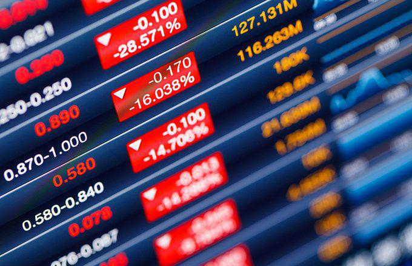

Algorithmic trading has significantly reshaped the way investors participate in financial markets, leveraging technology to improve the speed, accuracy, and efficiency of financial transactions. This transformative approach employs advanced computational techniques and data analytics to execute trades that were traditionally managed manually, allowing traders to respond to market movements in milliseconds.

A pivotal element in this transformation is the OEX, or the S&P 100 Index. Serving as a benchmark for blue-chip stocks in the United States, the OEX comprises the 100 largest companies by market capitalization and is widely used for derivatives trading. This index is a subset of the more comprehensive S&P 500 Index, yet it holds its distinct significance due to its concentration on large-cap stocks, which are typically characterized by stability and liquidity.



The intersection of algorithmic trading and the OEX financial index presents numerous opportunities and challenges for investors and traders. Algorithmic trading allows for strategies like statistical arbitrage, market-making, and trend following to be executed with precision, opening up possibilities for exploiting price discrepancies and optimizing portfolios with OEX options. The application of algorithmic systems in trading OEX options not only enhances market liquidity but also contributes to greater market efficiency.

This article will explore these dynamics, highlighting the importance of the OEX within the broader context of algorithmic trading. It will provide insights into the basics of OEX trading, its role in modern financial markets, and the considerable impact that algorithmic trading has on this sector. By examining these elements, readers will gain a deeper understanding of how to effectively employ algorithmic strategies in trading OEX options, thereby improving both strategic insights and decision-making processes in trading activities.

## Table of Contents

## Understanding the OEX Financial Index

The OEX, a key financial index, is identified by the ticker symbol used for S&P 100 index options traded on the Chicago Board Options Exchange (CBOE). It is comprised of the 100 largest publicly traded companies in the United States by market capitalization. As a subset of the broader S&P 500 index, the OEX serves as a reliable gauge for measuring the performance of large-cap stocks. This index, like the broader S&P 500, is capitalization-weighted, which means that the influence of each company within the index is proportional to its market value.

The calculation of the OEX involves aggregating the market capitalizations of the component companies and adjusting for the total market value of the index's constituents. This calculation can be expressed using the formula:

$$
\text{Index Level} = \frac{\sum_{i=1}^{N} (P_i \times Q_i)}{D}
$$

where $P_i$ is the price of stock $i$, $Q_i$ is the number of shares outstanding for stock $i$, and $D$ is the divisor used to maintain continuity in the index's value when changes occur, such as corporate actions among the component companies.

The OEX options contract, a financial derivative, plays a significant role in the market due to its strategic importance for traders and investors. Historically, OEX options have been extensively used by institutions and individual traders for hedging portfolios, leveraging positions, and speculating on market movements. Their continued relevance is attributed to the [liquidity](/wiki/liquidity-risk-premium) and market insights they offer. The OEX's structure and the substantial market capitalization of its components provide investors with a tool for managing risk and optimizing asset allocation in large-cap U.S. equities.

Understanding the vital characteristics and the historical role of the OEX within financial markets provides a foundation for comprehending its significance. This includes its impact on investment strategies, particularly in an era where the intersection of traditional trading practices and modern technology like [algorithmic trading](/wiki/algorithmic-trading) defines much of the market landscape.

## Algorithmic Trading in OEX Options

Algorithmic trading in OEX options leverages computer algorithms to execute trades with precision and speed that surpass human capabilities. This form of trading aims to exploit price discrepancies within the OEX, which represents the 100 largest U.S. companies by market capitalization. Through advanced quantitative models and [machine learning](/wiki/machine-learning) techniques, traders are able to develop and refine strategies that optimize trading outcomes.

### Exploiting Price Discrepancies

Algorithmic trading provides an edge by quickly identifying and acting on price inefficiencies in the OEX. Algorithms can execute trades in milliseconds, capturing opportunities before the market adjusts. This capability is vital in options trading, where prices are volatile and time-sensitive.

### Integrating Quantitative Models and Machine Learning

Quantitative models form the backbone of effective OEX algorithmic trading strategies. These models use mathematical formulas and statistical analyses to predict price movements and trends. Machine learning further enhances these models by allowing the algorithms to learn from data, adapt to market changes, and improve over time. For instance, employing regression models or neural networks can help forecast the optimal times for buying or selling OEX options.

```python
# Example of a simple linear regression model in Python for predicting option prices
import numpy as np
from sklearn.linear_model import LinearRegression

# Sample data: OEX option prices and corresponding market indicators
market_data = np.array([[1.2, 0.9], [1.5, 1.2], [1.7, 1.5], [2.0, 1.7]])
option_prices = np.array([21, 24, 27, 30])

# Create and train the linear regression model
model = LinearRegression().fit(market_data, option_prices)

# Predict future option prices
predicted_prices = model.predict(np.array([[2.1, 1.8]]))
print(predicted_prices)
```

### Enhancing Liquidity and Market Efficiency

Algorithmic trading significantly enhances market liquidity by facilitating a higher [volume](/wiki/volume-trading-strategy) of trades. This increased liquidity often results in tighter bid-ask spreads, leading to more efficient markets. By enabling rapid trade execution and processing vast amounts of information, algorithms ensure that market prices more accurately reflect available information.

### Advanced Trading Strategies

Several trading strategies benefit from the use of algorithms, including:

1. **Arbitrage**: Algorithms quickly identify and capitalize on price differences of similar or related financial instruments across different markets or platforms.

2. **Trend Following**: These strategies involve placing trades based on anticipated trends in price movements. Machine learning algorithms often detect patterns not visible to human traders.

3. **Mean Reversion**: This strategy assumes that asset prices will revert to their historical mean and relies on statistical models to determine when assets are mispriced relative to historical norms.

4. **Market Making**: Algorithms frequently quote bid and ask prices, staying neutral by simultaneously buying and selling to capture the spread. This strategy relies heavily on speed and precision, both of which are optimized through algorithmic trading.

By incorporating these methodologies, traders not only enhance their profitability but also contribute to a more robust and dynamic trading environment for OEX options. As technology evolves, the sophistication and effectiveness of algorithmic trading strategies are poised to grow, further integrating into mainstream financial ecosystems.

## Advantages of OEX Algorithmic Trading

Algorithmic trading offers significant advantages over manual trading, particularly when it comes to trading OEX options. One of the most noticeable benefits is the enhancement of speed and accuracy in the execution of trades. Algorithms can execute large volumes of trades in milliseconds, far exceeding the capabilities of human traders. This rapid execution minimizes latency, allowing traders to respond to market movements almost instantaneously.

Another key advantage is the ability to backtest trading strategies with historical data. Backtesting involves running a trading algorithm using past market data to assess its performance. This process helps traders refine their strategies before implementing them in real-time trading. By analyzing historical trends, traders can identify which strategies have been effective in different market conditions, enhancing the likelihood of future success. In Python, libraries such as Backtrader or Zipline can be used for [backtesting](/wiki/backtesting):

```python
import backtrader as bt

class MyStrategy(bt.Strategy):
    def next(self):
        # Define strategy logic here
        pass

# Initialize Cerebro engine
cerebro = bt.Cerebro()
data = bt.feeds.YahooFinanceData(dataname='AAPL', fromdate=datetime(2017, 1, 1),
                                 todate=datetime(2020, 1, 1))

cerebro.adddata(data)
cerebro.addstrategy(MyStrategy)
cerebro.run()
```

Risk management in OEX algorithmic trading is significantly enhanced through predictive analytics and automated alerts. Algorithms can analyze vast datasets in real-time, identifying patterns and potential risks before they materialize. This proactive approach enables traders to mitigate risks by adjusting their positions or using hedging strategies, ensuring better capital preservation.

Moreover, algorithmic trading facilitates the simultaneous monitoring and trading of multiple indices. This capability encourages diversification, as traders are not confined to a single asset or market. With the help of technology, algorithms can assess and react to changes across various markets, optimizing the portfolio's performance and reducing exposure to any single market's risk.

Cost efficiency is a substantial advantage of algorithmic trading. By automating trading processes, algorithms minimize human errors that can arise from emotional or irrational decision-making. Furthermore, the reduced need for human intervention and analysis translates into lower operational costs, as fewer resources are required to execute and manage trades. This efficiency enables traders to achieve higher returns relative to their operating expenses.

Overall, the integration of algorithmic trading in the OEX options market enhances speed, accuracy, and efficiency, while promoting robust risk management and cost reductions. These advantages solidify algorithmic trading as an essential component of modern financial strategies.

## Challenges and Considerations

Algorithmic trading in OEX options presents several challenges and considerations that traders and institutions must address to optimize their strategies and safeguard their operations.

### Complexity of Developing and Managing Reliable Algorithms

Creating effective algorithms for OEX trading is inherently complex. Developers need to design algorithms that can process a vast amount of data and make split-second trading decisions. This involves advanced quantitative models and possibly machine learning techniques to identify patterns and opportunities in market data. Ensuring the accuracy of these algorithms is paramount, as errors can lead to significant financial repercussions. Continuous backtesting and tweaking of algorithms against historical data are critical to refining their performance and reliability.

### Regulatory Concerns

Algorithmic trading, due to its high speed and automation, poses potential risks to market stability. Rapid trades executed by algorithms can exacerbate market [volatility](/wiki/volatility-trading-strategies), leading to events such as flash crashes. Regulatory bodies have implemented rules and checks to mitigate these risks, demanding compliance and robust risk management protocols from traders and firms. Adhering to such regulations is essential to safeguard the integrity of the financial markets and protect against systemic risks.

### Data Security and Integrity

In the digital landscape of trading, data security is essential. Algorithms rely on real-time data feeds to make informed decisions. Any compromise in data integrity, whether through cyber attacks or data corruption, can lead to erroneous trading activities and potential financial losses. Robust cybersecurity measures and data verification protocols are necessary to protect sensitive information and ensure the reliability of trading operations.

### Financial Risks of Algorithmic Errors

Algorithmic trading systems, if not thoroughly vetted and monitored, can lead to substantial financial losses. For instance, an incorrect model assumption or coding error might result in unintended trades. It is crucial to conduct rigorous testing and implement real-time monitoring to detect and correct issues promptly. Additionally, establishing fail-safes and controls can help mitigate the risk of algorithmic misfires before they lead to significant financial damage.

### Technological Upgrades and Skilled Workforce

The rapidly advancing technology landscape requires constant updates and enhancements to algorithmic trading systems. Keeping pace with technological innovations is imperative for maintaining competitive edge and system efficiency. Furthermore, a skilled workforce adept at both financial markets and technological tools is vital. Recruiting and training personnel who can develop, manage, and troubleshoot complex algorithms is a critical component of a successful algorithmic trading strategy.

In conclusion, navigating these challenges and considerations is essential for traders and firms engaged in OEX options trading. With careful planning, robust systems, and adherence to regulations, the pursuit of enhanced trading efficacy through algorithmic means can be effectively achieved.

## Future Trends in OEX Algo Trading

The future of algorithmic trading in OEX options is set to be shaped by several innovative trends, with [artificial intelligence](/wiki/ai-artificial-intelligence) (AI) being a key player. AI's integration into trading algorithms significantly boosts their efficiency and adaptability, allowing for the dynamic adjustment to market changes. For instance, machine learning techniques enable the creation of predictive models that refine trading strategies based on historical data and real-time analysis.

The growth of cloud computing technology is another trend poised to revolutionize OEX algo trading. Cloud infrastructure facilitates the handling of more complex strategies by providing scalable computational power and storage solutions, essential for processing vast amounts of market data. This shift not only enhances the operational capabilities but also reduces the overhead costs associated with maintaining physical servers.

Additionally, the collaboration between human traders and automated systems is expected to increase. Human insights, combined with the computational prowess of machines, can result in optimal trading decisions. Traders can focus on strategic decision-making, while machines handle large-scale data processing tasks and execute trades with precision.

In parallel, there is an emerging emphasis on ethical and sustainable trading practices. As algorithms play a more prominent role in financial markets, ensuring they operate within ethical boundaries and promote sustainability is crucial. This focus includes transparent algorithm design and adherence to regulatory standards designed to maintain market integrity.

Finally, the expansion of algorithmic trading into new financial products and markets is anticipated. As technologies evolve, they open up opportunities for trading in innovative asset classes, including cryptocurrencies and other digital assets. The adaptability of algorithmic systems allows traders to explore and leverage these emerging markets effectively, broadening their trading portfolios and strategies. 

Together, these trends underscore the transformative potential of algorithmic trading in OEX options and highlight the ongoing evolution of the financial trading landscape.

## Conclusion

OEX algorithmic trading has emerged as a fundamental element in shaping the landscape of modern financial markets. The seamless integration of algorithms allows for heightened efficiency and precision in executing trades within the S&P 100 Index, marking a significant shift from traditional trading practices. The success of algorithmic trading in OEX hinges on effectively weighing the benefits against the inherent challenges. Benefits such as faster execution, enhanced accuracy, and reduced operational costs are undeniable, yet the complexities involved in algorithm development and market regulation present ongoing hurdles.

Continuous technological advancements promise to revolutionize the way OEX options are traded. Innovations in artificial intelligence and machine learning hold the potential to refine algorithms further, making them more resilient and adaptive to market changes. Traders must remain agile, continually updating themselves with the latest trading techniques and technological advancements to maintain a competitive edge.

In conclusion, the proficient use of algorithmic trading in OEX options not only optimizes execution strategies but can also substantially improve financial performance. By staying informed and adaptable, traders can harness the full potential of these technologies and achieve superior outcomes in their trading activities.

## References & Further Reading

[1]: Bergstra, J., Bardenet, R., Bengio, Y., & Kégl, B. (2011). ["Algorithms for Hyper-Parameter Optimization."](https://papers.nips.cc/paper/4443-algorithms-for-hyper-parameter-optimization) Advances in Neural Information Processing Systems 24.

[2]: ["Advances in Financial Machine Learning"](https://www.amazon.com/Advances-Financial-Machine-Learning-Marcos/dp/1119482089) by Marcos Lopez de Prado

[3]: ["Evidence-Based Technical Analysis: Applying the Scientific Method and Statistical Inference to Trading Signals"](https://www.amazon.com/Evidence-Based-Technical-Analysis-Scientific-Statistical/dp/0470008741) by David Aronson

[4]: ["Machine Learning for Algorithmic Trading"](https://github.com/stefan-jansen/machine-learning-for-trading) by Stefan Jansen

[5]: ["Quantitative Trading: How to Build Your Own Algorithmic Trading Business"](https://www.amazon.com/Quantitative-Trading-Build-Algorithmic-Business/dp/1119800064) by Ernest P. Chan