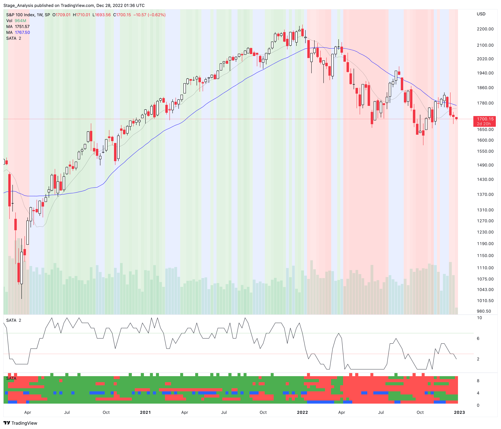

## Table of Contents

## What is the OEX S&P 100 Index?

The OEX S&P 100 Index, also known as the S&P 100, is a stock market index that tracks the performance of 100 large companies in the United States. These companies are chosen from the S&P 500, which is a broader index that includes 500 companies. The S&P 100 focuses on the biggest and most influential companies across different industries, like technology, finance, and healthcare.

Investors use the OEX S&P 100 Index to get a quick idea of how the biggest companies in the U.S. are doing. It's a useful tool for those who want to invest in major companies without having to look at each one separately. The index is updated regularly to make sure it reflects the current top companies, which helps investors make smart choices about where to put their money.

## Who created the OEX S&P 100 Index and when was it introduced?

The OEX S&P 100 Index was created by Standard & Poor's, a company known for making financial market indexes. They introduced the S&P 100 in 1983. Standard & Poor's wanted to give investors a way to see how the biggest companies in the U.S. were doing all at once.

Since it started, the S&P 100 has become a popular tool for investors. It helps them understand the performance of major companies without having to look at each company one by one. The index is updated regularly to make sure it always shows the top 100 companies, which helps investors make good choices about where to put their money.

## What types of companies are included in the OEX S&P 100 Index?

The OEX S&P 100 Index includes a mix of big companies from different industries. These companies are chosen from the S&P 500, which is a bigger group of 500 companies. The S&P 100 focuses on the largest and most important companies in the U.S., so you'll find companies from industries like technology, finance, healthcare, and more.

The index aims to show how these major companies are doing overall. It's not just about one type of company; it's about getting a good picture of the economy by looking at the biggest players in different fields. This way, investors can see how well the top companies are doing and make better decisions about where to invest their money.

## How is the OEX S&P 100 Index calculated?

The OEX S&P 100 Index is calculated using a method called market capitalization weighting. This means that each company in the index is given a weight, or importance, based on its total market value. The bigger the company, the more it affects the overall index. To find the total market value of a company, you multiply the number of its shares by the price of each share. Then, you add up the market values of all the companies in the index and use that to figure out the index value.

The index is updated in real-time as stock prices change throughout the trading day. This means the value of the OEX S&P 100 Index can go up or down based on how the stocks of the companies in it are doing. The index is also adjusted regularly to make sure it still represents the 100 biggest and most important companies. If a company gets bigger or smaller, or if a new company becomes more important, the index might change to reflect that. This helps keep the index a good measure of how the top U.S. companies are performing.

## What is the significance of the OEX S&P 100 Index in the financial market?

The OEX S&P 100 Index is important in the financial market because it gives investors a quick and easy way to see how the biggest companies in the United States are doing. By focusing on the top 100 companies from different industries, the index helps people understand the overall health of the economy. When the OEX S&P 100 goes up, it usually means these big companies are doing well, which can make investors feel more confident about the market. On the other hand, if the index goes down, it might signal that these major companies are struggling, which can make investors more cautious.

The index is also used as a benchmark for many investment products, like index funds and options. This means that people can invest in a fund that tries to match the performance of the OEX S&P 100, instead of buying stocks in each company separately. This makes it easier for investors to put their money into the biggest companies without having to do a lot of research. Additionally, the OEX S&P 100 is used by financial professionals to create and manage investment strategies, helping them make decisions based on the performance of these leading companies.

## How does the OEX S&P 100 Index differ from the S&P 500?

The OEX S&P 100 Index and the S&P 500 are both important stock market indexes, but they focus on different groups of companies. The OEX S&P 100 Index includes the 100 largest and most influential companies in the U.S., chosen from the S&P 500. This means the S&P 100 is a smaller and more concentrated version of the S&P 500, focusing only on the biggest players. Investors use the S&P 100 to get a quick look at how these top companies are doing, while the S&P 500 gives a broader picture of the market by including 500 companies.

Another difference is in how these indexes are used. The S&P 500 is often used as a benchmark for the overall U.S. stock market and is widely followed by investors and financial professionals. It's common to see investment products like mutual funds and ETFs that try to match the performance of the S&P 500. The OEX S&P 100, on the other hand, is used for more specific purposes, like options trading and as a benchmark for certain types of investment funds. While both indexes are important, the S&P 500 gives a more comprehensive view of the market, while the S&P 100 focuses on the performance of the biggest companies.

## What are the criteria for a company to be included in the OEX S&P 100 Index?

To be included in the OEX S&P 100 Index, a company must first be part of the S&P 500, which is a bigger index that includes 500 companies. The S&P 100 then picks the 100 largest and most important companies from this group. These companies are chosen based on their total market value, which is found by multiplying the number of shares a company has by the price of each share. This means the biggest companies, in terms of how much they are worth, are the ones that make it into the S&P 100.

The S&P 100 also looks at how much of a company's stock is available to the public. This is called "float-adjusted market capitalization." Companies with more shares that the public can buy and sell are more likely to be included. The index is updated regularly to make sure it always shows the 100 biggest and most important companies. If a company grows or shrinks a lot, or if a new company becomes more important, the S&P 100 might change to reflect that. This helps keep the index a good measure of how the top U.S. companies are doing.

## How often is the OEX S&P 100 Index rebalanced and reconstituted?

The OEX S&P 100 Index is rebalanced and reconstituted on a regular basis to make sure it always shows the 100 biggest and most important companies in the U.S. Rebalancing means adjusting the weight of each company in the index to reflect their current market value. This happens every quarter, which means four times a year. This helps keep the index accurate and up-to-date with how much each company is worth.

Reconstitution, on the other hand, is when the companies in the index are reviewed and changed if needed. This happens once a year, usually in September. During reconstitution, some companies might be added to the index if they have become big enough, while others might be removed if they have gotten smaller or less important. This yearly check helps make sure the S&P 100 always represents the top companies in the U.S.

## What are the investment products related to the OEX S&P 100 Index?

There are several investment products that are based on the OEX S&P 100 Index. One common type is index funds, which are funds that try to match the performance of the S&P 100. Investors can buy shares in these funds to invest in the 100 biggest companies in the U.S. without having to buy each company's stock separately. This makes it easier for people to put their money into these top companies. Another type of investment product is exchange-traded funds (ETFs). ETFs are similar to index funds but can be bought and sold throughout the day like regular stocks.

Options are another investment product related to the OEX S&P 100 Index. Options give investors the right, but not the obligation, to buy or sell the index at a certain price before a certain date. This can be used for different investment strategies, like trying to make money from changes in the index's value or protecting other investments. The OEX S&P 100 Index is also used as a benchmark for some mutual funds and other investment vehicles. These funds aim to beat the performance of the index, helping investors see if their money is doing better than the top 100 companies in the U.S.

## How can investors use the OEX S&P 100 Index to gauge market performance?

Investors can use the OEX S&P 100 Index to get a quick look at how the biggest companies in the U.S. are doing. Since the index includes the 100 largest and most important companies from different industries, it gives a good idea of the overall health of the economy. When the S&P 100 goes up, it usually means these big companies are doing well, which can make investors feel more confident about the market. On the other hand, if the index goes down, it might signal that these major companies are struggling, and investors might want to be more careful with their money.

The OEX S&P 100 Index can also help investors compare their own investments to the performance of these top companies. By looking at how the index is doing, investors can see if their stocks or funds are doing better or worse than the market's biggest players. This can help them decide if they need to change their investment strategy. For example, if their investments are not keeping up with the S&P 100, they might want to think about putting their money into different companies or funds that are more in line with the index's performance.

## What historical trends and patterns can be observed in the OEX S&P 100 Index?

The OEX S&P 100 Index has shown different trends and patterns over the years. One big pattern is that the index usually goes up over long periods of time, even though there can be ups and downs along the way. For example, if you look at the index over many years, you'll see that it's usually higher at the end than it was at the start. This is because the biggest companies in the U.S. tend to grow over time, and the index reflects that growth. But there are also times when the index goes down a lot, like during big economic problems or financial crises. These downturns can be scary for investors, but they are a normal part of the market's cycle.

Another trend you can see in the OEX S&P 100 Index is how it reacts to big events. When something important happens, like a new law or a big change in the economy, the index can move a lot. For example, when there's good news about the economy, the index might go up because people feel more confident about investing in big companies. But if there's bad news, like a war or a big company going bankrupt, the index might go down because people are worried about the future. These reactions show how the index is a good way to see what's happening in the economy and how people feel about it.

## How do options and futures on the OEX S&P 100 Index work, and what are their strategic uses?

Options and futures on the OEX S&P 100 Index are financial tools that investors use to make money or protect their investments. An option on the OEX gives you the right, but not the obligation, to buy or sell the index at a certain price before a certain date. If you think the index will go up, you can buy a "call" option, which lets you buy the index at a lower price than it might be in the future. If you think the index will go down, you can buy a "put" option, which lets you sell the index at a higher price than it might be later. Futures on the OEX are agreements to buy or sell the index at a set price on a specific date in the future. They are used to bet on where the index will be in the future or to lock in a price now for something you'll need later.

Investors use options and futures on the OEX S&P 100 Index for different strategies. One common use is to make money from changes in the index's value. If you think the index will go up, you can buy call options or futures contracts, hoping to sell them for more later. If you think it will go down, you can buy put options or sell futures contracts, hoping to buy them back for less. Another use is to protect other investments. If you own stocks that are in the S&P 100 and you're worried they might go down, you can buy put options on the index. This way, if the index does go down, the money you make from the options can help cover the losses in your stocks. These tools can be complex, but they give investors more ways to manage their money and plan for the future.

## What is the Understanding of the OEX Financial Index?

The OEX, a key financial index, is identified by the ticker symbol used for S&P 100 index options traded on the Chicago Board Options Exchange (CBOE). It is comprised of the 100 largest publicly traded companies in the United States by market capitalization. As a subset of the broader S&P 500 index, the OEX serves as a reliable gauge for measuring the performance of large-cap stocks. This index, like the broader S&P 500, is capitalization-weighted, which means that the influence of each company within the index is proportional to its market value.

The calculation of the OEX involves aggregating the market capitalizations of the component companies and adjusting for the total market value of the index's constituents. This calculation can be expressed using the formula:

$$
\text{Index Level} = \frac{\sum_{i=1}^{N} (P_i \times Q_i)}{D}
$$

where $P_i$ is the price of stock $i$, $Q_i$ is the number of shares outstanding for stock $i$, and $D$ is the divisor used to maintain continuity in the index's value when changes occur, such as corporate actions among the component companies.

The OEX options contract, a financial derivative, plays a significant role in the market due to its strategic importance for traders and investors. Historically, OEX options have been extensively used by institutions and individual traders for hedging portfolios, leveraging positions, and speculating on market movements. Their continued relevance is attributed to the [liquidity](/wiki/liquidity-risk-premium) and market insights they offer. The OEX's structure and the substantial market capitalization of its components provide investors with a tool for managing risk and optimizing asset allocation in large-cap U.S. equities.

Understanding the vital characteristics and the historical role of the OEX within financial markets provides a foundation for comprehending its significance. This includes its impact on investment strategies, particularly in an era where the intersection of traditional trading practices and modern technology like [algorithmic trading](/wiki/algorithmic-trading) defines much of the market landscape.

## References & Further Reading

[1]: Bergstra, J., Bardenet, R., Bengio, Y., & Kégl, B. (2011). ["Algorithms for Hyper-Parameter Optimization."](https://papers.nips.cc/paper/4443-algorithms-for-hyper-parameter-optimization) Advances in Neural Information Processing Systems 24.

[2]: ["Advances in Financial Machine Learning"](https://www.amazon.com/Advances-Financial-Machine-Learning-Marcos/dp/1119482089) by Marcos Lopez de Prado

[3]: ["Evidence-Based Technical Analysis: Applying the Scientific Method and Statistical Inference to Trading Signals"](https://www.amazon.com/Evidence-Based-Technical-Analysis-Scientific-Statistical/dp/0470008741) by David Aronson

[4]: ["Machine Learning for Algorithmic Trading"](https://github.com/stefan-jansen/machine-learning-for-trading) by Stefan Jansen

[5]: ["Quantitative Trading: How to Build Your Own Algorithmic Trading Business"](https://www.amazon.com/Quantitative-Trading-Build-Algorithmic-Business/dp/1119800064) by Ernest P. Chan