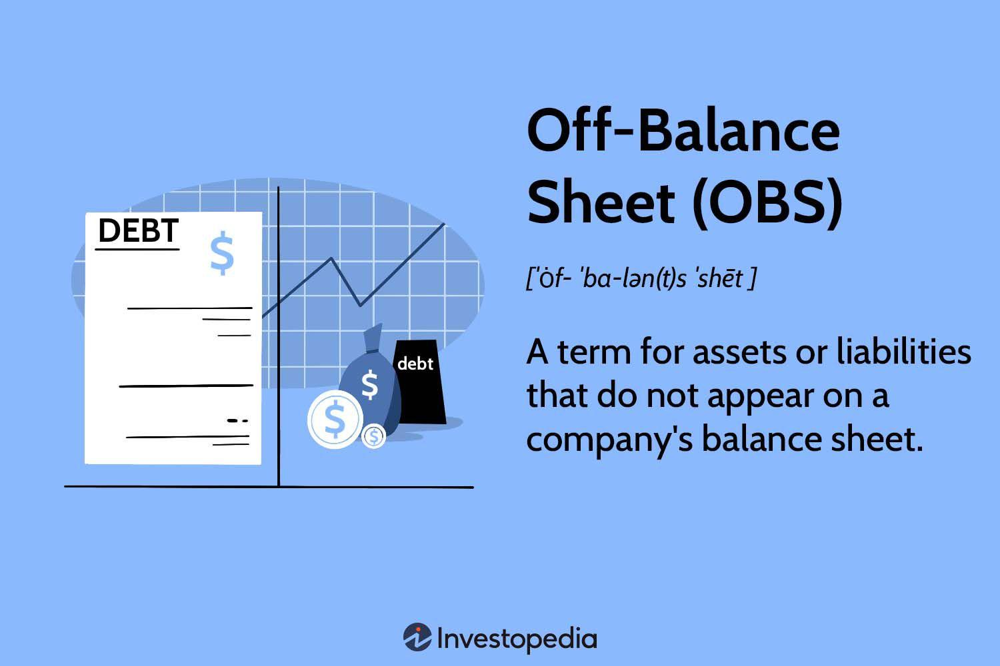

## Table of Contents

## What are off-balance sheet activities?

Off-balance sheet activities are financial activities that a company does not include in its balance sheet. These are often used to manage risk or to keep certain financial obligations off the main financial statements. For example, a company might use off-balance sheet activities to hide debt or to make its financial position look better than it really is.

These activities can include things like operating leases, where a company rents equipment or property without owning it, or joint ventures, where a company partners with another to share the costs and risks of a project. Another common off-balance sheet activity is the use of special purpose entities (SPEs), which are separate legal entities created to hold assets or liabilities that the company wants to keep off its balance sheet.

While off-balance sheet activities can be useful for managing risk, they can also be risky. If not managed properly, they can lead to financial problems or even collapse, as seen in cases like Enron. It's important for companies to be transparent about these activities so that investors and regulators can understand the full picture of the company's financial health.

## Why do companies engage in off-balance sheet activities?

Companies use off-balance sheet activities to manage their financial risks and to make their financial statements look better. For example, if a company has a lot of debt, it might use off-balance sheet activities to keep that debt off its main financial statements. This can make the company look less risky to investors and lenders. Another reason is to manage risk. By using off-balance sheet activities like joint ventures or special purpose entities, a company can share the costs and risks of a project with other partners.

However, these activities can also be risky. If not managed properly, they can lead to big problems. For instance, if a company hides too much debt off its balance sheet, it might collapse when it can't pay back what it owes. This is what happened with Enron, a big company that used off-balance sheet activities to hide its debts and ended up going bankrupt. So, while off-balance sheet activities can help a company manage its finances, they need to be used carefully and with transparency.

## What are the common types of off-balance sheet activities?

Off-balance sheet activities are things companies do that don't show up on their main financial reports. One common type is operating leases. This is when a company rents equipment or a building instead of buying it. By doing this, the company doesn't have to list the cost of the equipment or building on its balance sheet. Another type is joint ventures. This is when a company works with another company on a project, sharing the costs and risks. This way, the company can keep the costs of the project off its balance sheet.

Another common off-balance sheet activity is using special purpose entities (SPEs). These are separate companies that a business sets up to hold assets or debts. By using an SPE, a company can keep those assets or debts off its own balance sheet. For example, a company might use an SPE to borrow money without showing the debt on its balance sheet. These activities can help a company manage its finances, but they need to be used carefully. If not, they can lead to big problems, like what happened with Enron.

## Can you explain what a lease is as an off-balance sheet activity?

A lease is a way for a company to use something, like a building or a piece of equipment, without buying it. Instead of buying it, the company pays to rent it for a certain amount of time. This is called an operating lease. When a company uses an operating lease, it doesn't have to list the cost of the building or equipment on its balance sheet. This makes the company's financial statements look better because it doesn't show as much debt or as many assets.

However, using leases as an off-balance sheet activity can be risky. If a company leases a lot of things, it might end up paying a lot of money over time. And even though the lease isn't on the balance sheet, the company still has to make those payments. If it can't, it could run into financial trouble. So, while leases can help a company manage its finances, they need to be used carefully and with transparency.

## How do joint ventures function as off-balance sheet financing?

Joint ventures are a way for companies to work together on a project without putting the costs and risks on their own balance sheets. When two or more companies form a joint venture, they share the costs of the project. This means that each company can keep the costs off its own balance sheet. Instead, the joint venture has its own balance sheet, which shows the costs and any debts related to the project. This can make each company's financial statements look better because they don't show as much debt or as many costs.

However, using joint ventures as off-balance sheet financing can be tricky. If the joint venture doesn't do well, the companies involved might still have to pay for the costs. Even though the costs are not on their balance sheets, they are still responsible for them. This can lead to financial problems if the joint venture fails. So, while joint ventures can help companies manage their finances, they need to be used carefully and with transparency.

## What role do special purpose entities (SPEs) play in off-balance sheet activities?

Special purpose entities, or SPEs, are like separate companies that a business sets up to hold assets or debts. By using an SPE, a company can keep those assets or debts off its own balance sheet. This can make the company's financial statements look better because it doesn't show as much debt or as many assets. For example, a company might use an SPE to borrow money without showing the debt on its own balance sheet. This can be useful for managing finances, but it can also be risky if not managed properly.

If a company hides too much debt in an SPE, it might run into big problems later. This is what happened with Enron, a company that used SPEs to hide its debts and ended up going bankrupt. Even though the debts are not on the company's balance sheet, the company is still responsible for them. So, while SPEs can help a company manage its finances, they need to be used carefully and with transparency to avoid financial trouble.

## How are derivatives used in off-balance sheet financing?

Derivatives are financial contracts that get their value from something else, like a stock or a commodity. Companies use derivatives to manage risks, like changes in interest rates or currency values. When a company uses derivatives for off-balance sheet financing, it doesn't have to show the full value of the derivative on its balance sheet. Instead, it might only show a small amount, like the initial cost of the contract. This can make the company's financial statements look better because it doesn't show as much risk or as many liabilities.

However, using derivatives for off-balance sheet financing can be risky. If the value of the underlying asset changes a lot, the company might have to pay a lot of money. Even though the full value of the derivative isn't on the balance sheet, the company is still responsible for it. If the company can't pay, it could run into financial trouble. So, while derivatives can help a company manage its finances, they need to be used carefully and with transparency to avoid big problems.

## What are the regulatory requirements for disclosing off-balance sheet activities?

Regulatory requirements for disclosing off-balance sheet activities are important to make sure companies are honest about their finances. In the United States, the main rule is from the Financial Accounting Standards Board (FASB). They say that companies have to tell investors about any off-balance sheet activities that could affect their financial health. This means companies have to write about these activities in their financial reports, so everyone knows what's going on. The goal is to keep companies from hiding debts or risks that could cause big problems later.

Other countries have their own rules too. For example, in Europe, the International Financial Reporting Standards (IFRS) also require companies to be open about off-balance sheet activities. These rules make sure that companies give a clear picture of their financial situation, including any risks or debts that aren't on the main balance sheet. By following these rules, companies help investors and regulators understand the full story of their financial health, which can prevent surprises and keep the market fair.

## How do off-balance sheet activities impact a company's financial statements?

Off-balance sheet activities can make a company's financial statements look better than they really are. When a company uses things like operating leases, joint ventures, or special purpose entities, it doesn't have to show the full cost of those activities on its main financial reports. This means the company can hide some debts or risks, making it look like it has less debt and fewer liabilities. For example, if a company leases equipment instead of buying it, it won't show the cost of that equipment on its balance sheet. This can make the company seem more financially healthy to investors and lenders.

However, off-balance sheet activities can also be risky. Even though these activities are not shown on the main financial statements, the company is still responsible for them. If something goes wrong, like if the company can't pay its lease payments or if a joint venture fails, it could lead to big financial problems. The case of Enron is a famous example where off-balance sheet activities were used to hide debts, and when those debts came to light, the company collapsed. So, while off-balance sheet activities can help manage finances, they need to be used carefully and with transparency to avoid serious issues.

## What are the risks associated with off-balance sheet activities?

Off-balance sheet activities can be risky for companies. One big risk is that these activities can hide debts or other financial problems. If a company uses off-balance sheet activities to keep debts off its main financial statements, it might look healthier than it really is. But if those hidden debts come to light, it can cause big problems. For example, if a company can't pay back the money it owes through off-balance sheet activities, it could go bankrupt. This is what happened with Enron, a company that used off-balance sheet activities to hide its debts and ended up collapsing.

Another risk is that off-balance sheet activities can be hard to manage. If a company uses things like joint ventures or special purpose entities, it has to keep track of them carefully. If it doesn't, it might not know how much risk it's taking on. For example, if a joint venture fails, the company might have to pay for the costs even though they're not on its balance sheet. This can lead to financial trouble if the company isn't prepared. So, while off-balance sheet activities can help manage finances, they need to be used carefully and with transparency to avoid big problems.

## Can you provide examples of off-balance sheet activities that led to major financial scandals?

One famous example of off-balance sheet activities leading to a major financial scandal is Enron. Enron used special purpose entities (SPEs) to hide its debts and make its financial statements look better. They moved a lot of their debt off their balance sheet into these SPEs, so it looked like they had less debt than they really did. But when people found out about the hidden debts, Enron couldn't pay them back and the company went bankrupt. This scandal showed how dangerous off-balance sheet activities can be if they're not used honestly.

Another example is Lehman Brothers. They used a type of off-balance sheet activity called "Repo 105" to make their financial situation look better before reporting their earnings. They would temporarily sell assets to another company and then buy them back later, but they didn't show these transactions on their balance sheet. This made it look like they had less debt than they really did. When the financial crisis hit in 2008, Lehman Brothers couldn't hide their debts anymore and they went bankrupt too. These examples show how off-balance sheet activities can lead to big problems if they're not managed carefully and with transparency.

## How have accounting standards evolved to address off-balance sheet activities, and what are the current standards?

Accounting standards have changed a lot to deal with off-balance sheet activities. After big scandals like Enron, people realized that companies were hiding debts and risks off their main financial reports. So, the Financial Accounting Standards Board (FASB) in the U.S. made new rules. They said companies have to tell everyone about any off-balance sheet activities that could affect their money situation. This means companies have to write about these activities in their financial reports, so everyone knows what's going on. The goal is to keep companies from hiding debts or risks that could cause big problems later.

The current standards, like the ones from FASB and the International Financial Reporting Standards (IFRS) used in Europe, make sure companies are open about off-balance sheet activities. For example, under IFRS, companies have to show leases on their balance sheets if they last more than a year. This makes it harder for companies to hide debts through leases. Also, companies have to explain any joint ventures or special purpose entities they use. By following these rules, companies help investors and regulators understand the full story of their financial health, which can prevent surprises and keep the market fair.

## References & Further Reading

[1]: Dechow, P., Ge, W., & Schrand, C. (2010). ["Understanding Earnings Quality: A Review of the Proxies, their Determinants and their Consequences."](https://www.sciencedirect.com/science/article/pii/S0165410110000339) Journal of Accounting and Economics, 50(2-3), 344-401.

[2]: Lev, B. (1998). ["The Old Rules No Longer Apply: What Role Should Financial Statements Play in Valuing Firms?"](https://www.nytimes.com/2017/02/10/opinion/when-rules-no-longer-apply.html) Financial Analysts Journal, 54(2), 22-28.

[3]: Zhang, Y. (2009). ["A Case Study of the Enron Collapse: Understanding Financial Scandals and Regulation."](https://www.researchgate.net/publication/46302792_The_Case_Analysis_of_the_Scandal_of_Enron) Journal of Business Ethics, 90(SUPPL.3), 561-572.

[4]: Kaplan, R. S., & Norton, D. P. (1996). ["The Balanced Scorecard: Translating Strategy into Action."](https://www.hbs.edu/faculty/Pages/item.aspx?num=8831) Harvard Business School Press.

[5]: ["Accounting Standards Codification (ASC) 842: Leases"](https://asc.fasb.org/layoutComponents/getPdf?isSitesBucket=false&fileName=GUID-B634D7F7-44FF-49D9-ABC9-EE1D1A346D77.pdf), Financial Accounting Standards Board (FASB).

[6]: ["Enron and the New Disclosure Rules."](https://fedsoc.org/commentary/publications/enron-can-we-craft-an-efficient-disclosure-based-policy-response) U.S. Securities and Exchange Commission (SEC).