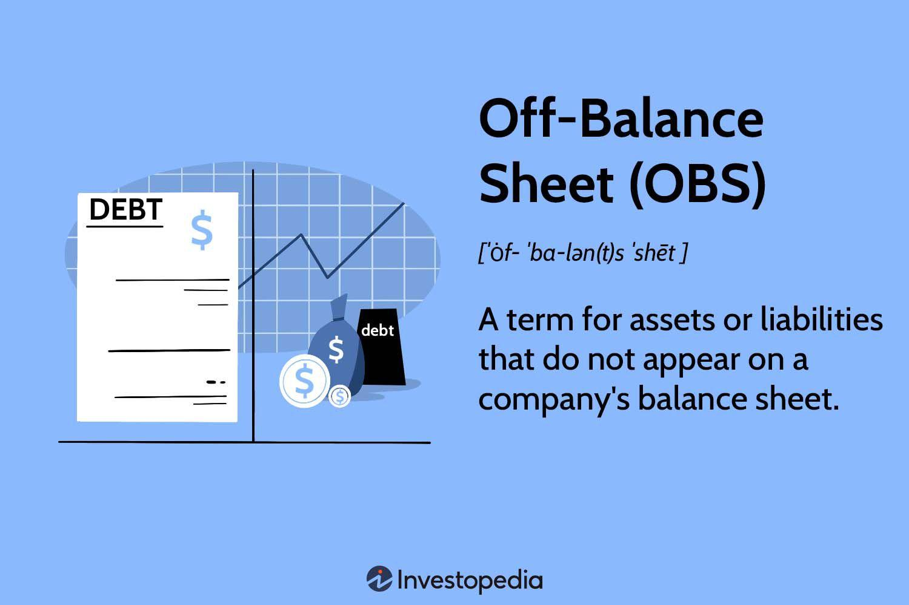

In the rapidly evolving financial landscape, off-balance-sheet (OBS) and algorithmic trading practices have gained prominence due to their potential for financial optimization and risk management. These mechanisms, while distinct, intersect significantly in modern finance, impacting decision-making processes and corporate strategies. OBS entities consist of financial items not directly listed on a company's balance sheet, offering both flexibility and the risk of reduced transparency. They can include special-purpose vehicles, derivatives, and various leasing arrangements, all designed to enhance financial appearances and strategic maneuverability.

Algorithmic trading, on the other hand, employs sophisticated algorithms to execute trades based on specific financial metrics. The use of algorithms facilitates rapid data analysis and decision-making, often influenced by the way OBS items are reported and interpreted. However, the integration of OBS items can distort these metrics, potentially leading to misinterpretations of a company’s financial health or risk profile. An accurate understanding of these interactions is essential for investors and financial analysts who must assess the actual value and risk of investments.



The intersection of OBS and algorithmic trading represents both an opportunity and a challenge. For companies, the strategic use of OBS can optimize financial dealings without impacting balance sheets directly, while algorithmic trading can enhance the efficiency and precision of trading strategies. However, the complexity arising from the interaction between these practices necessitates meticulous regulatory compliance and transparency to prevent the potential for financial misrepresentation. Therefore, a nuanced understanding of these interconnected practices is crucial for optimizing financial outcomes in today's market dynamics.

## Table of Contents

## Understanding Off-Balance-Sheet Entities

Off-balance-sheet (OBS) entities refer to financial arrangements that do not appear on the main balance sheet of a company, meaning they are not counted as direct assets or liabilities. This accounting practice enables firms to manage resources without immediately affecting their financial statements, thus offering a way to optimize financial profiles with enhanced flexibility.

Special-purpose vehicles (SPVs), derivatives, and operating leases are common types of OBS instruments. An SPV is a subsidiary created to isolate the financial risk of specific projects or assets. While an SPV can help manage risk by not reflecting it directly on the parent company's balance sheet, it can also obscure the true extent of financial obligations if not properly disclosed.

Derivatives, such as options, futures, and swaps, allow companies to hedge against risks related to market fluctuations. Although these financial instruments offer protection against adverse price movements, they can become complex and potentially hazardous, with their contingent liabilities often remaining unrecorded on the primary financial documents.

Operating leases provide another means for companies to use assets without owning them, thereby not recording the asset or corresponding liability on the balance sheet directly. The payments for these leases are recorded as operating expenses, smoothing the apparent financial status while potentially hiding longer-term financial commitments.

Although off-balance-sheet arrangements offer substantial benefits, they [carry](/wiki/carry-trading) significant transparency risks. They may give the appearance of a healthier financial state by masking actual debt levels and financial obligations. Investors and analysts might inadvertently misjudge a company's financial condition without full visibility of these hidden liabilities.

Given these implications, a thorough understanding of OBS entities is crucial for grasping the true financial position of a company. Enhanced scrutiny and improved disclosure practices are essential to mitigate the transparency risks associated with off-balance-sheet financing.

## The Role of OBS in Algorithmic Trading

Algorithmic trading utilizes sophisticated computational algorithms to implement trading strategies efficiently, capitalizing on real-time financial data. These algorithms are designed to respond to a variety of financial signals and metrics, which can be influenced by several factors, including off-balance-sheet (OBS) activities.

OBS activities pertain to transactions and financial commitments not directly recorded on a company's main balance sheet. This can include assets, liabilities, or any financial item that a company opts to keep off its primary financial statements. The presence of OBS items can significantly alter the financial profile that algorithms use to make trading decisions.

For instance, when algorithms analyze a company's financial health, they often rely on key metrics such as earnings, cash flow, and debt levels. OBS activities can obscure these metrics, leading algorithms to potentially misinterpret the true financial stance of an entity. For example, a company may have significant liabilities in the form of OBS items that do not appear on the traditional balance sheet. This opacity can lead algorithms to underestimate the company's risk exposure, thereby influencing trading strategies that may not align with the actual financial situation.

Moreover, the use of special-purpose vehicles (SPVs) and other OBS arrangements can further complicate the extraction of accurate financial insights by algorithms. These entities are often used to separate financial risk, but without transparent disclosure, algorithms might fail to assess the risk properly. In turn, this misinterpretation can affect stock valuations and trading volumes, creating an environment of misinformed trading activities.

To mitigate these risks, it is crucial for [algorithmic trading](/wiki/algorithmic-trading) systems to incorporate advanced data analytics capabilities. Machine learning techniques can be employed to recognize patterns and anomalies within financial data, including those arising from OBS activities. By integrating these sophisticated methods, trading algorithms can enhance their accuracy and robustness, ultimately leading to more informed trading decisions. 

Overall, the nuanced role of OBS in algorithmic trading underscores the importance of transparency and the need for algorithms to adapt and evolve in their data processing and analytical capabilities.

## Types of Off-Balance-Sheet Instruments

Financial derivatives, joint ventures, and lease agreements represent integral components of the off-balance-sheet (OBS) landscape, each carrying distinct advantages and risks that can significantly affect a company's financial statements.

**Financial Derivatives:** These are contracts whose value is derived from the performance of underlying assets, indices, or interest rates. Common types include options, futures, and swaps. Derivatives can be used for hedging risks, such as fluctuations in currency exchange rates or commodity prices, thus providing companies with a mechanism to manage financial exposure. However, they also introduce complexities and can obscure the real financial position of a company if not disclosed properly. Misuse of derivatives was a key factor in the financial difficulties faced by several major corporations, as seen in historical financial scandals.

**Joint Ventures:** This involves two or more parties undertaking an economic activity subject to joint control. In practice, joint ventures allow companies to collaborate on large projects without consolidating their financials, thus keeping certain liabilities off their own balance sheets. While this provides strategic growth opportunities and risk-sharing, it can lead to a lack of transparency regarding a company's full financial obligations. Investors must be diligent in comprehending the structure and terms of joint ventures to accurately assess their potential impacts on a company's financial health.

**Lease Agreements:** Operating leases, before recent accounting standard changes, were traditionally recorded off-balance-sheet. This allowed companies to avoid recognizing the lease as a liability, thus improving financial ratios. However, new standards like IFRS 16 and ASC 842 now require most leases to be capitalized on the balance sheet, thereby reducing the ability of companies to keep such arrangements off the books. Despite these changes, legacy impacts and ongoing contracts might still reflect off-balance-sheet, needing careful assessment by investors.

For investors, understanding these off-balance-sheet instruments is critical. They need to evaluate the potential influence on cash flows, risk exposure, and the overall financial strategy of a company. By scrutinizing how these instruments are utilized, investors can gain a clearer picture of a company's financial condition beyond the face of the balance sheet.

## Risks and Implications

Off-balance-sheet (OBS) instruments, while beneficial in presenting a favorable financial profile, pose significant transparency challenges. When companies employ OBS items, such as special-purpose vehicles (SPVs), derivatives, or operating leases, their financial position may appear more robust, potentially misleading stakeholders about the organization’s actual financial health. 

The use of OBS items can obscure the real financial standing of a company, making it difficult for investors and algorithmic trading systems to accurately assess risk. The absence of these items on the balance sheet can lead to a misunderstanding of the company's liabilities and assets. Consequently, investors might make ill-informed decisions based on incomplete or misleading information. For algorithmic trading systems that rely on financial metrics to make decisions, the lack of transparency can result in algorithms generating skewed outputs.

Historical episodes, such as the Enron scandal, illustrate the dangers inherent in the misuse of OBS instruments. Enron used SPVs to keep significant amounts of debt off its balance sheet, artificially inflating its profitability and hiding its financial troubles. This lack of transparency contributed to the company's unexpected collapse, demonstrating the broader implications for markets and investors when OBS items are not properly disclosed. Enron's failure highlighted the need for stringent regulatory measures to ensure accurate and honest financial representation. 

Overall, while OBS instruments can be valuable tools for financial management and flexibility, their potential to mask the true financial health of a company necessitates careful and transparent reporting practices to prevent inaccurate assessments and ensure market stability.

## Case Studies: Enron and Lehman Brothers

Enron and Lehman Brothers are two significant examples where the misuse of off-balance-sheet (OBS) entities had catastrophic consequences, leading to their eventual collapses and highlighting the need for stringent financial regulation and transparency.

Enron, once a leading energy company, used complex OBS entities extensively to mask its financial instability. By utilizing special-purpose vehicles (SPVs), Enron was able to transfer its liabilities off its balance sheet, creating an illusion of financial health and stability. This manipulation allowed the company to hide massive debt and inflate profits, misleading investors and analysts. The SPVs were structured to exclude Enron's debt from their records, thus enabling the company to appear more profitable than it actually was. Enron's practice of non-transparent financial reporting and aggressive accounting tactics ultimately led to its downfall in 2001 when it filed for one of the largest bankruptcies in U.S. history. The collapse had widespread implications for shareholders and employees and triggered a loss of confidence in corporate governance and financial reporting.

Similarly, Lehman Brothers, a major global financial services firm, used OBS strategies that played a role in its collapse during the 2008 financial crisis. Lehman utilized a technique known as Repo 105, which disguised the true extent of its debt by temporarily removing liabilities from its balance sheet through short-term repurchase agreements. These transactions allowed Lehman to present a stronger financial position at the end of each reporting period, thereby misleading investors about its actual leverage and risk exposure. When the truth about its financial state emerged, Lehman Brothers faced a severe [liquidity](/wiki/liquidity-risk-premium) crisis and filed for bankruptcy in September 2008, marking the largest bankruptcy filing in U.S. history at that time and exacerbating the global financial crisis.

The failures of Enron and Lehman Brothers underscore the critical dangers associated with the improper use of OBS entities. These cases have led to increased scrutiny in financial reporting and the implementation of comprehensive reforms aimed at preventing similar occurrences. Notably, regulations such as the Sarbanes-Oxley Act were introduced to enhance corporate accountability and financial disclosure standards, ensuring that investors receive accurate and transparent information. These historical lessons continue to influence financial industry standards and practices, emphasizing the necessity of clear and honest reporting in maintaining market stability and investor trust.

## Regulatory Framework and Reforms

Regulatory frameworks and reforms play a pivotal role in ensuring the transparency and reliability of financial reporting, especially concerning off-balance-sheet (OBS) entities. The Sarbanes-Oxley Act of 2002 is a prominent regulatory measure introduced in response to major corporate and accounting scandals, such as those involving Enron and WorldCom. This U.S. legislation established more stringent requirements for all publicly held companies to improve corporate governance and strengthen the accuracy of financial disclosures. Key components of the Sarbanes-Oxley Act include increased oversight responsibilities for boards of directors, enhanced internal control mechanisms, and stricter penalties for fraudulent financial activity.

The essential objective of these reforms is to protect investors by promoting transparency and integrity in financial reporting. Accurate disclosure of OBS items is crucial, as these can significantly influence a company's financial health and risk profile. For instance, by mandating that companies provide a detailed review of their off-balance-sheet arrangements in the annual reports, the Sarbanes-Oxley Act seeks to mitigate the informational opacity that can mislead investors and financial analysts.

In addition to the Sarbanes-Oxley Act, continuous advancements in accounting standards have been instrumental in addressing the loopholes that were previously exploited in financial reporting. The Financial Accounting Standards Board (FASB) and the International Accounting Standards Board (IASB) regularly update their frameworks to adapt to the evolving financial landscape. For example, the introduction of the Financial Accounting Standards (FAS) 166 and 167 by the FASB requires that certain off-balance-sheet entities be included in the consolidated financial statements of a company. These standards aim to provide a complete picture of a company's obligations and resources, thereby reducing the risk of misleading financial statements.

Moreover, global initiatives such as the International Financial Reporting Standards (IFRS) have been pivotal in standardizing accounting practices across different jurisdictions. The IFRS 16, for example, addresses the issue of lease accounting by requiring companies to recognize assets and liabilities for leases on their balance sheets, enhancing the transparency and comparability of financial statements internationally.

Regulatory reforms continue to evolve, driven by lessons learned from past financial crises and technological advancements that introduce new challenges and opportunities in financial reporting. Maintaining a robust and adaptive regulatory framework is critical for ensuring that off-balance-sheet entities are managed transparently and ethically, thus sustaining investor confidence and market stability.

## Integrating OBS Data in Trading Algorithms

Integrating off-balance-sheet (OBS) data into trading algorithms necessitates a multifaceted approach to enhance both data accuracy and trading efficiency. OBS items, not directly visible in the conventional financial statements, can significantly influence a company's financial metrics and thus impact algorithmic trading strategies. Advanced algorithms, especially those leveraging [machine learning](/wiki/machine-learning), can be adapted to consider these hidden elements, allowing for more accurate financial analysis and risk assessment.

Machine learning models are particularly effective in identifying trends and anomalies related to OBS activities. These models can process vast amounts of data, learning to detect patterns that signify irregularities or shifts in financial profiles due to off-balance-sheet transactions. For instance, unsupervised learning techniques, such as clustering algorithms and anomaly detection models, can recognize unexpected financial patterns that might not conform to typical trends observed in standard balance sheet analysis. Such capabilities are crucial, as they allow for a deeper understanding of potential risks associated with OBS items, contributing to more robust financial strategies.

Integrating OBS data within trading algorithms facilitates enhanced risk management and investment strategies. By accounting for the financial impact of OBS transactions, algorithms can provide a more comprehensive assessment of an entity's financial health, enabling traders and analysts to make more informed decisions. For example, a Python-based machine learning pipeline could preprocess financial data to include OBS metrics, training models to predict financial outcomes. This pipeline would not only utilize traditional financial data but also incorporate previously obscured metrics, providing a clearer image of financial reality.

```python
import pandas as pd
from sklearn.model_selection import train_test_split
from sklearn.ensemble import RandomForestClassifier
from sklearn.preprocessing import StandardScaler

# Load financial data
data = pd.read_csv('financial_data.csv')

# Feature selection including OBS metrics
features = data[['Revenue', 'Expenses', 'OBS_Leases', 'OBS_Derivatives']]
target = data['FinancialHealth']

# Preprocess data
scaler = StandardScaler()
features_scaled = scaler.fit_transform(features)

# Split data
X_train, X_test, y_train, y_test = train_test_split(features_scaled, target, test_size=0.2)

# Train model
model = RandomForestClassifier()
model.fit(X_train, y_train)

# Model evaluation
accuracy = model.score(X_test, y_test)
print(f"Model accuracy: {accuracy}")
```

This Python example demonstrates a simplified approach to integrating OBS data into a predictive model. Such integration provides a more nuanced view of financial health, which is crucial for crafting effective trading strategies. By improving data accuracy and leveraging the power of machine learning, financial analysts and traders can achieve heightened trading efficiency and risk management, ultimately enhancing investment outcomes.

## Conclusion

Off-balance-sheet (OBS) items significantly influence financial strategies and trading decisions, reflecting their importance in contemporary finance. By allowing companies to manage resources efficiently without directly impacting their balance sheets, OBS items provide strategic advantages, such as enhanced liquidity management and optimized capital structure. These benefits enable firms to present a more favorable financial position to investors and creditors, ultimately affecting market perceptions and trading valuations.

Nevertheless, the advantages of OBS items come with the critical need for strict regulatory compliance and transparent reporting. Without these, OBS practices can lead to financial misrepresentation, misleading stakeholders about a company’s actual financial health, as demonstrated by historical events like the Enron scandal. Consequently, ensuring transparency in OBS transactions is essential for maintaining market integrity and protecting investor interests.

The landscape of managing OBS items is poised for transformation with advancements in technology and regulation. Emerging technologies, such as [artificial intelligence](/wiki/ai-artificial-intelligence) and machine learning, offer potential for improved detection and analysis of OBS activities, facilitating better risk assessment and decision-making processes. Regulatory bodies continue to refine standards to close gaps that previously allowed financial misreporting, emphasizing the importance of accuracy and transparency.

In conclusion, while OBS items can significantly enhance financial strategies, they necessitate accountability and clarity in disclosure practices. As technology and regulations evolve, these factors will increasingly influence how OBS items are incorporated into financial management and trading practices, ensuring that they are leveraged ethically and effectively within the financial ecosystem.

## References & Further Reading

[1]: ["Off-Balance Sheet Financing and the Role of Special Purpose Entities"](https://www.investopedia.com/terms/o/obsf.asp) by Peter S. Chen, Journal of Finance.

[2]: ["Algorithmic Trading and High-Frequency Trading"](https://www.investopedia.com/articles/investing/091615/world-high-frequency-algorithmic-trading.asp) by Charles M. Jones, Financial Review.

[3]: ["Derivative Finance and Trading Instruments"](https://www.investopedia.com/terms/d/derivative.asp) by Robert L. McDonald.

[4]: ["Accounting Standards: IFRS 16 and the Changing Landscape of Lease Accounting"](https://assets.kpmg.com/content/dam/kpmgsites/xx/pdf/ifrg/2024/leases-overview.pdf) by the International Financial Reporting Standards (IFRS).

[5]: ["The Sarbanes-Oxley Act and its Impact on Corporate Governance"](https://www.investopedia.com/ask/answers/052815/what-impact-did-sarbanesoxley-act-have-corporate-governance-united-states.asp) by Sanjay Anand, Corporate Governance Journal.

[6]: ["The Role of Transparency in Financial Reporting"](https://fastercapital.com/content/Full-Disclosure-Principle--Transparency-in-Financial-Reporting.html) by PwC.

[7]: ["Enron and the Use of Special Purpose Entities"](https://papers.ssrn.com/sol3/papers.cfm?abstract_id=306820) by the U.S. Securities and Exchange Commission (SEC).