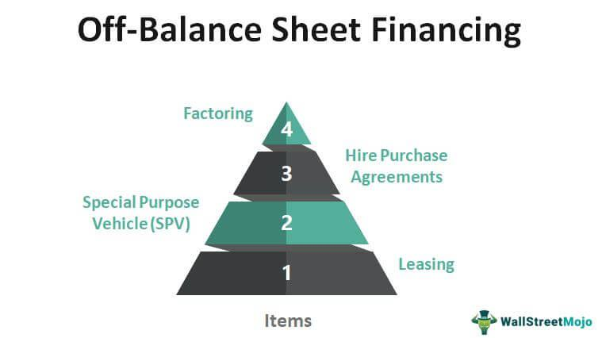

In today's complex financial landscape, off-balance sheet financing (OBSF) and algorithmic trading have become increasingly critical. These mechanisms not only shape corporate finance but also influence investment strategies on a global scale. This article explores how these two concepts intersect and the implications on corporate finance and investment strategies. 

Off-balance sheet financing enables companies to manage their financial obligations without directly affecting their balance sheets. This practice is crucial for businesses aiming to maintain attractive financial ratios, appealing to investors and lenders while retaining financial flexibility. The inclusion of leasing, partnerships, and special purpose vehicles illustrates its application and potential to reshape capital structures.



Algorithmic trading, on the other hand, employs sophisticated computer algorithms to execute trades with speed and precision. The ability to analyze vast datasets rapidly allows for high-frequency trading, which in turn contributes to market liquidity and trade volumes. This form of trading is indispensable for modern financial markets, requiring a profound understanding of market dynamics and data analytics.

Understanding these mechanisms helps businesses make informed decisions about capital structure and trading tactics. As we delve into the specifics of both off-balance sheet financing and algorithmic trading, the synergy they create can enhance corporate profitability and strategic positioning. This intersection is pivotal for companies aiming to optimize their financial performance and navigate today's dynamic market environment effectively.

## Table of Contents

## Understanding Off-Balance Sheet Financing

Off-Balance Sheet Financing (OBSF) refers to accounting methods that allow companies to keep certain financial obligations off their balance sheets. This practice can be particularly advantageous for improving a company's financial health as presented to investors and lenders. By keeping certain liabilities and expenses separate, companies can enhance their financial ratios—such as the debt-to-equity ratio—making them more appealing for investment or obtaining financing.

### Key Strategies in Off-Balance Sheet Financing

1. **Leasing:** One of the most prevalent forms of OBSF involves leasing assets rather than purchasing them. Operating leases, for instance, do not appear on the balance sheet as assets or liabilities since they are treated as rental expenses. This keeps a company's liability figures low while enabling the firm to use necessary assets.

2. **Partnerships and Joint Ventures:** Companies often engage in partnerships or joint ventures where financial obligations are shared among the involved parties. This can help spread the risk and potentially keep certain liabilities or debts off an individual company's balance sheet.

3. **Special Purpose Vehicles (SPVs):** An SPV is a subsidiary created by a parent company to isolate financial risk. The SPV is accounted for separately, which can help keep specific debts or financial obligations away from the main company's financial statements. SPVs gained notoriety due to misuse, as evidenced in cases like Enron, but when used properly, they can be a legitimate financing tool.

While Off-Balance Sheet Financing offers vital mechanisms for managing financial metrics and providing strategic flexibility, it has not been without controversy. The Enron scandal is one of the most notable examples, where the company used SPVs to hide massive debts and inflate profits, which ultimately led to its bankruptcy. This scandal had widespread ramifications, prompting regulatory reforms such as the Sarbanes-Oxley Act to enhance financial transparency and accountability.

It's important for companies employing OBSF to maintain rigorous transparency to ensure these mechanisms are used ethically and legally. Proper disclosure and adherence to accounting standards are crucial for avoiding misrepresentation and adverse legal consequences.

## Algorithmic Trading: A Brief Overview

Algorithmic trading refers to the use of computer algorithms to automate the execution of trading strategies with heightened speed and precision. The algorithms are designed to process large volumes of data rapidly, identify trading opportunities, and execute trades based on pre-defined criteria, minimizing the need for human intervention and emotional bias.

One of the key advantages of [algorithmic trading](/wiki/algorithmic-trading) is its capability to handle high-frequency trading ([HFT](/wiki/high-frequency-trading-strategies)). HFT involves executing a significant number of orders at extremely high speeds, often within fractions of a second. The use of sophisticated algorithms allows traders to capitalize on minute price discrepancies by quickly analyzing market conditions, historical data, and other relevant financial indicators. For instance, a simple moving average crossover strategy, where trades are executed when a short-term moving average crosses above or below a long-term moving average, can be swiftly implemented using algorithms.

Algorithmic trading is crucial in enhancing market [liquidity](/wiki/liquidity-risk-premium), as it facilitates a smooth flow of trades and contributes to narrowing bid-ask spreads. Increased liquidity, in turn, stabilizes prices and reduces [volatility](/wiki/volatility-trading-strategies) in the financial markets, making them more efficient and attractive to investors. The high [volume](/wiki/volume-trading-strategy) of trades executed by these algorithms also contributes to overall market stability by continuously providing buying and selling opportunities.

To effectively develop and deploy algorithmic trading systems, traders need a deep understanding of market mechanics and advanced data analytics techniques. Programming skills in languages such as Python or C++ are essential for coding the algorithms, while expertise in statistical analysis and [machine learning](/wiki/machine-learning) can enhance the ability to predict market movements. Below is a simple example of a trading strategy implemented in Python using the pandas library:

```python
import pandas as pd
import numpy as np

# Generate sample trading data
data = {'Price': [100, 102, 104, 103, 105]}
df = pd.DataFrame(data)

# Calculate the short and long-term moving averages
df['Short_MA'] = df['Price'].rolling(window=2).mean()
df['Long_MA'] = df['Price'].rolling(window=3).mean()

# Generate buy and sell signals
df['Signal'] = np.where(df['Short_MA'] > df['Long_MA'], 'Buy', 'Sell')

print(df)
```

This script computes short and long-term moving averages of a price series and generates buy or sell signals based on these averages, illustrating the automation capacity of algorithmic trading. Utilizing complex algorithms beyond moving averages, traders can implement strategies involving [arbitrage](/wiki/arbitrage), statistical analysis, and predictive modeling, making algorithmic trading a formidable tool in modern finance.

## The Intersection of OBSF and Algorithmic Trading

Both off-balance sheet financing (OBSF) and algorithmic trading are innovative financial strategies that, when combined, can provide significant advantages in the financial sector. Each methodology brings its own set of strengths, which, when integrated, can optimize financial outcomes while concurrently reducing associated risks.

Algorithmic trading leverages sophisticated computer algorithms to execute trades with enhanced speed and precision, outpacing human capabilities in processing vast datasets. Such an ability is pivotal in optimizing OBSF strategies. For instance, algorithms can predict the optimal timing for executing leasebacks or investing in special purpose vehicles (SPVs) by analyzing market trends and historical data patterns. By accurately forecasting market conditions, algorithms can inform more strategic decisions in managing off-balance sheet obligations, ultimately maximizing returns and ensuring timely capital deployment.

Meanwhile, OBSF offers the structural financial flexibility necessary for firms engaged in algorithmic trading. By keeping certain financial obligations off the company's balance sheet, firms can present a healthier financial profile, which can be particularly beneficial in securing capital essential for sustaining high-frequency trading operations. This flexibility can aid in managing liquidity risk and ensuring that adequate financial resources are dedicated to technological advancements in trading systems.

The synergy between these financial practices is exemplified in how OBSF strategies can enhance the operational efficiency of algorithmic trading algorithms. Through adjusted capital structures, businesses can deploy these algorithms more effectively, allowing them to engage in larger volumes of trades without the burden of dilutive debt on their balance sheets. Additionally, the reduction of visible liabilities affords firms the latitude to innovate trading strategies without immediate financial scrutiny.

In conclusion, the intersection of OBSF and algorithmic trading represents a compelling evolution in corporate finance and investment strategy. By marrying the capital flexibility of OBSF with the precise execution capabilities of algorithmic trading, organizations can propel their profitability while mitigating financial and operational risks. This combination not only sharpens competitive edge in the market but also sets a framework for a more dynamic and resilient financial strategy.

## Implications and Considerations

Off-balance sheet financing (OBSF) and algorithmic trading, while advantageous, present numerous regulatory and operational challenges that must be diligently managed to prevent potential legal issues. Regulatory compliance is paramount as firms employ these sophisticated financial strategies. Both methods demand clarity and transparency, primarily because they can obscure liabilities and generate volatile trading scenarios if not managed appropriately.

For OBSF, hidden liabilities can emerge if financial obligations are not adequately disclosed. This lack of transparency can mislead investors and regulators regarding a company’s true financial health. For instance, the Enron scandal highlighted how complex financial maneuvers, when not properly disclosed, can lead to catastrophic financial failures. Therefore, companies must ensure meticulous compliance with accounting standards and financial regulations to prevent the misuse of off-balance sheet arrangements. This involves disclosing any special purpose vehicles (SPVs) or partnerships, which could otherwise mask the true leverage and risk exposure of the company.

Algorithmic trading brings its own set of challenges, primarily due to its dependence on technology and speed. Rogue algorithms can lead to substantial market disruptions, as evidenced by events like the 2010 Flash Crash. The inherent complexity of these algorithms demands robust operational controls to ensure that they execute trades as intended without leading to undue volatility or market manipulation. Regulatory bodies such as the U.S. Securities and Exchange Commission (SEC) often require algorithmic traders to implement safeguards, including real-time monitoring and risk mitigation protocols, to address fail-safes in trading algorithms.

Understanding the costs associated with these financial strategies is crucial. In OBSF, hidden costs may include future liabilities associated with SPVs or lease obligations. To quantify these costs, companies can employ financial models or simulations that [factor](/wiki/factor-investing) in potential economic downturns or shifts in interest rates.

Algorithmic trading involves significant technical and infrastructural costs such as the development and maintenance of complex algorithms and trading systems, as well as the necessity for high-speed data feeds and execution platforms. Furthermore, firms must invest in cybersecurity measures to protect these systems from breaches or failures.

These financial instruments require a balanced approach combining innovation and strict adherence to regulatory frameworks. Companies must continuously evaluate and adapt their strategies to ensure compliance while optimizing their benefits. As technological advancements and regulatory landscapes evolve, firms engaging in OBSF and algorithmic trading must remain vigilant and proactive in managing both the opportunities and risks associated with these financial mechanisms.

## Conclusion

Off-balance sheet financing (OBSF) and algorithmic trading have become integral components of modern finance, significantly affecting how companies operate and strategize. By adopting these practices, businesses can achieve heightened financial performance and strategic positioning. OBSF offers the flexibility needed to improve financial metrics, making companies more attractive to investors and lenders. This strategic maneuver allows businesses to structure their financials to pursue investment opportunities without burdening their balance sheets excessively.

Simultaneously, algorithmic trading transforms the trading landscape by enabling rapid, high-frequency transactions that human traders simply cannot match. The precision and speed of algorithmic trading facilitate enhanced market liquidity and efficiency, bolstering a firm's capacity to respond to market fluctuations and optimize trade outcomes.

Despite their substantial benefits, both OBSF and algorithmic trading come with inherent risks. Effective navigation through these complexities requires rigorous adherence to regulatory frameworks and a deep commitment to transparency. The potential for hidden liabilities in OBSF and for algorithmic trading errors underscores the necessity for meticulous compliance and risk management practices.

As technology advances and financial regulations evolve, these practices are poised for further transformation. Innovations in [artificial intelligence](/wiki/ai-artificial-intelligence) and machine learning could enhance the effective implementation of algorithmic trading. Concurrently, regulatory changes may introduce more stringent controls, reshaping how OBSF is utilized. Companies that adeptly integrate these financial innovations and adapt to the changing regulatory landscape will likely secure a competitive edge, underscoring the essential role of OBSF and algorithmic trading in shaping the future of financial strategies.

## References & Further Reading

[1]: Munter, P. (2022). [SEC Proposes New Rules to Enhance and Standardize Climate-Related Disclosures for Investors.](https://www.sec.gov/newsroom/press-releases/2024-31) U.S. Securities and Exchange Commission.

[2]: Hull, J. C. (2018). ["Options, Futures, and Other Derivatives."](https://www.semanticscholar.org/paper/Options%2C-Futures%2C-and-Other-Derivatives-Hull/89bdee500c8623864fc9eb7a471546aa713acc44) Pearson Education.

[3]: Dizard, J. (2001). "Finance: Off-Balance-Sheet Financing's Uncertain Future." Financial Times. Retrieved from [Financial Times Archive](https://en.wikipedia.org/wiki/Population_transfer).

[4]: Vuuren, G. (2018). ["An overview of algorithmic trading platforms."](https://www.tandfonline.com/doi/full/10.1080/23322039.2018.1427533) Journal of Derivatives & Hedge Funds.

[5]: Goodspeed, T. (2021). ["High-Frequency Trading and Its Impact on Markets."](https://www.semanticscholar.org/paper/High-Frequency-Trading-and-Its-Impact-on-Market-Zhai/97290f4f9b83ae6e0008f4ae69f4b2e44c2d5cc1) International Financial Law Review.