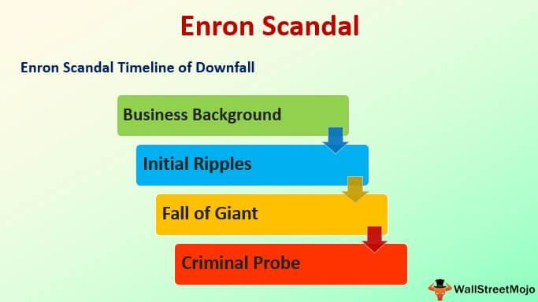

The convergence of acting and algorithmic trading presents a fascinating juxtaposition of artistry and data-driven precision. At first glance, these two domains might appear to share little in common; however, they are linked by the notion of being "off book." In theatre, "off book" refers to the stage during rehearsal when actors have memorized their lines, allowing them to perform without the immediate need for a script. This freedom enhances spontaneity and enables a more authentic interaction with fellow performers and the audience. The significance of being off book in theatre cannot be understated, as it is instrumental in creating fluid and dynamic performances.

On the other hand, "off book" in financial trading refers to transactions that are executed outside of formal exchanges. In the context of algorithmic trading, these off-book trades enable greater flexibility and innovation by allowing trades to occur beyond the confines of traditional market structures. This can offer advantages such as reduced costs and increased privacy, though it may trade off some transparency and regulatory oversight. Algorithmic trading, which involves the use of computer algorithms to execute trades at high speed and volume, relies on the precise execution of strategies without reliance on human intuition or discretion.

Both acting and trading are predicated on rigorous preparation, yet require participants to perform in real-time scenarios where adaptability is key. An actor's ability to be off book ensures preparedness for the unpredictable nature of live performances. Similarly, traders must navigate fluctuating markets, adapting algorithms as conditions change. For both actors and traders, mastering the off-book state signifies a profound understanding of their respective crafts that enables peak performance. This cross-disciplinary examination reveals the underlying discipline and adaptability necessary for success in either field, offering intriguing opportunities for mutual insight and learning.

## Table of Contents

## Understanding 'Off Book' in Theatre

In theatre, the term "off book" refers to an actor's ability to perform their part without holding a script. This signifies that the actor has memorized their lines and cues, a critical step in the rehearsal process that enables a more dynamic and authentic performance. Being "off book" is pivotal for live theater performances as it allows actors to fully inhabit their roles, interact naturally with fellow performers, and respond spontaneously to the nuances of the unfolding scene.

The primary importance of being off book lies in its contribution to spontaneity and fluidity in performances. When actors are not reliant on their scripts, they can focus entirely on their delivery, interaction with other characters, and adapting to live changes on stage. This freedom creates a more cohesive and engaging experience for the audience, as actors can react to each other in real-time, making the performance feel genuine and seamless.

Actors employ several techniques to achieve the state of being off book. Repetition is the most traditional and commonly used method, where actors consistently and repeatedly read their lines to embed them in their memory. Partner exercises are also popular, where actors practice with one another to simulate the actual performance environment, allowing them to learn their cues and timing within the interaction. These exercises often involve running lines with a scene partner, which helps build the chemistry and timing needed for the actual performance.

Memorization tips and strategies vary, but many actors find success using visualization techniques, attaching emotions or physical actions to certain lines, or breaking down scripts into more manageable sections. Additionally, some actors use mnemonic devices or association methods, linking lines to specific movements or positions on stage, which can aid in recall during performances.

These techniques underscore the importance of thorough preparation in theatre, ensuring that actors can perform confidently and effectively, fully engaging their audiences without the distraction of referring back to a script.

## Key Theatre Terminology for Actors

In the world of theatre, understanding key terminology is crucial for actors to deliver compelling performances. Among these, terms such as 'cue', 'blocking', and 'stage directions' play fundamental roles.

A 'cue' refers to the signal—be it a word, gesture, or event—that prompts an actor to speak or perform a particular action. Memorizing and responding to cues accurately enables actors to maintain the flow of the performance and interact seamlessly with fellow cast members. For instance, if an actor misses a cue, it can disrupt the timing and coordination, highlighting the significance of keen awareness and preparation.

'Blocking' involves the precise staging of actors, including their movements and positioning on stage during a performance. This component is meticulously planned by the director to ensure that actors are visible to the audience and the narrative is effectively conveyed through physical placement and movement. Proper blocking allows actors to navigate the stage confidently, contributing to the visual and narrative coherence of the production.

'Stage directions' provide actors with instructions in the script regarding their movements, positions, and use of space. These directions, usually set by the playwright and further orchestrated by the director, guide actors on how to align their physical actions with the energy and emotion required for the scene. Adhering to stage directions ensures that each performance is consistent and faithful to the intended production design.

Several acting methodologies also influence how actors approach their roles. 'Method acting' is a technique where actors fully immerse themselves into their characters, often drawing from personal experiences to evoke genuine emotions. This approach, popularized by figures such as Lee Strasberg, allows actors to deliver authentic and emotionally resonant performances by deeply connecting with their roles.

'Subtext' refers to the underlying meaning or implication behind a character's spoken lines, encompassing emotions and thoughts that are not explicitly expressed. Understanding and conveying subtext is vital as it adds depth to a character, allowing actors to portray more nuanced performances that resonate with audiences.

'Improvisation' involves spontaneously creating dialogue and action without a script, often enhancing a performance with unexpected creativity and allowing actors to explore their characters more deeply. It requires quick thinking and adaptability, skills that can lead to discovering new aspects of the characters and the story.

The significance of these terms and techniques lies in their ability to shape a successful performance. Mastery of cues, blocking, and stage directions ensures that actors deliver their lines and actions at the right moments and in the right places. Techniques like method acting, attention to subtext, and improvisation enrich performances by adding layers of authenticity and complexity. Understanding and skillfully applying theatre terminology is essential for actors striving to captivate their audiences and bring their characters truly to life.

## What is Off Book Trading?

'Off book trading' refers to transactions executed outside formal exchanges like the New York Stock Exchange or NASDAQ. These trades occur directly between parties, often through private negotiation or over-the-counter (OTC) platforms. This approach stands in contrast to on-exchange trading, where trades are conducted within the regulated confines of established marketplaces.

The flexibility of off-book trading is one of its most notable advantages. These transactions allow for customized deals tailored to specific needs, which can be particularly beneficial for large institutional investors seeking to move significant quantities of assets without impacting market prices. Additionally, off-book trades can provide opportunities for executing transactions beyond regular market hours or with assets not listed on formal exchanges.

Despite these benefits, off-book trading presents significant drawbacks, primarily due to a lack of transparency. Since these transactions do not appear on public exchange order [books](/wiki/algo-trading-books), they can obscure true market conditions, potentially leading to inefficiencies. This opacity can be problematic for market participants lacking access to detailed information, ultimately affecting price discovery and market integrity.

Another disadvantage is reduced regulatory oversight, compared to on-exchange trading. On-exchange trades benefit from stringent regulations designed to protect participants, ensuring fair practices and reducing the potential for fraud. These regulations contribute to the security and stability of financial markets, which can be less assured for off-book transactions.

In comparing off-book with on-exchange trading, several key distinctions emerge:

1. **Visibility:** On-exchange trades are publicly recorded, contributing to clear market signals and aiding in price discovery; in contrast, off-book trades remain private, masking the full market picture.

2. **Regulation:** Exchanges are bound by regulatory frameworks providing investor protection and ensuring market order, while off-book trades often lack this level of oversight, posing increased risks.

3. **Security:** Trading on exchanges involves established clearing and settlement systems that reduce counterparty risk, whereas off-book transactions may rely on bilateral agreements with varying risk profiles.

Understanding these differences helps market participants assess the risks and rewards of engaging in off-book trading strategies, allowing them to make informed decisions in aligning such strategies with their broader investment goals and risk tolerance.

## The Role of Algorithmic Trading

Algorithmic trading, a dominant force in contemporary finance, involves using computer programs and software algorithms to execute trading orders. These algorithms can process complex mathematical models and real-time data at speeds far beyond human capability. The significance of [algorithmic trading](/wiki/algorithmic-trading) in modern finance lies in its ability to enhance the efficiency of financial markets by increasing the speed and accuracy of trades, thus providing greater [liquidity](/wiki/liquidity-risk-premium) and facilitating price discovery.

One of the most significant advantages of algorithmic trading is its speed. Algorithms can operate at microsecond precision, enabling traders to capitalize on short-lived market opportunities that would be impossible to exploit manually. This speed advantage is crucial in markets where prices can change rapidly. For instance, high-frequency trading ([HFT](/wiki/high-frequency-trading-strategies)), a subset of algorithmic trading, relies heavily on such speed and can execute thousands of orders per second.

Precision is another critical benefit. Algorithms can be designed to adhere strictly to predefined rules and conditions, ensuring consistent execution. This precision minimizes the risk of human error, such as executing trades at the wrong price or time, which can be costly in volatile markets. Moreover, algorithms can analyze vast datasets to identify patterns and trends, improving the decision-making process.

Despite these advantages, algorithmic trading presents several challenges. One major concern is the technical complexity involved. Developing and maintaining sophisticated algorithms require a deep understanding of both financial markets and computer science, often necessitating collaboration among financial professionals, mathematicians, and software engineers. Additionally, the infrastructure needed to support high-speed trading is costly and requires significant investment in technology and data analysis tools.

Another challenge is the potential market impact of algorithmic trading. The speed and [volume](/wiki/volume-trading-strategy) of trades executed by algorithms can lead to increased market [volatility](/wiki/volatility-trading-strategies). In some cases, errant algorithms have caused drastic market fluctuations, such as the "flash crash" of May 6, 2010, when the Dow Jones Industrial Average plunged nearly 1,000 points within minutes before partially recovering.

Furthermore, there are concerns about the fairness and transparency of algorithmic trading. While algorithms can be optimized for gains, they can also exploit minute market inefficiencies, raising questions about market manipulation and the advantages enjoyed by entities with the resources to deploy such technology.

In summary, while algorithmic trading offers substantial benefits like speed, precision, and the reduction of human error, it also presents unique challenges including technical difficulties and market impact risks. As financial markets continue to evolve, algorithmic trading will likely remain a vital component of trading strategies, necessitating ongoing attention to both its advantages and its limitations to ensure stable and transparent markets.

## Parallels between Theatre and Trading

Examining the parallels between theatre and trading highlights compelling similarities in preparation, precision, and performance. Both disciplines demand comprehensive preparation to ensure success; actors memorize lines to perform seamlessly on stage, while traders develop strategies to execute trades effectively. In theatre, being "off book" is critical as actors rely on memory for fluidity and authenticity, similar to how traders must internalize algorithms for smooth execution during market fluctuations.

Precision is a cornerstone in both fields. Actors must deliver lines and cues accurately, aligning with blocking and timing. Similarly, traders need meticulous attention to data and timely execution based on algorithmic cues. Errors can detract from a performance or lead to financial loss, making precision non-negotiable.

The concept of being "off book" aids professionals by facilitating adaptability and real-time decision-making. Actors off book can improvise naturally, enhancing their interaction with fellow performers and audience. Similarly, traders equipped with deep algorithmic understanding can adjust strategies on-the-fly to capitalize on market dynamics. For example, an actor might improvise when a fellow actor skips a line, akin to a trader deviating from a predefined strategy in response to unforeseen market news.

Adaptability and real-time decision-making are pivotal. Theatre often involves live, unpredictable environments, necessitating quick-thinking and adaptability. In trading, market conditions can change rapidly, demanding real-time analysis and decision-making. Similar to an actor who must react to unexpected changes on stage, a trader constantly monitors and adjusts strategies based on live market data. 

In essence, professionals in both theatre and trading benefit from a strong foundational preparation that allows for precise execution and adaptability. The ability to operate "off book" underlines the importance of internalizing one's role or strategy, enabling a fluid and responsive performance whether on stage or in the financial markets. Both actors and traders learn to navigate the dynamic interplay of preparation and spontaneity, underscoring the transformative power of being "off book" in their respective fields.

## Conclusion

The concept of being "off book" holds distinct importance in both theatre and algorithmic trading, symbolizing preparation and mastery over one's craft. In theatre, being off book denotes an actor's ability to perform without relying on the script, fostering spontaneity and emotional authenticity. In trading, off-book transactions represent trades executed outside official exchanges, allowing for flexibility but demanding high levels of trust and understanding due to a lack of transparency.

Actors and traders can gain valuable insights from each other's disciplines. Traders, much like actors, can benefit from the ability to adapt quickly to unpredictable scenarios, showcasing the necessity for keen situational awareness and real-time decision making. On the flip side, actors can learn from traders the importance of precision and analytical thinking, which can enhance their strategic approach to performances.

Both fields require a deep commitment to preparation and adaptability, underscoring the importance of being well-prepared while remaining flexible enough to handle unexpected developments. As both theatre and financial trading continue to evolve, the cross-disciplinary lessons drawn from each can lead to more holistic professionals capable of thriving in dynamic environments.

Ultimately, the journey of mastering the art of being off book—whether in the vibrant world of theatre or the high-pressure environment of trading—highlights the timeless value of discipline, adaptability, and the continuous pursuit of excellence.

## References & Further Reading

[1]: Bennett, S. (1997). ["The Art of the Actor: Techniques and Strategies for Creating and Performing."](https://augustafreepress.com/news/uva-basketball-towering-fraud-pat-forde-gets-one-last-lick-in-at-tony-bennett/) Routledge.

[2]: Hayek, F. (1945). ["The Use of Knowledge in Society."](https://german.yale.edu/sites/default/files/hayek_-_the_use_of_knowledge_in_society.pdf) American Economic Review.

[3]: Gerstein, M. (2014). ["AlgoBots: Harnessing the Power of Algorithms for Financial Markets."](https://scholar.google.com/citations?user=YvjuUugAAAAJ)

[4]: Misra, S. (2019). ["Acting Under the Microscope: Delving into the Subtleties of Performance."](https://psycnet.apa.org/record/2019-54497-006) HarperCollins.

[5]: O'Hara, M. (2015). ["High Frequency Trading: Its Impact and Future Prospects."](https://en.wikipedia.org/wiki/List_of_Notre_Dame_Fighting_Irish_starting_quarterbacks) Columbia University Press.