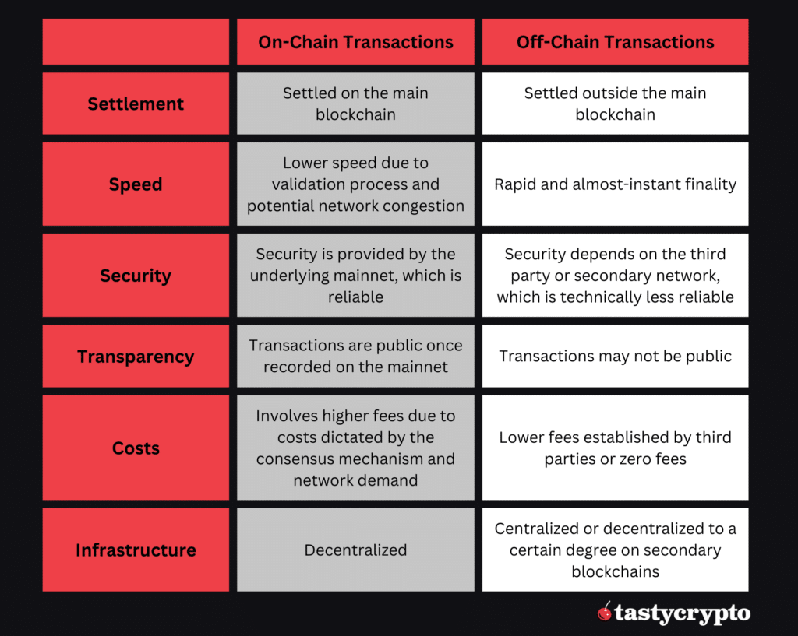

## Table of Contents

## What are off-chain transactions?

Off-chain transactions are transactions that happen outside of the main blockchain. They are not recorded on the blockchain's public ledger, which means they don't use up the blockchain's resources. This can make transactions faster and cheaper because they don't need to wait for the whole network to confirm them.

People often use off-chain transactions for things like everyday purchases or when they want to move money quickly. They can be done through special systems or agreements between users. Even though these transactions are not on the main blockchain, they can still be secure and reliable if the right methods are used.

## How do off-chain transactions differ from on-chain transactions?

Off-chain transactions happen outside of the main blockchain, while on-chain transactions are recorded directly on the blockchain's public ledger. When you do an off-chain transaction, it doesn't use the blockchain's resources, so it can be faster and cheaper. You don't have to wait for the whole network to confirm your transaction, which makes it quicker. On the other hand, on-chain transactions need to be verified by the network, which can take more time and cost more in fees.

Off-chain transactions are often used for things like everyday purchases or when you need to move money quickly. They can be done through special systems or agreements between users. Even though these transactions are not on the main blockchain, they can still be secure if the right methods are used. On-chain transactions, however, are always recorded on the blockchain, making them more transparent and permanent. This can be important for big transactions or when you need a clear record of what happened.

## What are the basic benefits of using off-chain transactions?

Off-chain transactions can make things faster and cheaper. When you do an off-chain transaction, you don't have to wait for the whole blockchain network to check and confirm it. This means you can move your money quickly, which is great for everyday purchases or when you need to send money fast. Plus, because you're not using the blockchain's resources, you don't have to pay as much in fees. This can save you money, especially if you're doing a lot of small transactions.

Another benefit is that off-chain transactions can be more private. Since they're not recorded on the public blockchain, fewer people can see what you're doing with your money. This can be important if you want to keep your financial activities private. Even though these transactions are off the main blockchain, they can still be safe and reliable if you use the right methods and systems.

## Can you explain the concept of a sidechain and its relation to off-chain transactions?

A sidechain is like a separate blockchain that works alongside the main blockchain. It's connected to the main blockchain, but it can have its own rules and ways of doing things. People can move their money or assets from the main blockchain to the sidechain and back again. This can be useful because the sidechain might be faster or cheaper to use than the main blockchain.

Sidechains are related to off-chain transactions because they both happen outside of the main blockchain. When you use a sidechain, your transactions are recorded on the sidechain instead of the main blockchain. This is similar to off-chain transactions, which also don't use the main blockchain. But, sidechains are still part of the bigger blockchain system, while off-chain transactions might happen through other methods or agreements between users. Both sidechains and off-chain transactions can help make things faster and cheaper, but they do it in slightly different ways.

## What role do second-layer solutions like Lightning Network play in off-chain transactions?

Second-layer solutions like the Lightning Network are special systems that help make off-chain transactions easier and faster. They work on top of the main blockchain, like Bitcoin, and let people do lots of small transactions without using the main blockchain. This means you can send money quickly and cheaply, which is great for things like buying coffee or sending money to friends. The Lightning Network does this by creating a kind of private channel between two people where they can move money back and forth without needing to tell the whole blockchain network about it.

These second-layer solutions are important because they solve some big problems with the main blockchain. The main blockchain can be slow and expensive to use, especially for small transactions. But with the Lightning Network, you can do many transactions off-chain and only need to use the main blockchain when you want to settle up or close the channel. This makes the whole system faster and cheaper, and it helps the main blockchain stay focused on bigger, more important transactions. So, second-layer solutions like the Lightning Network play a big role in making off-chain transactions work well.

## How do off-chain transactions enhance scalability in blockchain networks?

Off-chain transactions help make blockchain networks more scalable by taking some of the work away from the main blockchain. When lots of people want to use a blockchain at the same time, it can get slow and expensive. By doing transactions off-chain, you don't have to wait for the whole network to check and confirm each one. This means the main blockchain can handle more important things, like big transactions or keeping the overall system running smoothly.

Using off-chain transactions also means you can do more transactions without making the main blockchain too busy. For example, if you're buying coffee every day, you can do those small transactions off-chain. This way, the main blockchain doesn't get clogged up with lots of tiny transactions. It stays free to focus on bigger, more important tasks. So, off-chain transactions help the whole system work better by spreading out the load and making everything faster and cheaper.

## What are the security considerations when using off-chain transactions?

When using off-chain transactions, it's important to think about security. Since these transactions happen outside the main blockchain, they might not be as secure as on-chain transactions. The main blockchain has lots of people checking and confirming transactions, which makes it hard for someone to cheat or steal money. But with off-chain transactions, you might need to trust the people or systems you're working with. If you're using a second-layer solution like the Lightning Network, you need to make sure it's set up right and that you're working with people you can trust.

Another thing to think about is how you keep track of your off-chain transactions. Since they're not on the main blockchain, you need to have a good way to make sure everything is recorded correctly. If you're using a special system or app, it should be safe and reliable. It's also a good idea to have a backup plan in case something goes wrong. Even though off-chain transactions can be faster and cheaper, you need to be careful and make sure you're doing them in a way that keeps your money safe.

## How do off-chain transactions affect transaction fees compared to on-chain transactions?

Off-chain transactions can make things cheaper for you. When you do a transaction on the main blockchain, you have to pay a fee to the people who check and confirm it. These fees can add up, especially if you're doing a lot of small transactions. But with off-chain transactions, you don't need to use the main blockchain, so you don't have to pay those fees. This means you can save money, which is great if you're buying coffee or sending small amounts to friends.

Even though off-chain transactions can be cheaper, there might still be some small costs. For example, if you're using a special system like the Lightning Network, there might be a tiny fee for setting up the channel or for closing it. But these fees are usually much smaller than what you'd pay for on-chain transactions. So, overall, off-chain transactions can help you spend less on fees and make your money go further.

## What are the potential risks and limitations of off-chain transactions?

Off-chain transactions can be faster and cheaper, but they come with some risks. One big risk is that they might not be as secure as on-chain transactions. When you do an off-chain transaction, you often have to trust the people or the system you're using. If something goes wrong, like if someone cheats or the system gets hacked, you might lose your money. Also, since off-chain transactions aren't recorded on the main blockchain, it can be harder to keep track of them. If you don't have a good way to record what's happening, you might make a mistake or someone might take advantage of you.

Another limitation of off-chain transactions is that they might not be as private as you think. While they're not on the main blockchain, the people or systems you're using might still keep records of what you're doing. If those records get out, your private information could be at risk. Also, off-chain transactions can be tricky to use. You might need to learn how to use special systems or apps, which can be confusing. And if you want to move your money back to the main blockchain, you might have to wait or pay a fee to do it. So, while off-chain transactions have a lot of benefits, they also come with some important risks and limitations to think about.

## How can off-chain transactions be integrated with existing blockchain systems?

Off-chain transactions can be integrated with existing blockchain systems by using special tools and methods that work alongside the main blockchain. One way to do this is by using second-layer solutions like the Lightning Network. These solutions create a kind of private channel where people can move money back and forth without needing to use the main blockchain for every single transaction. When someone wants to start using these channels, they put some money into the system, do their transactions off-chain, and then settle up on the main blockchain when they're done. This way, the main blockchain stays free to handle bigger, more important tasks, while the off-chain system takes care of the smaller, everyday transactions.

Another way to integrate off-chain transactions is by using sidechains. Sidechains are separate blockchains that are connected to the main blockchain but can have their own rules and ways of doing things. People can move their money or assets from the main blockchain to the sidechain to do their transactions, and then move them back when they're finished. This can be useful because the sidechain might be faster or cheaper to use than the main blockchain. By using sidechains, people can still benefit from the security and trust of the main blockchain while enjoying the speed and cost savings of off-chain transactions.

## What are some real-world applications of off-chain transactions?

Off-chain transactions are used in many real-world situations where speed and low cost are important. For example, people use them for everyday purchases like buying coffee or groceries. Instead of waiting for the main blockchain to confirm each small transaction, which can be slow and expensive, they use off-chain systems like the Lightning Network. This way, they can pay quickly and with very low fees, making it perfect for things you do every day.

Another use of off-chain transactions is in gaming and microtransactions. In online games, players often need to buy small items or make quick trades. Using off-chain transactions, they can do this without slowing down the game or spending a lot of money on fees. This makes the gaming experience smoother and more enjoyable. Also, businesses use off-chain transactions for things like payroll or quick payments between partners, helping them save money and time.

## How do regulatory frameworks impact the use of off-chain transactions?

Regulatory frameworks can affect how people use off-chain transactions. Governments and financial watchdogs want to make sure that money moving around is safe and legal. They might set rules about how off-chain transactions should work, who can use them, and what kind of records need to be kept. If the rules are strict, it might be harder for people to use off-chain transactions because they have to follow a lot of steps or pay extra fees to make sure everything is okay with the law.

On the other hand, if the rules are clear and easy to follow, more people might feel comfortable using off-chain transactions. This can help the technology grow and be used in more places. But, if the rules change a lot or are different in different countries, it can be confusing for people and businesses trying to use off-chain transactions. They might have to spend more time and money making sure they're doing everything right, which could slow down how quickly off-chain transactions can be used everywhere.

## References & Further Reading

[1]: Poon, J. & Dryja, T. (2016). ["The Bitcoin Lightning Network: Scalable Off-Chain Instant Payments."](https://lightning.network/lightning-network-paper.pdf) [PDF file].

[2]: Nakamoto, S. (2008). ["Bitcoin: A Peer-to-Peer Electronic Cash System."](https://nakamotoinstitute.org/library/bitcoin/) [PDF file].

[3]: Peters, G. W. & Panayi, E. (2016). "Understanding Modern Banking Ledgers through Blockchain Technologies: Future of Transaction Processing and Smart Contracts on the Internet of Money." In: Tasca, P. et al. (eds) Banking Beyond Banks and Money. Lecture Notes in Economics and Mathematical Systems, vol 878. Springer, Cham.

[4]: Dziembowski, S., Eckey, L., Faust, S., Malinowski, D., & Riahi, S. (2019). ["Multi-Party Virtual State Channels."](https://eprint.iacr.org/2017/635) IACR Cryptol. ePrint Arch.

[5]: Buterin, V. (2016). ["Ethereum: A Next-Generation Smart Contract and Decentralized Application Platform."](https://www.blockchainlab.com/pdf/Ethereum_white_paper-a_next_generation_smart_contract_and_decentralized_application_platform-vitalik-buterin.pdf) Ethereum White Paper.