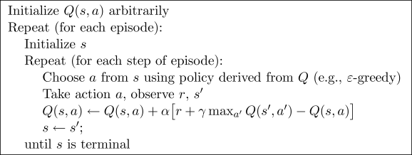

## Table of Contents

## What is Off-Policy TD Control in the context of machine learning?

Off-Policy TD Control is a method used in reinforcement learning where an agent learns the optimal policy for a task by using experiences from a different, often exploratory, policy. This technique allows the agent to learn from actions it might not have taken under its current policy, which can be particularly useful in scenarios where exploring all possible actions directly might be inefficient or risky. In essence, off-policy learning separates the policy used to generate behavior (the behavior policy) from the policy being learned and improved (the target policy).

A common algorithm used for off-policy TD control is Q-learning. In Q-learning, the agent updates its estimate of the value of taking a particular action in a particular state, known as the Q-value, based on the observed rewards and the maximum Q-value of the next state. The update rule for Q-learning can be expressed as $$Q(s, a) \leftarrow Q(s, a) + \alpha \left[ r + \gamma \max_{a'} Q(s', a') - Q(s, a) \right]$$, where $$s$$ is the current state, $$a$$ is the action taken, $$r$$ is the reward received, $$s'$$ is the next state, $$\alpha$$ is the learning rate, and $$\gamma$$ is the discount factor. This formula allows the agent to improve its policy by learning from any experience, even if it was generated by a different policy, making Q-learning a powerful off-policy method.

## How does Off-Policy TD Control differ from On-Policy TD Control?

Off-Policy TD Control and On-Policy TD Control are two different approaches in reinforcement learning that help an agent learn the best way to act in an environment. The main difference between them is in how they use the data collected during learning. In Off-Policy TD Control, the agent learns from experiences that might not have been generated by the current policy it is trying to improve. This means it can learn from old experiences or from a different policy that explores more actions. A common example of Off-Policy TD Control is Q-learning, which updates the Q-value using the formula $$Q(s, a) \leftarrow Q(s, a) + \alpha \left[ r + \gamma \max_{a'} Q(s', a') - Q(s, a) \right]$$. This allows the agent to improve its policy even if it's learning from actions it wouldn't normally take.

On the other hand, On-Policy TD Control requires the agent to learn only from the experiences generated by its current policy. This means the agent must follow the same policy it is trying to improve, which often involves balancing exploration and exploitation directly. A popular example of On-Policy TD Control is SARSA, where the Q-value is updated using the formula $$Q(s, a) \leftarrow Q(s, a) + \alpha \left[ r + \gamma Q(s', a') - Q(s, a) \right]$$. Here, $$a'$$ is the action actually taken in the next state $$s'$$, reflecting the current policy's choice. This method can be more straightforward but may be less efficient in some situations compared to off-policy methods, as it doesn't benefit from learning from other policies' experiences.

## What is Q-Learning and how does it relate to Off-Policy TD Control?

Q-learning is a way for a computer to learn how to do things better by trying different actions and learning from the results. It's like a game where the computer keeps track of how good each action is in different situations, using something called a Q-value. The Q-value tells the computer how much reward it can expect if it takes a certain action in a certain situation. The computer updates these Q-values based on what happens when it takes actions, using the formula $$Q(s, a) \leftarrow Q(s, a) + \alpha \left[ r + \gamma \max_{a'} Q(s', a') - Q(s, a) \right]$$. Here, $$s$$ is the current situation, $$a$$ is the action taken, $$r$$ is the reward it gets, $$s'$$ is the next situation, $$\alpha$$ is how fast it learns, and $$\gamma$$ is how much it cares about future rewards.

Q-learning is a type of Off-Policy TD Control because it can learn from any experience, not just the ones it gets from following its current plan. This means it can learn from old experiences or from trying out different actions that it might not usually take. This is different from On-Policy methods, where the computer can only learn from the actions it takes according to its current plan. Because Q-learning can use any experience, it can be more flexible and efficient in finding the best way to act in different situations.

## Can you explain the basic algorithm of Deep Q-Networks (DQN) and its significance in Off-Policy TD Control?

Deep Q-Networks (DQN) are a type of Q-learning that uses a neural network to estimate Q-values. The basic algorithm of DQN involves using two neural networks: the main network and the target network. The main network is updated frequently to learn from new experiences, while the target network is updated less often to provide a stable target for learning. The DQN algorithm uses a technique called experience replay, where past experiences are stored in a memory and randomly sampled during training. This helps the neural network learn more efficiently by seeing a variety of experiences. The Q-value update in DQN is similar to Q-learning but uses the neural network's output instead of a table, following the formula $$Q(s, a) \leftarrow Q(s, a) + \alpha \left[ r + \gamma \max_{a'} Q_{\text{target}}(s', a') - Q(s, a) \right]$$ where $$Q_{\text{target}}$$ is the output from the target network.

DQN is significant in the context of Off-Policy TD Control because it can learn from any experience, not just the ones generated by its current policy. This is similar to Q-learning, where the agent can improve its policy by learning from actions it might not have taken. By using a neural network, DQN can handle much larger and more complex environments than traditional Q-learning, making it a powerful tool for reinforcement learning. The use of experience replay and the separation of the main and target networks help stabilize learning and improve the performance of the agent, demonstrating the effectiveness of off-policy learning in deep reinforcement learning scenarios.

## What improvements does Double Q-learning offer over standard Q-learning in Off-Policy TD Control?

Double Q-learning improves upon standard Q-learning by addressing the issue of overestimation of Q-values. In standard Q-learning, the Q-value update uses the same values to select and evaluate the best action, which can sometimes lead to overestimating how good certain actions are. Double Q-learning fixes this by using two separate Q-value estimates. It randomly chooses which estimate to update and which to use for selecting the best action in the next state. This way, it reduces the chance of overestimating the Q-values, leading to more accurate learning and better performance in the long run.

The main formula for updating Q-values in Double Q-learning is split into two parts. If we call the two Q-value estimates $$Q_1$$ and $$Q_2$$, the update for $$Q_1$$ would be $$Q_1(s, a) \leftarrow Q_1(s, a) + \alpha \left[ r + \gamma Q_2(s', \arg\max_{a'} Q_1(s', a')) - Q_1(s, a) \right]$$. Similarly, the update for $$Q_2$$ would use $$Q_1$$ to select the action and $$Q_2$$ to evaluate it. By alternating between these two estimates, Double Q-learning provides a more stable and reliable way to learn the best actions in an environment, making it a valuable improvement over standard Q-learning in off-policy TD control scenarios.

## How does Clipped Double Q-learning enhance the performance of Off-Policy TD Control methods?

Clipped Double Q-learning helps make off-policy TD control methods work better by fixing a problem that can happen with Double Q-learning. In Double Q-learning, we use two different Q-value estimates to choose and evaluate the best action. But sometimes, one of these estimates might be too high or too low, which can make learning less accurate. Clipped Double Q-learning solves this by putting a limit on how much the Q-values can change during each update. This limit, or "clip," stops the Q-values from getting too far off, making the learning process more stable and reliable.

The way Clipped Double Q-learning works is by using a formula to update the Q-values, but it adds a step to make sure the changes aren't too big. If we call our two Q-value estimates $$Q_1$$ and $$Q_2$$, the update for $$Q_1$$ would look like this: $$Q_1(s, a) \leftarrow Q_1(s, a) + \alpha \left[ \text{clip}(r + \gamma Q_2(s', \arg\max_{a'} Q_1(s', a')) - Q_1(s, a), -c, c) \right]$$. Here, the "clip" function makes sure the change in the Q-value stays between -c and c. By doing this, Clipped Double Q-learning helps keep the Q-value estimates more accurate, which leads to better performance in off-policy TD control methods.

## What is the role of Dueling Network architectures in improving Off-Policy TD Control?

Dueling Network architectures help make Off-Policy TD Control work better by changing how the Q-values are figured out. In a regular Deep Q-Network (DQN), the Q-value for a state and action is found directly. But in a Dueling Network, the network splits into two parts: one part figures out how good being in a certain state is (the value function), and the other part figures out how much better or worse each action is compared to others (the advantage function). By combining these two parts, the Dueling Network can learn more about the overall value of states and the relative value of actions, which can lead to better decisions and faster learning.

The way a Dueling Network works is by using a formula to combine the value and advantage functions. The Q-value for a state $$s$$ and action $$a$$ is calculated as $$Q(s, a) = V(s) + (A(s, a) - \frac{1}{N} \sum_{a'} A(s, a'))$$, where $$V(s)$$ is the value of the state, $$A(s, a)$$ is the advantage of the action, and $$N$$ is the number of possible actions. This formula helps the network focus on what's important in different situations, making it more efficient at learning from experiences that might not have been generated by its current policy. This is especially useful in Off-Policy TD Control, where the agent learns from a wide range of experiences, helping it find the best way to act in different situations more quickly and accurately.

## How does Rainbow DQN combine different techniques to advance Off-Policy TD Control?

Rainbow DQN is a smart way to make off-policy TD control better by mixing together several good ideas from other methods. It takes the best parts from different techniques like Double Q-learning, which helps stop Q-values from being too high, and Dueling Networks, which split the Q-value into a part that tells how good a state is and another part that says how much better an action is. Rainbow DQN also uses something called Prioritized Experience Replay, where it pays more attention to the most important experiences, and it adds in a way to handle different possible outcomes called Multi-step Learning. Plus, it uses a trick called Distributional RL to understand the range of rewards it might get, and it makes sure to explore new actions with Noisy Nets instead of just choosing actions randomly.

All these ideas together help Rainbow DQN learn faster and make better decisions. By using Double Q-learning, it keeps the Q-values accurate. The Dueling Networks help it understand both the state and action values better, which makes learning more efficient. Prioritized Experience Replay makes sure it focuses on the most useful experiences, and Multi-step Learning helps it see further into the future. Distributional RL gives it a better picture of what rewards it might get, and Noisy Nets help it explore new actions without needing to try random actions all the time. This combination makes Rainbow DQN a strong and smart way to do off-policy TD control.

## What are the key features of Ape-X DQN and how do they contribute to Off-Policy TD Control?

Ape-X DQN is a smart way to make off-policy TD control even better by using a lot of computer power to learn faster. It does this by having many workers that explore the environment and gather experiences. These workers send their experiences to a central learner, which uses them to update the Q-values. This setup allows Ape-X DQN to learn from a huge amount of data at the same time, making the learning process much faster. The central learner uses a technique called prioritized experience replay, which means it pays more attention to the most important experiences. This helps the agent learn the best actions more quickly and accurately.

Another important part of Ape-X DQN is that it uses a method called Double Q-learning to make sure the Q-values don't get too high. This helps the agent make better decisions because it has more accurate information about how good each action is. Ape-X DQN also uses a trick called n-step returns, where it looks at the rewards over several steps into the future instead of just the next step. This helps the agent understand the long-term effects of its actions better. By combining these ideas, Ape-X DQN can learn from a wide range of experiences very efficiently, making it a powerful tool for off-policy TD control.

## Can you describe the NoisyNet-DQN approach and its impact on Off-Policy TD Control?

NoisyNet-DQN is a way to make off-policy TD control better by changing how the computer decides which actions to try. Instead of choosing actions randomly, NoisyNet-DQN adds a little bit of noise to the Q-values. This noise helps the computer explore new actions without having to use a separate exploration strategy. The noise is added to the weights of the neural network, which means the Q-values change a bit each time the computer makes a decision. This helps the computer find new and better actions faster, making the learning process more efficient.

The impact of NoisyNet-DQN on off-policy TD control is that it helps the computer learn from a wider range of experiences. Because the computer can explore new actions more effectively, it can gather more useful data to learn from. This is especially helpful in off-policy TD control, where the computer learns from actions it might not usually take. By using NoisyNet-DQN, the computer can improve its policy more quickly and find the best way to act in different situations, making it a powerful tool for reinforcement learning.

## What is the significance of Expected Sarsa in the context of Off-Policy TD Control?

Expected Sarsa is a way to make learning better in off-policy TD control by figuring out what the computer expects to happen next. In regular Sarsa, the computer learns from the actual action it takes next. But in Expected Sarsa, it thinks about all the possible actions it could take next and uses that to update its Q-values. This helps the computer learn more accurately because it considers all possibilities instead of just one action. The formula for updating Q-values in Expected Sarsa is $$Q(s, a) \leftarrow Q(s, a) + \alpha \left[ r + \gamma \sum_{a'} \pi(a'|s') Q(s', a') - Q(s, a) \right]$$. Here, $$\pi(a'|s')$$ is the probability of taking action $$a'$$ in the next state $$s'$$, and the computer uses this to calculate the expected value of the next state.

The significance of Expected Sarsa in off-policy TD control is that it helps the computer learn from a wider range of experiences more effectively. Because it considers all possible next actions, it can handle situations where the computer might not follow its current policy perfectly. This makes Expected Sarsa more flexible and reliable, especially in environments where exploring different actions is important. By using Expected Sarsa, the computer can improve its policy more quickly and find the best way to act in different situations, making it a valuable tool in reinforcement learning.

## How does DeepCubeAI utilize Off-Policy TD Control to solve complex problems?

DeepCubeAI uses off-policy TD control to solve complex problems like the Rubik's Cube by learning from a lot of different moves, even ones it wouldn't normally try. It uses a method called Q-learning, where it keeps track of how good each move is in different situations. By using a neural network, DeepCubeAI can handle big and tricky problems that would be hard for regular computers. The Q-value update formula it uses is $$Q(s, a) \leftarrow Q(s, a) + \alpha \left[ r + \gamma \max_{a'} Q(s', a') - Q(s, a) \right]$$, where $$s$$ is the current situation, $$a$$ is the move it makes, $$r$$ is the reward it gets, $$s'$$ is the next situation, $$\alpha$$ is how fast it learns, and $$\gamma$$ is how much it cares about future rewards. This way, DeepCubeAI can learn from any move it tries, helping it find the best way to solve the puzzle faster.

The key to DeepCubeAI's success is that it can learn from a wide range of experiences, which is what off-policy TD control is all about. Instead of just following its current plan, DeepCubeAI can try out different moves and learn from them. This makes it really good at solving hard puzzles because it can keep improving its strategy even if it tries moves that don't work out. By using off-policy learning, DeepCubeAI can explore all kinds of possibilities and figure out the best way to solve the Rubik's Cube, showing how powerful this method can be for solving complex problems.