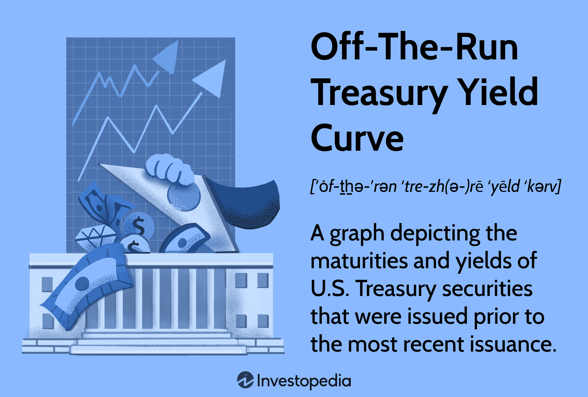

## Table of Contents

## What are Off-The-Run Treasury Securities?

Off-The-Run Treasury Securities are older U.S. government bonds that are no longer the most recently issued. When the U.S. Treasury issues new securities, the older ones become less popular and are called "off-the-run." These securities are still safe and backed by the government, but they are not traded as often as the new ones, called "on-the-run" securities.

Because off-the-run securities are traded less often, they can be harder to buy or sell quickly. This can make their prices a bit different from the newer securities. Investors might choose off-the-run securities if they want a slightly different price or if they are looking for securities that might not be as affected by the latest market news.

## How do Off-The-Run Treasury Securities differ from On-The-Run Treasury Securities?

Off-The-Run Treasury Securities are older bonds that the U.S. government issued before the latest ones. They are not as popular as the new ones, called On-The-Run Treasury Securities. Because they are older, Off-The-Run securities are traded less often. This means they might not be as easy to buy or sell quickly as the new ones.

On-The-Run Treasury Securities are the newest bonds that the U.S. government has issued. They are very popular and get traded a lot. Because they are new and in demand, they are easier to buy and sell quickly. The prices of On-The-Run securities can be influenced more by the latest news and market changes compared to the Off-The-Run securities.

## Why are Off-The-Run Treasury Securities less liquid?

Off-The-Run Treasury Securities are less liquid because they are not the newest bonds from the U.S. government. When new bonds come out, people want to buy those more than the older ones. This means that fewer people are trading the Off-The-Run securities. Because fewer people are buying and selling them, it can take longer to find someone who wants to trade them.

When something is less liquid, it means it can be harder to sell it quickly without losing money. With Off-The-Run securities, you might have to wait longer to find a buyer, or you might have to sell them for a lower price than you want. This is different from On-The-Run securities, which are easy to trade because lots of people want them.

## What factors influence the pricing of Off-The-Run Treasury Securities?

The pricing of Off-The-Run Treasury Securities is influenced by several factors. One main [factor](/wiki/factor-investing) is how often they are traded. Because they are not the newest bonds, fewer people want to buy or sell them. This means they are less liquid, and it can be harder to find someone to trade with. When something is less liquid, its price can be more affected by supply and demand. If there are more sellers than buyers, the price might go down.

Another factor is interest rates. If interest rates go up, the price of existing bonds like Off-The-Run securities usually goes down. This is because new bonds will be issued at the higher [interest rate](/wiki/interest-rate-trading-strategies), making the older bonds less attractive. Also, the general economic situation can affect their price. If people think the economy is doing well, they might want to invest in other things, making the demand for these securities go down.

Lastly, the specific features of the bond itself can influence its price. This includes the bond's maturity date and its coupon rate. If an Off-The-Run security has a coupon rate that is much lower than current market rates, its price will be lower because it's less attractive to investors. All these factors together decide how much an Off-The-Run Treasury Security is worth.

## How can investors access Off-The-Run Treasury Securities?

Investors can access Off-The-Run Treasury Securities through the secondary market. This means they buy them from other investors who already own them, not directly from the U.S. government. They can do this through a broker or a financial institution that deals in these securities. These brokers have access to trading platforms where Off-The-Run securities are bought and sold.

Sometimes, investors might also find Off-The-Run securities through mutual funds or exchange-traded funds (ETFs) that focus on government bonds. These funds might hold a mix of both On-The-Run and Off-The-Run securities. By investing in these funds, investors can get exposure to Off-The-Run securities without having to buy them directly. This can be a simpler way to invest in these securities, especially for those who don't want to deal with the complexities of the secondary market.

## What are the potential benefits of investing in Off-The-Run Treasury Securities?

One benefit of investing in Off-The-Run Treasury Securities is that they can sometimes be cheaper than On-The-Run securities. Because fewer people want to buy them, their prices might be lower. This means you can get a good deal if you're looking for a safe investment. Also, since they are less popular, they might not be affected as much by the latest news or market changes. This can make them a bit more stable if you're worried about big swings in the market.

Another benefit is that Off-The-Run securities can offer more variety in your investment choices. If you already have a lot of On-The-Run securities, adding some Off-The-Run ones can help spread out your risk. This is called diversification. By having different kinds of bonds, you can protect your money better. Plus, if you're looking for bonds with certain features, like a specific maturity date, you might find what you need in the Off-The-Run market.

## What are the risks associated with Off-The-Run Treasury Securities?

One big risk of investing in Off-The-Run Treasury Securities is that they are less liquid. This means it can be harder to sell them quickly if you need to. If you want to sell your Off-The-Run securities, you might have to wait longer to find a buyer, or you might have to sell them for a lower price than you want. This can be a problem if you need your money back fast.

Another risk is that the prices of Off-The-Run securities can be more affected by supply and demand. If there are a lot of people selling and not many buying, the price can go down. Also, if interest rates go up, the price of your Off-The-Run securities might drop because new bonds will have higher interest rates. This can make your older bonds less attractive to other investors.

## How do market conditions affect the demand for Off-The-Run Treasury Securities?

Market conditions can really change how much people want to buy Off-The-Run Treasury Securities. When interest rates go up, new bonds will have higher rates, so the older Off-The-Run securities might not look as good to investors. This can make the demand for Off-The-Run securities go down because people want the new bonds with better rates. Also, if the economy is doing well, people might want to invest in other things that seem more exciting or profitable, which can make them less interested in these older, less popular securities.

On the other hand, if the market is shaky or people are worried about the economy, they might look for safe places to put their money. Off-The-Run securities are still backed by the U.S. government, so they are very safe. In times like these, more people might want to buy them because they are looking for stability. But even then, the demand might not be as high as for On-The-Run securities because they are not as easy to buy and sell quickly.

## What role do Off-The-Run Treasury Securities play in portfolio diversification?

Off-The-Run Treasury Securities can help with portfolio diversification by adding variety to your investments. If you have a lot of On-The-Run securities, adding some Off-The-Run ones can spread out your risk. This means that if something bad happens to one type of bond, your whole portfolio won't be affected as much. By having different kinds of bonds, you can protect your money better.

Another way Off-The-Run securities help with diversification is by offering bonds with different features. You might find Off-The-Run securities with different maturity dates or coupon rates that fit your investment goals better. This can help you build a more balanced portfolio. Even though they are less liquid and might be harder to sell, the added variety can make your investments safer overall.

## How do Off-The-Run Treasury Securities contribute to the overall yield curve?

Off-The-Run Treasury Securities help shape the overall yield curve by adding more points to it. The yield curve shows the interest rates of bonds with different times until they mature. When you include Off-The-Run securities, you get a fuller picture of what's happening in the bond market. This is because Off-The-Run securities have different interest rates and maturity dates than the newest On-The-Run securities. By looking at all these different bonds, you can see how interest rates change over time and across different kinds of bonds.

These older securities can also show how the market values different times in the future. For example, if people think the economy will be better in a few years, they might want to buy bonds that mature then, which can change the shape of the yield curve. Off-The-Run securities give more information about what investors think about the future because they cover a wider range of times. This helps investors and economists understand the whole bond market better and make smarter decisions.

## What are the strategies for trading Off-The-Run Treasury Securities?

One strategy for trading Off-The-Run Treasury Securities is to buy them when they are cheaper than On-The-Run securities. Because Off-The-Run securities are not as popular, you might be able to get a good deal on them. If you think interest rates will stay the same or go down, these older bonds can be a good investment. You can hold onto them and sell them later when their price goes up, or keep them until they mature and get your money back with interest.

Another strategy is to use Off-The-Run securities for hedging. This means you buy them to protect other investments you have. If you have a lot of On-The-Run securities, buying some Off-The-Run ones can help balance your portfolio. If something bad happens to the On-The-Run securities, the Off-The-Run ones might not be affected as much. This can help keep your investments safer overall.

## How can advanced analytics be used to predict movements in Off-The-Run Treasury Securities?

Advanced analytics can help predict movements in Off-The-Run Treasury Securities by looking at a lot of data from the past and finding patterns. These tools can look at things like how interest rates have changed, what's happening in the economy, and how much people are buying and selling these securities. By using machine learning, these analytics can find small signs that might show if the price of Off-The-Run securities will go up or down. This can help investors make better guesses about when to buy or sell these bonds.

Also, advanced analytics can help by watching the difference in prices between Off-The-Run and On-The-Run securities. Sometimes, this difference can tell us something about what investors are thinking. If the price difference gets bigger or smaller, it might mean that people's views on the economy are changing. By keeping an eye on these patterns, advanced analytics can give investors a heads-up on what might happen next with Off-The-Run securities. This can help them plan their trades better and maybe make more money.

## What is the intersection of algorithms and off-the-run treasuries?

Incorporating [algorithmic trading](/wiki/algorithmic-trading) into the investment strategies for off-the-run Treasuries enables investors to overcome the challenges associated with the lower [liquidity](/wiki/liquidity-risk-premium) of these securities. Algorithmic trading employs sophisticated computer algorithms to analyze large datasets, execute trades at optimal times, and adjust strategies dynamically. This technological integration can be particularly effective in identifying yield spreads and exploiting market trends, which are pivotal in arbitraging opportunities between on-the-run and off-the-run Treasuries.

For instance, algorithms can automate the detection of yield differentials. Let $Y_{off}$ and $Y_{on}$ represent the yields of off-the-run and on-the-run Treasuries, respectively. The yield spread $S$ can be expressed as:

$$
S = Y_{off} - Y_{on}
$$

These differentials indicate potential profit opportunities, as off-the-run Treasuries generally offer higher yields due to their lower liquidity compared to their on-the-run counterparts. By automating the trading process, algorithms can swiftly execute trades when the spread $S$ exceeds a predetermined threshold, thereby maximizing returns.

Moreover, algorithmic systems are adept at monitoring and predicting market trends using [machine learning](/wiki/machine-learning) models and statistical methods. By analyzing historical data and current market conditions, algorithms can forecast movements in Treasury prices, aiding in decision-making processes. For example, a Python-based machine learning model could be employed to predict yield movements, enabling more informed trading decisions:

```python
from sklearn.ensemble import RandomForestRegressor

# Example dataset of historical yield spreads and market indicators
X_train = ...  # Features (e.g., economic indicators, past yields)
y_train = ...  # Target (e.g., future yield spreads)

# Initialize and train the model
model = RandomForestRegressor(n_estimators=100)
model.fit(X_train, y_train)

# Predict future spread using new data
X_new = ...  # New market data
predicted_spread = model.predict(X_new)
```

While the integration of algorithms presents opportunities for enhanced returns, it introduces the necessity for robust risk management strategies. Market [volatility](/wiki/volatility-trading-strategies), inaccuracies in model predictions, and the reliance on high-frequency data necessitate sophisticated risk mitigation techniques. Investors must employ strategies like stress testing, portfolio diversification, and continuous model validation to manage potential risks effectively.

Additionally, algorithmic trading in the bond market is subject to evolving regulatory frameworks and technological advancements. Investors must stay abreast of changes in financial regulations that govern trading activities and data requirements. Adapting to new technologies, such as blockchain for trade settlements or advancements in [artificial intelligence](/wiki/ai-artificial-intelligence) for predictive analytics, is crucial for maintaining a competitive edge.

In summary, leveraging algorithmic trading in the context of off-the-run Treasuries can transform investment strategies, offering the potential for better returns while requiring careful navigation of inherent risks and a keen awareness of technological and regulatory shifts in the financial landscape.

## References & Further Reading

[1]: Duffee, G. R. (1996). "Idiosyncratic variation of Treasury bill yields." *The Journal of Finance*, 51(2), 527-551. [Link to paper](https://onlinelibrary.wiley.com/doi/10.1111/j.1540-6261.1996.tb02693.x)

[2]: Vayanos, D., & Vila, J.-L. (2009). "A Preferred-Habitat Model of the Term Structure of Interest Rates." *National Bureau of Economic Research*, No. w15487. [Link to paper](https://www.nber.org/system/files/working_papers/w15487/w15487.pdf)

[3]: Alexei, J. (2006). "The Microstructure of the U.S. Treasury Bond Market." *The Review of Financial Studies*, 19(3), 1001-1040. [Link to article](https://github.com/LiuYuann/Three-machine-learning-problem/blob/master/IMDB/imdb_word_index.json)

[4]: Lopez de Prado, M. (2018). ["Advances in Financial Machine Learning."](https://www.amazon.com/Advances-Financial-Machine-Learning-Marcos/dp/1119482089) Wiley.

[5]: Chan, E. (2013). ["Algorithmic Trading: Winning Strategies and Their Rationale."](https://github.com/ftvision/quant_trading_echan_book) Wiley.

[6]: Jarrow, R., & Larsson, M. (2012). "The Treasury Bill – Treasury Bond Spread and Risk Premia: An Empirical Investigation." *Journal of Empirical Finance*, 19(3), 329-345. [Link to article](https://www.sciencedirect.com/science/article/abs/pii/S0927539812000334)