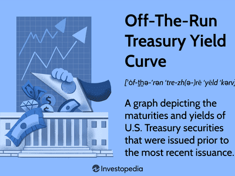

## Table of Contents

## What is an Off-The-Run Treasury?

An Off-The-Run Treasury is a U.S. government bond that is not the most recently issued of its kind. When the U.S. Treasury issues new bonds, the older ones become less popular and are called off-the-run. These bonds are less liquid, meaning they are harder to buy and sell quickly, and they usually have a lower price than the new ones.

Investors might choose off-the-run Treasuries if they want to hold onto them for a long time or if they think the price will go up. Because they are less popular, off-the-run Treasuries can sometimes offer a better deal. However, they can be riskier because it might be harder to sell them when needed.

## How does the Off-The-Run Treasury Yield Curve differ from the On-The-Run Treasury Yield Curve?

The Off-The-Run Treasury Yield Curve and the On-The-Run Treasury Yield Curve show how much interest, or yield, investors can get from different Treasury bonds based on how long they have to wait until the bond matures. The On-The-Run Treasury Yield Curve is made up of the most recently issued Treasury securities, which are the most popular and traded the most. This means they are easier to buy and sell, and the prices and yields for these bonds are usually seen as the standard.

The Off-The-Run Treasury Yield Curve, on the other hand, is made from older Treasury securities that are not as popular or traded as often. Because these bonds are less liquid, they might have a bit higher yield to make up for the fact that they are harder to sell. This means the Off-The-Run Yield Curve can sometimes show slightly different yields than the On-The-Run Yield Curve, especially if there are big differences in how much people want to buy or sell these older bonds.

Both curves are important for understanding the overall health of the economy and what investors think about future interest rates. The On-The-Run curve is watched more closely by many people because it's seen as a better reflection of current market conditions. But the Off-The-Run curve can give extra information, especially if there are big differences between the two, which might tell us something about how liquid the market is or how investors are feeling about risk.

## Why is the Off-The-Run Treasury Yield Curve important for investors?

The Off-The-Run Treasury Yield Curve is important for investors because it shows them another way to look at the bond market. While the On-The-Run Treasury Yield Curve is made from the newest bonds that everyone wants to buy and sell, the Off-The-Run curve is made from older bonds that are not as popular. This can tell investors about the health of the bond market in a different way. If the Off-The-Run curve shows higher yields than the On-The-Run curve, it might mean that investors want more money to hold onto these less popular bonds because they are harder to sell.

Investors can use the Off-The-Run Treasury Yield Curve to find good deals. Sometimes, these older bonds might be cheaper than the new ones, which means investors can buy them at a lower price and maybe sell them later for a profit. Also, by looking at both the Off-The-Run and On-The-Run curves, investors can see if there are big differences between them. These differences can tell investors about how easy or hard it is to buy and sell bonds, which is important for making smart investment choices.

## What factors influence the Off-The-Run Treasury Yield Curve?

Several things can change how the Off-The-Run Treasury Yield Curve looks. One big thing is how much people want to buy or sell these older bonds. If lots of people want to buy them, the price goes up and the yield goes down. If not many people want them, the price goes down and the yield goes up. Another thing is how easy or hard it is to buy and sell these bonds. If it's hard to sell them quickly, people might want more money to hold onto them, so the yield goes up.

The overall health of the economy can also affect the Off-The-Run Treasury Yield Curve. If people think the economy will do well, they might want to buy newer bonds, making the older ones less popular and increasing their yield. Also, changes in interest rates can influence the curve. If interest rates go up, the price of older bonds goes down, making their yield higher compared to new bonds. By looking at these factors, investors can understand why the Off-The-Run Treasury Yield Curve might be different from the On-The-Run curve.

## How is the Off-The-Run Treasury Yield Curve constructed?

The Off-The-Run Treasury Yield Curve is made by looking at the yields of older U.S. Treasury bonds that are not the newest ones. When the U.S. Treasury issues new bonds, the old ones become less popular and are called off-the-run. To build the curve, people look at the prices and yields of these older bonds at different times until they mature. They then plot these yields on a graph, with the time until the bond matures on one side and the yield on the other side. This shows how much interest investors can get for holding these older bonds for different lengths of time.

The curve is important because it can be different from the On-The-Run Treasury Yield Curve, which is made from the newest bonds. The difference comes from how easy or hard it is to buy and sell the older bonds. If it's hard to sell them quickly, people might want more money to hold onto them, so the yield goes up. By comparing the Off-The-Run and On-The-Run curves, investors can see if there are good deals on the older bonds or if there are big differences in how people feel about buying and selling them.

## Can you explain the liquidity premium associated with Off-The-Run Treasuries?

The liquidity premium is the extra interest, or yield, that investors get for buying Off-The-Run Treasuries. These are older U.S. government bonds that are not as popular as the new ones. Because they are harder to buy and sell quickly, investors want more money to hold onto them. This extra money is the liquidity premium. It's like a reward for taking on the risk of owning something that might be harder to sell when you need to.

The size of the liquidity premium can change. It depends on how easy or hard it is to buy and sell these older bonds. If it's really hard to sell them, the premium goes up because investors want more money to take that risk. But if it's not so hard, the premium might be smaller. By looking at the liquidity premium, investors can see if the extra interest from Off-The-Run Treasuries is worth the risk of them being less popular and harder to sell.

## What are the common uses of the Off-The-Run Treasury Yield Curve in financial analysis?

The Off-The-Run Treasury Yield Curve is used by people who study the economy and money markets to learn more about how easy or hard it is to buy and sell older U.S. government bonds. When these older bonds are harder to sell, they might offer a higher [interest rate](/wiki/interest-rate-trading-strategies), called a liquidity premium. By looking at the Off-The-Run curve, these experts can see if this premium is big or small and decide if it's worth the risk of buying these bonds. They compare it to the On-The-Run Treasury Yield Curve, which shows the interest rates of the newest bonds, to see how much of a difference there is between the two.

Another way the Off-The-Run Treasury Yield Curve is used is to find good deals in the bond market. Sometimes, these older bonds might be cheaper than the new ones. Investors can buy them at a lower price and maybe sell them later for a profit if the price goes up. By looking at both the Off-The-Run and On-The-Run curves, investors can see if there are big differences between them. These differences can tell them about how easy or hard it is to buy and sell bonds, which is important for making smart investment choices.

## How does the Off-The-Run Treasury Yield Curve impact monetary policy?

The Off-The-Run Treasury Yield Curve can give important information to people who make decisions about the country's money, like the Federal Reserve. They look at this curve to see how easy or hard it is to buy and sell older U.S. government bonds. If the Off-The-Run curve shows higher interest rates than the new bonds, it might mean that people want more money to hold onto these older bonds because they are harder to sell. This difference can tell the Federal Reserve about the health of the bond market and how much risk people are willing to take.

The Federal Reserve might use this information to decide if they should change interest rates or do other things to help the economy. If the Off-The-Run curve shows big differences from the new bonds, it might mean the bond market is not working as smoothly as it should. The Federal Reserve could then take steps to make the market more liquid, like buying or selling bonds themselves. By keeping an eye on the Off-The-Run Treasury Yield Curve, the Federal Reserve can make better choices about how to keep the economy stable and growing.

## What are the historical trends observed in the Off-The-Run Treasury Yield Curve?

Over the years, the Off-The-Run Treasury Yield Curve has shown some interesting patterns. One big trend is that the difference between the Off-The-Run and On-The-Run Treasury Yield Curves, called the liquidity premium, tends to grow during times when the economy is not doing well. For example, during financial crises, like the one in 2008, people wanted more money to hold onto older bonds because they were worried about selling them. This made the Off-The-Run curve show higher yields than the On-The-Run curve.

Another trend is that the Off-The-Run Treasury Yield Curve can sometimes be smoother than the On-The-Run curve. This happens because the older bonds are not traded as much, so their prices do not change as quickly as the new ones. This can make the Off-The-Run curve a bit more stable over time. By looking at these historical trends, people who study the economy can learn more about how the bond market works and how it reacts to different situations.

## How can investors use the Off-The-Run Treasury Yield Curve to predict economic cycles?

Investors can use the Off-The-Run Treasury Yield Curve to predict economic cycles by looking at how it changes over time. When the economy is doing well, people might want to buy new bonds more than old ones, making the Off-The-Run curve show higher yields. This difference, called the liquidity premium, can grow bigger during times when the economy is not doing so well, like during a financial crisis. By watching these changes, investors can get a sense of whether the economy might be heading into a good or bad period.

The Off-The-Run Treasury Yield Curve can also help investors see if the bond market is getting more or less worried about risk. If the curve starts to show much higher yields than the On-The-Run curve, it might mean people are getting more worried about selling older bonds. This can be a sign that the economy might be slowing down or that a recession could be coming. By paying attention to these signals, investors can make better choices about when to buy or sell bonds and how to plan for the future.

## What are the risks associated with investing in Off-The-Run Treasuries?

One big risk of investing in Off-The-Run Treasuries is that they are not as easy to buy and sell as the new ones. These older bonds are less popular, so it might take longer to find someone who wants to buy them if you need to sell them quickly. This can be a problem if you need your money back fast. Another risk is that the price of Off-The-Run Treasuries can change more than the new ones. Because they are traded less often, the price might go up or down a lot when someone does want to buy or sell them.

Another thing to think about is the liquidity premium. This is the extra interest you get for holding onto these older bonds. But if the economy gets worse, the liquidity premium might grow bigger, which means the price of the bonds could go down. This can make your investment worth less money. So, while Off-The-Run Treasuries might offer a higher interest rate, they also come with more risk because they are harder to sell and their prices can change a lot.

## How do advanced financial models incorporate the Off-The-Run Treasury Yield Curve?

Advanced financial models use the Off-The-Run Treasury Yield Curve to get a better picture of the bond market. These models look at the difference between the Off-The-Run and On-The-Run curves to understand how easy or hard it is to buy and sell older bonds. This difference, called the liquidity premium, can tell them how much extra interest investors want for holding onto these less popular bonds. By including this information, the models can make more accurate guesses about how much money people might get from their investments and how much risk they are taking.

These models also use the Off-The-Run curve to help predict what might happen in the economy. If the Off-The-Run curve starts to show much higher yields than the new bonds, it might mean people are getting more worried about the future. This can be a sign that the economy might be slowing down or that a recession could be coming. By watching these changes, the models can help investors make better choices about when to buy or sell bonds and how to plan for the future.

## What is the Understanding of Treasury Yield Curves?

The Treasury yield curve, a fundamental construct in finance, represents the relationship between the yield on U.S. Treasury securities and their maturities. The curve typically plots interest rates of Treasury bills, notes, and bonds, ranging from short-term securities like three-month Treasury bills to long-term bonds with maturities of up to 30 years. The shape of the yield curve provides insightful economic signals, indicating the prevailing interest rate environment and investors' expectations for economic conditions.

### Definition and Explanation of the Treasury Yield Curve

Mathematically, the yield $Y$ of a Treasury security can be expressed as a function of its maturity $T$:

$$
Y(T) = \text{a function of expected future short-term interest rates, a liquidity premium, and a risk premium}
$$

The Treasury yield curve is typically plotted as a graph with interest rates on the vertical axis and different maturities on the horizontal axis. It usually takes one of three primary shapes: normal (upward sloping), inverted (downward sloping), or flat. 

- **Normal Yield Curve:** An upward-sloping curve suggests that longer-term securities have higher yields, which is typical in a growing economy where investors expect future interest rates to rise.

- **Inverted Yield Curve:** This occurs when short-term interest rates exceed long-term rates, often a signal of upcoming economic recession.

- **Flat Yield Curve:** When yields across maturities are similar, it suggests uncertainty in economic conditions.

### Difference Between On-the-Run and Off-the-Run Treasury Securities

Treasury securities are classified into on-the-run and off-the-run categories. 

- **On-the-Run Treasury Securities:** These are the most recently issued U.S. Treasuries of each maturity. They are generally more liquid due to higher trading volumes and narrower bid-ask spreads. Therefore, they often serve as benchmarks for various debt instruments and derivatives.

- **Off-the-Run Treasury Securities:** These are older, previously issued government securities which have been replaced by newer issues (on-the-run) of the same maturity. Off-the-run securities typically offer higher yields due to their lower liquidity compared to their on-the-run counterparts. They can, however, present trading opportunities because of yield differences.

### How the Yield Curve is Used as a Benchmark for Pricing Various Bonds

The Treasury yield curve serves as a critical benchmark for pricing a wide array of financial products, from corporate bonds to mortgage-backed securities. An essential aspect of its role is in determining the risk-free rate, which is used in various financial models including the Capital Asset Pricing Model (CAPM):

$$
\text{Expected Return} = \text{Risk-Free Rate} + \beta \times (\text{Market Return} - \text{Risk-Free Rate})
$$

Corporations use the yield curve to assess their cost of debt and to price their bonds relative to government securities. By comparing yields offered on corporate versus Treasury bonds of similar maturities, investors can assess credit risk premiums. Additionally, movements in the yield curve can influence monetary policy decisions, as it reflects market expectations for future interest rates and economic activity.

In summary, the Treasury yield curve is a vital tool for investors and policymakers, providing a broad perspective on market conditions and economic expectations. Understanding the differences between on-the-run and off-the-run securities helps market participants make informed decisions about [liquidity](/wiki/liquidity-risk-premium) and yield opportunities within fixed income portfolios.

## What are the strategies for using off-the-run securities?

Off-the-run securities, those Treasury bonds not currently used for benchmarks, present unique advantages and trading opportunities, particularly articulated through strategies designed to exploit yield differentials. One of the prevalent strategies is the basis trade, which capitalizes on the price disparities between on-the-run (recently issued and more liquid) and off-the-run (older and less liquid) securities.

### Basis Trade Strategy

The basis trade involves executing a pair of transactions: buying an off-the-run bond while simultaneously short-selling an on-the-run bond of similar maturity. The premise of the strategy is based on the price convergence expectation, where the yields will eventually align, driven by the greater liquidity of on-the-run securities diminishing over time.

This can be mathematically represented where the profit $P$ from the basis trade is a function of the yield difference $\Delta Y$ between on-the-run and off-the-run securities:

$$
P = \Delta Y \times D
$$

Where:
- $\Delta Y$ = Yield difference between on-the-run and off-the-run securities.
- $D$ = Duration, representing the sensitivity of the security's price to interest rate changes.

Executing the basis trade properly requires precise risk management tools and an understanding of the current market dynamics to predict the convergence of yields.

### Liquidity and Risk Management

Liquidity is a core consideration in these strategies, as off-the-run securities generally exhibit lower liquidity than their on-the-run counterparts. This liquidity differential can affect the execution price and, if incorrectly assessed, could lead to significant losses. Therefore, traders engaging in off-the-run strategies must incorporate liquidity measures into their pricing models and be prepared to hold positions longer if immediate execution isn't favorable.

The risk management aspect also involves monitoring the interest rate environment, economic indicators, and Treasury auction cycles, as these factors influence yield movements and market interest. Hedging using derivatives, for example, Treasury futures or options, is often employed to mitigate interest rate risk inherent in holding off-the-run securities.

Additionally, advanced algorithmic models may be employed to identify optimal entry and [exit](/wiki/exit-strategy) points by analyzing historical data patterns and real-time market conditions. This computational approach facilitates quicker decision-making processes and helps in exploiting transient market inefficiencies that manual trading might overlook.

In conclusion, strategies utilizing off-the-run securities, particularly through basis trades, offer potential yield enhancement but require rigorous analysis and adept management of liquidity and risk factors. Mastery of these strategies can lead to substantial investment advantages within the broader Treasury bond market.

## References & Further Reading

[1]: Campbell, J. Y., & Shiller, R. J. (1991). ["Yield Spreads and Interest Rate Movements: A Bird's Eye View."](https://www.nber.org/papers/w3153) The Review of Economic Studies, 58(3), 495-514.

[2]: Adrian, T., Estrella, A., & Shin, H. S. (2010). ["Risk, Liquidity, and Securitization Trends in the Financial Crisis."](https://papers.ssrn.com/sol3/papers.cfm?abstract_id=1139857) National Bureau of Economic Research.

[3]: D'Amico, S., Kim, D. H., & Wei, M. (2018). ["Tips from TIPS: The Informational Content of Treasury Inflation-Protected Security Prices."](https://www.jstor.org/stable/26591911) Finance and Economics Discussion Series, Board of Governors of the Federal Reserve System (U.S.).

[4]: Lopez de Prado, M. (2018). ["Advances in Financial Machine Learning."](https://www.amazon.com/Advances-Financial-Machine-Learning-Marcos/dp/1119482089) Wiley.

[5]: Fleming, M. J. (2003). ["Measuring Treasury Market Liquidity."](https://www.newyorkfed.org/medialibrary/media/research/epr/03v09n3/0309flempdf.pdf) Federal Reserve Bank of New York Staff Reports.

[6]: Kearns, M., & Nevmyvaka, Y. (2013). ["Machine Learning for Market Microstructure and High-Frequency Trading."](https://www.cis.upenn.edu/~mkearns/papers/KearnsNevmyvakaHFTRiskBooks.pdf) University of Pennsylvania.

[7]: Harris, R. S., & Panchapagesan, V. (2005). ["The Information Content of the On-the-Run Treasury Market: Evidence from Returns, Order Flow, and Order Book Data."](https://academic.oup.com/rfs/article-abstract/18/2/573/1599104?redirectedFrom=fulltext) The Review of Financial Studies, 18(2), 573-607.