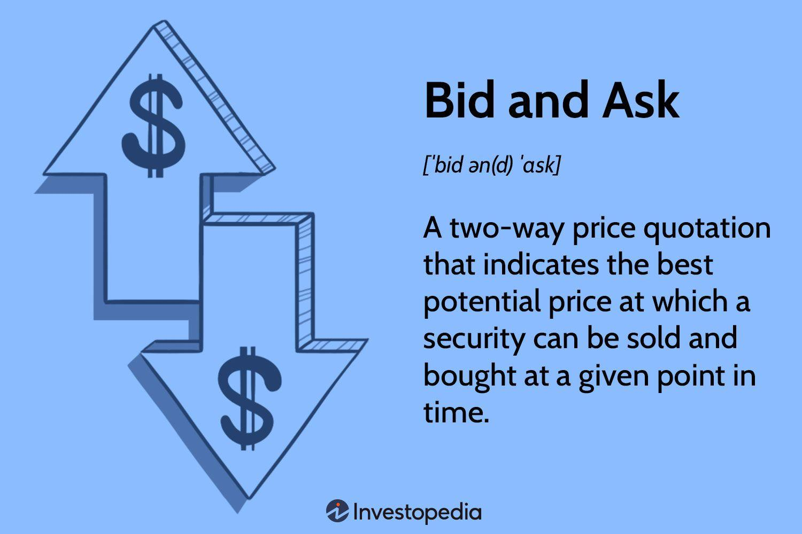

In the world of finance, understanding key terms like 'ask price' and 'offer price' is crucial for participating in markets effectively. The ask price, often referred to as the offer price, signifies the minimum price that a seller seeks for a financial asset. Mastery of these fundamental concepts is indispensable for investors and traders aiming to navigate the complex landscape of financial markets. This article aims to elucidate these terms, examining their roles in financial transactions.

With the increasing adoption of algorithmic trading, or algo trading, understanding these pricing terms becomes even more vital. Algo trading leverages sophisticated computer algorithms to make swift trading decisions based on pre-established criteria, thus transforming the trading domain by allowing more precise and faster executions. The interplay between ask prices and algo trading strategies underscores the evolving nature of financial markets, offering an edge to those proficient in utilizing technology for trading.



This exploration targets providing a detailed yet accessible understanding of ask and offer prices, paving the way for enthusiasts and professionals venturing into trading and investments. Whether you are trading stocks, forex, commodities, or any other financial instruments, mastering these terms can significantly enhance your strategic approaches. By understanding how these prices operate within the mechanisms of modern trading platforms, investors can better strategize their market participation.

As we proceed, we will uncover the intricate dynamics that these terms present in both traditional and algorithmic trading settings, emphasizing their applications and implications. Let us begin this journey to understand how ask prices, offer prices, and algorithmic trading interact to shape today's financial markets.

## Table of Contents

## Understanding Ask Price and Offer Price

The ask price, alternatively known as the offer price, represents the price at which a seller is prepared to sell an asset. In standard financial transactions, the ask price typically sits above the bid price, reflecting the amount buyers are willing to pay for the asset. This discrepancy between the bid and ask price is defined as the spread. 

$$
\text{Spread} = \text{Ask Price} - \text{Bid Price}
$$

The spread is a vital measure of market [liquidity](/wiki/liquidity-risk-premium). A narrower spread generally points to a more liquid market, signaling active participation from both buyers and sellers. Conversely, a broader spread can indicate reduced liquidity, revealing potential hesitancy among market participants. 

Grasping these concepts is critical, not just for those actively trading, but also for individuals keen on understanding broader market dynamics, as they offer insights into the underlying health and efficiency of financial markets. By analyzing bid-ask spreads, traders can assess market conditions, anticipate movements, and make educated trading decisions.

## Role of Ask Price in Financial Markets

In financial markets, the ask price is a fundamental concept that directly influences the cost of purchasing an asset. This price acts as a critical reference point for traders, determining when to enter or [exit](/wiki/exit-strategy) positions. For example, before purchasing a stock, a trader analyzes the ask price to decide if the cost aligns with their investment strategy. This valuation becomes even more pivotal during volatile market conditions, where prices can fluctuate rapidly due to external factors.

The responsiveness of the ask price to variables such as news releases, shifts in supply and demand, and broader economic indicators impacts market function significantly. Suppose a major tech company announces a groundbreaking innovation; such news can cause the ask price of the company's stocks to surge as investor demand increases. Conversely, adverse events may lead to a decrease in demand, lowering the ask price.

Traders rely heavily on these dynamic price movements when strategizing their buying and selling actions. They often analyze patterns and trends in the ask prices across various financial instruments to optimize their trades. For instance, when an asset’s ask price consistently trends upward, a trader might interpret this as a signal of increasing value and decide to buy. Conversely, a downward trend could signal to sell before the market prices drop further.

By integrating knowledge of ask prices, traders can participate more effectively in financial markets. This awareness not only provides a clear picture of current market conditions but also aids in forecasting future movements, allowing for more informed and strategic decision-making. In sum, understanding the intricacies of ask prices is vital for anyone looking to engage successfully with financial markets.

## Algo Trading and Its Interaction with Ask and Offer Prices

Algorithmic trading, often referred to as algo trading, utilizes programmed algorithms to automate trading decisions based on specific conditions and rules. By leveraging the power of algorithms, traders can implement strategies that respond dynamically to market data, such as the fluctuations in ask and offer prices. 

One of the primary advantages of algo trading is its ability to process large volumes of data and execute trades with remarkable speed and precision. In the context of ask and offer prices, this capability is particularly beneficial. Algorithms can be set to monitor real-time market metrics and automatically trigger trades when certain criteria are met, such as when the ask price dips below a pre-defined value or when the spread between the bid and ask price narrows to a favorable threshold. This instantaneous response helps traders capitalize on market opportunities that might be missed during manual trading due to the slower reaction time.

For example, a common algorithmic strategy might involve setting up rules to buy an asset when its ask price falls to a certain level, anticipating a future price rise. Conversely, an algorithm could be configured to sell an asset when the ask price reaches a targeted high, locking in profits. The precision of such strategies is enhanced by continuous monitoring and the capability to adjust trades automatically as the market evolves.

Python, a popular language in the field of [algorithmic trading](/wiki/algorithmic-trading), can be used to implement such strategies. Below is a simplified example of how one might set up an algo trading strategy to react to ask price changes:

```python
import requests

def get_market_data():
    # This function fetches the latest market data from an API.
    response = requests.get('https://api.example.com/market_data')
    return response.json()

def algo_trading_strategy():
    market_data = get_market_data()
    ask_price = market_data['ask_price']

    # Define buy condition
    if ask_price < 100:
        execute_buy_order()
    # Define sell condition
    elif ask_price > 150:
        execute_sell_order()

def execute_buy_order():
    print("Buying asset at current ask price.")

def execute_sell_order():
    print("Selling asset at current ask price.")

# Run the trading strategy on market data
algo_trading_strategy()
```

This script demonstrates a very basic form of algorithmic trading based on specific ask price thresholds. Of [course](/wiki/best-algorithmic-trading-courses), in real scenarios, the algorithms are far more complex, incorporating multiple data points and sophisticated logic to optimize trade execution.

By orchestrating the interaction between algorithmic trading and ask/offer prices, traders can achieve enhanced trading efficiency and accuracy. This synergy offers a substantial advantage in highly competitive financial markets, where making informed and swift trading decisions is crucial to maintaining a profitable trading strategy.

## Examples of Ask Price in Action

In stock trading, the ask price represents the minimum price a seller is willing to accept for shares of a company. For example, if the ask price for Company X's shares is set at $100, this means a buyer who is prepared to meet this price can go ahead and complete the transaction. The buyer effectively agrees to the seller's terms based on the ask price, allowing the trade to proceed.

In the foreign exchange ([forex](/wiki/forex-system)) market, the ask price functions similarly but in the context of currency pairs. Consider the EUR/USD currency pair, where the ask price is quoted at 1.1200. Here, traders looking to buy euros using U.S. dollars will pay $1.1200 for each euro. This price reflects the amount the seller demands to part with euros in exchange for dollars.

These scenarios highlight how the ask price serves as the seller's quoted price for an asset, whether it be in stock markets or forex. By examining such transactions, traders can obtain valuable insights into market dynamics and strategy formulation. For instance, understanding the ask price can inform decisions on timing trades to capitalize on price fluctuations or market efficiencies. Over time, this experience and knowledge can help traders develop more nuanced pricing strategies and improve their market positioning.

## Strategies for Trading Using Ask and Offer Prices

Traders utilize several strategies to effectively navigate the differences between ask and offer prices in financial markets. One such approach is targeting assets with narrow bid-ask spreads, which typically signal a more liquid and less volatile market. By focusing on these assets, traders can execute trades more cost-efficiently, minimizing transaction costs associated with wider spreads. This strategy is especially beneficial in high-frequency trading environments, where even small cost reductions per trade can significantly impact profitability over time.

Algorithmic trading plays a crucial role in optimizing trading strategies related to bid-ask spreads. By programming algorithms to monitor real-time market data, traders can automate the process of identifying optimal entry and exit points. These systems can be designed to respond to specific market conditions, such as spread narrowing or widening, allowing traders to capitalize on favorable pricing conditions swiftly. For example, a Python script using libraries like `pandas` and `numpy` can continuously analyze live data feeds, executing buy or sell orders when the spread meets predefined criteria.

Understanding the timing of placing buy and sell orders based on ask and offer prices is vital for maximizing profits. Traders must assess not only the current price spread but also anticipate potential market movements that could affect the spread. This involves a thorough analysis of factors such as economic indicators, market sentiment, and geopolitical events that could impact asset prices and liquidity.

Such strategic approaches ensure traders maintain a competitive edge within the dynamic environment of financial markets. By leveraging both analytical insight and technological advancement, traders can enhance their decision-making processes, ensuring they are well-positioned to react promptly to changes in market dynamics. This combination of strategy and technology is a cornerstone of modern trading, offering significant advantages in both execution speed and efficiency.

## Conclusion

Mastering financial terms such as the ask price, offer price, and their roles in algorithmic trading is essential for effective participation in financial markets. These elements are fundamental to trading strategies, influencing decisions across all market levels. A deep comprehension and application of these concepts allow traders to optimize their market activities and improve strategic outcomes.

As financial markets continue to evolve, the significance of these principles remains unwavering. The gap between the bid and ask price, often called the spread, serves as a measure of market liquidity and provides critical insights into market conditions. By analyzing these spreads and the corresponding market data, traders can make informed decisions that align with their trading objectives.

Algorithmic trading further underscores the importance of ask and offer prices by enabling traders to execute strategies with precision and efficiency. By automating the process, traders can quickly adapt to market changes and capitalize on opportunities as they arise. This technological advancement highlights the need for continual learning and adaptation in trading strategies.

To remain competitive and well-informed in a dynamic market environment, traders must pursue ongoing education and remain adaptable to new methodologies and technologies. Doing so ensures they are prepared to navigate the complexities of modern financial markets effectively, leveraging essential concepts like the ask price and offer price to their advantage.

## References & Further Reading

[1]: ["Advances in Financial Machine Learning"](https://www.amazon.com/Advances-Financial-Machine-Learning-Marcos/dp/1119482089) by Marcos Lopez de Prado

[2]: ["Evidence-Based Technical Analysis: Applying the Scientific Method and Statistical Inference to Trading Signals"](https://www.amazon.com/Evidence-Based-Technical-Analysis-Scientific-Statistical/dp/0470008741) by David Aronson

[3]: ["Machine Learning for Algorithmic Trading"](https://github.com/PacktPublishing/Machine-Learning-for-Algorithmic-Trading-Second-Edition) by Stefan Jansen

[4]: ["Quantitative Trading: How to Build Your Own Algorithmic Trading Business"](https://www.amazon.com/Quantitative-Trading-Build-Algorithmic-Business/dp/1119800064) by Ernest P. Chan

[5]: Gomber, P., Arndt, B., Lutat, M., & Uhle, T. (2011). ["High-Frequency Trading"](https://www.semanticscholar.org/paper/High-Frequency-Trading-Gomber-Arndt/3d0ba8179934e0a45e85a184d1ec526616e2e213) Business & Information Systems Engineering, 3(2), 93-96.

[6]: Nagel, S. (2012). ["Evaporating Liquidity"](https://www.jstor.org/stable/pdf/23263557.pdf) The Review of Financial Studies, 25(7), 2005-2039.