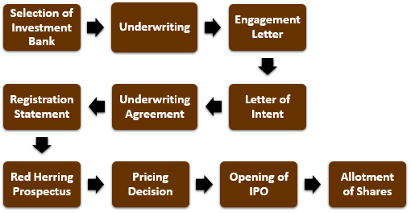

In the world of finance and investment, comprehensive documentation is essential for successfully raising capital and ensuring regulatory compliance. One such document that plays a crucial role is the investment offering circular. Particularly important in securities issuance and algorithmic trading, the investment offering circular provides vital information that helps investors make informed decisions. This article explores the significance of these circulars, how they compare to other financial documents, and their relevance in algorithmic trading. A deep understanding of these components is essential for investors, companies, and financial analysts interested in the rapidly changing dynamics of modern financial markets. By providing a clear and concise overview of investment opportunities, offering circulars enhance transparency and trust, which are fundamental to the functioning of efficient markets.

## Table of Contents



## What is an Investment Offering Circular?

An investment offering circular is a formal written document crafted to supply potential investors with vital information about a new security listing. It closely resembles a prospectus, but is often more concise, while still encapsulating comprehensive financial data, risk factors, and the intended use of proceeds from the investment. Offering circulars serve as critical instruments in promoting transparency and facilitating informed investment decisions. 

These documents are meticulously designed to present essential details that enable investors to thoroughly evaluate the merits of an investment opportunity. They typically include the issuer’s business background, financial statements, management structure, and market goals. The purpose is to provide a comprehensive view that helps investors understand the prospects and risks associated with the investment.

The condensed nature of an offering circular contrasts it with a prospectus, which generally presents more exhaustive information and narrative details. Despite this brevity, offering circulars do not compromise on the essential details, ensuring that potential investors are informed about significant elements that can impact their investment decisions. By maintaining transparency, offering circulars play an integral role in the financial ecosystem, fostering trust and informed decision-making among stakeholders.

## Key Components of an Offering Circular

An investment offering circular is comprised of several key components that offer potential investors a clear view of the investment opportunity and the financial well-being and strategic objectives of the issuing entity. Each of these components serves a distinct purpose in providing critical insights into the company's operations, financial soundness, and future plans.

**Company Overview:**
The company overview section introduces the issuing entity, detailing its history, mission, and core business activities. It often includes information on the company's governance structure, management team, and market position. This section is crucial as it provides investors with context about the issuing entity's operational landscape and competitive advantages.

**Intended Use of Proceeds:**
This component specifies how the capital raised through the offering will be utilized. Detailed allocation of proceeds can include funding new projects, business expansion, debt repayment, or other strategic initiatives. This transparency allows investors to assess whether the company is making sound decisions regarding capital utilization, aligned with its long-term growth strategy.

**Financial Statements:**
Offering circulars include audited financial statements, such as income statements, balance sheets, and cash flow statements. These financial documents provide a snapshot of the company's financial health, profitability, and [liquidity](/wiki/liquidity-risk-premium). Investors can analyze trends in revenue, expenses, and earnings to evaluate the company’s financial performance and stability.

**Risk Factors:**
The risk factors section enumerates potential challenges and uncertainties that could affect the company's operations and financial results. These may include market risks, economic factors, legal issues, and industry-specific threats. Transparent disclosure of risks helps investors make informed decisions by understanding the potential downsides and assessing whether they are within an acceptable range for their investment strategy.

By thoroughly examining these key components, potential investors can acquire invaluable information about the issuing entity, enabling a comprehensive understanding of the financial opportunity presented and fostering informed decision-making processes.

## Differentiating Offering Circulars and Other Financial Documents

Differentiating offering circulars from other financial documents like red herrings and preliminary prospectuses is important for investors seeking to make knowledgeable decisions. These documents, while related, serve distinct purposes and contain varying levels of detail. 

An offering circular is a comprehensive document providing potential investors with final, detailed information about a security, enabling them to make informed investment decisions. It offers a complete view of the investment opportunity, including data on financials, risk factors, the intended use of proceeds, and the financial health of the issuer. The completeness of this document ensures that investors have access to the crucial information they need to assess the risks and potentials associated with the investment.

In contrast, a red herring is a preliminary offering document used primarily as a marketing tool during an Initial Public Offering (IPO). It is named for the red disclaimer on its cover, indicating it does not yet contain complete information. The red herring provides potential investors with information about the basic structure of the investment, the business operations, and strategic goals of the company, but lacks finalized specifics like the price range of the securities or details on the number of shares to be offered. This document is meant to gauge investor interest and to provide initial market feedback, rather than serve as a basis for a final investment decision.

A preliminary prospectus, meanwhile, is issued as part of the process leading up to an IPO and, like the red herring, is not a final document. It typically includes data on the issuer's business, management, and financial information but is subject to updates and modifications. The preliminary prospectus serves as a draft from which the final prospectus is derived, once the offering details are settled.

Thus, understanding the distinctions among these documents aids in evaluating securities offerings accurately. Offering circulars deliver finalized and authoritative information essential for decision-making, whereas red herrings and preliminary prospectuses serve as early, incomplete steps in the securities offering process. Recognizing these distinctions helps investors navigate the intricacies of investing and ensures compliance with applicable regulations.

## Regulatory Framework of Offering Circulars

Offering circulars play a vital role in the financial market, serving as an essential tool for investor protection and market transparency. In the United States, the regulation of these documents falls under the jurisdiction of the Securities and Exchange Commission (SEC) according to the Securities Act of 1933. This regulatory framework is designed to ensure that investors receive pertinent and accurate information about new securities, allowing for well-informed investment decisions.

The Securities Act of 1933 lays out specific requirements for the preparation and distribution of offering circulars. Primarily, the Act mandates that all securities offered or sold in the United States must be registered with the SEC unless they qualify for an exemption. This registration process involves the submission of detailed disclosures about the security and issuing company, which are encapsulated within the offering circular.

The regulatory oversight by the SEC focuses on several critical components:

1. **Disclosure Requirements**: Offering circulars must provide comprehensive disclosure of financial and non-financial information. This includes a description of the company's business operations, financial condition, management structure, and risk factors. The aim is to present a transparent and clear picture of the company’s health and future prospects.

2. **Review and Comment**: The SEC reviews the offering circulars submitted by companies to ensure compliance with the regulatory standards. The Commission may issue comments to the company if additional information or clarification is needed, reflecting a robust review process intended to protect investors from inaccurate or misleading information.

3. **Materiality**: Information included in the offering circular must be material—that is, significant enough to influence an investor's decision-making process. Companies are obligated to update the offering circular with new material information even after the initial distribution.

4. **Anti-Fraud Provisions**: The Securities Act includes stringent anti-fraud provisions, making it unlawful to misrepresent or omit any material facts necessary to prevent making misleading statements in the offering circular. Companies and their executives can be held liable for any such violations, which underscores the importance of accuracy and completeness.

The regulatory framework ensures a level playing field where the interests of investors are safeguarded. By mandating transparency and accountability through the offering circular, the SEC seeks to prevent fraudulent activity and maintain the integrity of the financial markets. This not only protects investors but also enhances confidence in the capital markets, facilitating efficient capital formation.

In summary, the regulatory requirements for offering circulars are crucial in creating a transparent investment environment. Compliance with SEC rules under the Securities Act of 1933 ensures that investors have access to all necessary information, promoting fair investment practices and protecting against potential abuses in the financial market.

## The Role of Offering Circulars in Algorithmic Trading

Algorithmic trading is a method of executing orders using automated and pre-programmed trading instructions. It is dependent on data precision and accuracy to identify and capitalize on market opportunities efficiently. Offering circulars provide a critical source of the data essential for [algorithmic trading](/wiki/algorithmic-trading), offering detailed insights into a company's financial health, strategic goals, and potential risk factors associated with its securities. This information can be vital for algorithmic traders seeking to build and refine models that predict market movements and optimize trading strategies.

Offering circulars contain financial statements, projections, and market analyses, which can be quantitatively analyzed to derive actionable insights. For example, an algorithm can be programmed to parse through these documents to extract key financial metrics like P/E ratios, debt-to-equity ratios, and earnings growth rates. These metrics can then be fed into trading algorithms as variables that influence buy, hold, or sell decisions.

Furthermore, the risk factors and intended use of proceeds detailed in offering circulars can be crucial inputs for models that assess the qualitative aspects of investment opportunities. By incorporating sentiment analysis or natural language processing (NLP) techniques, algorithms can evaluate the language and tone used in these sections to gauge market sentiment and potential impacts on stock performance.

Additionally, offering circulars are pivotal during initial public offerings (IPOs) and other new securities issuances, providing a comprehensive view of an entity's market position. Traders utilizing algorithmic models can leverage this strategic information to predict short-term price [volatility](/wiki/volatility-trading-strategies) and long-term growth trajectories of new market entrants, creating opportunities to optimize returns.

In Python, for example, libraries such as pandas for data manipulation, and NLP libraries like NLTK or spaCy, can be employed to automate and enhance the analysis of offering circulars. Below is a simplified example using Python to extract and analyze financial ratios from an offering circular:

```python
import pandas as pd
from nltk.sentiment.vader import SentimentIntensityAnalyzer

# Sample data extraction from offering circular
data = {
    'P/E Ratio': [15.8, 22.4, 17.5],
    'Debt-to-Equity': [0.45, 0.70, 0.30],
    'Earnings Growth': [0.12, 0.08, 0.15]
}
financial_df = pd.DataFrame(data)

# Calculating average financial metrics
pe_average = financial_df['P/E Ratio'].mean()
de_average = financial_df['Debt-to-Equity'].mean()
earnings_growth_average = financial_df['Earnings Growth'].mean()

# Sentiment analysis of risk factors section
risk_factors_text = "Company XYZ faces significant risks due to market volatility and regulatory changes." # Example text
sia = SentimentIntensityAnalyzer()
sentiment = sia.polarity_scores(risk_factors_text)

print('Financial Averages:', pe_average, de_average, earnings_growth_average)
print('Sentiment Analysis Scores:', sentiment)
```

The integration of such detailed financial data from offering circulars allows traders to optimize their algorithmic models, leading to improved trading efficiency and potential profitability. By ensuring that their models are informed by the comprehensive and regulatory-compliant information within offering circulars, algorithmic traders can enhance their ability to make informed, data-driven investment decisions.

## Case Studies and Practical Examples

Examining notable case studies provides valuable insights into how investment offering circulars can significantly impact investor decision-making and securities offerings. One of the most prominent examples is WeWork's attempted Initial Public Offering (IPO) in 2019. WeWork's offering circular, also known as the S-1 filing in the United States, played an essential role in shaping investor perceptions and ultimately influenced the IPO's outcome.

The WeWork case highlights several key lessons:

1. **Transparency and Financial Scrutiny**: The offering circular revealed detailed financial statements and operational metrics, which exposed significant discrepancies between the company's reported valuation and its financial health. Investors' scrutiny of WeWork's circular raised concerns about its business model's sustainability, profitability, and cash flow management. This transparency is imperative, allowing investors to conduct due diligence and assess the risk associated with their investments.

2. **Corporate Governance and Risk Factors**: WeWork's circular disclosed governance issues, including the concentration of power in key executives and conflicts of interest. The document detailed potential risk factors that could affect WeWork's business, such as its reliance on long-term lease commitments and the complexities of scaling its business model globally. This level of detail is crucial for investors to understand the inherent risks and make informed decisions.

3. **Market Reaction and Adjustments**: The public release of WeWork's offering circular led to a substantial negative market reaction, prompting the company to revise its offering. WeWork postponed its IPO, reassessed its valuation, and made significant management changes. This chain of events underscores the importance of offering circulars in testing market sentiment and their ability to guide necessary strategic adjustments for companies aiming to enter public markets.

Another illustrative example involves the IPO of the company Airbnb in December 2020. Unlike WeWork, Airbnb's offering circular was perceived positively by investors, reflecting a strategic shift towards profitability and a resilient business model amid the COVID-19 pandemic. The documentation provided clarity on how Airbnb adapted its operations during the crisis, which reassured investors about its growth prospects. The success of Airbnb's IPO can be attributed to the effective communication of strategic initiatives and financial planning through its offering circular.

These case studies underscore the integral role of offering circulars in modern investment landscapes. They serve not only as statutory documents ensuring transparency and compliance but also as strategic tools that can influence investor perceptions and corporate strategies. Learning from these examples, companies must prioritize the accuracy, transparency, and strategic positioning of their offering circulars to align investor expectations with their business objectives.

For future securities offerings, both companies and investors can benefit from closely examining offering circulars to anticipate potential challenges and opportunities. Companies should ensure a thorough and honest presentation of their financial and strategic outlook while investors should analyze these documents critically to make informed decisions in their investment pursuits.

## Conclusion

Investment offering circulars play a critical role in financial markets by providing essential information that informs investment decisions. These documents offer detailed insights into a company's financial health, risk factors, and strategic objectives, which are vital for both investors and financial analysts. By ensuring transparency and regulatory compliance, offering circulars help maintain market integrity and protect investor interests.

In the high-stakes world of algorithmic trading, offering circulars assume even greater importance. Algorithmic trading strategies depend on accurate and comprehensive data to function effectively. Information derived from offering circulars can be integrated into these algorithms to optimize trading decisions, enhance efficiency, and potentially increase profitability. This makes them not just a regulatory requirement but a valuable resource for data-driven decision-making.

Understanding offering circulars is crucial for anyone engaged in modern financial practices. The intricacies of these documents, including the detailed financial information and risk assessments they contain, equip investors, companies, and analysts with the tools needed to navigate complex financial markets confidently. As financial landscapes continue to evolve, the role of offering circulars in promoting informed decision-making and transparency remains indispensable.

## References & Further Reading

[1]: Bergstra, J., Bardenet, R., Bengio, Y., & Kégl, B. (2011). ["Algorithms for Hyper-Parameter Optimization."](https://dl.acm.org/doi/10.5555/2986459.2986743) Advances in Neural Information Processing Systems 24.

[2]: ["Advances in Financial Machine Learning"](https://www.amazon.com/Advances-Financial-Machine-Learning-Marcos/dp/1119482089) by Marcos Lopez de Prado

[3]: ["Evidence-Based Technical Analysis: Applying the Scientific Method and Statistical Inference to Trading Signals"](https://www.amazon.com/Evidence-Based-Technical-Analysis-Scientific-Statistical/dp/0470008741) by David Aronson

[4]: ["Machine Learning for Algorithmic Trading"](https://github.com/stefan-jansen/machine-learning-for-trading) by Stefan Jansen

[5]: ["Quantitative Trading: How to Build Your Own Algorithmic Trading Business"](https://www.amazon.com/Quantitative-Trading-Build-Algorithmic-Business/dp/1119800064) by Ernest P. Chan