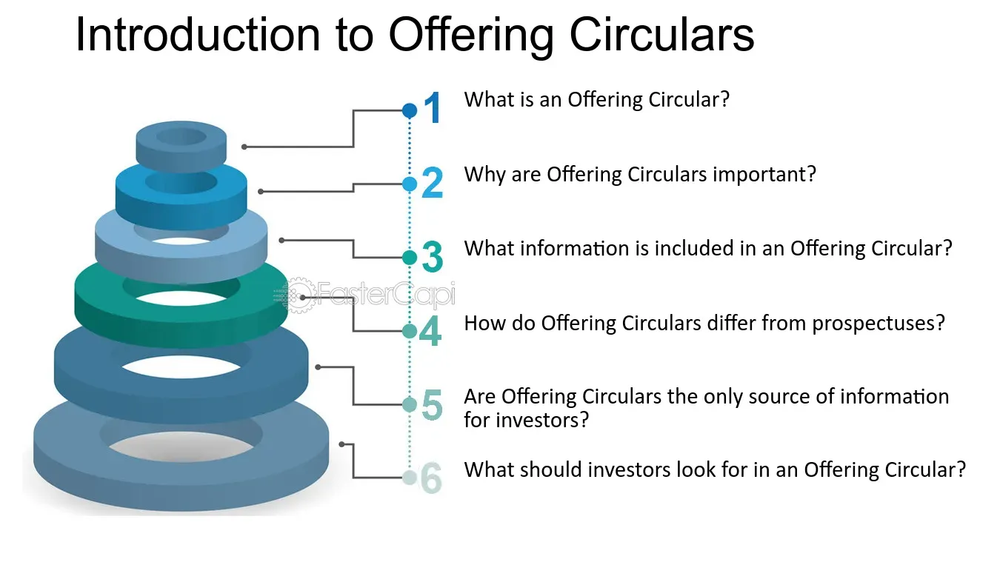

## Table of Contents

## What is an Offering Circular?

An Offering Circular is a document that companies use when they want to sell securities like stocks or bonds to investors. It gives important information about the company and the securities being offered. This helps investors make smart choices about whether to buy the securities or not.

The Offering Circular includes details like the company's financial health, what the money raised will be used for, and any risks involved in investing. It's similar to a prospectus but is often used for private placements, which are sales of securities not available to the general public. By reading the Offering Circular, investors can understand the investment opportunity better and decide if it's right for them.

## Who typically issues an Offering Circular?

Companies that want to raise money by selling securities like stocks or bonds usually issue an Offering Circular. These companies can be big or small, but they often use this document when they are doing a private placement. A private placement means they are selling securities to a select group of investors, not to the general public.

The Offering Circular helps these companies explain their business and what they plan to do with the money they raise. It's important for the company to be clear and honest in this document because investors will use it to decide if they want to invest. By providing all the necessary details, the company can attract the right investors and successfully raise the funds they need.

## What is the purpose of an Offering Circular?

The main purpose of an Offering Circular is to give investors important information about a company that wants to sell securities like stocks or bonds. When a company wants to raise money, it needs to tell potential investors about its business, how it's doing financially, and what it plans to do with the money it raises. The Offering Circular is the document that provides all these details, helping investors understand what they're getting into.

This document is especially important for private placements, where the securities are sold to a select group of investors instead of the general public. By reading the Offering Circular, investors can learn about any risks involved and make a smart decision about whether to buy the securities. It helps build trust between the company and the investors, making sure everyone has the information they need to make good choices.

## How does an Offering Circular differ from a Prospectus?

An Offering Circular and a Prospectus both give information about a company that wants to sell securities, but they are used in different situations. A Prospectus is used when a company wants to sell securities to the general public. It has to follow strict rules set by the government to make sure everyone gets the same information. This is important because the company is selling to a lot of people, so everything needs to be clear and fair.

On the other hand, an Offering Circular is used for private placements, where the company is selling securities to a smaller, select group of investors. Because it's a smaller group, the rules are a bit less strict. The Offering Circular still has to give a lot of information about the company and the securities, but it doesn't have to follow all the same rules as a Prospectus. This makes it easier for the company to raise money from specific investors who might be interested in their business.

## What are the key components of an Offering Circular?

An Offering Circular has several important parts that help investors understand the company and the securities being offered. It starts with a summary of the offering, which explains what the company is selling, how much they want to raise, and who can buy the securities. This part also talks about the main risks of investing in the company. Then, there's a section about the company itself, including its history, what it does, and who runs it. This helps investors know more about the business and the people behind it.

The next part of the Offering Circular is about the company's finances. It includes financial statements like the balance sheet, income statement, and cash flow statement. These documents show how the company is doing money-wise and help investors see if it's a good investment. There's also a section on how the company plans to use the money it raises. This could be for things like growing the business, paying off debts, or other projects. By explaining this, the company shows investors what their money will be used for.

Finally, the Offering Circular talks about the terms of the securities being offered. This includes details like the price, how long the securities will last, and any special rights or benefits that come with them. It also covers any legal stuff, like how the securities are regulated and what investors need to know about the law. All these parts together give investors a full picture of the investment opportunity, helping them decide if it's right for them.

## What information must be disclosed in an Offering Circular?

An Offering Circular must include a summary of the offering, which tells investors what the company is selling, how much money they want to raise, and who can buy the securities. It also explains the main risks of investing in the company, so people know what they might be getting into. This part is important because it gives a quick overview of the whole thing, helping investors decide if they want to read more.

The Offering Circular also has to share information about the company itself, like its history, what it does, and who runs it. This helps investors understand the business and the people in charge. There are also financial statements, like the balance sheet, income statement, and cash flow statement, which show how the company is doing with money. These documents are crucial because they let investors see if the company is a good investment. 

Lastly, the Offering Circular needs to explain how the company plans to use the money they raise. This could be for things like growing the business, paying off debts, or other projects. It also includes the terms of the securities, like the price, how long they last, and any special rights or benefits. The Offering Circular must cover any legal stuff too, like how the securities are regulated and what investors need to know about the law. All of this information helps investors make smart choices about whether to invest.

## How is the content of an Offering Circular regulated?

The content of an Offering Circular is regulated by government rules to make sure investors get the right information. In the United States, the Securities and Exchange Commission (SEC) sets the rules for what needs to be in an Offering Circular. These rules make sure the document has all the important details about the company and the securities being sold. This helps investors know what they are getting into and make good choices about whether to invest.

Even though an Offering Circular is used for private placements, it still has to follow some rules. The rules might be less strict than those for a Prospectus, which is used for public offerings, but the company still has to be honest and clear. The Offering Circular needs to include things like the company's financial health, what the money will be used for, and any risks involved. By following these rules, the company can help build trust with investors and make sure everyone has the information they need.

## What are the legal implications of inaccuracies in an Offering Circular?

If an Offering Circular has mistakes or wrong information, the company can get into big trouble. The law says that companies have to be honest and clear when they tell investors about their business and the securities they are selling. If they lie or leave out important stuff, they can be sued by investors who lose money because of the wrong information. This can lead to the company having to pay a lot of money to those investors.

Also, the government can step in if they find out about the inaccuracies. The Securities and Exchange Commission (SEC) in the United States can take action against the company. They might fine the company, stop them from selling securities, or even take them to court. This can hurt the company's reputation and make it hard for them to raise money in the future. So, it's really important for companies to make sure their Offering Circular is accurate and complete.

## How can investors use an Offering Circular to make informed decisions?

Investors can use an Offering Circular to make smart choices by reading it carefully. The document tells them all about the company and what they're selling. It has a summary that explains the main points, like how much money the company wants to raise and what they plan to do with it. It also talks about the risks of investing, so people know what could go wrong. By understanding these details, investors can decide if the investment is right for them.

The Offering Circular also includes financial statements that show how the company is doing money-wise. These numbers help investors see if the company is healthy and if it's a good place to put their money. There's also information about the people running the company, which can help investors trust them more. By looking at all this information, investors can figure out if the company's plans make sense and if they're likely to make money from the investment.

## What are the best practices for drafting an Offering Circular?

When drafting an Offering Circular, it's important to be clear and honest. Start by making sure the document gives a good summary of the offering, explaining what the company is selling, how much money they want to raise, and who can buy the securities. Include all the risks of investing so people know what could go wrong. It's also good to talk about the company's history, what they do, and who runs it. This helps investors trust the company more.

Next, include the company's financial statements like the balance sheet, income statement, and cash flow statement. These numbers show how the company is doing money-wise and help investors decide if it's a good investment. Also, explain how the company plans to use the money they raise, whether it's for growing the business, paying off debts, or other projects. Make sure to follow the rules set by the government, like those from the Securities and Exchange Commission (SEC), to make sure everything is legal and fair. By being thorough and clear, the Offering Circular can help build trust with investors and make it easier to raise money.

## How do international standards affect the preparation of an Offering Circular?

International standards can affect how a company prepares an Offering Circular. Different countries have their own rules about what needs to be in these documents. For example, in the United States, the Securities and Exchange Commission (SEC) sets rules, while other countries might have different agencies. Companies that want to sell securities in more than one country need to follow the rules of each place. This can make the Offering Circular longer and more detailed because it has to meet all the different standards.

Even though the rules might be different, the main goal is the same everywhere: to make sure investors get clear and honest information. Companies need to be careful to include all the required details, like financial statements and risk factors, no matter where they are selling their securities. By following international standards, companies can build trust with investors from different countries and make it easier to raise money around the world.

## What role does technology play in the distribution and analysis of Offering Circulars?

Technology makes it easier for companies to share Offering Circulars with investors. Instead of sending out paper copies, companies can now put the document online where investors can read it anytime. This saves time and money, and it's better for the environment too. Some companies even use special websites or apps to share the Offering Circular, making it simple for investors to find and read the information they need.

Technology also helps investors understand the Offering Circular better. There are tools and software that can analyze the document and highlight important parts like financial numbers or risks. This can make it easier for investors to see if the investment is a good idea. Some platforms even let investors ask questions or talk to the company directly, making the whole process more interactive and helpful.

## References & Further Reading

[1]: Bergstra, J., Bardenet, R., Bengio, Y., & Kégl, B. (2011). ["Algorithms for Hyper-Parameter Optimization."](https://dl.acm.org/doi/10.5555/2986459.2986743) Advances in Neural Information Processing Systems 24.

[2]: ["Advances in Financial Machine Learning"](https://www.amazon.com/Advances-Financial-Machine-Learning-Marcos/dp/1119482089) by Marcos Lopez de Prado

[3]: ["Evidence-Based Technical Analysis: Applying the Scientific Method and Statistical Inference to Trading Signals"](https://www.amazon.com/Evidence-Based-Technical-Analysis-Scientific-Statistical/dp/0470008741) by David Aronson

[4]: ["Machine Learning for Algorithmic Trading"](https://github.com/stefan-jansen/machine-learning-for-trading) by Stefan Jansen

[5]: ["Quantitative Trading: How to Build Your Own Algorithmic Trading Business"](https://www.amazon.com/Quantitative-Trading-Build-Algorithmic-Business/dp/1119800064) by Ernest P. Chan