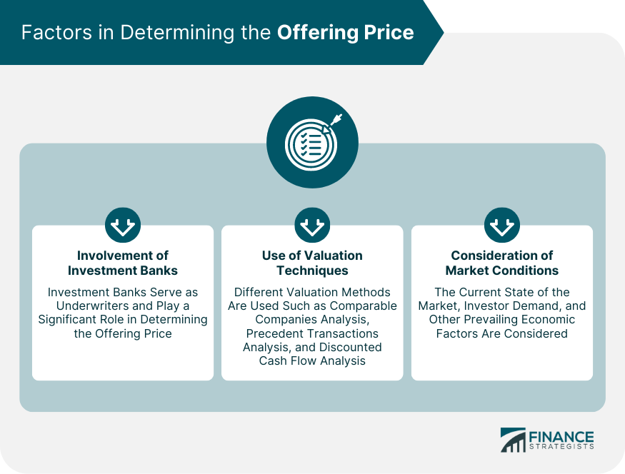

## Table of Contents

## What is an offering price?

An offering price is the price at which a company sells its new shares or securities to the public for the first time. This happens during an initial public offering (IPO) or when a company issues new shares. The offering price is important because it sets the value at which investors can buy into the company. It is usually determined by the company and its underwriters, who consider factors like the company's value, market conditions, and investor demand.

The offering price can affect how much money the company raises and how investors view the stock. If the offering price is set too high, investors might not buy the shares, and the IPO could fail. If it's set too low, the company might not raise as much money as it could, but the stock might perform well after the IPO. Getting the offering price right is a balancing act that can influence the success of the company's entry into the public market.

## How is the offering price determined?

The offering price is set by looking at different things. The company and its underwriters, who are like helpers in selling the shares, think about how much the company is worth. They also check what's happening in the stock market and how much people want to buy the new shares. They might talk to big investors to see what price they would pay. All these things help them decide on a good offering price.

Sometimes, the company does a roadshow where they meet with investors to talk about the business and get feedback on what price might work. This helps them understand if the price they're thinking about is too high or too low. After gathering all this information, the company and underwriters pick an offering price that they think will make the IPO successful. They want to make sure the price is fair so that the company raises enough money and investors feel good about buying the shares.

## What factors influence the offering price of a new stock?

The offering price of a new stock is influenced by several key factors. One big factor is the company's valuation, which means how much the company is worth. This is figured out by looking at things like the company's profits, how fast it's growing, and what similar companies are worth. Another factor is what's happening in the stock market at the time. If the market is doing well, people might be willing to pay more for new stocks. If it's not doing so well, they might want a lower price.

Another important thing is how much demand there is for the new stock. If a lot of people want to buy it, the company can set a higher offering price. To find out how much demand there is, the company and its underwriters might talk to big investors and see what price they're willing to pay. They might also do a roadshow where they meet with investors to talk about the business and get their feedback on the price.

Getting the offering price right is tricky because it needs to balance what the company wants to raise with what investors are willing to pay. If the price is too high, not enough people might buy the shares, and the IPO could fail. If it's too low, the company might not raise as much money as it could, but the stock might do well after the IPO. So, the company and its underwriters have to think carefully about all these factors to pick a good offering price.

## Can you explain the difference between offering price and market price?

The offering price is the price at which a company sells its new shares to the public for the first time during an initial public offering (IPO). It's set by the company and its underwriters before the stock starts trading. They think about how much the company is worth, what's happening in the market, and how much people want to buy the new shares. The offering price is important because it decides how much money the company will raise from selling the shares.

The market price, on the other hand, is what people are willing to pay for the stock once it starts trading on the stock exchange. After the IPO, the stock's price can go up or down based on what buyers and sellers think it's worth. The market price can be different from the offering price. If a lot of people want to buy the stock after the IPO, the market price might go higher than the offering price. If not many people want to buy it, the market price might drop below the offering price.

So, the offering price is set before the stock starts trading and is used to sell the shares to the public. The market price is what the stock trades at after it's on the market, and it can change every day based on what people think the stock is worth.

## What role does an underwriter play in setting the offering price?

An underwriter is like a helper for the company that wants to sell new shares to the public. They work with the company to figure out a good offering price. The underwriter looks at how much the company is worth, what's happening in the stock market, and how much people want to buy the new shares. They might talk to big investors to get their thoughts on what price would work. All this helps them come up with an offering price that they think will make the IPO successful.

The underwriter's job is important because they need to find a balance. If the offering price is too high, not enough people might buy the shares, and the IPO could fail. If it's too low, the company might not raise as much money as it could, but the stock might do well after the IPO. So, the underwriter uses their knowledge and talks with investors to pick a price that's fair for both the company and the people buying the shares.

## How does the offering price impact investors during an IPO?

The offering price is really important for investors during an IPO because it's the price they pay to buy the new shares. If the offering price is set too high, investors might think the stock is too expensive and decide not to buy it. This could make the IPO not go as well as the company hoped. On the other hand, if the offering price is set too low, a lot of investors might want to buy the shares because they think they're getting a good deal. This could make the stock's price go up quickly after the IPO, which is good for investors who bought in early.

Investors also watch the offering price closely because it can tell them a lot about what the company and its underwriters think the stock is worth. If the offering price seems fair, investors might feel more confident about buying the shares. But if the offering price seems too high or too low, it might make them think twice. After the IPO, the stock's price can change based on what people think it's worth, so the offering price is just the starting point for investors to decide if they want to buy the stock or not.

## What are the common pricing strategies used in setting an offering price?

When setting an offering price, companies and their underwriters often use a few common pricing strategies. One popular strategy is called the book-building method. With this method, the underwriters talk to big investors to see what price they would be willing to pay for the new shares. They gather all this information and use it to set the offering price. This helps make sure the price is fair and that there's enough demand for the shares.

Another strategy is the fixed price method. In this approach, the company and its underwriters decide on a set price for the shares before the IPO. They might use their own research and look at what similar companies are worth to come up with this price. This method is simpler but can be riskier because it doesn't take into account what investors think the shares are worth right before the IPO.

Sometimes, companies use a hybrid approach that mixes elements of both book-building and fixed price methods. They might set a price range and then use feedback from investors to finalize the offering price within that range. This can help balance the need for a fair price with the need to make sure the IPO goes well. Each of these strategies has its own pros and cons, and the choice depends on what the company and its underwriters think will work best for their situation.

## How can historical data be used to predict an effective offering price?

Historical data can be really helpful in figuring out a good offering price for a new stock. By looking at past IPOs of similar companies, underwriters can see what offering prices worked well and what didn't. They can check how much those companies were worth, how their stocks did after the IPO, and what was happening in the market at the time. This information helps them understand what investors might be willing to pay for the new shares. For example, if companies in the same industry usually have successful IPOs at a certain price range, the underwriters might use that as a guide for the new offering price.

Using historical data also helps underwriters see patterns and trends that can affect the offering price. They might look at how the stock market has been doing over time and how that has influenced IPOs. If the market has been going up, investors might be more willing to pay a higher price for new stocks. On the other hand, if the market has been down, a lower offering price might be needed to attract investors. By studying these trends, underwriters can make a smarter guess about what price will work best for the new stock, making the IPO more likely to succeed.

## What are the risks associated with setting the offering price too high or too low?

Setting the offering price too high can be risky for a company. If the price is too high, investors might think the stock is too expensive and not want to buy it. This could make the IPO fail because not enough people are buying the shares. If the IPO doesn't go well, the company might not raise the money it needs to grow or pay off debts. Also, if the stock price drops a lot after the IPO, it can make people think the company isn't doing well, which can hurt its reputation.

On the other hand, setting the offering price too low also has risks. If the price is too low, the company might not raise as much money as it could have. This means they might not have enough money to do everything they planned. But, a low offering price can make a lot of investors want to buy the shares because they think they're getting a good deal. This can make the stock's price go up quickly after the IPO, which is good for early investors but might leave money on the table for the company. Finding the right balance is important to make sure both the company and investors are happy.

## How does the offering price affect the company's valuation and future funding rounds?

The offering price during an IPO can really change how much people think the company is worth. If the offering price is high, it makes the company's total value, or valuation, go up. This is because the valuation is figured out by multiplying the number of shares by the price per share. A high offering price can make the company look more valuable, but it also needs to be a price that investors are willing to pay. If the price is too high and investors don't buy the shares, it can make the company's valuation go down after the IPO. On the other hand, if the offering price is low, the company might not seem as valuable, but it can attract more investors and make the stock price go up after the IPO.

The offering price also affects how the company can raise money in the future. If the IPO goes well and the stock price goes up after the offering price, it can make it easier for the company to raise more money later. Investors might be more willing to buy new shares in future funding rounds because they see the company's value going up. But if the offering price is too high and the IPO doesn't go well, it can be harder to raise money later. Investors might be scared off if they think the company's valuation is too high or if the stock price drops a lot after the IPO. So, getting the offering price right is important for both the company's current valuation and its ability to get more funding in the future.

## What are some case studies of successful and unsuccessful offering price strategies?

One successful case of setting the offering price was the IPO of Google in 2004. Google used a unique approach called a Dutch auction, where investors could bid on the shares, and the offering price was set based on these bids. They set the offering price at $85 per share, which was seen as fair and attracted a lot of investors. After the IPO, Google's stock price went up a lot, showing that the offering price was good. This helped Google raise a lot of money and made early investors happy because they saw their shares become more valuable.

On the other hand, an example of an unsuccessful offering price strategy was the IPO of Facebook in 2012. They set the offering price at $38 per share, which many people thought was too high. After the IPO, the stock price dropped a lot, going below the offering price. This made investors lose money and hurt Facebook's reputation. It showed that setting the offering price too high can make the IPO not go well and make it harder for the company to raise money in the future.

Another case study is the IPO of Snap Inc. in 2017. They set the offering price at $17 per share, which was seen as reasonable. The IPO went well, and the stock price went up right after. But over time, the stock price went down, showing that even if the offering price is good, other things can affect how the stock does later. This case shows that the offering price is important, but it's just one part of making an IPO successful.

## How do regulatory environments influence the setting of an offering price?

Regulatory environments can have a big impact on how a company sets its offering price. Different countries have rules about how companies can sell their shares to the public. For example, some places might have rules about how much information a company has to share before an IPO. If the rules are strict, it can take longer to get everything ready, and this might affect the offering price. Also, some regulators might check the offering price to make sure it's fair and not too high or too low. This can make the company and its underwriters be more careful about what price they pick.

Another way regulations can affect the offering price is through investor protection laws. These laws are there to make sure investors are treated fairly and have all the information they need to make good choices. If the rules are strong, companies might set a lower offering price to make sure more people can buy the shares and feel safe investing. On the other hand, if the rules are not so strict, companies might try to set a higher price to raise more money. So, the rules in a country can really change how a company thinks about the offering price and what they decide to do.

## What is the process of understanding IPO pricing?

An offering price is a critical component of the Initial Public Offering (IPO) process, determining the price at which a company’s shares will be sold to the public for the first time. Setting this price requires a complex evaluation that considers multiple factors, ensuring both company and market expectations are met. 

A primary factor influencing the offering price is the company's valuation, which reflects its anticipated future cash flows, market position, and competitive advantages. Valuation methods might include discounted cash flow models, comparable company analysis, or precedent transactions. For example, the Discounted Cash Flow (DCF) model estimates the present value of expected future cash flows:

$$
DCF = \sum \frac{CF_t}{(1 + r)^t}
$$

where $CF_t$ is the cash flow in year $t$, and $r$ is the discount rate.

Market sentiment also plays a crucial role; positive market conditions can lead to higher offering prices due to increased investor enthusiasm. Conversely, in a bearish market, companies might lower their offering prices to attract investors. Investment banks and underwriters leverage their market expertise and investor network to help set the initial offering price, balancing between an attractive offer and a realistic valuation. They aim to ensure the company raises sufficient capital while providing a potential upside to new investors.

Investor demand is another significant [factor](/wiki/factor-investing). During the IPO process, underwriters often conduct book-building, gathering input on demand levels at different price points. High demand could potentially justify a higher offering price, whereas sluggish interest might necessitate a lower one.

While setting the offering price, the challenge lies in maintaining an equilibrium between attracting investors and reflecting the company's true value. If a company sets the price too low, it risks leaving substantial amounts of capital unraised. Conversely, an overly high price could lead to poor stock performance post-IPO, as subsequent market trading may not support the initial valuation.

Once the IPO process concludes, share prices become subject to broader market forces. These include general economic conditions, industry-specific developments, and company performance updates. Thus, even if the initial offering price is well-calibrated, it does not inherently guarantee the stability or growth of the share price in the secondary market. Understanding these elements helps in appreciating the intricate balance required in IPO pricing strategy.

## References & Further Reading

[1]: Wall Street Journal. ["Uber Prices Long-Awaited IPO at Lower End of Range."](https://www.wsj.com/)

[2]: Forbes. ["Alibaba's Record $25B IPO: Key Points."](https://www.ft.com/content/0f97cc70-4208-11e4-a7b3-00144feabdc0)

[3]: Securities and Exchange Commission. ["Facebook, Inc. Registration Statement."](https://www.sec.gov/Archives/edgar/data/1326801/000132680114000055/facebook-universalsx3.htm) SEC, 2012.

[4]: Damodaran, A. ["Investment Valuation: Tools and Techniques for Determining the Value of Any Asset"](https://archive.org/details/investmentvaluat0000damo_n6k9), John Wiley & Sons, 2012.

[5]: ["Algorithmic and High-Frequency Trading"](https://www.amazon.com/Algorithmic-High-Frequency-Trading-Mathematics-Finance/dp/1107091144) by Álvaro Cartea, Sebastian Jaimungal, and José Penalva

[6]: ["Investment Banking: Valuation, Leveraged Buyouts, and Mergers and Acquisitions"](https://www.amazon.com/Investment-Banking-Valuation-Leveraged-Acquisitions/dp/1118656210) by Joshua Rosenbaum and Joshua Pearl

[7]: ["Trading and Exchanges: Market Microstructure for Practitioners"](https://www.amazon.com/Trading-Exchanges-Market-Microstructure-Practitioners/dp/0195144708) by Larry Harris