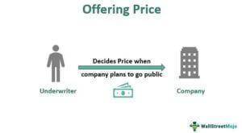

The Initial Public Offering (IPO) represents a critical phase where private companies transition to public ownership, with the primary goal of raising capital by making shares available to a wider investor base. This process marks a significant milestone as it allows companies to leverage public capital markets to fuel growth, enhance credibility, and achieve broader corporate objectives.

IPO pricing is a multifaceted process that requires the integration of various stakeholder perspectives, including those of investment banks, underwriters, and potential investors. The complexity of setting the right offering price stems from a need to balance the interests of the company seeking capital, the appetite of the market, and the expected performance as perceived by investors. A successful IPO requires meticulous planning and strategic decision-making to address these diverse concerns.



The dynamics of IPO pricing are pivotal in understanding broader market trends, insights into investor behavior, and effective financial strategies. Analyzing IPO processes and outcomes can reveal underlying patterns in investor sentiment and market conditions that influence financial markets. For instance, during periods of economic exuberance, a higher IPO offering price might be feasible, whereas in more subdued market environments, pricing strategies might need adjustment to attract sufficient investor interest.

This article is designed to provide a comprehensive look at the intricacies of IPO pricing, focusing on key elements such as offering prices, underwriter roles, market influences, and the emerging impact of algorithmic trading. It scrutinizes how these factors collectively shape the pricing and success of IPOs, providing potential guides for those involved in the IPO process. By examining these aspects, the aim is to offer valuable insights into how companies can navigate the IPO landscape effectively, ensuring successful transitions to public ownership and optimal capital acquisition.

## Table of Contents

## Understanding IPO Pricing

An offering price is a critical component of the Initial Public Offering (IPO) process, determining the price at which a company’s shares will be sold to the public for the first time. Setting this price requires a complex evaluation that considers multiple factors, ensuring both company and market expectations are met. 

A primary factor influencing the offering price is the company's valuation, which reflects its anticipated future cash flows, market position, and competitive advantages. Valuation methods might include discounted cash flow models, comparable company analysis, or precedent transactions. For example, the Discounted Cash Flow (DCF) model estimates the present value of expected future cash flows:

$$
DCF = \sum \frac{CF_t}{(1 + r)^t}
$$

where $CF_t$ is the cash flow in year $t$, and $r$ is the discount rate.

Market sentiment also plays a crucial role; positive market conditions can lead to higher offering prices due to increased investor enthusiasm. Conversely, in a bearish market, companies might lower their offering prices to attract investors. Investment banks and underwriters leverage their market expertise and investor network to help set the initial offering price, balancing between an attractive offer and a realistic valuation. They aim to ensure the company raises sufficient capital while providing a potential upside to new investors.

Investor demand is another significant [factor](/wiki/factor-investing). During the IPO process, underwriters often conduct book-building, gathering input on demand levels at different price points. High demand could potentially justify a higher offering price, whereas sluggish interest might necessitate a lower one.

While setting the offering price, the challenge lies in maintaining an equilibrium between attracting investors and reflecting the company's true value. If a company sets the price too low, it risks leaving substantial amounts of capital unraised. Conversely, an overly high price could lead to poor stock performance post-IPO, as subsequent market trading may not support the initial valuation.

Once the IPO process concludes, share prices become subject to broader market forces. These include general economic conditions, industry-specific developments, and company performance updates. Thus, even if the initial offering price is well-calibrated, it does not inherently guarantee the stability or growth of the share price in the secondary market. Understanding these elements helps in appreciating the intricate balance required in IPO pricing strategy.

## The Role of Underwriters

Underwriters play a crucial role in the IPO process by assessing company value and market conditions to develop a suitable pricing strategy. They serve as intermediaries between the issuing company and the investing public, ensuring that the IPO is priced accurately to meet both the company’s capital-raising needs and investor expectations.

Underwriters begin by conducting comprehensive market research. This involves evaluating the financial health of the company, examining industry trends, and analyzing economic factors that may impact the IPO's success. Additionally, underwriters engage in a process known as book-building. During book-building, underwriters gauge investor interest by soliciting potential investors’ price and allocation preferences for the shares. This feedback allows underwriters to approximate the demand levels for the shares and helps in setting a preliminary offering price.

Choosing the right pricing strategy is critical for the success of an IPO. Underwriters must balance the company's desire to maximize capital raised against the need to set an attractive price for investors. An optimally priced IPO can result in a stable aftermarket performance, enhancing the company's reputation and future capital-raising capabilities.

Post-IPO, underwriters help manage share price [volatility](/wiki/volatility-trading-strategies) through market-making activities. These activities may include buying and selling shares in the market to ensure sufficient [liquidity](/wiki/liquidity-risk-premium) and prevent significant price fluctuations that could deter investors. Additionally, underwriters can utilize overallotment options, commonly referred to as the "greenshoe" option, named after the Green Shoe Manufacturing Company, which was the first to use this option. The greenshoe allows underwriters to sell more shares than initially planned, typically up to 15% of the original number of shares. If demand for the shares is strong, exercising the greenshoe option stabilizes the share price by increasing supply and preventing it from rising excessively. Conversely, if the share price falls below the offering price, underwriters can buy back shares to cover the overallotment, providing price support.

By conducting thorough analyses and employing strategic tools, underwriters help ensure that the IPO is a successful entry into the public market, benefiting both the issuing company and the investors involved.

## Market Conditions and IPO Pricing

Understanding market conditions is crucial for determining the success of an Initial Public Offering (IPO). The pricing strategies employed during an IPO are often adjusted to correlate with investor sentiment, which can vary significantly during bullish or bearish market phases. During bullish markets, optimism among investors may lead to higher valuations and, consequently, higher offering prices. Conversely, in bearish markets, companies might be compelled to lower their offering prices to attract hesitant investors.

The economic climate and prevailing industry trends play vital roles in shaping investor behavior and their willingness to participate in an IPO. For instance, during periods of economic growth, sectors experiencing rapid advancement—such as technology and renewable energy—may see higher investor interest due to promising future returns. The opposite often occurs during economic downturns, where investors might shift their focus to more stable industries or delay participating in new offerings altogether.

Real-world cases, such as the IPOs of Uber and Alibaba, serve as illustrations of the profound impact market conditions can have on IPO pricing. Uber's IPO, which took place in May 2019, unfolded in a volatile market environment affected by U.S.-China trade tensions and broader economic uncertainty. Despite being one of the largest IPOs in history, Uber adjusted its offering price to $45 per share, which was at the lower end of its targeted range.[1] 

In contrast, Alibaba's IPO in September 2014 benefited from strong market conditions and vibrant investor interest, allowing it to set an initial offering price at $68 per share, and subsequently raised nearly $22 billion, marking the largest IPO in history at that time.[2] Both cases illustrate how external market factors necessitate strategic adjustments in IPO pricing to achieve successful outcomes.

Companies must continuously assess and adapt to market dynamics to optimize their IPO results. This involves a comprehensive analysis of current market trends, economic indicators, and investor behavior patterns. By aligning their pricing strategies with these market conditions, companies can improve their chances of achieving desired financial outcomes and ensuring long-term stability post-IPO.

---
[1] Wall Street Journal. "Uber Prices Long-Awaited IPO at Lower End of Range."  
[2] Forbes. "Alibaba's Record $25B IPO: Key Points."

## Challenges and Risks in IPO Pricing

IPO pricing is a critical process that involves various challenges and risks which must be meticulously navigated to ensure a successful public offering. One of the primary challenges in IPO pricing is accurately valuing the company. This task is particularly difficult for startups and firms with limited financial histories, as they often lack the extensive data required for precise valuation. The difficulty in valuation stems from the need to forecast future cash flows and growth prospects without a robust historical baseline. 

Mispricing during an IPO can have significant consequences. Underpricing an IPO, where the initial share price is set too low, can mean substantial unrealized capital for the company, essentially "leaving money on the table." On the other hand, overpricing can result in a failed offering, as shares may not attract enough buyers at the set price due to perceived overvaluation, leading to a drop in share prices once trading begins. The IPO of Facebook in 2012 serves as an illustrative example, where initial pricing issues led to considerable fluctuations in its market debut [1].

Regulatory compliance is another layer of complexity in the IPO process. Companies must adhere to regulations set by securities authorities, such as the U.S. Securities and Exchange Commission (SEC), which mandate comprehensive disclosure of financial and operational information. Compliance ensures that investors have sufficient information to make informed decisions. However, the extensive disclosure requirements can become a workload burden and may also expose sensitive business information to competitors.

Besides financial and regulatory aspects, managing investor expectations is a crucial part of the IPO journey. Companies need to carefully craft their narrative and financial forecasts to align with market perceptions and investment appetites. Failure to manage these expectations can result in investor dissatisfaction and negative media perception, further impacting the stock's performance post-IPO.

To mitigate these risks, a strategic approach to IPO pricing is essential. This includes thorough market research and the engagement of experienced underwriters who can accurately assess market conditions, investor sentiment, and the competitive landscape. Using quantitative models, companies can forecast valuations and determine optimal pricing strategies. Here is a simple Python code snippet that uses a discounted cash flow (DCF) model to estimate company valuation:

```python
def dcf_valuation(cash_flows, discount_rate):
    """
    Calculate the DCF valuation given projected cash flows and a discount rate.
    :param cash_flows: List of estimated cash flows for a future period.
    :param discount_rate: Discount rate as a decimal.
    :return: Estimated valuation.
    """
    present_value = 0
    for i, cash_flow in enumerate(cash_flows):
        present_value += cash_flow / ((1 + discount_rate) ** (i + 1))
    return present_value

# Example usage
projected_cash_flows = [500000, 600000, 700000, 800000, 900000]  # Example cash flows over years
discount_rate = 0.1  # 10% discount rate

valuation = dcf_valuation(projected_cash_flows, discount_rate)
print(f"Estimated Company Valuation: ${valuation:,.2f}")
```

Crafting a strategic pricing approach allows companies not only to comply with regulatory standards and manage investor expectations but also to effectively navigate the inherent challenges and risks associated with IPO pricing [2]. This careful balance of multiple factors increases the likelihood of a successful public offering and positive market reception.

References:
1. Securities and Exchange Commission. "Facebook, Inc. Registration Statement". SEC, 2012.
2. Damodaran, A. "Investment Valuation: Tools and Techniques for Determining the Value of Any Asset", John Wiley & Sons, 2012.

## Algorithmic Trading and IPOs

Algorithmic trading has become an instrumental factor in the dynamics of Initial Public Offerings (IPOs). Primarily employed by institutional investors, this form of trading utilizes complex algorithms to execute rapid, high-frequency trades. These activities significantly influence IPO pricing by increasing liquidity and affecting the demand for newly listed shares. The swift execution of trades through algorithmic systems may lead to substantial fluctuations in the opening prices of new IPOs, as demand surges or wanes based on algorithmic activity.

The impact of [algorithmic trading](/wiki/algorithmic-trading) on IPOs is multifaceted. Algorithms are designed to interpret market signals and execute trades at speeds beyond human capabilities. This ability allows them to rapidly respond to new information or changes in market conditions, thereby affecting the initial trading [volume](/wiki/volume-trading-strategy) and price stability of IPO shares. By capitalizing on minute price discrepancies, algorithms can modify the perceived demand, potentially creating volatility during the initial moments post-IPO.

For traditional investors, understanding how algorithmic trading affects IPO pricing can provide a strategic advantage. By analyzing patterns in algorithmic trade execution, these investors can gauge the true demand for shares and adjust their strategies accordingly. For instance, recognizing periods of heightened algorithmic activity may help investors anticipate price movements or decide on optimal entry and [exit](/wiki/exit-strategy) points.

The continuing evolution of trading technologies enhances these influences on IPO pricing strategies. Advances in [machine learning](/wiki/machine-learning) and [artificial intelligence](/wiki/ai-artificial-intelligence) are enabling even more sophisticated algorithmic models, capable of more nuanced decision-making processes and predictive analysis. These developments present both opportunities and challenges; companies must remain cognizant of evolving technology trends and their potential impacts on IPO pricing.

Furthermore, both companies considering going public and investors participating in IPOs must remain aware of how algorithmic trading affects market conditions. The presence of algorithms can amplify market trends and cause unforeseen impacts, such as increased volatility or altered perceptions of a company's value. Ensuring a well-prepared strategy that considers these algorithmic influences can aid in achieving successful IPO outcomes.

## Key Takeaways for Effective IPO Pricing Strategies

Conducting thorough market research and valuation analysis is essential for setting a realistic pricing strategy during an Initial Public Offering (IPO). This step ensures that the offering price reflects the company's intrinsic value while considering current market conditions and investor demand. Robust market research encompasses multiple factors, including economic indicators, industry trends, and competitor analysis, providing a comprehensive understanding of the IPO landscape.

Collaboration with experienced underwriters is crucial in navigating the complexities of pricing dynamics. Underwriters bring specialized knowledge and expertise, helping companies assess their financial standings and market potential. By engaging in book-building processes and leveraging market insights, underwriters contribute to formulating effective pricing strategies that balance company goals and investor expectations.

Understanding investor sentiment is vital for tailoring IPO strategies to maximize interest. Market sentiment can heavily influence the perceived attractiveness of an IPO. Companies can gauge investor sentiment through pre-roadshow surveys, feedback from institutional investors, and social media analysis. Aligning the IPO strategy with investor interests enhances the likelihood of a successful offering.

Adapting pricing strategies to changing market conditions and maintaining flexibility is imperative for optimizing IPO outcomes. Market environments can shift rapidly due to various factors such as geopolitical events, economic changes, and technological advances. Effective IPO pricing strategies must therefore remain adaptable, incorporating mechanisms like pricing ranges to accommodate market volatility and investor demand fluctuations.

Recent case studies illustrate that understanding market dynamics and technological impacts can significantly improve IPO outcomes. For instance, companies that effectively incorporate algorithmic trading trends and technological shifts into their pricing strategies often fare better in successful [capital raising](/wiki/hedge-fund-capital-raising) and achieving desired market valuations. By staying informed on these trends, companies can anticipate potential impacts on their IPOs and adjust their strategies accordingly.

## References & Further Reading

[1]: Wall Street Journal. ["Uber Prices Long-Awaited IPO at Lower End of Range."](https://www.wsj.com/)

[2]: Forbes. ["Alibaba's Record $25B IPO: Key Points."](https://www.ft.com/content/0f97cc70-4208-11e4-a7b3-00144feabdc0)

[3]: Securities and Exchange Commission. ["Facebook, Inc. Registration Statement."](https://www.sec.gov/Archives/edgar/data/1326801/000132680114000055/facebook-universalsx3.htm) SEC, 2012.

[4]: Damodaran, A. ["Investment Valuation: Tools and Techniques for Determining the Value of Any Asset"](https://archive.org/details/investmentvaluat0000damo_n6k9), John Wiley & Sons, 2012.

[5]: ["Algorithmic and High-Frequency Trading"](https://www.amazon.com/Algorithmic-High-Frequency-Trading-Mathematics-Finance/dp/1107091144) by Álvaro Cartea, Sebastian Jaimungal, and José Penalva

[6]: ["Investment Banking: Valuation, Leveraged Buyouts, and Mergers and Acquisitions"](https://www.amazon.com/Investment-Banking-Valuation-Leveraged-Acquisitions/dp/1118656210) by Joshua Rosenbaum and Joshua Pearl

[7]: ["Trading and Exchanges: Market Microstructure for Practitioners"](https://www.amazon.com/Trading-Exchanges-Market-Microstructure-Practitioners/dp/0195144708) by Larry Harris