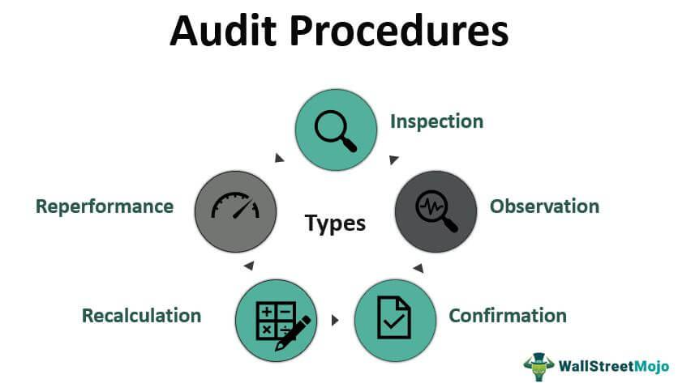

In today's rapidly evolving financial landscape, ensuring compliance, transparency, and accountability is essential for organizations. Audits play a crucial role in verifying the accuracy of financial statements and maintaining stakeholder trust. With the increasing complexity of financial transactions and the globalization of markets, audits have become even more critical. They help in identifying discrepancies, ensuring legal compliance, and providing assurance to investors and regulators that an organization's financial practices adhere to established standards.

Algorithmic trading, or algo trading, represents a significant transformation in financial markets, allowing for automated and high-frequency trades. This sophisticated form of trading involves the use of complex algorithms to execute trades at speeds and frequencies beyond human capability. Algo trading has brought about unprecedented efficiency and liquidity in financial markets, yet it also introduces new challenges related to oversight and regulation. The intricate algorithms and high-speed transactions demand heightened scrutiny to ensure they are not only effective but also fair and compliant with financial regulations.



This article explores the interconnected roles of various audit types and algo trading, emphasizing procedures that ensure regulatory compliance and optimal trading strategies. As automated trading becomes increasingly common, understanding the ways to audit these systems is paramount for maintaining market integrity and protection against fraudulent activities. The integration of audits in algorithmic trading environments helps in providing transparency, securing investor interests, and supporting the stability of the financial system.

Understanding these concepts is vital for both financial professionals and businesses to operate effectively in the market. Professionals equipped with the knowledge of audit practices in the context of contemporary trading technologies can better navigate the complexities of today's financial environment. This understanding is crucial for making informed decisions, optimizing operational efficiencies, and sustaining long-term business success. By embracing these practices, businesses can enhance their competitive edge while fulfilling their ethical and regulatory obligations to stakeholders.

## Table of Contents

## What is an Office Audit?

An office audit is a meticulous review of a taxpayer's financial records conducted by the Internal Revenue Service (IRS) from its office premises. Unlike correspondence audits, which are primarily conducted through mail and focus on less complex issues, an office audit often addresses more specific and intricate concerns that the IRS identifies during its initial review of a tax return. This type of audit acts as an intermediary between the less intensive correspondence audits and the more intrusive field audits, where IRS agents visit the taxpayer's business or home.

The primary goal of an office audit is to ensure that taxpayers are reporting their income, expenses, and deductions correctly, in strict alignment with prevailing tax laws. During an office audit, taxpayers may be required to appear in person and present a variety of financial documents, such as receipts, bank statements, and other records that can substantiate the claims made on their tax returns.

By undertaking office audits, the IRS seeks to maintain a level of accountability and compliance among taxpayers. These audits serve as a vital tool in assuring that taxpayer submissions are accurate and that any discrepancies are addressed. Furthermore, office audits contribute to a broader understanding of IRS procedures and the importance of maintaining detailed financial records for tax reporting. They provide valuable insights into the intricacies of tax compliance, highlighting the necessity for individuals and businesses to adhere meticulously to reporting guidelines to avoid potential penalties or further scrutiny.

## Types of Audits

Audits are integral to ensuring compliance and accuracy in financial and tax reporting. They can be primarily categorized into three types: correspondence audits, office audits, and field audits.

**Correspondence Audits:**
These audits are the most common and are typically conducted through mail. They are used for less complex issues, where the Internal Revenue Service (IRS) requires clarification or additional information regarding specific items on a tax return. Correspondence audits are efficient and cost-effective, allowing the IRS to address minor discrepancies without the need for face-to-face meetings. Taxpayers are usually asked to mail in forms or receipts to verify claims made in their tax returns.

**Office Audits:**
These audits are more detailed than correspondence audits and take place at an IRS office. Office audits often focus on specific issues that require more in-depth examination than a correspondence audit can provide. Taxpayers are requested to bring in documents and records for review. The focus is usually on issues such as income discrepancies or questionable deductions. By addressing the audit in person, taxpayers have the opportunity to explain and clarify their financial matters directly with the IRS agent.

**Field Audits:**
Field audits are the most comprehensive type of audit conducted by the IRS. These involve IRS [agents](/wiki/agents) visiting the taxpayer's home, place of business, or the office of their tax preparer. Field audits are generally reserved for cases that involve complex financial circumstances or when significant discrepancies need thorough evaluation. This type of audit allows for a detailed examination of a taxpayer's records and business operations. Field audits require significant preparation, as they entail a comprehensive review of financial statements, transactions, and business practices.

Understanding these audit types is essential for taxpayers, as it aids in preparing for potential IRS inquiries. Maintaining accurate tax records and being aware of the specific requirements of each audit type can ease the process and ensure compliance with tax regulations.

## Audit Procedures in Algo Trading

Algorithmic trading necessitates the implementation of comprehensive audit procedures to maintain transparency and accountability in executing high-frequency transactions. The meticulousness of these audit procedures ensures that the complex algorithms used in trading function correctly and remain compliant with existing legal and regulatory frameworks.

Internal and external audits are integral components of the auditing process in [algorithmic trading](/wiki/algorithmic-trading). Internal audits, conducted by the organization itself, focus on verifying that the algorithms operate as expected and that their implementation aligns with the firm’s trading strategy and policies. These audits involve rigorous testing of the algorithms under various market conditions to validate their performance and adherence to internal risk management protocols. External audits, on the other hand, are performed by independent third parties to provide an unbiased assessment of the algorithm’s compliance with industry standards and legal regulations. This external verification serves as a check against internal procedures, ensuring that the firm meets all required legal and ethical standards.

Compliance audits are specifically designed to ensure that algorithmic trading activities adhere to regulations set forth by financial authorities, such as the U.S. Securities and Exchange Commission (SEC) and other international regulatory bodies. These audits assess whether trading practices comply with relevant laws regarding market manipulation, insider trading, and fair access to market information. Compliance audits are critical in maintaining the integrity of financial markets, as they help identify and rectify potential violations before they escalate.

Operational audits focus on evaluating the efficiency and effectiveness of trading operations. The high-frequency nature of algorithmic trading demands robust systems to manage and process significant volumes of data quickly. Operational audits examine the processes that support trading activities, such as data handling, execution speed, and system reliability. They help identify operational weaknesses or bottlenecks that could lead to errors or fraudulent activities. By continuously monitoring and upgrading trading systems, operational audits ensure that an organization can respond effectively to changes in market conditions, thereby minimizing risks associated with algorithmic trading.

In conclusion, implementing a rigorous audit framework within algorithmic trading environments is crucial for compliance, operational efficiency, and market integrity. Organizations that conduct thorough internal, external, compliance, and operational audits position themselves to mitigate risks and capitalize on the opportunities presented by algorithmic trading.

## Examples of Audit Trails in Algorithmic Trading

Audit trails play a critical role in algorithmic trading systems, providing a transparent and accountable framework by meticulously documenting all actions, decisions, and changes within the trading environment. These trails are essential for maintaining the integrity of trading operations and for ensuring compliance with regulatory standards.

**Trade Execution Logs:** Trade execution logs capture detailed information on every transaction executed by the trading algorithm. These logs include data such as the time of trade, the order type (e.g., market, limit), executed price, quantity, and any identifiers linking the trade to a specific strategy or algorithm version. This information is vital for post-trade analysis and for resolving disputes regarding trade execution. For example, a Python snippet to log trade executions might look like this:

```python
import logging

# Setting up basic configuration for logging
logging.basicConfig(filename='trade_execution.log', level=logging.INFO, format='%(asctime)s - %(message)s')

def log_trade_execution(order_id, order_type, executed_price, quantity):
    logging.info(f"Order ID: {order_id}, Order Type: {order_type}, Executed Price: {executed_price}, Quantity: {quantity}")

# Example trade execution log
log_trade_execution('ORD1234', 'Market', 100.5, 150)
```

**Algorithm Modification Records:** Continual adaptation and fine-tuning of trading algorithms are necessary due to rapidly changing market conditions. Algorithm modification records maintain a detailed history of changes, including who made the changes, the rationale behind the updates, and the time and date of implementation. This is crucial for tracing any performance issues or anomalies back to specific modifications. These records often involve version control systems to manage the algorithm's development lifecycle effectively.

**Market Data Logs:** Market data logs are integral for ensuring the data's reliability and integrity used in trading decisions. These logs store time-stamped data reflecting the market conditions when trades were executed, helping traders and auditors verify that the trading strategy's decisions were based on accurate and timely information. Ensuring the quality of this data is crucial, as it directly impacts the decision-making processes. Typical components of market data logs include bid/ask prices, trade volumes, and timestamps.

The implementation of sophisticated audit trails ensures comprehensive monitoring and evaluation of algorithmic trading systems, which helps in pinpointing the source of any errors or unusual trading activity. Such robust mechanisms are increasingly important in a landscape where a single erroneous trade due to a flawed algorithm might lead to significant financial repercussions. Therefore, maintaining detailed and accurate audit trails not only aids in compliance and risk management but also fosters a culture of accountability and continuous improvement within trading organizations.

## Challenges and Best Practices

Algorithmic trading presents unique challenges due to the high [volume](/wiki/volume-trading-strategy) and rapid pace at which data is generated, processed, and acted upon. One of the primary issues is managing this data efficiently. To handle the vast quantities of data produced in real-time trading environments, businesses must employ advanced data management tools and strategies.

Best practices in algorithmic trading involve the automation of data capture and analysis. Automating these processes reduces the risk of human error and ensures that data is collected systematically and consistently. Regular audits are vital to verify that trading systems comply with regulatory standards and function correctly. These audits should include both internal checks and external evaluations to provide comprehensive oversight.

Robust cybersecurity measures are imperative to protect sensitive trading data and algorithms. Given the competitive nature of trading, ensuring the security of proprietary algorithms and client data is crucial. Implementing firewalls, encryption, and regular security audits can help mitigate the risk of data breaches or cyberattacks.

Advanced analytical tools, such as [machine learning](/wiki/machine-learning) algorithms, play a crucial role in managing and interpreting large datasets. Machine learning can optimize trading strategies by identifying patterns and anomalies in market data that are not immediately obvious through traditional analysis methods. These tools can enhance decision-making processes, allowing traders to execute more informed and strategic trades.

Continuous monitoring and refinement of audit processes are necessary to keep pace with the dynamic trading environment. This includes updating auditing techniques and standards as technologies evolve. Regular updates and improvements help ensure that trading practices remain compliant and that any potential discrepancies are promptly identified and rectified.

In summary, addressing the challenges in algorithmic trading requires a multifaceted approach combining data automation, rigorous auditing, strong cybersecurity, and advanced analytical methodologies. By adopting these best practices, organizations can improve their trading performance and maintain regulatory compliance.

## Conclusion

Effective auditing is integral to maintaining compliance and transparency across both tax and trading practices. In the financial sector, the accuracy of data is paramount. Audit procedures in algorithmic trading are designed to prevent financial discrepancies and ensure the integrity of the market. By utilizing robust audit mechanisms, such as comprehensive audit trails, traders and organizations can gain precise insights into their transactions, encompassing everything from trade execution logs to algorithm modification records.

These audit trails serve not just for compliance purposes but also as tools to optimize operations. By analyzing the data captured through regular audits, organizations can identify inefficiencies, enhance trading strategies, and preemptively manage risks. This process not only strengthens the organization's position in the market but also supports a stable and transparent marketplace for all participants. 

Incorporating advanced technological solutions like machine learning and big data analytics further bolsters the efficacy of auditing practices. Such technologies facilitate the analysis of vast datasets, optimizing trading strategies and enhancing the detection of anomalies. Cybersecurity measures are also crucial to protect sensitive data and maintain the trust of stakeholders.

Ultimately, a clear understanding and application of rigorous auditing practices are essential to achieve financial success and sustainability. These practices build a foundation of trust, allowing businesses to thrive in a competitive landscape and reinforcing the integrity and stability of financial markets.

## References & Further Reading

[1]: [Bergstra, J., Bardenet, R., Bengio, Y., & Kégl, B. (2011). "Algorithms for Hyper-Parameter Optimization."](https://dl.acm.org/doi/10.5555/2986459.2986743) Advances in Neural Information Processing Systems 24.

[2]: [Lopez de Prado, M. (2018). "Advances in Financial Machine Learning."](https://www.amazon.com/Advances-Financial-Machine-Learning-Marcos/dp/1119482089) John Wiley & Sons.

[3]: [Aronson, D. R. (2006). "Evidence-Based Technical Analysis: Applying the Scientific Method and Statistical Inference to Trading Signals."](https://www.amazon.com/Evidence-Based-Technical-Analysis-Scientific-Statistical/dp/0470008741) John Wiley & Sons.

[4]: [Jansen, S. (2020). "Machine Learning for Algorithmic Trading."](https://github.com/stefan-jansen/machine-learning-for-trading) Packt Publishing.

[5]: [Chan, E. P. (2008). "Quantitative Trading: How to Build Your Own Algorithmic Trading Business."](https://github.com/ftvision/quant_trading_echan_book) John Wiley & Sons.