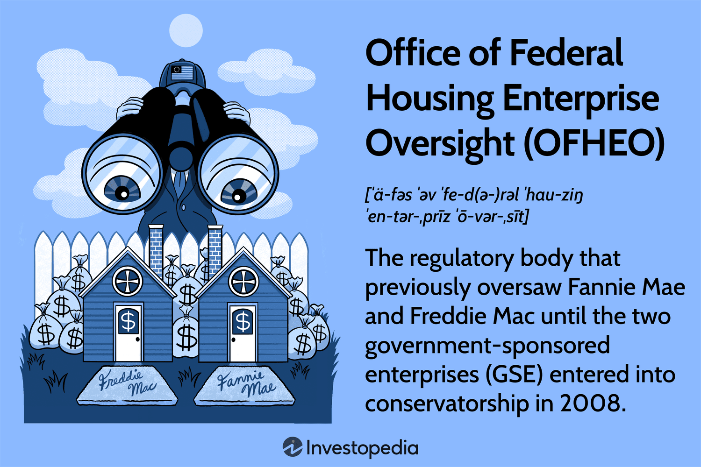

## Table of Contents

## What is the Office of Federal Housing Enterprise Oversight (OFHEO)?

The Office of Federal Housing Enterprise Oversight (OFHEO) was a U.S. government agency. It was created to make sure that two big companies, Fannie Mae and Freddie Mac, were safe and sound. These companies help people buy homes by buying and guaranteeing mortgages. OFHEO's job was to watch over these companies and make sure they followed the rules.

OFHEO was set up in 1992. It had the power to check on Fannie Mae and Freddie Mac, and if needed, it could take action to fix any problems. This was important because these companies were very big and if they had problems, it could affect the whole housing market. In 2008, OFHEO was replaced by a new agency called the Federal Housing Finance Agency (FHFA), which took over its duties and more.

## When was OFHEO established?

OFHEO was established in 1992. It was a part of the U.S. government. Its main job was to watch over two big companies, Fannie Mae and Freddie Mac. These companies help people buy homes by dealing with mortgages.

OFHEO made sure that Fannie Mae and Freddie Mac were safe and followed the rules. This was important because these companies were very big. If they had problems, it could affect the whole housing market. In 2008, OFHEO was replaced by a new agency called the Federal Housing Finance Agency (FHFA).

## What is the main purpose of OFHEO?

The main purpose of the Office of Federal Housing Enterprise Oversight (OFHEO) was to make sure that two big companies, Fannie Mae and Freddie Mac, were safe and sound. These companies help people buy homes by buying and guaranteeing mortgages. OFHEO's job was to watch over these companies and make sure they followed the rules. This was important because these companies were very big and if they had problems, it could affect the whole housing market.

OFHEO was set up in 1992. It had the power to check on Fannie Mae and Freddie Mac, and if needed, it could take action to fix any problems. This oversight was crucial to maintain stability in the housing finance system. In 2008, OFHEO was replaced by a new agency called the Federal Housing Finance Agency (FHFA), which took over its duties and more.

## Which organizations does OFHEO oversee?

The Office of Federal Housing Enterprise Oversight (OFHEO) was in charge of watching over two big companies, Fannie Mae and Freddie Mac. These companies help people buy homes by buying and guaranteeing mortgages. OFHEO's job was to make sure that Fannie Mae and Freddie Mac were safe and followed the rules.

OFHEO was set up in 1992. It had the power to check on these companies and, if needed, take action to fix any problems. This was important because Fannie Mae and Freddie Mac were very big. If they had problems, it could affect the whole housing market.

In 2008, OFHEO was replaced by a new agency called the Federal Housing Finance Agency (FHFA). The FHFA took over the duties of OFHEO and more.

## How does OFHEO regulate the housing enterprises it oversees?

The Office of Federal Housing Enterprise Oversight (OFHEO) regulates the housing enterprises, Fannie Mae and Freddie Mac, by keeping a close watch on them. It checks to make sure these companies are safe and sound. OFHEO does this by looking at their financial reports and other important information. If OFHEO sees any problems, it can step in and tell the companies what they need to do to fix things.

OFHEO also makes rules that Fannie Mae and Freddie Mac have to follow. These rules help make sure the companies are doing their jobs the right way and not taking too many risks. By setting these rules and watching over the companies, OFHEO helps keep the housing market stable. This is important because if Fannie Mae and Freddie Mac have big problems, it could affect a lot of people who are trying to buy homes.

## What are some key responsibilities of OFHEO?

The Office of Federal Housing Enterprise Oversight (OFHEO) had the important job of making sure that Fannie Mae and Freddie Mac were safe and sound. These two big companies help people buy homes by buying and guaranteeing mortgages. OFHEO's main responsibility was to watch over these companies and check their financial reports and other important information. If OFHEO found any problems, it could step in and tell the companies what they needed to do to fix things.

OFHEO also had the responsibility of making rules that Fannie Mae and Freddie Mac had to follow. These rules were important to make sure the companies were doing their jobs the right way and not taking too many risks. By setting these rules and keeping a close eye on the companies, OFHEO helped keep the housing market stable. This was crucial because if Fannie Mae and Freddie Mac had big problems, it could affect a lot of people trying to buy homes.

## How does OFHEO ensure the safety and soundness of the housing enterprises?

The Office of Federal Housing Enterprise Oversight (OFHEO) makes sure that Fannie Mae and Freddie Mac are safe and sound by watching them closely. OFHEO looks at their financial reports and other important information to see if everything is okay. If OFHEO finds any problems, it can step in and tell the companies what they need to do to fix things. This helps make sure that the companies are doing their jobs the right way and not taking too many risks.

OFHEO also sets rules that Fannie Mae and Freddie Mac have to follow. These rules help keep the companies safe and make sure they are doing what they are supposed to do. By making these rules and watching over the companies, OFHEO helps keep the housing market stable. This is important because if Fannie Mae and Freddie Mac have big problems, it could affect a lot of people who are trying to buy homes.

## What are some significant actions taken by OFHEO in its history?

OFHEO took some important steps during its time. One big action was in 2003 when OFHEO found out that Fannie Mae was not following the rules properly. They were making mistakes in their financial reports. OFHEO made Fannie Mae fix these mistakes and also made them pay a big fine. This was important because it showed that OFHEO was serious about making sure the companies followed the rules.

Another big action happened in 2004. OFHEO found out that Freddie Mac was also not following the rules correctly. They had problems with their financial reports too. OFHEO stepped in and made Freddie Mac fix these problems. They also had to pay a fine. These actions by OFHEO helped make sure that Fannie Mae and Freddie Mac were doing their jobs the right way and keeping the housing market safe.

## How has the role of OFHEO evolved over time?

The Office of Federal Housing Enterprise Oversight (OFHEO) was created in 1992 to watch over two big companies, Fannie Mae and Freddie Mac. These companies help people buy homes by buying and guaranteeing mortgages. OFHEO's main job was to make sure these companies were safe and sound. It did this by checking their financial reports and making rules for them to follow. If OFHEO found any problems, it could step in and tell the companies how to fix things. This was important because if Fannie Mae and Freddie Mac had big problems, it could affect the whole housing market.

Over time, OFHEO took some important actions. In 2003, it found out that Fannie Mae was not following the rules properly and had mistakes in its financial reports. OFHEO made Fannie Mae fix these mistakes and pay a fine. The next year, in 2004, OFHEO found similar problems with Freddie Mac. It made Freddie Mac fix its financial reports and also pay a fine. These actions showed that OFHEO was serious about making sure the companies followed the rules. In 2008, OFHEO was replaced by a new agency called the Federal Housing Finance Agency (FHFA). The FHFA took over OFHEO's duties and added more responsibilities to help keep the housing market stable.

## What are the challenges faced by OFHEO in regulating housing enterprises?

OFHEO faced some big challenges in watching over Fannie Mae and Freddie Mac. These companies were very big and important in the housing market. They had a lot of money and power, so it was hard for OFHEO to make sure they followed all the rules. Sometimes, the companies would make mistakes in their financial reports, which made it tough for OFHEO to see if they were safe and sound. OFHEO had to be very careful and thorough in checking everything to make sure the companies were doing things the right way.

Another challenge was that the housing market could change a lot. When the market was doing well, Fannie Mae and Freddie Mac might take more risks to make more money. This made it harder for OFHEO to keep them safe. If the market went down, these risks could cause big problems. OFHEO had to keep a close eye on the companies and be ready to step in if needed. This was a big job because any mistakes could affect a lot of people trying to buy homes.

## How does OFHEO interact with other federal agencies?

OFHEO worked with other federal agencies to make sure Fannie Mae and Freddie Mac were safe and sound. One important agency it worked with was the Department of Housing and Urban Development (HUD). HUD helps people find homes and makes rules about housing. OFHEO and HUD would share information to make sure the housing market was stable. They would talk about any problems they saw and work together to fix them. This was important because if Fannie Mae and Freddie Mac had big problems, it could affect a lot of people trying to buy homes.

OFHEO also worked with the Federal Reserve. The Federal Reserve helps control the country's money and makes sure the economy is stable. OFHEO would share information with the Federal Reserve about how Fannie Mae and Freddie Mac were doing. This helped the Federal Reserve understand the housing market better and make good decisions. By working together, these agencies could help keep the housing market safe and make sure people could buy homes without big problems.

## What was the impact of the Housing and Economic Recovery Act of 2008 on OFHEO?

The Housing and Economic Recovery Act of 2008 had a big impact on OFHEO. This law changed things a lot for OFHEO. It made a new agency called the Federal Housing Finance Agency (FHFA). The FHFA took over all the jobs that OFHEO used to do. This meant that OFHEO was no longer in charge of watching over Fannie Mae and Freddie Mac. The FHFA got more power and more responsibilities to help keep the housing market safe.

The change was important because it happened during a time when the housing market was having big problems. The new FHFA was set up to be stronger and better at watching over Fannie Mae and Freddie Mac. This was meant to help fix the problems in the housing market and make sure things were more stable. So, the Housing and Economic Recovery Act of 2008 ended OFHEO and started a new chapter with the FHFA.

## References & Further Reading

[1]: Frame, W. S., Fuster, A., Tracy, J., & Vickery, J. I. (2015). ["The Rescue of Fannie Mae and Freddie Mac."](https://www.aeaweb.org/articles?id=10.1257/jep.29.2.25) Federal Reserve Finance and Economics Discussion Series.

[2]: Hendershott, T., Jones, C. M., & Menkveld, A. J. (2011). ["Does Algorithmic Trading Improve Liquidity?"](https://onlinelibrary.wiley.com/doi/full/10.1111/j.1540-6261.2010.01624.x) The Journal of Finance, 66(1), 1-33.

[3]: Marcos López de Prado (2018). ["Advances in Financial Machine Learning."](https://www.amazon.com/Advances-Financial-Machine-Learning-Marcos/dp/1119482089) John Wiley & Sons.

[4]: Patton, A. J., & Verardo, M. (2012). ["Does Algorithmic Trading Alleviate Information Asymmetry in Banking?"](https://papers.ssrn.com/sol3/papers.cfm?abstract_id=1361813) Review of Financial Studies, 25(4), 1195-1234.

[5]: ["Algorithmic Trading and Direct Market Access Services"](https://www.daytrading.com/direct-market-access-dma) by The Technical Committee of the International Organization of Securities Commissions (IOSCO).