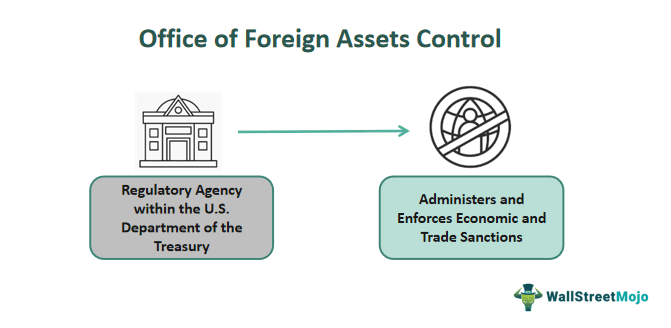

In today's globalized economy, the convergence of financial regulations, foreign policy, and technological innovation is increasingly significant. The Office of Foreign Assets Control (OFAC) serves as a central figure in this dynamic landscape by enforcing U.S. sanctions that have substantial effects on foreign assets and algorithmic trading. Understanding the role of OFAC is essential for financial professionals and investors engaged in automated trading and global market operations.

OFAC, a department of the U.S. Treasury, is tasked with implementing and overseeing economic and trade sanctions. These sanctions target foreign nations, entities, and individuals that threaten U.S. national security and economic interests. By freezing assets, restricting trade, and prohibiting certain financial transactions, OFAC wields considerable influence over various economic sectors, including finance.



Algorithmic trading, characterized by the use of automated systems to execute trades based on predefined criteria, is particularly affected by these regulations. As the financial industry adapts to rapid technological advancements, the implementation of sanctions introduces new challenges and complexities for those involved in algorithmic trading. Traders must navigate these regulatory waters carefully to ensure compliance and avoid potential penalties while still capitalizing on market opportunities.

This article explores the intricate relationship between OFAC sanctions, foreign asset control, and their impact on algorithmic trading strategies. By examining key concepts, regulatory frameworks, and practical implications, the article aims to equip financial professionals with the knowledge needed to navigate this complex regulatory landscape. Understanding these dynamics not only protects financial interests but also contributes to the stability and integrity of the international financial system. As the global economy continues to evolve, the importance of remaining vigilant and proactive in compliance efforts cannot be overstated.

## Table of Contents

## Understanding OFAC and Its Role

The Office of Foreign Assets Control (OFAC) is a pivotal agency within the U.S. Department of the Treasury, tasked with implementing and enforcing economic and trade sanctions that safeguard U.S. national security and promote foreign policy objectives. Its operations are integral to the regulation of foreign assets and financial transactions involving designated foreign entities that pose perceived threats to the stability and security of the United States.

OFAC's authority to impose sanctions derives from several legal sources, primarily congressional legislation and the President's emergency powers. Legislative acts such as the International Emergency Economic Powers Act (IEEPA) and the Trading with the Enemy Act (TWEA) permit the President and subsequently OFAC to regulate commerce in cases of unusual or extraordinary threats. These legal frameworks empower OFAC to act decisively in freezing assets, restricting trade, and prohibiting specific financial transactions involving targeted countries, organizations, or individuals.

These enforcement measures have a significant impact across various economic sectors, most notably in finance. By freezing assets, OFAC restricts access to funds that could otherwise be used to support illicit activities or entities inconsistent with U.S. interests. Trade restrictions and prohibitions on financial transactions can disrupt market dynamics, affecting [liquidity](/wiki/liquidity-risk-premium) and the valuation of assets linked to sanctioned entities. This can create a ripple effect, influencing market participants including investors, financial institutions, and businesses engaged in international commerce.

The scope and reach of OFAC's measures necessitate vigilance among those operating in global markets. Financial institutions, in particular, must incorporate comprehensive compliance programs to assess and mitigate potential risks associated with OFAC sanctions. Non-compliance can result in substantial penalties and reputational damage, underscoring the importance of robust systems to ensure adherence to these regulatory requirements.

As the geopolitical landscape evolves, so too does the complexity of enforcing sanctions, requiring OFAC to continuously adapt its strategies and tools. This includes leveraging technology for more efficient tracking and monitoring of illicit financial activities. The globalized nature of contemporary trade and finance means that OFAC's role is more crucial than ever, influencing not just U.S. interests but also contributing to the integrity of international financial systems.

## Sanctions and Foreign Assets Control

Sanctions imposed by the Office of Foreign Assets Control (OFAC) are strategic measures designed to disrupt activities that contravene international norms and to compel entities and nations to adhere to these norms. OFAC's sanctions are a pivotal tool of U.S. foreign policy, aiming to maintain national security and economic stability by targeting individuals, entities, and countries considered threats.

Foreign asset control is a critical component of this process. It encompasses the legal authority to seize or freeze assets owned by foreign individuals or entities under the jurisdiction of the United States. This power is exercised to ensure that assets which could support activities contrary to international law or U.S. interests are restrained and monitored.

The sanctions' impact on financial markets is profound. By restricting the flow of capital, sanctions affect market liquidity, the availability of assets for trade, and the overall value of these assets. Trading volumes may decrease as uncertainty and risk perceptions rise among investors and financial institutions. 

Entities that fall under OFAC sanctions can encounter serious financial setbacks. They often face impediments in accessing international financial systems, which can cripple their ability to perform even basic financial transactions across borders. This restriction limits their operational capacity and can lead to significant economic strain.

For global investors and financial institutions, such sanctions introduce additional layers of complexity and risk. Investments in sanctioned entities become fraught with legal and financial peril, potentially leading to losses or legal sanctions on the investors themselves. Entities engaged in cross-border transactions must navigate this challenging landscape with care, ensuring compliance to mitigate the associated risks.

In summary, the imposition of sanctions and control over foreign assets by OFAC not only serves as a mechanism to align global activities with international standards but also significantly influences the dynamics of the global financial markets. Understanding these impacts ensures stakeholders can strategically manage risks and maintain operational integrity in their engagements.

## Algorithmic Trading and Regulatory Challenges

Algorithmic trading has increasingly become a cornerstone of modern financial markets. It utilizes automated systems and sophisticated algorithms to execute trades based on predefined criteria, allowing traders to process vast amounts of market data and execute high-frequency trades with speed and precision. These systems, however, are not immune to external influences, particularly the regulatory landscape governed by entities such as the Office of Foreign Assets Control (OFAC).

Sanctions issued by OFAC can substantially affect market dynamics. They introduce [volatility](/wiki/volatility-trading-strategies) and uncertainty, which can disrupt established market trends and subsequently impact [algorithmic trading](/wiki/algorithmic-trading) strategies. Automated trading algorithms must swiftly adapt to these changes to maintain profitability and manage risk, a challenging task given the unpredictable timing and nature of such regulatory interventions.

To remain compliant, traders need to ensure that their algorithms are not executing trades involving sanctioned entities or nations. This requires a robust framework for regular screening of counterparties and transaction activities. Compliance mandates, such as those from OFAC, necessitate continuous monitoring and updates to trading algorithms to mitigate the risks associated with trading under these conditions. Non-compliance can result in penalties, underscoring the critical need for alignment with regulatory requirements.

The primary challenge lies in the real-time adaptation of algorithms to account for the evolving regulatory environment. Employing dynamic programming techniques and real-time data feeds can enable traders to modify algorithmic strategies promptly, thus avoiding prohibited actions. For example, consider an algorithm designed to execute trades based on currency fluctuations:

```python
def execute_trade(market_data, sanctions_list):
    for data in market_data:
        if data['counterparty'] not in sanctions_list:
            # Execute trade logic
            print(f"Executing trade with {data['counterparty']}")
        else:
            print(f"Trade with {data['counterparty']} blocked due to sanctions")

# Example usage
market_data = [{'counterparty': 'EntityA'}, {'counterparty': 'EntityB'}]
sanctions_list = ['EntityB']
execute_trade(market_data, sanctions_list)
```

In the example above, the algorithm evaluates each potential trade against a list of sanctioned entities before execution, allowing it to dynamically adapt to regulatory constraints.

Overall, navigating the challenges posed by OFAC regulations in algorithmic trading requires sophisticated systems capable of rapid analysis and adaptation. Financial institutions must invest in technological solutions that offer real-time compliance capabilities to safeguard against the complex and shifting global regulatory environment.

## Case Studies and Real-World Implications

Recent sanctions targeting Russia have underscored the intricacies involved in managing financial transactions amidst a heavily sanctioned environment. The imposition of these sanctions has disrupted traditional financial channels, prompting a reevaluation of risk assessments and compliance protocols in financial markets.

**Digital Assets and Cryptocurrencies**

The proliferation of digital assets and cryptocurrencies has introduced additional layers of complexity for regulators and financial institutions aiming to enforce sanctions effectively. Cryptocurrencies, due to their decentralized nature, provide alternative avenues for evading sanctions. This poses significant challenges for entities like the Office of Foreign Assets Control (OFAC), which must innovate in regulatory strategies to manage these non-traditional assets. Blockchain technology, while transparent in nature, can obscure the identities involved in transactions, necessitating advanced analytical tools to trace illicit activities.

**Algorithmic Trading and Compliance Risks**

Instances of algorithmic traders unwittingly engaging with sanctioned entities have highlighted the critical need for robust compliance frameworks. Algorithmic trading systems, which automatically execute trades based on specific criteria, may inadvertently interact with entities or assets subject to sanctions. This potential for unintentional breaches emphasizes the necessity for rigorous screening processes and real-time monitoring systems that can integrate updated regulatory information into trading algorithms.

**Financial and Legal Repercussions**

Failure to comply with OFAC regulations, particularly in the context of algorithmic trading, can result in substantial financial and legal consequences. Penalties may include hefty fines and sanctions against the trading firm, as well as reputational damage that can have long-term effects on business operations. Legal ramifications can further extend to individual accountability, with traders and compliance officers facing personal liability for lapses in adherence to regulatory mandates.

**Conclusion**

These case studies demonstrate the pressing need for financial institutions and traders to enhance their compliance structures, especially when navigating global financial markets influenced by stringent sanctions. Implementing state-of-the-art technological solutions, alongside continuous monitoring and evaluation, can help mitigate the risks associated with dynamic sanction landscapes. As digital assets continue to evolve, regulatory frameworks must adapt proportionally to safeguard the integrity of international financial systems.

## Best Practices for Compliance

To effectively navigate the complex regulatory landscape shaped by the Office of Foreign Assets Control (OFAC) sanctions, financial institutions and algorithmic traders must adopt comprehensive compliance programs. These programs should incorporate real-time monitoring of trades and counterparties to ensure adherence to the latest regulatory requirements and mitigate potential risks associated with sanctioned entities.

One of the most effective approaches is the utilization of advanced technologies such as [machine learning](/wiki/machine-learning). Machine learning algorithms can analyze vast amounts of data to identify patterns, predict regulatory changes, and adapt trading algorithms accordingly. This adaptability is essential in maintaining compliance in the face of evolving sanctions. For instance, machine learning models can be trained to recognize transactions involving sanctioned entities by analyzing historical transaction data and identifying anomalies as they occur.

Here's a simple Python example using a machine learning library like scikit-learn to predict the likelihood of a transaction involving a sanctioned entity:

```python
from sklearn.model_selection import train_test_split
from sklearn.ensemble import RandomForestClassifier
from sklearn.metrics import accuracy_score

# Example data: transactions with features and labels (0 = compliant, 1 = sanctioned)
transactions_data = ...  # load your dataset here
features = transactions_data.drop('sanctioned', axis=1)
labels = transactions_data['sanctioned']

# Split the data
X_train, X_test, y_train, y_test = train_test_split(features, labels, test_size=0.2, random_state=42)

# Train a Random Forest model
model = RandomForestClassifier()
model.fit(X_train, y_train)

# Predict and evaluate the model
predictions = model.predict(X_test)
accuracy = accuracy_score(y_test, predictions)
print(f"Model Accuracy: {accuracy * 100:.2f}%")
```

Implementing regular training and updates for trading professionals is another critical aspect. This ensures that all individuals involved in the trading process are aware of the latest sanctions and compliance protocols. Continuous education helps maintain a culture of compliance within the organization, reducing the likelihood of inadvertent violations.

Collaboration between compliance departments and algorithm developers is equally vital. Working together, these teams can ensure that the algorithms used for trading are designed with compliance considerations in mind. This collaborative approach can help integrate compliance checks directly into trading systems, making it easier to identify and respond to potential issues.

By adopting these best practices, organizations can better manage the risks associated with algorithmic trading in a regulated environment, thus protecting their financial interests and maintaining compliance with OFAC sanctions.

## Conclusion

The intersection of OFAC sanctions, foreign assets control, and algorithmic trading represents a multifaceted regulatory environment that challenges financial professionals globally. The intricate relationship among these elements necessitates that professionals remain vigilant and proactive to ensure compliance, as failing to do so can have severe financial and reputational repercussions.

Sanctions are inherently dynamic, reflecting geopolitical changes and policy shifts. This fluidity demands continuous adaptation and innovation within the financial industry. As sanctions evolve, financial institutions and traders must recalibrate their strategies and tools to accommodate new regulations, ensuring their operations remain lawful and efficient. 

Understanding these challenges not only protects financial assets but also upholds the integrity of international financial systems. By adhering to regulations, financial professionals contribute to global efforts aimed at maintaining stability and transparency across financial markets. This commitment to integrity is crucial, as violations can lead to penalties and erode trust in financial institutions.

In the modern financial landscape, advanced technologies play an increasingly significant role in ensuring compliance. The integration of machine learning and [artificial intelligence](/wiki/ai-artificial-intelligence) in compliance systems allows for enhanced monitoring and real-time response to regulatory changes. These technologies can analyze vast amounts of data, predict potential risks, and suggest adjustments to trading algorithms, thereby maintaining compliance and optimizing trading strategies.

Professionals equipped with robust technological tools and a deep understanding of the regulatory landscape are better positioned to navigate the complexities of OFAC sanctions and foreign assets control. As the global economy continues to grow and evolve, the importance of integrating advanced technologies into compliance efforts will only increase, making them indispensable to the financial industry's future.

## References & Further Reading

[1]: Hufbauer, G. C., Schott, J. J., Elliott, K. A., & Oegg, B. (2007). ["Economic Sanctions Reconsidered."](https://www.sciencedirect.com/science/article/abs/pii/S0022199608000597) Peterson Institute for International Economics.

[2]: Earnest, D. C. (2015). ["Institutional Combat: The Legal Threat to Algorithmic Trading."](https://www.tandfonline.com/doi/full/10.1080/19416520.2015.1014661) University of Pennsylvania Law Review, 164, 247-291.

[3]: Alawadhi, A. (2020). ["The Effect of Economic Sanctions on the Financial Markets of Targeted Countries."](https://onlinelibrary.wiley.com/doi/full/10.1111/roie.12724) Journal of Financial Stability, 46, 100713.

[4]: Department of the Treasury. ["OFAC FAQs: Sanctions Compliance."](https://ofac.treasury.gov/faqs) U.S. Department of the Treasury Office of Foreign Assets Control (OFAC).

[5]: Scholnick, D. (2012). ["Algorithmic Trading Compliance Struggles: The Impact of Sanctions on Trading Algorithms."](https://www.researchgate.net/publication/378548435_Algorithmic_Trading_and_AI_A_Review_of_Strategies_and_Market_Impact) Harvard Journal of Law & Technology, 25(1), 215-238.