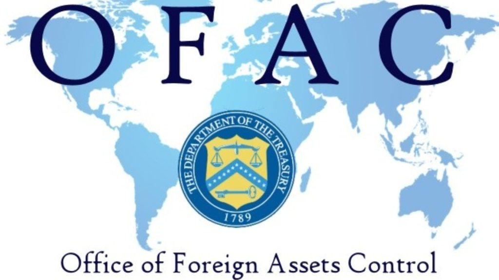

## Table of Contents

## What is the Office of Foreign Assets Control (OFAC)?

The Office of Foreign Assets Control, or OFAC, is a part of the U.S. Department of the Treasury. It is responsible for enforcing economic and trade sanctions against certain countries, groups, and individuals. These sanctions are put in place to help achieve foreign policy and national security goals of the United States.

OFAC's main job is to make sure that people and businesses in the U.S. follow these sanctions. This means they cannot do business with or send money to those who are on OFAC's list of blocked persons. If someone breaks these rules, they can face big fines or even go to jail. OFAC also works to stop money laundering and the funding of terrorism.

## What are sanctions and how do they relate to OFAC?

Sanctions are rules set by a country or group of countries to stop or limit trade and financial dealings with other countries, groups, or people. They are used to make these countries or groups change their behavior, often because of things like human rights abuses or threats to peace. Sanctions can include stopping trade, freezing money, or not allowing travel.

The Office of Foreign Assets Control, or OFAC, is part of the U.S. Treasury Department. OFAC's job is to make sure that people and businesses in the U.S. follow these sanctions. They do this by keeping a list of people and groups that U.S. citizens and companies are not allowed to do business with. If someone breaks these rules, OFAC can give them big fines or even send them to jail. So, OFAC is very important in making sure that the U.S. sanctions work as they should.

## What is the primary purpose of OFAC sanctions?

The main goal of OFAC sanctions is to help the United States achieve its foreign policy and national security goals. These sanctions are used to pressure other countries, groups, or individuals to change their behavior. For example, the U.S. might use sanctions to stop a country from developing nuclear weapons or to punish a group for human rights abuses.

OFAC makes sure that people and businesses in the U.S. follow these sanctions. They do this by keeping a list of people and groups that U.S. citizens and companies are not allowed to do business with. If someone breaks these rules, they can face big fines or even go to jail. This helps make sure that the sanctions work and that the U.S. can reach its goals.

## How does OFAC enforce its sanctions?

OFAC enforces its sanctions by making a list of people, groups, and countries that U.S. citizens and businesses cannot do business with. This list is called the Specially Designated Nationals and Blocked Persons List, or SDN List. If a U.S. person or company does business with anyone on this list, they can get in big trouble. OFAC watches closely to make sure everyone follows the rules. They can check bank records, look at business deals, and even investigate if they think someone might be breaking the sanctions.

If OFAC finds out that someone broke the rules, they can give out big fines or even send people to jail. The fines can be millions of dollars, depending on how bad the violation was. OFAC also works with other parts of the government, like the Department of Justice, to make sure that the sanctions are enforced strongly. By doing all of this, OFAC helps make sure that the U.S. can use sanctions to reach its goals in foreign policy and national security.

## Who must comply with OFAC regulations?

Everyone in the United States must follow OFAC rules. This includes people, businesses, and even banks. If you live in the U.S. or are a U.S. citizen living somewhere else, you have to make sure you do not do business with anyone on OFAC's list of blocked people and groups.

OFAC also has rules for people and businesses outside the U.S. if they use U.S. dollars or the U.S. banking system. This means that even if you are not in the U.S., you might still have to follow OFAC's rules if your money goes through the U.S. in any way. Breaking these rules can lead to big fines or even jail time, so it's important for everyone to know and follow OFAC's regulations.

## What are the different types of sanctions programs administered by OFAC?

OFAC runs many different kinds of sanctions programs. Some of these programs target whole countries, like Cuba, Iran, and North Korea. These country-wide sanctions stop most trade and financial dealings with these places. Other programs focus on specific people or groups, like terrorists or drug traffickers. These targeted sanctions mean that U.S. people and businesses cannot do business with these people or groups, no matter where they are.

OFAC also has sanctions that deal with certain issues, like stopping the spread of weapons or fighting human rights abuses. For example, there are sanctions against people and groups involved in human rights violations in places like Syria and Burma. These sanctions help the U.S. try to make the world a safer and fairer place.

Overall, OFAC's sanctions programs are used to help the U.S. reach its goals in foreign policy and national security. They can be very broad, affecting whole countries, or very specific, targeting just a few people or groups. By using these different kinds of sanctions, OFAC can respond to many different problems around the world.

## How can an individual or entity be added to the OFAC sanctions list?

An individual or entity can be added to the OFAC sanctions list if they are seen as a threat to U.S. national security or foreign policy goals. This decision is usually made by the U.S. government, often after a lot of research and investigation. The reasons for being added to the list can include things like supporting terrorism, being involved in human rights abuses, or helping countries like Iran or North Korea with their nuclear programs.

Once the decision is made, OFAC adds the name to the Specially Designated Nationals and Blocked Persons List, or SDN List. This list is public, so anyone can see it and know who they are not allowed to do business with. Being on this list means that U.S. people and businesses cannot do any deals or send money to the person or group on the list. If someone breaks these rules, they can face big fines or even go to jail.

## What are the penalties for violating OFAC sanctions?

If someone breaks OFAC sanctions, they can get in big trouble. The penalties can be very harsh, including big fines and even jail time. The fines can be millions of dollars, depending on how bad the violation was. For example, if a bank does business with someone on the OFAC list, they might have to pay a huge fine. The exact amount of the fine depends on things like how much money was involved and if the person knew they were breaking the rules.

OFAC works with other parts of the government, like the Department of Justice, to make sure the penalties are strong. If someone is found guilty of breaking OFAC sanctions, they might go to jail. The length of time in jail can vary, but it can be a long time, especially if the violation was very serious. These tough penalties help make sure that people and businesses follow the rules and that the U.S. can use sanctions to reach its goals in foreign policy and national security.

## How can businesses ensure compliance with OFAC regulations?

Businesses can make sure they follow OFAC rules by checking the Specially Designated Nationals and Blocked Persons List, or SDN List, regularly. This list has the names of people and groups that U.S. businesses cannot deal with. By checking this list often, businesses can avoid doing business with anyone on it. They should also have good systems in place to screen customers and business partners. This means using special software that can check names against the SDN List quickly and accurately.

Training employees is also very important. Businesses should teach their workers about OFAC rules and what to do if they think someone might be on the SDN List. This way, everyone knows how to spot and report possible violations. Keeping good records is another key part of staying compliant. Businesses should keep detailed records of all their checks and any reports they make to OFAC. This can help them show that they are trying to follow the rules if OFAC ever investigates them.

## What is the process for obtaining a license from OFAC to engage in transactions that would otherwise be prohibited?

If a business or person wants to do something that OFAC rules say they can't, they need to ask for a special permission called a license. To get this license, they have to fill out an application and send it to OFAC. The application needs to explain why they want to do the transaction and why it should be allowed, even though it's normally against the rules. They might need to include details like who will be involved, how much money is involved, and what the transaction is for.

Once OFAC gets the application, they will look at it carefully. They will think about things like U.S. foreign policy and national security goals. Sometimes, OFAC might ask for more information before they make a decision. If they decide to give a license, they will send it to the person or business, and then the transaction can go ahead. But if they say no, the person or business has to follow the rules and not do the transaction. It's important to apply for a license early because it can take a while for OFAC to make a decision.

## How does OFAC coordinate with other U.S. government agencies and international partners?

OFAC works closely with other parts of the U.S. government to make sure sanctions are strong and work well. They often team up with the Department of State, which helps make foreign policy, and the Department of Justice, which can take people to court if they break the rules. OFAC also shares information with the intelligence community, like the CIA, to find out who should be on the sanctions list. By working together, these agencies help the U.S. reach its goals in keeping the country safe and influencing what happens around the world.

OFAC also works with other countries to make sanctions even more effective. They share information with international partners like the United Nations and the European Union to make sure everyone is on the same page. This teamwork helps stop people and groups from finding ways around the sanctions by moving to a country that isn't following the rules. By working together, OFAC and its partners can make the world safer and push for changes in behavior from those who are causing problems.

## What recent developments or changes have occurred in OFAC's sanction policies and enforcement?

Recently, OFAC has been working to make their sanctions stronger and more focused. They have been adding more names to their list of people and groups that U.S. businesses cannot deal with. This includes people involved in human rights abuses in places like Belarus and Myanmar. OFAC has also been using more technology to watch for violations. They use special computer programs to check bank records and other data to find anyone breaking the rules.

OFAC has also been working more closely with other countries to make their sanctions more effective. They share information with groups like the United Nations and the European Union to make sure everyone is working together. This helps stop people and groups from finding ways around the sanctions by moving to a country that isn't following the rules. By working together, OFAC and its partners can make the world safer and push for changes in behavior from those who are causing problems.

## References & Further Reading

[1]: Hufbauer, G. C., Schott, J. J., Elliott, K. A., & Oegg, B. (2007). ["Economic Sanctions Reconsidered."](https://www.sciencedirect.com/science/article/abs/pii/S0022199608000597) Peterson Institute for International Economics.

[2]: Earnest, D. C. (2015). ["Institutional Combat: The Legal Threat to Algorithmic Trading."](https://www.tandfonline.com/doi/full/10.1080/19416520.2015.1014661) University of Pennsylvania Law Review, 164, 247-291.

[3]: Alawadhi, A. (2020). ["The Effect of Economic Sanctions on the Financial Markets of Targeted Countries."](https://onlinelibrary.wiley.com/doi/full/10.1111/roie.12724) Journal of Financial Stability, 46, 100713.

[4]: Department of the Treasury. ["OFAC FAQs: Sanctions Compliance."](https://ofac.treasury.gov/faqs) U.S. Department of the Treasury Office of Foreign Assets Control (OFAC).

[5]: Scholnick, D. (2012). ["Algorithmic Trading Compliance Struggles: The Impact of Sanctions on Trading Algorithms."](https://www.researchgate.net/publication/378548435_Algorithmic_Trading_and_AI_A_Review_of_Strategies_and_Market_Impact) Harvard Journal of Law & Technology, 25(1), 215-238.