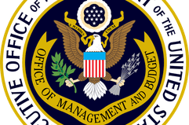

## Table of Contents

## What is the Office of Management and Budget (OMB)?

The Office of Management and Budget (OMB) is a part of the United States government. It helps the President manage the government's money and make sure it is spent wisely. The OMB works with different parts of the government to create a budget plan every year. This plan shows how much money the government will spend and where it will spend it.

The OMB also checks how well government programs are working. It makes sure that the programs are doing what they are supposed to do and are not wasting money. The OMB gives advice to the President on how to make government work better and save money. This helps the President make good decisions about running the country.

## When was the Office of Management and Budget established?

The Office of Management and Budget (OMB) was established in 1921. It started as the Bureau of the Budget, which was part of the Department of the Treasury. The main reason for creating it was to help the President manage the government's money better. Before the OMB, different parts of the government made their own budget plans, which could be confusing and wasteful.

In 1939, the Bureau of the Budget was moved to the Executive Office of the President. This change helped the President have more control over the budget. In 1970, the name was changed to the Office of Management and Budget. This new name showed that the office was not just about making budgets, but also about managing how the government works and making sure it runs smoothly.

## What are the main functions of the OMB?

The Office of Management and Budget (OMB) helps the President manage the government's money. It works with different parts of the government to create a budget plan every year. This plan shows how much money the government will spend and where it will spend it. The OMB makes sure that the money is used in the best way possible. It also looks at how much money the government makes and how it can make more.

The OMB also checks how well government programs are working. It makes sure that the programs are doing what they are supposed to do and are not wasting money. If a program is not working well, the OMB will suggest ways to fix it or even stop it. The OMB gives advice to the President on how to make the government work better and save money. This helps the President make good decisions about running the country.

## Who leads the Office of Management and Budget?

The Office of Management and Budget (OMB) is led by the Director of the OMB. The Director is appointed by the President and confirmed by the Senate. This person is in charge of making sure the government's money is spent wisely and that the budget is managed well.

The Director works closely with the President and other government leaders. They help make the yearly budget plan and check how well government programs are working. The Director also gives advice on how to make the government run better and save money.

## How does the OMB influence federal budgeting?

The Office of Management and Budget (OMB) plays a big role in deciding how the government spends its money. Every year, the OMB works with different parts of the government to make a budget plan. This plan shows how much money the government will spend and where it will spend it. The OMB makes sure that the money is used in the best way possible. It also looks at how much money the government makes and how it can make more. This helps the President and Congress decide on the final budget.

The OMB also checks how well government programs are working. It makes sure that the programs are doing what they are supposed to do and are not wasting money. If a program is not working well, the OMB will suggest ways to fix it or even stop it. This helps the government use its money wisely. By doing all these things, the OMB helps shape the federal budget and makes sure the government runs smoothly.

## What role does the OMB play in federal policy-making?

The Office of Management and Budget (OMB) plays an important role in helping the President make federal policies. The OMB gives advice on how to make government programs work better and how to save money. It looks at how well these programs are doing and suggests ways to improve them. This helps the President decide what policies to support and how to make them work well.

The OMB also works with different parts of the government to make sure that new policies fit well with the budget. It helps make sure that the government has enough money to start new programs or keep old ones going. By doing this, the OMB makes sure that the government's money is used in the best way possible. This helps the President make smart choices about new policies and how to run the country.

## How does the OMB ensure government agencies are accountable?

The Office of Management and Budget (OMB) helps make sure government agencies do their jobs well and use money wisely. The OMB checks how well these agencies are working by looking at their programs and budgets. If an agency is not doing a good job or is wasting money, the OMB will tell them how to fix it. This helps make sure that the agencies are doing what they are supposed to do and are not wasting the government's money.

The OMB also makes sure agencies follow the rules. It sets guidelines that agencies have to follow when they spend money or start new programs. If an agency does not follow these rules, the OMB can make them change what they are doing. By doing all these things, the OMB helps keep government agencies accountable and makes sure they work well for the country.

## What is the relationship between the OMB and the President of the United States?

The Office of Management and Budget (OMB) works closely with the President of the United States. The President picks the Director of the OMB, who then helps the President manage the government's money. The OMB makes a budget plan every year, which shows how much money the government will spend and where it will spend it. The President uses this plan to decide how to run the country and what to spend money on.

The OMB also gives advice to the President on how to make government programs work better and save money. It checks how well these programs are doing and suggests ways to improve them. This helps the President make smart choices about new policies and how to use the government's money wisely. By working together, the OMB and the President make sure the government runs smoothly and uses its money in the best way possible.

## How does the OMB coordinate with other federal agencies?

The Office of Management and Budget (OMB) works with other federal agencies to make sure the government's money is spent wisely. Every year, the OMB asks these agencies to say how much money they need and what they will use it for. The OMB then looks at these plans and makes a big budget for the whole government. This helps the President and Congress decide how to spend the government's money.

The OMB also checks how well the agencies are doing their jobs. It looks at their programs to see if they are working well and not wasting money. If an agency is not doing a good job, the OMB will tell them how to fix it. This helps make sure all parts of the government are working together and using money in the best way possible.

## What are some significant reforms or initiatives led by the OMB?

The Office of Management and Budget (OMB) has led many important changes to make the government work better. One big change was the Government Performance and Results Act (GPRA) in 1993. This law made government agencies set clear goals and check how well they were doing. The OMB helped make sure agencies followed this law and used it to make their programs better. This helped the government spend money more wisely and do a better job for people.

Another important initiative was the Program Assessment Rating Tool (PART) in 2002. The OMB used this tool to look at how well government programs were working. It helped find programs that were not doing well and needed to be fixed or stopped. This made the government more efficient and saved money. The OMB's work on PART showed how it can help make the government run better by checking and improving programs.

## How does the OMB impact the economy through its budgeting decisions?

The Office of Management and Budget (OMB) helps the President decide how to spend the government's money. This can affect the economy because the budget decides how much money goes to different things like schools, roads, and health care. If the OMB decides to spend more money on building roads, it can create jobs and help the economy grow. On the other hand, if the OMB cuts spending in some areas, it might slow down the economy because fewer people will have jobs or money to spend.

The OMB also looks at how well government programs are working and tries to save money. If it finds a program that is not working well, it might suggest stopping it or changing it. This can save money that the government can use for other things. By making these decisions, the OMB helps make sure the government's money is used in the best way possible. This can help keep the economy stable and help it grow in the long run.

## What are the criticisms and controversies surrounding the OMB's operations?

Some people think the Office of Management and Budget (OMB) has too much power. They say the OMB can change or stop new laws before they even start. This happens because the OMB looks at new laws to see if they fit with the budget. If the OMB says no, it can be hard for the new law to go forward. Critics worry that this gives the President too much control over what laws get passed.

Another big criticism is that the OMB can be too political. Some people think the OMB might change budget numbers or program reviews to make the President look good. This can make it hard to trust the OMB's work. Critics say the OMB should be more open about how it makes decisions and should not let politics get in the way of doing its job well.

## References & Further Reading

[1]: Mathias, M. (2015). ["Automated Trading with R: Quantitative Research and Platform Development"](https://link.springer.com/book/10.1007/978-1-4842-2178-5) - Provides insights into creating algorithmic trading strategies using R.

[2]: Hasbrouck, J. (2018). ["The New York Stock Exchange and Flow of Orders"](https://scholar.google.com/citations?user=q9T8XN8AAAAJ) - Discusses the influence of algorithmic trading on liquidity and market stability.

[3]: Aldridge, I. (2013). ["High-Frequency Trading: A Practical Guide to Algorithmic Strategies and Trading Systems"](https://www.wiley.com/en-us/High-Frequency+Trading%3A+A+Practical+Guide+to+Algorithmic+Strategies+and+Trading+Systems%2C+2nd+Edition-p-9781118343500) - Explores practical aspects of high-frequency trading and its regulatory concerns.

[4]: Vance, A. (2015). ["The Flash Boys: A Wall Street Revolt"](https://www.goodreads.com/book/show/24724602-flash-boys) by Michael Lewis - Investigates the impact of high-frequency trading, including events like the 2010 Flash Crash.

[5]: Jones, C. (2019). ["U.S. Securities and Exchange Commission Regulation and Its Implications for High-Frequency Trading"](https://onlinelibrary.wiley.com/doi/full/10.1111/joes.12434) - An overview of SEC regulations concerning high-frequency trading practices.