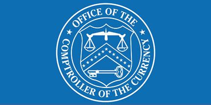

Algorithmic trading has become a fundamental component of the modern financial ecosystem, shaping the way financial markets operate. It involves the use of computer algorithms to execute trades at speeds and volumes far surpassing traditional human capabilities. The primary functionalities of algorithmic trading include high-speed execution, which allows traders to capitalize on fleeting market opportunities, and high-volume automated trades, which enable handling large transactions efficiently without causing significant market disruptions.

In this rapidly evolving environment, government agencies play a crucial role in maintaining financial stability and integrity. Through regulation and oversight, these agencies aim to mitigate systemic risks and ensure fair market practices. Their responsibilities involve setting guidelines, monitoring compliance, and enforcing penalties where necessary, to prevent manipulative practices and protect the interests of investors and the economy at large.

The purpose of this article is to explore how U.S. government agencies oversee banking and regulate financial operations, specifically in the context of algorithmic trading. It will examine the roles and regulations set forth by key institutions, such as the Securities and Exchange Commission (SEC), the Commodity Futures Trading Commission (CFTC), and the Office of the Comptroller of the Currency (OCC). By understanding these regulatory frameworks, we can better appreciate the measures in place to address the implications of algorithmic trading on financial markets.

## Table of Contents

## Role of U.S. Government Agencies in Banking Oversight

The regulation and oversight of the United States financial markets are primarily undertaken by several key government agencies: the Securities and Exchange Commission (SEC), Commodity Futures Trading Commission (CFTC), and Office of the Comptroller of the Currency (OCC). Each plays a distinct yet interrelated role in ensuring the stability, security, and integrity of the financial system, which is increasingly dominated by the complexities of algorithmic trading.

The SEC is responsible for overseeing securities markets and protecting investors through a transparent regulatory framework. Its primary function is to maintain fair, orderly, and efficient markets while facilitating capital formation. The SEC achieves these objectives by enforcing securities laws, conducting market surveillance, and implementing rules that mitigate systemic risks posed by high-frequency and algorithmic trading practices. The agency's regulations aim to ensure transparency and accountability in securities transactions, thereby reinforcing market integrity.

The CFTC, on the other hand, focuses on the oversight of futures and derivatives markets. Its mandate is to foster open, transparent, competitive, and financially sound markets. To this end, the CFTC implements regulatory measures to mitigate risks associated with algorithmic trading in these markets. By establishing rules that govern pre-trade and post-trade activities, the CFTC ensures that futures and derivatives trading operations do not destabilize the financial system. Registration and rigorous recordkeeping requirements for algorithmic traders form a core part of the CFTC's regulatory arsenal to maintain oversight and market safety.

The OCC's role extends to overseeing the integrity and soundness of national banks and federal savings associations. The agency ensures that these institutions adhere to robust risk management practices, particularly concerning [algorithmic trading](/wiki/algorithmic-trading) activities. By evaluating banks' internal controls, model risk management, and governance frameworks, the OCC works to safeguard financial stability. The agency's oversight includes assessing banks' clearing operations and the effectiveness of their risk management strategies, which are critical in managing potential disruptions arising from automated trading systems.

Inter-agency cooperation is essential in managing the risks posed by algorithmic trading. The interconnectedness of global financial markets means that actions by one regulatory agency can have widespread implications. Collaborative efforts among the SEC, CFTC, OCC, and other regulatory bodies enable a comprehensive approach to regulation, harmonizing oversight to mitigate systemic risks. Through shared data, coordinated policies, and joint enforcement actions, these agencies endeavor to maintain a robust financial system that can withstand the challenges of technological advancements and complex trading dynamics.

## Financial Regulation and the SEC

The Securities and Exchange Commission (SEC) plays a pivotal role in regulating the securities markets in the United States, employing a robust framework aimed at enhancing market fairness, efficiency, and transparency. At the heart of this regulatory structure is the SEC's Market Access Rule (Rule 15c3-5), which serves as a critical control mechanism for algorithmic trading. This rule mandates that broker-dealers implement effective risk management controls and supervisory procedures to limit financial and regulatory risks. By requiring pre-trade risk checks and controls, Rule 15c3-5 ensures that orders being entered into the market adhere to stringent financial and regulatory standards, protecting the market from erroneous trades and systemic threats.

Regulation National Market System (NMS) further underscores the SEC's commitment to maintaining fair and efficient markets. Enacted in 2005, Regulation NMS aims to modernize and strengthen the U.S. equity markets, significantly influencing high-frequency trading ([HFT](/wiki/high-frequency-trading-strategies)) practices. This regulatory framework ensures that investors receive the best possible price by requiring that trades be executed at the most favorable prices across all exchanges. This is facilitated through the Order Protection Rule, which prevents trade-throughs—instances where trades are executed at prices inferior to protected quotations. As a result, Regulation NMS has arguably enhanced competition, transparency, and efficiency within the securities market, while also leading to increased fragmentation and the rise of complex trading strategies such as HFT.

The SEC remains steadfast in its mandate to foster fair and efficient markets. This commitment is evident through its advocacy for technological advancements and the establishment of comprehensive risk management guidelines. By promoting technological innovations, the SEC seeks to encourage market participants to leverage advancements that enhance trading capabilities, thus contributing to market efficiency. Simultaneously, the commission’s risk management initiatives focus on identifying, mitigating, and managing the risks associated with algorithmic trading. This dual strategy of embracing technology and enforcing rigorous risk management practices underscores the SEC's proactive approach in safeguarding the financial markets and ensuring their smooth and efficient operation.

## CFTC's Role in Algorithmic Trading Regulation

The Commodity Futures Trading Commission (CFTC) plays a critical role in regulating the futures and derivatives markets in the United States, which are pivotal components of the global financial system. The CFTC's mission involves promoting the integrity, resilience, and vibrancy of the U.S. derivatives markets through sound regulation. With the advent of algorithmic trading, characterized by high-frequency, automated transactions, the CFTC has implemented specific regulations to address the risks and benefits associated with these technological advancements.

Regulation Automated Trading (Reg AT) was proposed by the CFTC to enhance oversight of algorithmic trading. Although it faced challenges and was eventually withdrawn, Reg AT aimed to establish a comprehensive framework for minimizing the risks associated with automated trading. The regulation focused on ensuring that trading algorithms are adequately tested and monitored to prevent market disruptions. Key provisions included requiring traders to implement pre-trade risk controls to avoid erroneous trades that could cause significant market movements and ensuring post-trade transparency to facilitate monitoring by regulatory bodies.

Pre-trade and post-trade risk controls are essential elements outlined by the CFTC for maintaining market stability. Pre-trade controls encompass mechanisms such as maximum order size limits, price reasonability checks, and trading halts to prevent unusual activities. These controls help manage the potential adverse effects of erroneous or manipulative trading activities. Post-trade controls include the requirement for detailed recordkeeping, enabling thorough analysis and tracking of trading activities to detect potential market abuse.

In terms of registration and recordkeeping, the CFTC mandates that entities involved in algorithmic trading must register as market participants, ensuring they adhere to regulatory standards and contribute to market integrity. Recordkeeping requirements oblige algorithmic traders to maintain comprehensive records of their trading activities, which must be readily accessible for regulatory review. This enhances transparency and allows the CFTC to monitor compliance more effectively.

Overall, the CFTC’s regulatory initiatives provide a framework for managing the risks of algorithmic trading while promoting the benefits of speed and efficiency that such technologies offer to futures and derivatives markets. The ongoing evolution of these regulations underscores the importance of balancing innovation with robust oversight to ensure orderly and secure financial markets.

## OCC’s Approach to Risk Management in Algorithmic Trading

The Office of the Comptroller of the Currency (OCC) plays a crucial role in managing risks associated with algorithmic trading by issuing comprehensive guidance on model risk management. The OCC's Model Risk Management Guidance is a cornerstone in ensuring that banks and financial institutions maintain robust risk management practices. This guidance emphasizes the identification, assessment, and management of risks associated with models used in algorithmic trading.

The OCC mandates that banks implement rigorous model validation processes to ensure the accuracy and integrity of algorithmic trading systems. Model validation involves a thorough examination of models to verify their performance, reliability, and compliance with regulatory standards. It includes evaluating the assumptions, limitations, and potential biases of models. This assessment helps institutions to forecast potential losses and operational risks, thereby contributing to a more resilient financial system.

In governance, the OCC outlines the necessity for effective oversight mechanisms to manage algorithmic trading risks effectively. This includes setting up clear policies and procedures for model development, implementation, and review. The OCC requires banks to maintain documentation that supports the rationale for model selection and utilization, thus ensuring accountability and transparency. These oversight mechanisms are crucial in identifying emerging risks and ensuring prompt corrective actions.

Compliance is another critical area highlighted by the OCC to mitigate algorithmic trading risks. Banks are required to establish robust risk oversight frameworks that include stringent compliance protocols. This encompasses internal audits, regular reporting, and real-time monitoring of trading activities to prevent systemic risks and market abuse. Effective compliance mechanisms help institutions align with regulatory expectations and foster a culture of risk awareness and management.

The OCC collaborates with other regulatory bodies such as the Securities and Exchange Commission (SEC) and the Commodity Futures Trading Commission (CFTC) to maintain market integrity. This inter-agency cooperation enhances the sharing of information and best practices, promoting a unified approach to oversight and risk management. By working together, these agencies ensure that algorithmic trading activities are monitored comprehensively, safeguarding the stability and integrity of financial markets.

In conclusion, the OCC’s approach to risk management in algorithmic trading through model risk management guidance, validation, governance, and compliance emphasizes a holistic framework to address the complexities of automated trading. By fostering cooperation with other regulatory entities, the OCC contributes to creating a robust defense against potential issues arising from algorithmic trading, thereby supporting a stable and secure financial ecosystem.

## Compliance and Risk Management Strategies

Compliance and risk management remain central to the successful integration of algorithmic trading within financial markets. Firms engaging in algorithmic trading must adhere to a framework of compliance obligations, ensuring they meet regulatory requirements designed to uphold market integrity and prevent systemic risks.

Key compliance obligations for these firms include mandatory registration and reporting with relevant regulatory authorities such as the Securities and Exchange Commission (SEC) and the Commodity Futures Trading Commission (CFTC). These requirements aim to maintain transparency within the markets and enable monitoring of trading activities. Registration offers a formal record, while reporting ensures continuous oversight, particularly focusing on trades that may influence market stability.

Pre-trade risk controls are essential components in managing the risks associated with algorithmic trading. Implementing maximum order size limits helps to curb excessive speculation and mitigates the potential for market manipulation. These limits ensure that individual trades are kept at levels that do not unduly impact market prices or [liquidity](/wiki/liquidity-risk-premium). Additionally, trading system kill switches offer a critical safety mechanism. In the event of unintended or errant trading behavior, kill switches can halt trading operations instantly, preventing severe market disruption.

Post-trade surveillance is equally vital. It involves the ongoing analysis of executed trades to detect and address market abuse such as spoofing, layering, and other forms of manipulative trading practices. This surveillance is powered by sophisticated algorithms and technologies that can sift through vast amounts of data to identify patterns consistent with regulatory breaches. The deployment of these technologies ensures that firms not only comply with regulatory standards but also maintain the integrity of financial markets.

Governance plays a pivotal role in managing algorithmic trading risks. Strong governance structures involve board oversight and the establishment of internal controls that align with best practice standards. Boards are responsible for setting the firm's risk appetite and ensuring that trading activities conform to this framework. Internal controls, meanwhile, are implemented to monitor trading activities, review model performance, and address any potential anomalies. These controls also safeguard against unauthorized access and operational errors, thereby minimizing the risk exposure from algorithmic trading activities.

In conclusion, compliance and risk management in algorithmic trading necessitate a comprehensive approach involving registration, robust pre-trade and post-trade controls, and effective governance structures. By adhering to these strategies, firms can manage their risk exposure and contribute to the stability and integrity of financial markets.

## Conclusion

Government oversight plays a crucial role in maintaining the stability of financial markets, particularly as algorithmic trading continues to dominate the trading landscape. Algorithmic trading, characterized by high-speed and high-[volume](/wiki/volume-trading-strategy) transactions, introduces complex risks that require vigilant regulatory oversight to prevent financial disruptions and ensure market integrity. Agencies like the Securities and Exchange Commission (SEC), Commodity Futures Trading Commission (CFTC), and Office of the Comptroller of the Currency (OCC) are central to this task, implementing regulations and guidelines that help mitigate the risks associated with these automatic trading systems.

The regulatory landscape is continually evolving to address the novel challenges posed by algorithmic trading. This evolution involves adapting existing rules and creating new frameworks to enhance transparency, manage risks, and ensure fair market practices. The emergence of new technologies and trading strategies necessitates updated regulations to close any gaps that could be exploited, thereby maintaining a level playing field for all market participants.

Looking ahead, regulatory frameworks are expected to become more sophisticated to keep pace with technological advancements in trading algorithms. This anticipated evolution will likely include enhanced monitoring and analytics capabilities to detect suspicious trading activities more efficiently, as well as stricter compliance requirements. Financial institutions involved in algorithmic trading must be proactive in implementing sound risk management practices, such as real-time monitoring and stress testing, to comply with evolving regulations and maintain operational integrity.

It is imperative for financial organizations to stay informed about regulatory updates and incorporate robust risk management strategies into their operations. This includes investing in technologies that enhance compliance capabilities and ensure rigorous oversight of trading activities. By doing so, organizations can not only safeguard their operations but also contribute to the overall stability and integrity of the financial markets.

## References & Further Reading

[1]: Davies, S., & Kumiega, A. (2010). ["Trading Systems: A New Approach to System Development and Portfolio Optimisation."](https://www.amazon.com/Trading-Systems-Development-Portfolio-Optimisation/dp/1905641796)

[2]: Banks, E. (2010). ["Dark Pools: The Role of Automated Trading in Financial Markets."](https://www.amazon.com/Dark-Pools-Structure-Off-Exchange-Liquidity/dp/0230238106)

[3]: U.S. Securities and Exchange Commission. ["Market Access Rule (Rule 15c3-5)."](https://www.ecfr.gov/current/title-17/chapter-II/part-240/subpart-A/subject-group-ECFR541343e5c1fa459/section-240.15c3-5)

[4]: Commodity Futures Trading Commission. ["Regulatory Framework for Algorithmic Trading."](https://www.cftc.gov/PressRoom/SpeechesTestimony/johnsonstatement012524)

[5]: Office of the Comptroller of the Currency. ["Model Risk Management Guidance."](https://www.occ.gov/publications-and-resources/publications/comptrollers-handbook/files/model-risk-management/pub-ch-model-risk.pdf)

[6]: Aldridge, I. (2013). ["High-Frequency Trading: A Practical Guide to Algorithmic Strategies and Trading Systems."](https://onlinelibrary.wiley.com/doi/pdf/10.1002/9781119203803.fmatter)

[7]: Securities and Exchange Commission. ["Regulation National Market System (NMS)."](https://www.sec.gov/rules-regulations/2005/06/regulation-nms)

[8]: Johnson, B. (2010). ["Algorithmic Trading & DMA: An Introduction to Direct Access Trading Strategies."](https://archive.org/details/algorithmictradi0000john)