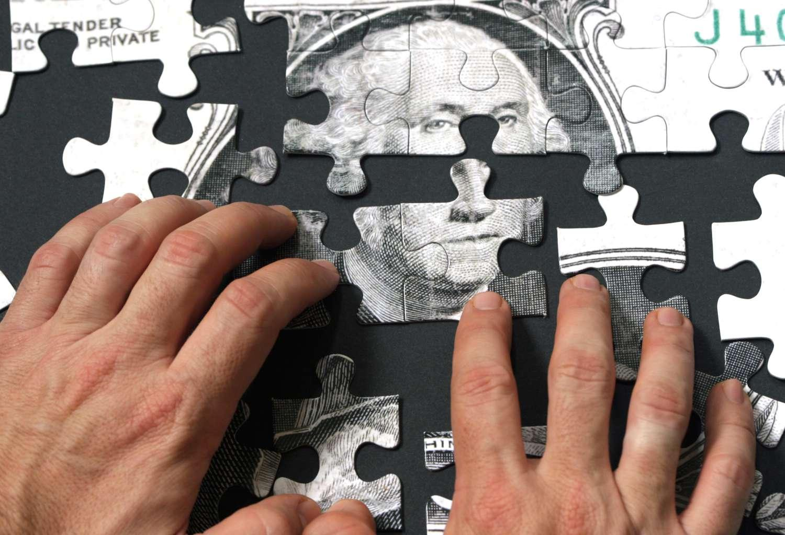

## Table of Contents

## What is the Office of Thrift Supervision (OTS)?

The Office of Thrift Supervision (OTS) was a part of the U.S. Department of the Treasury. It was created to oversee and regulate savings and loan associations, also known as thrifts. These are financial institutions that mainly offer home mortgages and savings accounts. The OTS was set up in 1989 after a big problem with savings and loans, to make sure these institutions were safe and followed the rules.

The OTS worked to make sure that thrifts were run well and did not take too many risks. They checked the thrifts regularly and made rules for them to follow. If a thrift was not doing well, the OTS could step in to fix things or even close it down. In 2011, the OTS was closed down, and its jobs were given to other agencies like the Office of the Comptroller of the Currency and the Federal Reserve.

## When was the OTS established and why?

The Office of Thrift Supervision (OTS) was set up in 1989. This happened because there was a big problem with savings and loan associations, also called thrifts, in the 1980s. Many thrifts were failing, and it caused a lot of trouble for people and the economy. The government decided to create the OTS to watch over these thrifts and make sure they were run safely and followed the rules.

The OTS was part of the U.S. Department of the Treasury. Its job was to check on thrifts regularly, make sure they were not taking too many risks, and help them if they were in trouble. If a thrift was doing very badly, the OTS could even close it down to protect people's money. The OTS worked hard to keep the thrift industry stable and trustworthy until it was closed in 2011, when its duties were handed over to other agencies like the Office of the Comptroller of the Currency and the Federal Reserve.

## What are the primary functions of the OTS?

The Office of Thrift Supervision (OTS) had the main job of watching over savings and loan associations, which are also called thrifts. These are banks that mostly give out home loans and take in savings from people. The OTS made sure these thrifts were run safely and followed the rules. They would check on the thrifts often to see if they were doing okay and not taking too many risks. If a thrift was not doing well, the OTS would help fix things.

If a thrift was in really bad shape, the OTS had the power to close it down to protect people's money. They also made rules that thrifts had to follow to keep everything running smoothly. The OTS was important because it helped keep the thrift industry stable and trustworthy. It worked until 2011, when its jobs were given to other agencies like the Office of the Comptroller of the Currency and the Federal Reserve.

## How does the OTS regulate thrift institutions?

The Office of Thrift Supervision (OTS) made sure thrift institutions, which are like banks that focus on home loans and savings, were run safely and followed the rules. They did this by checking on these thrifts often to see if they were doing okay and not taking too many risks. If a thrift was not doing well, the OTS would step in to help fix things. They would look at the thrift's money and how it was being managed to make sure everything was in order.

If a thrift was in really bad shape, the OTS had the power to close it down to protect people's money. They also made rules that all thrifts had to follow to keep everything running smoothly. This was important because it helped keep the thrift industry stable and trustworthy. The OTS worked hard at this job until 2011, when its duties were handed over to other agencies like the Office of the Comptroller of the Currency and the Federal Reserve.

## What is the difference between a thrift institution and a commercial bank?

A thrift institution, also known as a savings and loan association, is a type of financial institution that mainly focuses on helping people save money and buy homes. They offer savings accounts where people can keep their money and earn interest, and they also give out loans, especially home mortgages. Thrifts are all about helping people with their personal savings and home buying needs.

A commercial bank, on the other hand, does a lot more than just savings and home loans. They offer a wide range of services like checking accounts, business loans, and credit cards. Commercial banks work with both individuals and businesses, helping them with all sorts of financial needs, from everyday banking to big business deals. While thrifts focus on personal savings and home loans, commercial banks have a broader focus and serve a wider variety of customers.

## How does the OTS ensure the safety and soundness of thrift institutions?

The Office of Thrift Supervision (OTS) made sure thrift institutions were safe and sound by checking on them often. They looked at the thrift's money and how it was being managed to see if everything was okay. If a thrift was not doing well, the OTS would step in to help fix things. They would work with the thrift to make sure it was not taking too many risks and was following the rules.

If a thrift was in really bad shape, the OTS had the power to close it down to protect people's money. This was important because it helped keep the thrift industry stable and trustworthy. The OTS made rules that all thrifts had to follow to keep everything running smoothly. By doing all these things, the OTS worked hard to make sure thrift institutions were safe and sound until its duties were handed over to other agencies in 2011.

## What role does the OTS play in consumer protection?

The Office of Thrift Supervision (OTS) helped protect consumers by making sure thrift institutions were safe and followed the rules. They checked on these thrifts often to see if they were doing things right. If a thrift was not treating customers fairly or was taking too many risks with their money, the OTS would step in to fix it. This helped make sure that people's savings and home loans were safe.

The OTS also made rules that thrifts had to follow to protect consumers. These rules were about how thrifts should handle people's money and what they could and couldn't do. By keeping an eye on thrifts and making sure they followed these rules, the OTS helped keep consumers safe until it was closed in 2011.

## How did the OTS interact with other financial regulatory agencies?

The Office of Thrift Supervision (OTS) worked with other financial regulatory agencies to make sure the whole financial system was safe. They shared information and worked together to watch over banks and thrifts. For example, the OTS would talk to the Federal Reserve and the Federal Deposit Insurance Corporation (FDIC) about how thrifts were doing. This helped everyone keep a close eye on the financial system and stop problems before they got too big.

When the OTS found out about a problem with a thrift, they would let other agencies know. This way, everyone could work together to fix things. If a thrift was in really bad shape, the OTS might ask the FDIC to step in and help close it down safely. This teamwork was important because it helped protect people's money and keep the financial system strong.

## What were the major challenges faced by the OTS during its operation?

The Office of Thrift Supervision (OTS) faced big challenges while it was working. One big problem was the savings and loan crisis in the 1980s. Many thrifts were failing, and the OTS had to work hard to fix things and stop more thrifts from going under. This was tough because they had to make sure thrifts were not taking too many risks and were following the rules, all while trying to help them stay open.

Another challenge was working with other financial regulatory agencies. The OTS had to share information and work together with groups like the Federal Reserve and the FDIC. This was important to keep the whole financial system safe, but it was not always easy. Sometimes, different agencies had different ideas about how to handle things, and they had to find ways to agree and work together to protect people's money.

The OTS also had to deal with changes in the financial world. As new types of financial products and services came out, the OTS had to keep up and make new rules to make sure thrifts were still safe and sound. This meant always learning and changing to keep up with the fast-moving world of finance.

## How was the OTS affected by the financial crisis of 2007-2008?

The financial crisis of 2007-2008 was a big problem for the Office of Thrift Supervision (OTS). Many thrift institutions were in trouble because they had given out too many risky home loans. The OTS had to work hard to check on these thrifts and make sure they were not going to fail. They had to step in and help fix things, but it was tough because the problems were so big. The OTS had to work with other agencies like the Federal Reserve and the FDIC to try and stop the crisis from getting worse.

After the crisis, people started to think that the OTS did not do a good enough job watching over the thrifts. They said the OTS let thrifts take too many risks and did not stop the crisis from happening. Because of this, the government decided to close down the OTS in 2011. Its jobs were given to other agencies like the Office of the Comptroller of the Currency and the Federal Reserve. This was a big change, but it was done to try and make the financial system safer after the big problems of the crisis.

## What led to the dissolution of the OTS and when did it occur?

The Office of Thrift Supervision (OTS) was closed down because of the big financial crisis that happened in 2007-2008. Many thrift institutions, which the OTS was supposed to watch over, got into trouble because they gave out too many risky home loans. People thought the OTS did not do a good job at stopping these thrifts from taking too many risks. This made the government decide that the OTS was not working well enough to keep the financial system safe.

The OTS was officially closed in 2011. Its jobs were given to other agencies like the Office of the Comptroller of the Currency and the Federal Reserve. This change was made to try and make the financial system stronger and safer after the big problems of the crisis.

## What functions of the OTS were transferred to other agencies after its dissolution?

After the Office of Thrift Supervision (OTS) was closed in 2011, its jobs were given to other agencies. The Office of the Comptroller of the Currency (OCC) took over the job of watching over federal savings associations. This meant the OCC had to make sure these thrifts were run safely and followed the rules, just like the OTS used to do.

The Federal Reserve took on the job of watching over thrift holding companies. This was important because these companies own thrifts and the Federal Reserve had to make sure they were not taking too many risks. The Federal Deposit Insurance Corporation (FDIC) also got some of the OTS's jobs, like helping to close down thrifts that were in really bad shape to protect people's money.

## References & Further Reading

[1]: ["The Dodd-Frank Act: A Cheat Sheet"](https://www.riskdata.com/wp-content/uploads/The-Dodd-Frank-Act_Morrison-Foerster.pdf) by Skadden, Arps, Slate, Meagher & Flom LLP

[2]: Blume, L., & Durlauf, S. (Eds.). (2010). ["The New Palgrave Dictionary of Economics"](https://www.amazon.com/New-Palgrave-Dictionary-Economics-Set/dp/0333786769) (2nd ed.). Palgrave Macmillan.

[3]: MacKenzie, D. (2019). ["Material Markets: How Economic Agents are Constructed"](https://academic.oup.com/book/52341). Oxford University Press.

[4]: Biais, B., & Woolley, P. (2011). ["High Frequency Trading"](https://www.tse-fr.eu/publications/high-frequency-trading). Annual Review of Financial Economics, 3, 223-239.

[5]: Bank for International Settlements. (2011). ["Basel III: A Global Regulatory Framework for More Resilient Banks and Banking Systems"](https://www.bis.org/publ/bcbs189.htm).