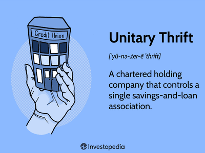

The financial landscape is in a state of constant flux, driven by innovation, globalization, and evolving market dynamics. Institutions operating within this realm must skillfully navigate intricate regulatory frameworks designed to ensure stability, transparency, and fairness. At the forefront of this regulatory environment are entities like the Office of Thrift Supervision (OTS) and practices such as algorithmic trading, both of which have significantly influenced modern financial systems.

The Office of Thrift Supervision, once a pivotal regulatory body under the U.S. Treasury, played an essential role in overseeing the savings and loan industry. Established in response to the Savings and Loan Crisis of the 1980s, the OTS was instrumental in implementing regulations aimed at safeguarding the savings institutions and protecting depositors. While the OTS itself was dissolved in 2011 and its responsibilities distributed among other federal agencies, its legacy continues to inform contemporary regulatory practices and the overall architecture of financial oversight.

In tandem with these regulatory frameworks, algorithmic trading has emerged as a contemporary force reshaping how trades are executed in financial markets. Leveraging sophisticated computer algorithms, this form of trading allows for rapid execution of a large number of orders, potentially increasing market efficiency and liquidity. However, it also introduces challenges such as market volatility and the risk of systemic issues, necessitating robust oversight and sophisticated risk management strategies.

This article seeks to provide a comprehensive examination of the influence of the OTS on bank regulation and the intricate web of challenges and regulations that surround algorithmic trading. By understanding the interplay between these elements, industry stakeholders can better manage the risks associated with financial innovations while contributing to the stability and integrity of the financial system.

A thorough understanding of these dynamics is crucial for stakeholders—ranging from financial institutions to regulatory bodies—as they navigate the complexities of today's financial markets. This exploration aims to clarify these terms and concepts, emphasizing their practical application within regulatory frameworks and their impact on financial stability and risk management.

## Table of Contents

## Office of Thrift Supervision: Legacy and Role in Financial Oversight

The Office of Thrift Supervision (OTS) was a significant entity within the U.S. Department of the Treasury, charged with the critical role of monitoring and regulating the nation's savings and loan associations. Formally established in 1989 amidst the financial turbulence of the Savings and Loan Crisis, the OTS aimed to restore stability and confidence in a sector plagued by widespread failures and losses. This crisis highlighted the need for robust regulatory frameworks designed to ensure the safety and soundness of savings institutions.

The OTS's regulatory framework focused on enforcing stringent capital requirements and operational standards to mitigate risk exposure in thrift institutions. By prescribing these measures, the OTS played a pivotal role in preventing further systemic risk and protecting depositors. The agency enforced compliance through examinations and supervisory actions, maintaining a vigilant watch over the financial practices of its regulated entities.

Despite its eventual absorption into other regulatory bodies as part of financial reform efforts, the OTS's legacy persists. In 2011, the Dodd-Frank Wall Street Reform and Consumer Protection Act led to the integration of the OTS's functions into the Office of the Comptroller of the Currency (OCC), the Federal Deposit Insurance Corporation (FDIC), and the Consumer Financial Protection Bureau (CFPB). This restructuring was part of a broader push towards a more integrated and cohesive financial regulatory environment following the 2008 global financial crisis.

The groundwork laid by the OTS continues to influence contemporary financial oversight strategies. Its regulatory measures and protocols established foundational principles that current agencies continue to build upon. The integration of OTS functions into the FDIC and OCC highlights its enduring impact in shaping a robust financial regulatory architecture in the United States.

Thus, the OTS's contributions to financial oversight are not merely historical footnotes but essential components of the modern regulatory landscape. By establishing critical oversight protocols, the OTS helped to fortify the financial system against potential crises, underscoring the importance of vigilant and effective regulatory practices.

## Financial Oversight and the Evolution of Bank Regulation

Financial oversight has evolved significantly over recent decades, shifting from singular agency mandates to a more integrated and cohesive framework involving multiple regulatory bodies. This transformation partially resulted from the collapse of the Office of Thrift Supervision (OTS) in 2011, following its absorption into agencies such as the Office of the Comptroller of the Currency (OCC), Federal Deposit Insurance Corporation (FDIC), and the Consumer Financial Protection Bureau (CFPB). This shift underscores a more unified regulatory approach aimed at fostering financial stability and maintaining comprehensive oversight of financial institutions.

The transition towards integrated financial oversight reflects a broader response to past financial crises, notably the 2007-2008 financial crisis, which highlighted significant inadequacies in existing regulatory structures. These crises underscored the need for more robust compliance measures and a comprehensive approach to financial oversight to prevent a recurrence of systemic failures.

Modern bank regulation has increasingly focused on essential aspects such as risk management, transparency, and capital adequacy. Risk management involves identifying, assessing, and prioritizing risks followed by coordinated efforts to minimize them, using approaches like the Basel III framework, which sets international standards for bank capital requirements. Transparency has become critical, ensuring that financial institutions operate with full disclosure, which helps in maintaining investor confidence and systemic stability. Capital adequacy, a critical component, refers to the requirement for banks to hold sufficient capital reserves to mitigate potential losses, ensuring that they remain solvent under adverse conditions.

Understanding these shifts is crucial for stakeholders within financial markets, as they provide context for contemporary practices and regulatory expectations. The integration of multiple regulatory bodies aims to create a more resilient financial system, reducing the risk of failure and enhancing the ability to respond effectively to emerging financial challenges. This unified strategy not only enhances oversight but also instills accountability and promotes sound financial practices across the banking sector.

This evolution highlights the dynamic nature of financial regulation, necessitating continuous adaptation and vigilance from all market participants. By recognizing these developments, financial institutions can better navigate the regulatory landscape, ensuring compliance while aligning their strategic objectives with regulatory requirements.

## Algorithmic Trading: A Double-Edged Sword in Modern Finance

Algorithmic trading refers to the use of computer algorithms to automatically execute a large [volume](/wiki/volume-trading-strategy) of trades at speeds and frequencies that are impossible for human traders. This practice has revolutionized modern finance by improving market efficiency and providing [liquidity](/wiki/liquidity-risk-premium). However, it also comes with significant risks, necessitating stringent oversight and risk management protocols.

One of the primary benefits of [algorithmic trading](/wiki/algorithmic-trading) is its ability to process vast amounts of data quickly, allowing traders to identify and exploit market opportunities in real-time. The efficiency and speed of algorithmic trading have reduced transaction costs and minimized price discrepancies across different markets. However, the same capabilities that make algorithmic trading advantageous also pose risks to market stability. For instance, algorithmic strategies can potentially exacerbate market [volatility](/wiki/volatility-trading-strategies), as seen in the "Flash Crash" of May 6, 2010, when the Dow Jones Industrial Average plunged nearly 1,000 points within minutes before sharply rebounding.

This capacity for quick market impact highlights the potential for market manipulation. The algorithms can engage in practices such as "quote stuffing" or "layering," where traders flood the market with large numbers of orders to create false signals about market supply and demand. These activities can distort market prices and undermine confidence among investors. Therefore, it becomes critical to manage these risks through effective regulatory oversight.

Key regulatory agencies, including the Commodity Futures Trading Commission (CFTC), the Securities and Exchange Commission (SEC), and the Office of the Comptroller of the Currency (OCC), play vital roles in overseeing algorithmic trading. These organizations have developed measures to ensure that the algorithms being deployed do not compromise market integrity. For example, the CFTC has implemented Regulation Automated Trading (Reg AT), aimed at reducing risks associated with algorithmic trading in futures markets. Meanwhile, the SEC enforces policies like the Market Access Rule, which requires broker-dealers to establish risk controls before providing their clients with access to the market.

The challenge for these regulatory measures is to strike a balance between harnessing the benefits of algorithmic trading while mitigating its risks. This involves setting controls around algorithm development, testing, deployment, and monitoring. Surveillance tools are also continuously being enhanced to detect anomalous trading patterns that might indicate abusive practices.

Understanding and navigating these dynamics is essential for stakeholders engaged in algorithmic trading. This includes staying abreast of regulatory developments and integrating risk management systems capable of detecting and responding to potential issues in real-time. As algorithmic trading evolves, a cooperative approach between industry participants and regulators will be indispensable in sustaining a fair and transparent trading environment.

## Regulatory Framework Governing Algorithmic Trading

Algorithmic trading, characterized by its reliance on computer algorithms to execute trades with lightning speed and precision, necessitates a robust regulatory framework to mitigate associated risks and enhance market transparency. Regulatory bodies, such as the Commodity Futures Trading Commission (CFTC), the Securities and Exchange Commission (SEC), and the Office of the Comptroller of the Currency (OCC), have established comprehensive regulations to oversee this dynamic domain.

The CFTC has been at the forefront of regulating algorithmic trading. A key component of its efforts is the Regulation Automated Trading (Reg AT), which is designed to minimize the risks associated with automated trading systems. Reg AT mandates the implementation of risk controls to prevent market disruptions. These controls include pre-trade risk management tools, order cancellation capability, and systems for monitoring and surveillance to detect trading anomalies or suspicious activities. By enforcing these measures, the CFTC aims to enhance market integrity and prevent potential systemic risks caused by errant algorithms or malfunctions.

Complementing the efforts of the CFTC, the SEC has introduced the Market Access Rule, officially known as Rule 15c3-5. This regulation is pivotal in managing trading risks and ensuring compliance among broker-dealers. The Market Access Rule requires firms to have direct market access to implement adequate risk management controls. These controls are designed to limit erroneous orders, prevent the manipulation of stock prices, and ensure compliance with securities laws. By enforcing these requirements, the SEC seeks to address the technological vulnerabilities that may arise from algorithmic trading, thereby safeguarding market participants and investors.

In addition to the CFTC and SEC, the OCC plays a critical role in guiding model risk management for national banks engaged in algorithmic trading. The OCC’s guidance emphasizes the importance of effective model validation processes to ensure that algorithms function correctly and do not pose undue risk to the financial system. This includes the validation of models for accuracy, the regular review and adjustment of algorithms, and the implementation of strong governance frameworks to oversee trading operations.

Together, these regulatory measures enhance transparency, provide rigorous risk management controls, and strengthen regulatory oversight. By understanding and adhering to these frameworks, market participants can effectively navigate the complexities of algorithmic trading. Continuous engagement with evolving regulations ensures that traders, brokers, and financial institutions can reduce potential risks while capitalizing on the efficiencies offered by algorithmic trading. This balanced approach allows the financial markets to harness the power of advanced technologies while maintaining stability and integrity.

## The Future of Financial Oversight and Algorithmic Trading

As financial innovation advances, regulatory frameworks are required to adapt swiftly to meet emerging challenges and mitigate associated risks. This adaptation includes embracing advanced technologies and data analytics, which are integral components of modern financial oversight. Such tools enhance the capacity of regulators to monitor market activities in real time, identify irregular patterns, and implement preemptive measures to safeguard financial stability.

Algorithmic trading continues to be a major component of contemporary financial markets, offering significant efficiency gains but also introducing sizeable risks. The opacity and speed of algorithmic trading can lead to market distortions if left unregulated. Therefore, regulatory approaches must be both dynamic and adaptive, continually evolving to encompass the latest technological and market developments.

Engagement with ongoing research and regulatory updates is vital for market participants. Staying informed allows for compliance with current standards and anticipation of future regulatory shifts. This proactive engagement not only aids in adhering to compliance measures but also in capitalizing on emerging opportunities within the market.

The future of financial oversight will likely hinge on achieving a balance between fostering innovation and instituting robust risk management protocols. Encouraging financial technological advancements while maintaining strict oversight ensures the integrity and stability of financial markets. Establishing this balance requires collaboration between industry stakeholders and regulatory bodies to create a sustainable financial ecosystem that supports both innovation and security. By leveraging new technologies and adaptive frameworks, the financial sector can navigate the complexities of future challenges effectively.

## Conclusion

The Office of Thrift Supervision's (OTS) legacy continues to be a pivotal influence on modern regulatory frameworks, underscoring the necessity for comprehensive financial oversight. It provides a historical foundation upon which current protocols are built, ensuring that financial institutions operate within a secure and stable environment. Despite the dissolution of OTS, its principles endure within the frameworks of contemporary regulatory bodies, reminding institutions of the importance of rigorous oversight and adherence to established regulations.

Algorithmic trading represents both the promise of innovation and the potential for systemic risk within the financial sector. The rapid execution capabilities it offers introduce efficiencies but also necessitate stringent regulations to manage the associated risks. This dual potential highlights the importance of effective regulatory measures designed to mitigate risks without stifling technological advancements. Properly managed, algorithmic trading can enhance market efficiency and provide new opportunities for financial growth.

Understanding the regulatory context is crucial for financial institutions to navigate the complex landscape of compliance and risk management. By adhering to these measures, institutions can proactively face challenges and leverage emerging opportunities, thus playing a crucial role in maintaining financial stability. Continuous adaptation to evolving regulations and vigilance against potential risks are essential for sustaining market integrity in today’s dynamic financial ecosystem.

Finally, collaboration between industry stakeholders and regulatory bodies is instrumental in shaping a sustainable financial future. This partnership ensures that regulations evolve in step with technological advancements and market developments, fostering an environment where innovation can thrive alongside robust risk management. This equilibrium is vital for the long-term resilience and integrity of global financial markets.

## References & Further Reading

[1]: ["The Dodd-Frank Act: A Cheat Sheet"](https://www.riskdata.com/wp-content/uploads/The-Dodd-Frank-Act_Morrison-Foerster.pdf) by Skadden, Arps, Slate, Meagher & Flom LLP

[2]: Blume, L., & Durlauf, S. (Eds.). (2010). ["The New Palgrave Dictionary of Economics"](https://www.amazon.com/New-Palgrave-Dictionary-Economics-Set/dp/0333786769) (2nd ed.). Palgrave Macmillan.

[3]: MacKenzie, D. (2019). ["Material Markets: How Economic Agents are Constructed"](https://academic.oup.com/book/52341). Oxford University Press.

[4]: Biais, B., & Woolley, P. (2011). ["High Frequency Trading"](https://www.tse-fr.eu/publications/high-frequency-trading). Annual Review of Financial Economics, 3, 223-239.

[5]: Bank for International Settlements. (2011). ["Basel III: A Global Regulatory Framework for More Resilient Banks and Banking Systems"](https://www.bis.org/publ/bcbs189.htm).