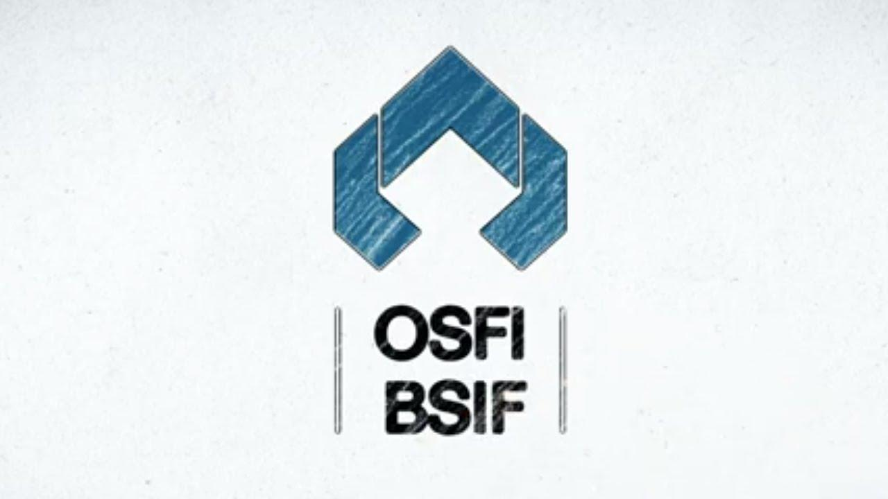

The landscape of financial regulation in Canada is intricate and essential for safeguarding the country's economic stability. At the forefront of this regulatory framework is the Office of the Superintendent of Financial Institutions (OSFI), a critical agency tasked with overseeing the strength and stability of financial institutions and insurance companies nationwide. Established in 1987, OSFI's primary mission is to protect depositors and policyholders while fostering trust across the financial system. This oversight is followed by extending its regulatory efforts to incorporate a dynamic range of modern challenges, including the rise of technological advancements such as algorithmic trading.

Algorithmic trading, defined as the automated execution of trading orders based on pre-set rules, represents a significant development in the financial markets. It necessitates a refined approach to regulation and supervision. OSFI has begun adapting its strategic initiatives to keep pace with these technological changes, ensuring that financial institutions adhere to sound business practices in an era characterized by rapid innovation.

This article examines OSFI's role in financial regulation and supervision, particularly how it contends with the implications of emerging technologies. We will explore key frameworks governed by the OSFI, illustrate its financial supervision practices, delve into the impact of algorithmic trading, and discuss prospective directions for regulation in response to global economic trends. The article aims to highlight OSFI's efforts to maintain Canada’s financial integrity and its proactive measures for continuous enhancement of financial regulation amidst evolving challenges.

## Table of Contents

## Understanding OSFI's Role in Financial Regulation

The Office of the Superintendent of Financial Institutions (OSFI) is a Canadian federal agency responsible for the regulation and supervision of banks, insurance companies, and trust companies. Its primary purpose is to safeguard depositors, policyholders, and the financial system's stability, ensuring that financial institutions operate in a sound and prudent manner.

OSFI's mission centers on maintaining a robust framework that protects the interests of depositors and policyholders while fostering confidence in the financial system. This mission highlights the agency's commitment to mitigate systemic risks and ensure that Canada's financial institutions remain resilient in the face of economic uncertainties.

The establishment of OSFI in 1987 marked a significant milestone in Canada's financial regulatory landscape. It was created as a response to the need for an integrated approach to oversight, combining the regulatory functions previously dispersed among different entities. This consolidation was aimed at enhancing the efficiency and effectiveness of financial supervision, adapting to the increasing complexity of financial markets.

OSFI is tasked with several key responsibilities. It oversees banks and insurance companies, ensuring their operations comply with established regulations. In addition, OSFI supervises trust and loan companies, maintaining oversight to protect their customers' interests. The agency conducts regular risk assessments and evaluates financial institutions' compliance with prudential standards, taking proactive measures to address potential threats to the financial system.

An important aspect of OSFI's role is its collaboration with the Canadian Deposit Insurance Corporation (CDIC) to guarantee deposits. The CDIC is a separate entity that provides deposit insurance for eligible accounts held at member financial institutions. OSFI works alongside CDIC to ensure that depositors' funds are protected up to the insured limit in the event of a bank failure, thereby contributing to the overall stability and trust in Canada's banking system.

In summary, OSFI serves as a cornerstone of Canada's financial regulatory framework, tasked with the crucial role of overseeing and guiding financial institutions. By protecting depositors and policyholders, OSFI plays a vital part in maintaining trust and stability within the financial system, adapting to emerging challenges and ensuring the ongoing integrity of the financial sector.

## Key Regulatory Frameworks Under OSFI

The Office of the Superintendent of Financial Institutions (OSFI) governs several key regulatory frameworks, most notably the Bank Act and the Insurance Companies Act, which form the cornerstone of Canada's financial system. These frameworks are essential to maintaining the stability and integrity of Canada's financial institutions.

### Bank Act and Insurance Companies Act

The Bank Act provides the legislative basis for the organization and supervision of banks operating in Canada. It defines the statutory requirements for banks, including capital adequacy standards, governance structures, and operational rules. Its enforcement ensures the safety and soundness of Canadian banks, safeguarding depositors' interests and promoting a stable financial environment.

Similarly, the Insurance Companies Act governs the operations of insurance companies in Canada. It specifies the financial and organizational requirements necessary for insurance companies to operate, thus protecting policyholders and maintaining confidence in the insurance sector.

### Importance of these Regulations

The importance of the Bank Act and Insurance Companies Act lies in their role in maintaining financial stability. By mandating rigorous capital requirements and risk management practices, these regulations ensure that financial institutions hold sufficient reserves to withstand economic shocks. This protects the Canadian economy from systemic risks and promotes public confidence in the financial system.

### Procedures for Updating Regulations

OSFI follows structured procedures to update and amend these regulations, ensuring they remain relevant in the face of evolving financial landscapes. This includes continuous monitoring of financial trends, stakeholder consultations, and comparative analyses with international standards. The amendments are often preceded by draft guidelines released for public comment, allowing for industry feedback and adjustments before finalization.

### Supervision of Pension Plans

OSFI also plays a critical role in the regulatory supervision of pension plans, particularly federally regulated private pension plans. This involves ensuring that these plans adhere to the requirements set out under the Pension Benefits Standards Act. OSFI conducts periodic reviews of plan administrators, focuses on plan funding, and oversees plan governance to protect beneficiaries' interests.

### Directives and Specifications for Pension Plans

OSFI issues directives and specifications that outline the operational requirements for pension plan administrators. These guidelines are crucial for maintaining the financial health of pension plans and ensuring compliance with federal standards. This includes instructions on actuarial valuations, funding policies, and risk management strategies important for the sustainability of pension programs.

Overall, the regulatory frameworks governed by OSFI, including the Bank Act and Insurance Companies Act, are fundamental to the stability and integrity of Canada's financial system. Through meticulous oversight and strategic updates, these frameworks adapt to technological advancements and emerging financial trends, ensuring the continued protection of depositors, policyholders, and pension beneficiaries.

## Financial Supervision Practices by OSFI

The Office of the Superintendent of Financial Institutions (OSFI) employs a rigorous supervision process to ensure financial institutions comply with established regulations. This process encompasses various measures designed to maintain stability and trust within the financial system. OSFI's supervision involves continuous monitoring, risk assessment, and comprehensive evaluations aimed at identifying and addressing potential vulnerabilities across financial institutions.

Risk assessments are central to OSFI's approach in evaluating system-wide financial issues. These assessments involve analyzing both macroeconomic factors and institution-specific risks that might impact financial stability. OSFI utilizes risk-based frameworks to prioritize supervisory efforts, focusing on areas that pose the greatest potential threat to the financial system. By doing so, OSFI can allocate resources efficiently and ensure that high-risk areas receive the necessary scrutiny.

Ensuring that financial institutions maintain sound business practices is another crucial role of OSFI. This involves guiding institutions on regulatory expectations and encouraging robust internal control systems. By promoting sound governance and risk management practices, OSFI helps institutions prepare for adverse economic conditions while safeguarding the interests of depositors and policyholders.

OSFI engages with stakeholders, including industry participants and the public, through industry surveys and consultations. These engagements enable OSFI to gather insights, share information, and solicit feedback on regulatory developments. By fostering open communication with stakeholders, OSFI ensures that its regulatory practices are well-informed and responsive to industry needs.

Addressing modern challenges such as cybersecurity threats is an essential component of OSFI's strategic initiatives. In response to increasing cyber risks, OSFI has implemented guidelines and supervisory frameworks specifically targeting cybersecurity practices within financial institutions. These initiatives aim to enhance the resilience of institutions against cyber threats and protect the integrity of the financial system.

In summary, OSFI's supervision practices are comprehensive and adaptive, designed to ensure compliance, assess risks, and uphold sound financial practices. By engaging with stakeholders and addressing modern challenges like cybersecurity, OSFI continues to play a pivotal role in Canada's financial regulatory environment.

## The Impact of Algorithmic Trading on Financial Supervision

Algorithmic trading, commonly referred to as algo trading, is the use of computer algorithms to execute trades in financial markets at high speeds and volumes impossible for human traders. It involves predetermined instructions based on variables such as timing, price, and [volume](/wiki/volume-trading-strategy), allowing for efficient trade execution and order processing. In modern financial markets, [algorithmic trading](/wiki/algorithmic-trading) is significant due to its ability to enhance market [liquidity](/wiki/liquidity-risk-premium), reduce transaction costs, and mitigate human biases through automation.

The rise of algorithmic trading poses several challenges to regulatory bodies like the Office of the Superintendent of Financial Institutions (OSFI). One primary concern is ensuring the stability and integrity of financial markets amidst high-frequency trading, which can contribute to market [volatility](/wiki/volatility-trading-strategies). Regulatory agencies must address risks related to market manipulation, erroneous trades, and systemic risks originating from complex algorithms operating at speeds beyond human intervention. Additionally, the opaque nature of trading algorithms complicates efforts to monitor and regulate these transactions effectively.

To address these challenges, OSFI is adapting its supervisory practices by incorporating advanced technologies and analytics. This involves deploying tools to monitor real-time trading activity, detect anomalies, and assess potential systemic risks. Leveraging [machine learning](/wiki/machine-learning) and data analytics can enhance OSFI's ability to scrutinize market behavior and algorithmic trade patterns. Engaging with industry stakeholders through consultations ensures a comprehensive understanding of the latest technological developments and their implications on financial markets.

Algorithmic trading presents both risks and benefits to financial markets. On one hand, it offers increased liquidity, pricing efficiency, and reduced cost of trading. On the other hand, it poses risks such as market volatility, flash crashes, and systemic risks from interconnected algorithms. The automation inherent in algorithmic trading can lead to unintended consequences if not properly regulated, exemplified by the 'Flash Crash' of 2010, where the Dow Jones Industrial Average plummeted drastically within minutes due to algorithmic trades.

OSFI can enhance its regulatory frameworks to better address algorithmic trading by instituting stringent risk management protocols for algorithmic traders, mandating stress testing of algorithms, and requiring increased transparency in trading strategies and algorithms. Collaborating with other global regulatory bodies to establish international standards for algorithmic trading could also be beneficial. By doing so, OSFI aims to balance fostering innovation while safeguarding market integrity and preventing systemic disruptions.

## Future Directions in Financial Regulation and Supervision

The future of financial regulation and supervision in Canada presents a landscape of both challenges and opportunities for the Office of the Superintendent of Financial Institutions (OSFI). As technological innovations such as algorithmic trading continue to reshape financial markets, regulatory bodies must adapt dynamically to new norms.

### Prospective Regulatory Changes

One of the foremost challenges for OSFI is to enhance current regulatory measures to accommodate innovations while maintaining financial stability. This could involve revising existing frameworks like the Bank Act and the Insurance Companies Act to incorporate provisions specifically addressing emerging technologies. The rise of fintech companies and digital banking solutions demands updated regulatory structures to ensure these entities operate securely and responsibly within the financial system. Therefore, regulatory changes may include stricter guidelines for data protection, cybersecurity measures, and real-time monitoring to manage risks associated with digital transactions effectively.

### International Cooperation

International cooperation is increasingly critical for strengthening financial regulatory frameworks. OSFI can benefit from engaging with global regulatory bodies such as the Financial Stability Board (FSB) and the Basel Committee on Banking Supervision to develop harmonized regulations that tackle global financial challenges. Collaborating on shared issues like cross-border data transfer, international bank operations, and global cybersecurity threats could enhance OSFI's ability to protect Canada's financial system from external shocks. This cooperation ensures that Canadian regulations are in tandem with international standards, which is crucial given the interconnectedness of today's financial markets.

### Impact of Global Economic Trends

Global economic trends significantly impact Canada's financial regulatory landscape. For example, macroeconomic shifts, such as [interest rate](/wiki/interest-rate-trading-strategies) fluctuations and international trade tensions, could affect financial institutions' risk profiles in Canada. OSFI must remain vigilant and responsive to these external conditions by employing robust risk assessment models and stress testing practices. The agency might leverage advanced technologies like machine learning to predict potential threats and adjust regulatory strategies preemptively. This proactive approach could help mitigate the adverse effects of global economic disturbances on Canada's economy.

### Strategies for Safeguarding Financial Integrity

To continue safeguarding Canada’s financial integrity, OSFI could adopt several strategic initiatives. Emphasizing continuous education and training for regulatory staff on emerging financial technologies and cyber threats would be crucial. Additionally, fostering innovation within the regulatory framework itself, possibly incorporating agile regulatory practices, could allow for more effective oversight of a rapidly transforming financial environment. Engaging more extensively with stakeholders, including financial institutions, public sector actors, and consumer advocacy groups, could also provide diverse perspectives and insights necessary for crafting balanced and forward-looking regulations.

By addressing these challenges and capitalizing on potential opportunities, OSFI can maintain its pivotal role in ensuring the soundness and stability of Canada's financial system well into the future.

## Conclusion

The Office of the Superintendent of Financial Institutions (OSFI) holds a fundamental role in ensuring that Canada's financial landscape remains stable, secure, and trustworthy. OSFI's regulatory frameworks and supervisory practices are designed to protect depositors and policyholders while reinforcing trust in the financial system. This crucial oversight helps mitigate risks, maintain the integrity of financial institutions, and ensure compliance with established guidelines.

As technological advancements continue to shape financial markets, OSFI is at the forefront of adapting its supervision methodologies to this dynamic environment, including challenges posed by innovations such as algorithmic trading. These changes necessitate ongoing evolution in financial supervision practices to align with emerging trends. The integration of technology in financial transactions, for instance, can lead to increased efficiency but also introduces new risks that require vigilant oversight.

OSFI's commitment to comprehensive and flexible regulations is pivotal in facing future financial challenges. Maintaining adaptable regulatory measures is key to integrating technological innovations within a secure framework. As these innovations evolve, so too must the regulations that govern them, ensuring they provide a solid structure within which financial institutions can operate safely and effectively.

The potential outcomes of OSFI's regulatory frameworks are significant in mitigating financial risks. By fostering a proactive regulatory environment, OSFI is better equipped to anticipate and manage threats arising from both traditional and novel financial activities. This proactive stance contributes not only to national economic stability but also to global financial security, as Canada's regulatory practices often serve as benchmarks internationally.

In conclusion, the importance of OSFI in maintaining a robust financial regulatory environment cannot be understated. As financial landscapes continue to evolve, embracing technology and globalization, the necessity for adaptable, forward-looking regulation has never been more critical. Further research and discussions concerning financial regulation enhancements will be vital for continuing to bolster Canada's economic resilience and ensuring that the national financial system can meet the demands of tomorrow's challenges effectively.

## References & Further Reading

[1]: Zigrand, J.-P., Danielsson, J., & Shin, H. S. (2010). ["Risk Appetite and Endogenous Risk"](https://www.risknet.de/fileadmin/eLibrary/Risk-Appetite-Endogenous-Risk-Danielsson-2009.pdf). SSE/EFI Working Paper Series in Economics and Finance.

[2]: Cartea, Á., Jaimungal, S., & Penalva, J. (2015). ["Algorithmic and High-Frequency Trading"](https://assets.cambridge.org/97811070/91146/frontmatter/9781107091146_frontmatter.pdf). Cambridge University Press.

[3]: MacKenzie, D. (2015). ["Mechanizing the Merc: The Chicago Mercantile Exchange and the Rise of High-Frequency Trading."](https://www.jstor.org/stable/24468735) Technology and Culture.

[4]: Jones, C. M. (2013). ["What Do We Know About High-Frequency Trading?"](https://www.wsj.com/public/resources/documents/HFT0324.pdf) Columbia Business School Research Paper.

[5]: IOSCO (2011). ["Regulatory Issues Raised by the Impact of Technological Changes on Market Integrity and Efficiency."](https://www.iosco.org/library/pubdocs/pdf/IOSCOPD354.pdf) Technical Committee of the International Organization of Securities Commissions.