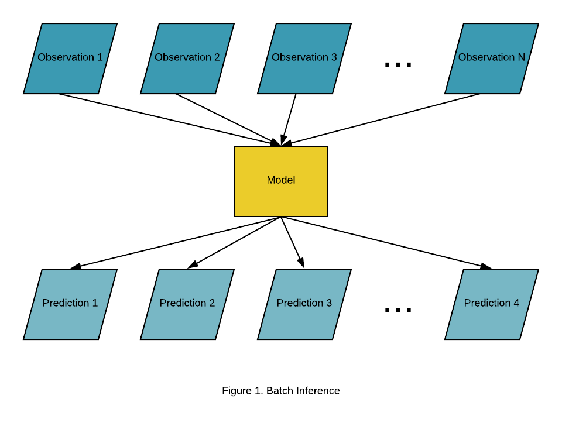

## Table of Contents

## What is offline inference in machine learning?

Offline inference in machine learning refers to the process of using a trained model to make predictions or decisions on new data without needing an active connection to the internet or a central server. This means that once the model is trained, it can be deployed on a local device, like a smartphone or a computer, and used to analyze new data without sending it anywhere. This is particularly useful in scenarios where privacy is important, or when internet connectivity is unreliable or unavailable.

For example, a smartphone app that identifies different types of plants might use offline inference. After downloading the app, which includes a pre-trained model, you can take a picture of a plant, and the app will use the model to identify it right on your phone, without needing to send the picture to a server. This not only saves time and data usage but also keeps your data private. Offline inference is also common in applications like voice recognition on smart devices, where the device processes your commands locally to maintain speed and privacy.

## How does offline inference differ from online inference?

Offline inference and online inference are two ways to use machine learning models to make predictions. Offline inference means the model runs on a local device, like your phone or computer, without needing to connect to the internet. Once the model is trained and downloaded to your device, it can work on new data right there. This is great for privacy because your data stays on your device, and it's useful when you don't have internet access.

On the other hand, online inference means the model is hosted on a server, and your device sends data to that server to get predictions. For example, when you use a web app to identify a picture, your device sends the picture to a server, which then uses the model to analyze it and sends the result back to you. This can be faster if the server has more power than your device, but it requires an internet connection and might raise privacy concerns since your data goes over the internet.

Both methods have their place. Offline inference is perfect for apps that need to work without internet or keep data private, while online inference can handle more complex tasks and use powerful servers to process data quickly.

## What are the typical use cases for offline inference?

Offline inference is often used in apps that need to work without an internet connection. For example, imagine you're hiking in a remote area with no cell service, but you have an app on your phone that can identify different plants and animals. This app uses a [machine learning](/wiki/machine-learning) model that's already on your phone. When you take a picture of a plant, the app analyzes it right there on your device and tells you what it is, without needing to send the picture anywhere. This is really useful for people who need information on the go, in places where the internet isn't available.

Another common use for offline inference is in smart devices like voice assistants. When you ask your smart speaker to play music or set a reminder, it often processes your request directly on the device. This makes the response quick and keeps your voice data private because it doesn't have to send your request over the internet. Offline inference is also important in healthcare, where devices like heart monitors can analyze data in real-time without needing to connect to a server, ensuring that sensitive medical data stays private and secure.

Offline inference is also valuable in situations where data privacy is a big concern. For instance, financial apps on your phone might use offline inference to analyze your spending habits or detect fraud. By keeping the analysis on your device, the app ensures that your financial data doesn't leave your phone, protecting your privacy. This approach is also useful in industrial settings where machines need to make quick decisions based on sensor data without relying on an internet connection, ensuring both efficiency and security.

## What are the advantages of using offline inference?

Offline inference has several advantages, one of the biggest being privacy. When you use a machine learning model on your device, your data stays on your device. This means no one else can see it, which is really important for things like medical records or financial information. For example, if you have an app on your phone that analyzes your heart rate, it can do that without sending your heart data over the internet, keeping it safe and private.

Another advantage is that offline inference can work without an internet connection. This is super helpful if you're somewhere without Wi-Fi or cell service, like in the mountains or on a plane. Imagine you're hiking and you want to identify a plant or a bird; an app with offline inference can do that right on your phone, even if you're miles away from the nearest internet connection. This makes it really useful for people who need information or help on the go, in places where the internet isn't available.

Offline inference can also be faster and more efficient. When your device processes data locally, it doesn't have to wait to send data to a server and get a response back. This can make things like voice commands on smart devices quicker because the device can understand and act on your request right away. Plus, it saves on data usage since nothing is being sent over the internet, which can be a big deal if you have limited data on your phone plan.

## What are the potential drawbacks of offline inference?

One of the main drawbacks of offline inference is that it can be limited by the power of the device it's running on. If your phone or computer isn't very powerful, it might struggle to run complex machine learning models quickly. This means that while simple tasks like voice recognition might work well, more complicated tasks like image recognition might be slower or less accurate. Also, because the model is already on your device, you can't easily update it to improve its performance or fix bugs without downloading a new version of the app or software.

Another issue is the size of the model. Machine learning models can be pretty big, and storing them on your device can take up a lot of space. If you have a phone with limited storage, this can be a problem. Plus, downloading a large model can use a lot of data, which might be an issue if you have a limited data plan. So while offline inference is great for privacy and working without the internet, these practical limitations can make it less appealing for some people or in certain situations.

## How can you prepare a model for offline inference?

Preparing a model for offline inference starts with training the model to perform the task you want, like identifying plants or recognizing speech. Once the model is trained, you need to make it smaller and simpler so it can run on devices like phones or computers that might not be as powerful as a server. This process is called model compression. You can do this by techniques like pruning, where you remove parts of the model that don't contribute much to its performance, or quantization, where you reduce the precision of the numbers the model uses. These methods make the model smaller and faster, but they can also make it a bit less accurate, so you need to find a good balance.

After compressing the model, you need to package it into a format that can be easily used by the device. This often means converting the model into a specific file type, like TensorFlow Lite for Android apps or Core ML for iOS apps. You then need to test the model on the actual device to make sure it works well and doesn't use too much memory or battery. If everything looks good, you can distribute the model with your app or software, so users can download it and use it offline. This way, they can get quick and private results without needing an internet connection.

## What tools and frameworks support offline inference?

Several tools and frameworks make it easier to use machine learning models for offline inference. TensorFlow Lite is a popular choice for Android apps. It's a lightweight version of TensorFlow that's designed to run on mobile and embedded devices. For iOS apps, Core ML is often used because it's built into Apple's ecosystem and works well with iPhones and iPads. Both of these tools help you convert your model into a format that can run quickly and efficiently on smaller devices. Another useful framework is ONNX Runtime, which supports a wide range of devices and can run models from different frameworks like PyTorch and TensorFlow.

In addition to these, there are other tools that can help with specific parts of preparing a model for offline use. For example, if you need to make your model smaller, you might use tools like TensorRT from NVIDIA, which is good for optimizing models for GPUs. If you're working with edge devices like Raspberry Pi, you might look into OpenVINO from Intel, which can help optimize models for those kinds of devices. These tools and frameworks make it easier to get your model ready for offline inference, so it can work well on a variety of devices without needing an internet connection.

## How do you evaluate the performance of a model in offline inference?

Evaluating the performance of a model for offline inference involves checking how well it works on the device it will be used on. This means looking at things like how fast the model runs, how much memory and battery it uses, and how accurate its predictions are. You can test the model on the actual device to see if it's quick enough and doesn't drain the battery too much. If the model takes too long to make a prediction or uses too much of the device's resources, you might need to make it smaller or simpler. This can be done using techniques like pruning or quantization, but you have to be careful because these methods can also make the model a bit less accurate.

Accuracy is another important thing to check. You can use a test dataset to see how often the model gets the right answer. If the model's accuracy is lower than you need, you might have to go back and tweak the model or try different compression techniques. It's all about finding a balance between making the model small enough to work well on the device and keeping it accurate enough to be useful. By testing the model thoroughly on the device, you can make sure it will work well for offline inference, giving users quick and private results without needing an internet connection.

## What are the best practices for deploying models for offline inference?

When deploying models for offline inference, it's important to start by making sure the model is as small and efficient as possible. This means using techniques like pruning, where you remove parts of the model that don't help much, and quantization, where you simplify the numbers the model uses. These methods help the model run faster and use less memory on the device, but you have to be careful because they can also make the model a bit less accurate. Once you've made the model smaller, you need to convert it into a format that works well on the device. For example, if you're making an app for Android, you might use TensorFlow Lite, and for iOS, you could use Core ML. After converting the model, test it on the actual device to make sure it runs quickly and doesn't use too much battery.

After you've tested the model and made sure it works well on the device, you need to think about how to distribute it to users. This usually means including the model in your app or software so users can download it and use it offline. Make sure to keep the model updated, but this can be tricky because users have to download new versions of the app to get the updated model. It's also a good idea to keep an eye on how the model performs once it's in use. If users report that it's slow or not accurate enough, you might need to go back and make more changes. By following these steps, you can make sure your model works well for offline inference, giving users quick and private results without needing an internet connection.

## How does offline inference impact model accuracy over time?

Offline inference can affect model accuracy over time because the model doesn't get updated with new data. When a model is used online, it can be retrained or fine-tuned with new information to keep its predictions accurate. But with offline inference, the model stays the same once it's downloaded to the device. This means if the world changes or if new patterns emerge, the offline model won't know about them. For example, if you have an app that identifies plants, and new types of plants become common, the offline model might not recognize them because it hasn't been updated.

To deal with this, developers need to think about how often they need to update the model and how to get those updates to users. If the model needs to stay very accurate, you might need to release new versions of the app with updated models more often. But this can be hard because users have to download the new version to get the updated model. It's a balance between keeping the model small and efficient for offline use and making sure it stays accurate over time. By planning for regular updates and testing how the model performs after it's been out for a while, you can help keep the model working well even when it's used offline.

## What techniques can be used to optimize offline inference for large datasets?

Optimizing offline inference for large datasets starts with making the model smaller and more efficient. One way to do this is by using techniques like pruning, where you remove parts of the model that don't help much with predictions. Another method is quantization, which simplifies the numbers the model uses, making it take up less space and run faster. These techniques help the model work well on devices like phones or computers that might not be as powerful as servers. But you have to be careful because making the model smaller can also make it a bit less accurate. So, it's important to test the model on the actual device to see if it's quick enough and doesn't use too much memory or battery.

Another way to optimize offline inference for large datasets is by using smart data handling. This means only loading the parts of the dataset that the model needs at any given time, instead of trying to process everything at once. This can be done by breaking the dataset into smaller chunks and processing them one at a time. It's also helpful to use efficient data formats that take up less space and can be read quickly. By doing these things, you can make sure the model can handle large amounts of data without slowing down too much or using too many resources on the device. This way, users can get quick and accurate results even when working with big datasets offline.

## How can one ensure data privacy and security during offline inference?

Ensuring data privacy and security during offline inference starts with keeping the data on the device. When you use a machine learning model on your phone or computer, the data stays right there and doesn't get sent over the internet. This means no one else can see your information, which is really important for things like medical records or financial data. For example, if you have an app that analyzes your heart rate, it can do that without sending your heart data anywhere, keeping it safe and private.

Another way to keep data secure during offline inference is by using encryption. Even though the data stays on your device, you can add an extra layer of protection by encrypting it. This means turning your data into a code that only the app can understand. If someone else tries to look at your data, they'll just see a bunch of random numbers and letters. By combining offline processing with encryption, you can make sure your data stays private and secure, even when you're using a machine learning model on your device.