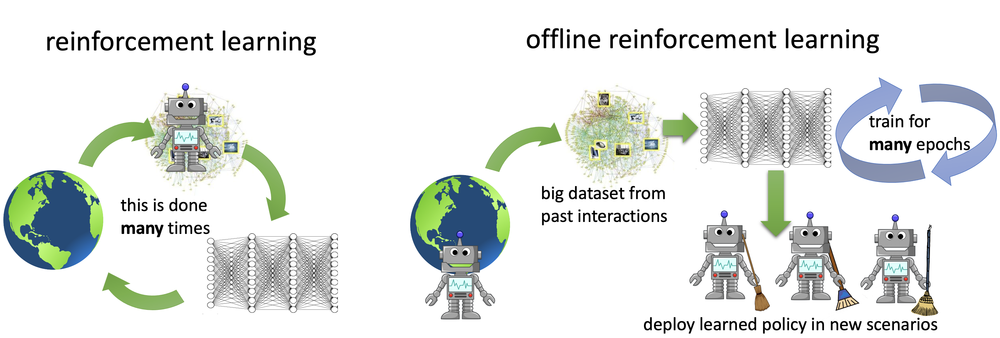

## Table of Contents

## What is offline reinforcement learning and how does it differ from online reinforcement learning?

Offline reinforcement learning is a type of machine learning where an agent learns to make decisions by using a fixed dataset of past experiences, without the ability to interact with the environment in real-time. This means that the agent can only use the data it has been given to learn and improve its decision-making process. Offline reinforcement learning is useful in situations where interacting with the environment is expensive, dangerous, or simply not possible. For example, a robot learning to navigate a factory floor might use offline reinforcement learning to train on data collected from previous runs, without needing to physically move around the factory.

On the other hand, online reinforcement learning involves an agent that learns by actively interacting with its environment in real-time. The agent takes actions, observes the outcomes, and adjusts its strategy based on the feedback it receives. This continuous interaction allows the agent to learn and improve over time as it gathers more data. A common example of online reinforcement learning is a game-playing AI that learns to play better by playing many games and adjusting its strategy based on wins and losses. The key difference between offline and online reinforcement learning is the ability to interact with the environment; online learning can adapt more dynamically, while offline learning relies on pre-existing data.

## What are some common challenges faced in offline reinforcement learning?

One big challenge in offline reinforcement learning is dealing with limited data. Since the agent can't gather new experiences, it has to make do with what it's given. This can lead to problems like overfitting, where the agent learns to do well only on the specific data it has seen and not on new situations. Another issue is the distribution shift, where the data the agent learns from might not represent all possible scenarios it could face. This can make the agent's decisions less effective when faced with new or different conditions.

Another challenge is the problem of extrapolation error. In offline [reinforcement learning](/wiki/reinforcement-learning), the agent might try to predict outcomes for actions it hasn't seen in the dataset. This can lead to big mistakes because the agent is guessing based on incomplete information. To handle this, researchers use techniques like conservative Q-learning, which makes the agent more cautious about actions it hasn't seen before. Balancing exploration and exploitation is also tricky in offline settings because the agent can't explore new actions in real-time, making it harder to find the best strategies without risking poor performance.

## Can you explain the basic concept of Decision Transformer (DPO) in offline RL?

The Decision Transformer (DPO) in offline reinforcement learning is a cool way to teach an agent how to make decisions without needing to interact with the environment in real-time. Instead of trying to predict the best action directly, the Decision Transformer uses a model called a transformer, which is good at understanding sequences, like words in a sentence. In this case, the transformer looks at a sequence of past actions, rewards, and states, and then figures out what action to take next. It's like learning from a history book of what happened before, and using that to decide what to do now.

The key idea behind the Decision Transformer is to treat the reinforcement learning problem as a sequence modeling task. Instead of learning a policy that directly maps states to actions, the Decision Transformer predicts future actions based on a given context of past experiences. This context includes a sequence of states, actions, and rewards, which the model uses to generate the next action. By doing this, the Decision Transformer can learn from offline data more effectively, as it doesn't need to worry about the challenges of exploring new actions in real-time. It's a smart way to use what we already know to make better decisions in the future.

## How does Recurrent Replay Distributed DQN (R2D2) work in the context of offline RL?

Recurrent Replay Distributed DQN, or R2D2, is a way to help a computer learn from past experiences without needing to try new things in real-time. In offline reinforcement learning, R2D2 uses a special kind of memory called a recurrent [neural network](/wiki/neural-network). This memory helps the computer remember what happened before and use that information to make better decisions. R2D2 also uses a technique called replay, where it looks at past experiences over and over again to learn from them. By doing this, R2D2 can get better at making choices without having to explore new situations.

In R2D2, the computer stores a lot of past experiences in a big memory called the replay buffer. It then picks experiences from this buffer to learn from. The recurrent part of R2D2 is important because it helps the computer keep track of sequences of events, like how one action leads to another. This is useful in offline learning because it means the computer can learn from long sequences of past actions and rewards, even if it can't try new things. By using both replay and recurrent memory, R2D2 can improve its decision-making using only the data it already has.

## What is the role of Uncertainty Regularized Q-Learning (URL) in offline RL?

Uncertainty Regularized Q-Learning (URL) is a method used in offline reinforcement learning to help an agent learn better from a fixed set of past experiences. The main idea behind URL is to make the agent more cautious when it's not sure about the outcomes of its actions. In offline RL, the agent can't try new things, so it's important for it to know when it's guessing based on limited data. URL adds a special term to the Q-learning formula that makes the agent less confident about actions it hasn't seen much in the data. This helps prevent the agent from making big mistakes when it's unsure.

By using URL, the agent can learn to balance exploration and exploitation better in an offline setting. Since the agent can't explore new actions in real-time, it needs a way to be careful about the actions it hasn't seen before. URL does this by adding a penalty for uncertainty, which makes the agent prefer actions it's more certain about. This approach helps the agent make safer and more reliable decisions, even when working with a fixed dataset.

## How does Implicit Q-Learning (IQL) improve upon traditional Q-learning methods in offline settings?

Implicit Q-Learning (IQL) makes offline reinforcement learning better by being smarter about how it learns from past experiences. In traditional Q-learning, the agent tries to learn the best action for each situation by figuring out how good each action is. But in offline settings, this can be tricky because the agent can't try new things and might make big mistakes if it guesses wrong. IQL fixes this by learning a special kind of value function that helps the agent know when it's not sure about an action. This way, the agent can be more careful and choose actions it's more confident about, even if it can't explore new actions in real-time.

One cool thing about IQL is that it uses a method called advantage weighting to help the agent decide which actions are really good. Instead of just looking at how good an action seems, IQL also looks at how much better it is compared to other actions in the same situation. This helps the agent focus on the best actions and avoid bad ones, making its decisions more reliable. By doing this, IQL can learn better from the fixed dataset it has, without needing to interact with the environment to gather new experiences.

## What is the Fisher-BRC method and how does it address the distributional shift in offline RL?

The Fisher-BRC method is a way to help a computer learn from past experiences in offline reinforcement learning without making big mistakes. In offline RL, the computer can't try new things, so it has to guess based on what it knows. This can lead to a problem called distributional shift, where the computer might make decisions based on situations it hasn't seen before. The Fisher-BRC method tries to fix this by making the computer more careful about actions it's not sure about. It does this by adding a special term to the learning process that makes the computer less confident when it's guessing.

The key idea behind Fisher-BRC is to use something called the Fisher information matrix to help the computer understand how sure it is about its actions. This matrix helps measure how much the computer's guesses might change if it had more data. By using this information, Fisher-BRC can make the computer focus more on actions it's seen a lot in the data and be more cautious about actions it hasn't seen much. This way, the computer can make safer decisions and avoid big mistakes, even when it can't try new things in real-time.

## How does DeepCubeAI utilize offline RL to solve complex puzzles?

DeepCubeAI uses offline reinforcement learning to solve complex puzzles like the Rubik's Cube by learning from a huge set of past moves and outcomes. Instead of trying new moves in real-time, DeepCubeAI looks at a big collection of puzzle states and the moves that were made to solve them. This helps the AI understand which moves are good and which ones lead to dead ends. By studying this data, DeepCubeAI can figure out the best way to solve a puzzle without needing to try every possible move.

The key to DeepCubeAI's success is its ability to learn from the fixed dataset of past experiences. It uses a special kind of neural network that can handle the complexity of puzzles like the Rubik's Cube. By training on this data, DeepCubeAI can predict the best next move for any given puzzle state. This approach allows DeepCubeAI to solve puzzles much faster than traditional methods, making it a powerful tool for tackling complex problems without the need for real-time interaction.

## What are the key differences between these offline RL methods (DPO, R2D2, URL, IQL, Fisher-BRC, DeepCubeAI)?

The key differences between these offline RL methods lie in their approaches to learning from fixed datasets. Decision Transformer (DPO) uses a transformer model to predict future actions based on sequences of past experiences, treating the RL problem as a sequence modeling task. This allows DPO to effectively learn from offline data without the need for real-time interaction. On the other hand, Recurrent Replay Distributed DQN (R2D2) focuses on using recurrent neural networks and replay buffers to learn from long sequences of past actions and rewards, helping the agent remember and utilize past experiences more effectively. Uncertainty Regularized Q-Learning (URL) adds an uncertainty term to the Q-learning formula, making the agent more cautious about actions it hasn't seen much in the data, which helps prevent big mistakes in offline settings.

Implicit Q-Learning (IQL) improves upon traditional Q-learning by using advantage weighting to focus on the best actions and avoid bad ones, making its decisions more reliable in offline settings. Fisher-BRC tackles the distributional shift problem by using the Fisher information matrix to measure how confident the agent is about its actions, helping it to be more cautious when guessing based on limited data. DeepCubeAI, specifically designed for solving complex puzzles, learns from a vast set of past moves and outcomes to predict the best next move for any given puzzle state, allowing it to solve puzzles like the Rubik's Cube much faster than traditional methods. Each method addresses different challenges in offline RL, such as data limitation, extrapolation errors, and distributional shift, using unique techniques tailored to their specific goals.

## How can one evaluate the performance of different offline RL algorithms?

To evaluate the performance of different offline RL algorithms, you can look at how well they do on a set of tasks or puzzles. One common way is to use a special score called the return, which is the total reward the algorithm gets over time. You can compare the returns of different algorithms to see which one does better. Another way is to see how quickly the algorithm learns from the data it has. If one algorithm can learn faster and get good results with less data, it might be better for some tasks. You can also check how well the algorithm handles new situations it hasn't seen before, which is important because offline RL can't try new things in real-time.

Another important thing to look at is how stable the algorithm is. Some algorithms might do well sometimes but not others, which can be a problem. You can measure this by running the algorithm many times and seeing how much the results change. If the results are pretty much the same each time, the algorithm is more stable. Also, you can use special tests to see if the algorithm is making big mistakes because it's guessing based on limited data. These tests can help you understand if the algorithm is being too confident about things it doesn't know well. By looking at all these things, you can get a good idea of which offline RL algorithm works best for your needs.

## What are some advanced techniques for handling large datasets in offline RL?

Handling large datasets in offline reinforcement learning can be tricky, but there are some cool advanced techniques that can help. One of these is called data subsampling. This means [picking](/wiki/asset-class-picking) out a smaller part of the big dataset to use for learning. By doing this, the computer can learn faster and still get good results. Another technique is called curriculum learning, where the computer starts with easier parts of the data and slowly moves to harder parts. This helps the computer learn step by step, like how a student learns from easy to hard lessons.

Another advanced method is using something called distributed learning. This means using many computers at the same time to learn from the data. It's like having a team of people working together to solve a big puzzle. By splitting the work, the computers can handle the large dataset more easily and learn faster. There's also a technique called [data augmentation](/wiki/data-augmentation), where the computer makes new data from the old data by changing it a little bit. This can help the computer see more different situations and learn better, even if it can't try new things in real-time.

## What future developments can we expect in the field of offline reinforcement learning?

In the future, we can expect offline reinforcement learning to get even better at handling big data. Researchers might come up with new ways to make computers learn faster from the data they have, without needing to try new things in real-time. One cool idea is to use more advanced versions of data subsampling and curriculum learning, which can help the computer learn step by step from easy to hard parts of the data. Another exciting development could be the use of more powerful computers working together, like a team, to handle huge datasets more easily. This could make offline RL much faster and more efficient.

We might also see new methods that help computers be more careful when they're not sure about something. For example, techniques like Uncertainty Regularized Q-Learning (URL) and Fisher-BRC could get even better at making the computer less confident about actions it hasn't seen much in the data. This would help prevent big mistakes and make offline RL more reliable. Plus, as computers get smarter, they might be able to use data augmentation to create new data from old data, helping them learn from more different situations. All these improvements could make offline reinforcement learning a powerful tool for solving all kinds of problems, from playing games to controlling robots.

## References & Further Reading

[1]: Levine, S., Kumar, A., Tucker, G., & Fu, J. (2020). ["Offline Reinforcement Learning: Tutorial, Review, and Perspectives on Open Problems."](https://arxiv.org/abs/2005.01643) arXiv preprint arXiv:2005.01643.

[2]: Chen, M., Liu, H., & Wang, M. (2021). ["Decision Transformer: Reinforcement Learning via Sequence Modeling."](https://arxiv.org/abs/2106.01345) arXiv preprint arXiv:2106.01345.

[3]: Kapturowski, S., Ostrovski, G., Quan, J., Munos, R., & Dabney, W. (2019). ["Recurrent Experience Replay in Distributed Reinforcement Learning."](https://openreview.net/forum?id=r1lyTjAqYX) International Conference on Learning Representations (ICLR).

[4]: Agarwal, R., Schuurmans, D., & Norouzi, M. (2020). ["An Optimistic Perspective on Offline Reinforcement Learning."](https://arxiv.org/abs/1907.04543) International Conference on Machine Learning (ICML).

[5]: Kostrikov, I., Nachum, O., & Tompson, J. (2021). ["Implicit Q-Learning as a New Approach in Offline Reinforcement Learning."](https://arxiv.org/abs/2103.08050) arXiv preprint arXiv:2110.06169.

[6]: Ajay, A., Kumar, A., & Levine, S. (2020). ["Challenging Common Assumptions in the Traditional OFFLINE RL Applications."](https://scholar.google.com/citations?user=uv7g5kMAAAAJ&hl=en) NeurIPS Workshop on Offline Reinforcement Learning.