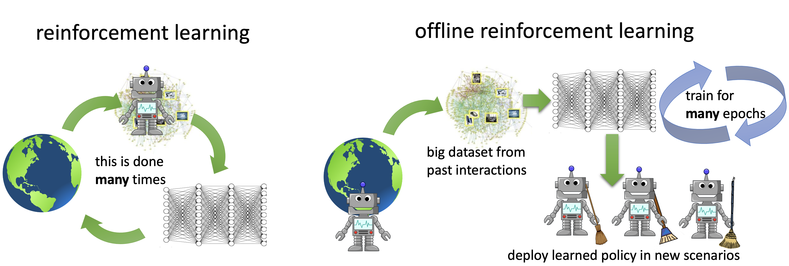

## Table of Contents

## What is offline machine learning?

Offline machine learning, also known as batch learning, is a type of machine learning where the model is trained using a fixed dataset. This means that all the data needed for training is collected beforehand, and the model learns from this data in one go. Once the training is complete, the model is then used to make predictions on new data without further updates until it is retrained with a new dataset. This approach is useful when you have a large amount of data available at once and you don't need the model to adapt to new data in real-time.

In contrast to online machine learning, where the model is continuously updated as new data comes in, offline machine learning is more straightforward and often easier to implement. For example, if you are building a model to predict house prices, you might gather a large dataset of past sales, train your model on this data, and then use the model to estimate prices for new listings. The model won't change until you decide to retrain it with new sales data. This method is particularly useful in scenarios where data collection is periodic or where real-time updates are not necessary.

## How does offline machine learning differ from online machine learning?

Offline machine learning and online machine learning are two different ways to train a machine learning model. Offline machine learning, also called batch learning, uses a fixed set of data to train the model all at once. Once the training is done, the model stays the same until you decide to train it again with a new set of data. This is good when you have all your data ready and you don't need the model to change quickly. For example, if you want to predict house prices, you can collect data on past sales, train your model, and then use it to guess prices for new houses without updating it until you get more data.

Online machine learning, on the other hand, updates the model as new data comes in. This means the model keeps learning and changing even after it starts being used. It's like learning a new language where you keep adding new words and phrases every day. This approach is useful when you need the model to adapt quickly to new information. For instance, if you're trying to detect fraud in credit card transactions, you want your model to learn from new fraud patterns as soon as they appear, so it can stay effective.

Both methods have their own advantages and are chosen based on what you need. Offline [machine learning](/wiki/machine-learning) is simpler and works well when you can wait to update your model. Online machine learning is more complex but necessary when you need your model to keep improving with new data.

## What are the advantages of using offline machine learning?

Offline machine learning is easier to use because you train your model with all your data at once. You don't need to worry about new data coming in while you're training. This makes it simpler to set up and run. Once you have your data, you just train the model and then use it to make predictions. It's like baking a cake: you mix all the ingredients, put it in the oven, and then you're done until you want to bake another cake.

Another advantage is that offline machine learning can be more accurate if you have a lot of good data. Since the model sees all the data at once, it can learn from everything you give it. This can lead to better predictions because the model has more information to work with. For example, if you're trying to predict how much a house will sell for, having data on lots of past sales helps the model learn better than if it only saw a few sales at a time.

Offline machine learning is also good for situations where you don't need to update your model all the time. If you're okay with waiting to retrain your model with new data, this method works well. It's less work to keep the model running because you only need to think about updating it now and then. This can save time and effort, especially if getting new data is hard or takes a long time.

## Can you explain the process of training a model using offline machine learning?

Training a model using offline machine learning starts with gathering all your data. Imagine you want to predict how much houses will sell for. You collect data on lots of past house sales, including details like the size of the house, the number of rooms, and the final sale price. Once you have all this data ready, you split it into two parts: one part for training the model and another part for testing how well the model works. This helps make sure the model is good at guessing prices for houses it hasn't seen before.

Next, you use a machine learning algorithm to train the model on the training data. The algorithm looks at all the house details and sale prices, trying to find patterns that help it predict future prices. For example, it might learn that bigger houses usually sell for more money. After the training is done, you test the model with the test data to see how well it predicts prices. If the model does well, you can start using it to guess prices for new houses. If it doesn't do well, you might need to go back and gather more data or try a different algorithm. Once you're happy with the model, you use it until you decide to train it again with new data.

## What types of data are typically used in offline machine learning?

In offline machine learning, the types of data used can vary a lot depending on what you're trying to predict or learn. Common types of data include numbers, like the size of a house or the price it sold for, and categories, like the type of house or the neighborhood it's in. You might also use dates and times, like when a house was sold, or text, like descriptions of the house. All this data is collected beforehand and put into a big dataset that the model uses to learn.

Sometimes, you might also use images or sounds as data. For example, if you're trying to teach a model to recognize different types of dogs, you would gather lots of pictures of dogs and label them with the breed. Or if you're trying to identify different bird calls, you would record lots of bird sounds and label them with the species. All these types of data are used together to train the model in one go, and then the model uses what it learned to make predictions or decisions.

## What are some common algorithms used in offline machine learning?

In offline machine learning, some common algorithms used are linear regression and decision trees. Linear regression is great for predicting a number, like the price of a house. It tries to find the best line that fits through all your data points. The equation of the line is something like $$y = mx + b$$, where $$y$$ is what you're trying to predict, $$x$$ is your data, $$m$$ is the slope of the line, and $$b$$ is where the line starts on the y-axis. Decision trees, on the other hand, are like a flowchart. They ask questions about your data and split it into different paths until they make a prediction. They're good for both numbers and categories, like deciding if a house is expensive or not.

Another popular algorithm is k-nearest neighbors (k-NN). This method looks at the data points closest to the one you're trying to predict and uses them to make a guess. It's like asking your neighbors for advice. If you want to know if a house is expensive, k-NN would look at similar houses nearby and see if they're expensive. Lastly, there's the support vector machine (SVM), which is good at finding the best line or curve to separate different groups of data. It's often used for things like figuring out if an email is spam or not. Each of these algorithms has its own way of learning from the data you give it, and they can be used for different kinds of predictions.

## How do you evaluate the performance of a model trained with offline machine learning?

To evaluate the performance of a model trained with offline machine learning, you use a part of your data that the model hasn't seen before, called the test set. You compare the model's predictions to the actual values in the test set. For example, if you're predicting house prices, you see how close the model's guesses are to the real sale prices. One common way to measure this is by calculating the mean squared error (MSE), which is the average of the squared differences between the predicted and actual values. The formula for MSE is $$ \text{MSE} = \frac{1}{n} \sum_{i=1}^{n} (y_i - \hat{y}_i)^2 $$, where $$ y_i $$ is the actual value, $$ \hat{y}_i $$ is the predicted value, and $$ n $$ is the number of observations. A smaller MSE means the model is doing a better job at predicting.

Another way to evaluate the model is by looking at its accuracy, especially if you're classifying things into categories, like deciding if a house is expensive or not. Accuracy is simply the percentage of correct predictions out of all predictions. If your model correctly guesses the category for 90 out of 100 houses, its accuracy is 90%. You can also use a confusion matrix to see how well the model is doing for each category. This helps you understand if the model is making more mistakes in one category than another. By using these methods, you can decide if your model is good enough to use or if you need to train it again with more or different data.

## What are the challenges faced when implementing offline machine learning?

One challenge of offline machine learning is that you need a lot of data to train your model well. If you don't have enough data, your model might not learn the patterns it needs to make good predictions. For example, if you're trying to predict house prices, you need data on many different houses to understand what affects the price. Gathering all this data can take time and effort. Also, once you train your model, it won't change until you train it again. This means if new trends or patterns appear, like a sudden increase in house prices, your model won't know about it until you retrain it with new data.

Another challenge is that offline machine learning can be slow. Training a model on a big dataset can take a long time, especially if you're using complex algorithms. You might need powerful computers to do this quickly. Once the model is trained, you have to test it to see how well it works. This involves using a test set of data to check the model's predictions against real values. A common way to measure this is by calculating the mean squared error (MSE), which is the average of the squared differences between the predicted and actual values. The formula for MSE is $$ \text{MSE} = \frac{1}{n} \sum_{i=1}^{n} (y_i - \hat{y}_i)^2 $$, where $$ y_i $$ is the actual value, $$ \hat{y}_i $$ is the predicted value, and $$ n $$ is the number of observations. If the MSE is high, you might need to go back and gather more data or try a different algorithm.

## How can offline machine learning be applied in real-world scenarios?

Offline machine learning is used a lot in real life, especially when you want to predict something based on a lot of data you already have. For example, companies might use it to guess how much people will buy next month. They look at what people bought in the past, train a model with that data, and then use the model to make predictions. This helps them plan how much stuff to order and how to set prices. Another example is in healthcare, where doctors might use offline machine learning to predict if a patient is at risk for a certain disease. They gather data from past patients, train a model, and then use it to help make decisions about new patients.

Another place where offline machine learning is helpful is in the finance world. Banks and investment firms use it to predict stock prices or how likely someone is to pay back a loan. They collect a lot of data on past stock prices or loan repayments, train a model on that data, and then use the model to make guesses about the future. This helps them decide where to invest money or whether to give someone a loan. Offline machine learning is great for these kinds of situations because it lets you use all your data at once to make the best predictions possible, and you don't need to worry about updating the model every day.

## What are the best practices for managing and updating models in offline machine learning?

One important practice for managing and updating models in offline machine learning is to keep your data clean and organized. Before you train your model, make sure to check your data for any mistakes or missing information. This helps your model learn better and make more accurate predictions. Also, it's a good idea to save your data and the trained model in a way that's easy to find and use later. This way, when you need to update your model with new data, you can do it without too much trouble.

Another key practice is to regularly retrain your model with new data. Even though offline machine learning doesn't update in real-time, it's still important to keep your model up to date. Set a schedule to collect new data and retrain your model, like every month or every year, depending on how fast things change in your field. When you retrain, you can use the same mean squared error (MSE) formula $$ \text{MSE} = \frac{1}{n} \sum_{i=1}^{n} (y_i - \hat{y}_i)^2 $$ to check if your model is doing better than before. If the MSE is lower, your model is improving. If it's not, you might need to gather more or different data, or try a different algorithm.

## How does offline machine learning handle large datasets?

Offline machine learning is good at handling large datasets because it can process all the data at once. When you have a lot of data, like information on millions of houses, you can use powerful computers to train your model. This means the model can learn from all the data in one go, which helps it make better predictions. For example, if you're trying to predict house prices, having data on many houses helps the model understand what affects the price better than if it only saw a few houses.

One way to check how well your model is doing with a large dataset is by using the mean squared error (MSE). The formula for MSE is $$ \text{MSE} = \frac{1}{n} \sum_{i=1}^{n} (y_i - \hat{y}_i)^2 $$, where $$ y_i $$ is the actual value, $$ \hat{y}_i $$ is the predicted value, and $$ n $$ is the number of observations. A lower MSE means your model is doing a good job at predicting. When you have a large dataset, you split it into a training set and a test set. You train your model on the training set and then test it on the test set to see how well it predicts new data. This helps make sure your model works well with all the data you have.

## What advanced techniques can be used to optimize offline machine learning models?

One advanced technique to optimize offline machine learning models is to use feature engineering. This means creating new data points from the ones you already have to help your model learn better. For example, if you're predicting house prices, you might create a new feature that combines the number of rooms and the size of the house. This can help the model see patterns it might miss otherwise. Another technique is hyperparameter tuning, where you adjust the settings of your machine learning algorithm to find the best ones for your data. You can use methods like grid search or random search to try different settings and see which ones make your model perform the best. For example, if you're using a decision tree, you might change how deep the tree can grow to see if it helps your model predict better.

Another way to optimize your model is by using ensemble methods. This means combining several models to make predictions together. For example, you might train multiple decision trees and then use their average prediction. This can often lead to better results than using just one model. You can also use cross-validation to make sure your model works well with different parts of your data. Cross-validation means splitting your data into several parts, training your model on some parts, and testing it on others. This helps you see how well your model will work with new data. To check how well your model is doing, you can use the mean squared error (MSE) formula $$ \text{MSE} = \frac{1}{n} \sum_{i=1}^{n} (y_i - \hat{y}_i)^2 $$, where $$ y_i $$ is the actual value, $$ \hat{y}_i $$ is the predicted value, and $$ n $$ is the number of observations. A lower MSE means your model is doing a good job at predicting.