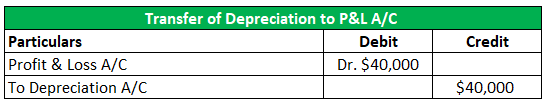

In today's dynamic financial landscape, the integration between accounting practices and algorithmic trading systems is becoming increasingly pivotal. Algorithmic trading, often known as algo trading, leverages advanced mathematical models and computational algorithms to execute trades at speeds and frequencies impossible for human traders. As these systems gain prominence, accounting practices play an essential role in ensuring that the financial data driving these algorithms is accurate and reliable.

This article explores the synergy between accounting, finance, and offset strategies in algo trading. At its core, accounting provides the quantitative financial foundation necessary for informed decision-making within trading systems. Comprehensive accounting records allow traders and systems to assess the financial health of portfolios, manage risks effectively, and ensure compliance with regulatory standards. These elements combine to enhance trading accuracy, efficiency, and profitability.



By understanding the individual components—accounting, financial strategies, and offset techniques—and their interplay in modern financial markets, one can appreciate how they collectively contribute to the success of algorithmic trading systems. Consequently, the integration of these disciplines is crucial not only for managing operations but also for leveraging technological innovations that drive financial markets forward. This exploration begins with defining these core concepts before examining their interconnectedness within algorithmic trading.

## Table of Contents

## Understanding Financial Accounting in Algo Trading

Financial accounting plays a crucial role in providing the essential metrics required for decision-making in algorithmic trading. This branch of accounting provides a structured and accurate depiction of a firm's financial health, enabling traders to assess risks more effectively and execute strategies with precision. 

One of the main advantages of integrating financial accounting in algo trading is the clarity it offers on financial positions. Accurate accounting ensures that traders have real-time data on assets, liabilities, and overall portfolio performance, which is vital for assessing potential risks and making informed decisions. For instance, maintaining up-to-date balance sheets and income statements allows traders to gauge liquidity, solvency, and profitability – all critical factors in determining trading strategies and risk tolerance levels.

Compliance and reporting are other key reasons why accounting principles are indispensable in algorithmic trading, particularly within automated environments where trade volumes can be extraordinarily high, and the speed is paramount. Adhering to standardized accounting principles ensures consistency and accuracy in financial reporting, essential for both legal compliance and maintaining investor trust. In automated trading systems, these principles help in setting up proper audit trails and documentation, which are necessary for regulatory compliance and post-trade analysis.

The integration of accounting software with trading platforms is facilitated by various technologies and tools. Advanced APIs (Application Programming Interfaces) allow for seamless communication between different systems, enabling real-time synchronization of financial data. For example, trading platforms can be integrated with accounting software like QuickBooks or Xero, allowing automatic updates of trading transactions in the accounting ledgers.

Moreover, data analytics and [machine learning](/wiki/machine-learning) tools are increasingly being adopted to enhance financial accounting processes within algo trading. These technologies can analyze vast datasets to detect patterns and predict trends, providing valuable insights that can inform trading decisions. Python, with its rich ecosystem of libraries such as Pandas for data manipulation and Scikit-learn for machine learning, is widely used in developing such applications to automate and optimize accounting tasks.

Here's a simple Python example that demonstrates the integration of accounting data analytics with trading decisions:

```python
import pandas as pd
from sklearn.linear_model import LinearRegression

# Load financial data
data = pd.read_csv('financial_data.csv')

# Extract relevant features
X = data[['net_income', 'total_assets', 'liabilities']]
y = data['stock_performance']

# Initialize and train the model
model = LinearRegression()
model.fit(X, y)

# Predict stock performance based on new accounting data
new_data = [[50000, 200000, 150000]]  # Example accounting metrics
prediction = model.predict(new_data)
print(f"Predicted Stock Performance: {prediction[0]}")
```

In this code snippet, financial accounting data is used to predict stock performance, demonstrating the importance of accounting metrics in shaping algo trading strategies. By integrating financial accounting principles and utilizing technology, traders can achieve better risk management and strategy execution, ultimately leading to more successful trading outcomes.

## Core Financial Strategies in Algorithmic Trading

Algorithmic trading involves deploying pre-programmed strategies to execute trades based on financial data and market signals. Three primary strategies employed in this field are [arbitrage](/wiki/arbitrage), [trend following](/wiki/trend-following), and market-making, each of which relies heavily on the precision of financial calculations and accounting data.

### Arbitrage

Arbitrage is a strategy that exploits price discrepancies in different markets or forms. The essence of arbitrage lies in buying low in one market and selling high in another, thus making a profit from the difference. This strategy necessitates meticulous accounting to track and calculate potential spreads in real-time, ensuring profitability against transaction costs and fees. Algorithms used in arbitrage must access up-to-date and accurate financial data to seize opportunities as price differences often exist only for short periods. For example, the arbitrage equation can be simplified as:

$$
\text{Profit} = (\text{Price in Market A} - \text{Price in Market B}) - \text{Transaction Costs}
$$

Real-time accounting ensures these variables are accurate, facilitating swift decision-making.

### Trend Following

Trend-following strategies capitalize on the directional movement of asset prices. These strategies analyze historical financial data to identify and predict trends, relying on moving averages and other statistical tools. Key to this approach is accurate historical data analysis, allowing the algorithm to determine entry and [exit](/wiki/exit-strategy) points along the trend's trajectory. A simple moving average (SMA) of an asset's price over a specified window could illustrate trend direction:

$$
\text{SMA} = \frac{1}{n} \sum_{i=0}^{n-1} \text{Price}[i]
$$

Here, $n$ represents the number of periods within the dataset. Accurate financial records inform these calculations, promoting optimal positioning based on trend dynamics.

### Market-Making

Market-making strategies provide [liquidity](/wiki/liquidity-risk-premium) to the market by continuously buying and selling securities, profiting from the spread between bid and ask prices. This strategy requires acute precision in accounting to maintain balanced positions and calculate spreads accurately. The accounting system should track inventory, calculate margins accurately, and adjust to market demand dynamics to profit consistently. Market makers require continuous data streams to adjust bid-ask spreads dynamically:

$$
\text{Spread} = \text{Ask Price} - \text{Bid Price}
$$

### Importance of Historical Financial Data Analysis

Historical data analysis underpins the effectiveness of each strategy. By examining past market behaviors, traders develop models that forecast future price movements and anomalies. Algorithms utilize this historical data to back-test strategies, assessing their performance before live implementation. This practice reduces risk by verifying theoretical models against real-world outcomes.

Overall, [algorithmic trading](/wiki/algorithmic-trading) relies on the interplay between precise financial calculations and robust data analysis to optimize execution and profitability. The integration of financial accounting provides a foundation for developing effective strategies, leveraging historical insights and real-time data for strategic decision-making.

## The Role of Offset Techniques in Financial Trading

Offset strategies are essential mechanisms employed in financial trading to mitigate risks within investment portfolios. These strategies aim to counterbalance potential losses by adopting techniques that reduce exposure to adverse market movements.

One of the primary offset techniques is hedging, which involves taking a position in a financial instrument to offset potential losses in another. For example, an investor holding a stock position might purchase put options on the same stock to protect against a decline in its price. This protection allows the investor to mitigate losses while maintaining the stock position. Hedging can be achieved through various financial derivatives, such as options, futures, and swaps.

Diversification is another crucial offset technique, aiming to spread investments across different asset classes or financial instruments. By doing so, the overall portfolio risk is reduced, as the adverse performance of one asset can be offset by the favorable performance of another. Diversification strategies are particularly effective against idiosyncratic risks—those specific to individual assets—while systematic risks affecting the broader market require more sophisticated strategies.

Position sizing is a vital aspect of risk management, determining the appropriate amount of capital to allocate to each investment within a portfolio. By calculating the optimal position size, traders can ensure that individual trades do not disproportionately impact the portfolio, thereby reducing potential losses. This involves setting fixed risk percentages for each trade relative to the overall portfolio value, thus balancing the potential risk and reward.

Market [volatility](/wiki/volatility-trading-strategies) significantly impacts offset strategies, as fluctuations in asset prices can alter the risk profile of a portfolio. During periods of high volatility, offset strategies such as hedging and diversification become increasingly important, as they help stabilize the portfolio against sudden market changes. Algorithms play a crucial role in adjusting offset strategies by rapidly analyzing market data and executing trades to preserve financial stability. For instance, algorithmic trading systems can continuously assess market conditions and automatically adjust hedging positions or reallocate assets to maintain diversification.

One example of a mathematical approach to determine optimal position sizing is the Kelly Criterion, given by the formula:

$$
f^* = \frac{bp - q}{b}
$$

where:
- $f^*$ is the fraction of the portfolio to be bet,
- $b$ is the odds received on the wager (net odds),
- $p$ is the probability of winning,
- $q$ is the probability of losing (i.e., $1-p$).

In modern trading, Python can be employed to implement these quantitative models effectively. For example, position sizing could be coded as:

```python
def calculate_position_size(risk_per_trade, total_portfolio_value, stop_loss_distance):
    return (risk_per_trade * total_portfolio_value) / stop_loss_distance
```

In summary, offset techniques form a cornerstone of risk management in financial trading by utilizing hedging, diversification, and position sizing to balance risks and adapt to market volatility. The integration of algorithms enhances these strategies, ensuring investments remain insulated against frequent market fluctuations, thereby fostering financial stability.

## Algorithmic Trading: Bridging Accounting and Finance

Algorithmic trading has revolutionized the financial markets by optimizing the integration of financial data analysis into automated trading systems. At the core of this process is the effective use of accounting data to enhance the performance of trading algorithms. Accurate, real-time financial data derived from accounting practices provides a comprehensive view of market conditions and financial health, allowing for the informed development of trading strategies.

Accounting data is instrumental in refining algorithmic trading models, primarily by supplying precise input variables that affect market predictions. For instance, financial ratios such as the Price-to-Earnings (P/E) ratio, debt levels, cash flow analysis, and liquidity positions feed directly into algorithms to evaluate undervalued or overvalued stocks. This integration empowers traders with robust insights into current market dynamics, thereby supporting improved decision-making and strategy adaptation.

Financial data analysis also plays a pivotal role in risk management within algorithmic trading. Accounting data can be used to assess the potential risks associated with various trading strategies and to develop risk-adjusted algorithms. For example, a risk management algorithm may rely on historical volatility data combined with recent accounting information to adjust position sizes or hedge positions to mitigate potential losses.

There have been successful case studies illustrating the integration of financial analysis with algorithmic strategies. One notable example involves the use of balance sheet analysis to drive algorithmic models that predict corporate credit risk. By integrating comprehensive financial statement analysis with real-time trading systems, trading firms have managed to create models that accurately predict company default probabilities, thus leading to better risk-adjusted returns.

Another example is the use of cash flow data in high-frequency trading ([HFT](/wiki/high-frequency-trading-strategies)). Firms that have integrated detailed cash flow analysis into their trading algorithms have achieved significant advantages by deploying strategies that capitalize on temporary market inefficiencies. This approach not only facilitates precision in entry and exit points but also enhances liquidity management in fast-paced market environments.

The marriage between accounting data and algorithmic trading not only improves predictive accuracy but also enables more efficient execution of trades by narrowing spreads and reducing slippage. As accounting data continues to become more detailed and real-time in nature, its role in refining algorithmic strategies will likely expand, offering greater potential for high-caliber financial outcomes.

## Technological Innovations in Accounting and Algo Trading

Blockchain, [artificial intelligence](/wiki/ai-artificial-intelligence) (AI), and machine learning (ML) are revolutionizing the interface between accounting, finance, and algorithmic trading by introducing unprecedented levels of precision, efficiency, and security.

### Blockchain and Distributed Ledger Technology

Blockchain facilitates transparency and immutability in financial transactions, which is pivotal for the integrity of trading systems. In accounting, blockchain ensures secure recording of transactions, which can be crucial for compliance and auditability. In algorithmic trading, blockchain can enable verifiable and timestamped trade executions, reducing the risk of fraud and enhancing trust among trading partners. The integration of smart contracts — self-executing contracts with the terms directly written into code — streamlines operations and reduces costs by automatically enforcing and verifying contractual terms without intermediaries.

### Artificial Intelligence and Machine Learning

AI and ML are critical in extracting actionable insights from massive datasets. These technologies enable the development of predictive models that can anticipate market trends by analyzing historical financial data, news articles, and social media sentiment. In accounting, AI can automate routine tasks such as data entry, fraud detection, and financial forecasting, allowing professionals to focus on strategic decision-making. 

A Python example of a simple predictive model using machine learning in algorithmic trading might involve training a decision tree to forecast stock prices based on historical data:

```python
from sklearn.model_selection import train_test_split
from sklearn.tree import DecisionTreeRegressor
import pandas as pd

# Assume df is a pandas DataFrame containing historical stock data
df = pd.read_csv('historical_stock_data.csv')
X = df[['feature1', 'feature2', 'feature3']]  # Features
y = df['target']  # Target variable (stock price)

# Split data
X_train, X_test, y_train, y_test = train_test_split(X, y, test_size=0.2, random_state=42)

# Train decision tree model
model = DecisionTreeRegressor()
model.fit(X_train, y_train)

# Predict on test data
predictions = model.predict(X_test)
```

### Recent Advancements

Recent technological advancements have focused on enhancing scalability and reducing latency in trading operations. Cloud computing platforms now offer elastic resources that seamlessly handle spikes in trading activity, ensuring optimal performance without the need for significant IT overhead. Additionally, real-time analytics platforms provide instant insights from accounting data, informing trading decisions with up-to-date financial metrics.

### Future Trends

Future trends in algorithmic trading technology will likely include the convergence of quantum computing and finance, offering exponentially faster data processing capabilities for even more refined trading algorithms. The continued integration of AI and ML in accounting systems will enable more granular insights into financial health, allowing algorithms to be continuously fine-tuned for performance optimization. Moreover, the proliferation of decentralized finance (DeFi) platforms will further intertwine blockchain with traditional trading systems, offering new opportunities and challenges for traders and accountants alike.

Embracing these technological innovations will be essential for firms looking to maintain a competitive edge in the rapidly evolving landscape of finance and trading.едактировать.

## Conclusion

In modern financial markets, the integration of accounting, finance, and offset strategies with algorithmic trading is crucial for achieving optimal trading outcomes. This synergy results in enhanced risk management, operational efficiency, and profitability. By utilizing accurate financial accounting, traders can establish a reliable foundation for decision-making, allowing them to assess risks and execute strategies with confidence. These strategies are often supported by robust offset techniques that help mitigate potential market risks. 

The use of algorithmic trading systems allows for the efficient processing of large volumes of data, which when combined with precise accounting information, optimizes trading strategies. This integration facilitates real-time adjustments to market positions and enhances trading performance by leveraging detailed financial insights.

Encouraging financial professionals to adopt a holistic perspective is essential. Embracing advancements such as blockchain, AI, and machine learning can drive further improvements in trading systems. It is imperative for these professionals to stay informed and adapt to technological innovations, which continue to redefine the interface between accounting and algorithmic trading.

As the field evolves, ongoing education and adaptation are crucial. The future of trading lies in the continuous development of technologies that seamlessly unite financial accounting insights with algorithmic strategies, paving the way for more informed and strategic financial decisions. Financial professionals who recognize the value of this integration will be well-positioned to navigate the complexities of modern markets and capitalize on emerging opportunities.

## References & Further Reading

[1]: Bergstra, J., Bardenet, R., Bengio, Y., & Kégl, B. (2011). ["Algorithms for Hyper-Parameter Optimization."](https://dl.acm.org/doi/10.5555/2986459.2986743) Advances in Neural Information Processing Systems 24.

[2]: ["Advances in Financial Machine Learning"](https://www.amazon.com/Advances-Financial-Machine-Learning-Marcos/dp/1119482089) by Marcos Lopez de Prado

[3]: ["Evidence-Based Technical Analysis: Applying the Scientific Method and Statistical Inference to Trading Signals"](https://www.amazon.com/Evidence-Based-Technical-Analysis-Scientific-Statistical/dp/0470008741) by David Aronson

[4]: ["Machine Learning for Algorithmic Trading"](https://github.com/stefan-jansen/machine-learning-for-trading) by Stefan Jansen

[5]: ["Quantitative Trading: How to Build Your Own Algorithmic Trading Business"](https://www.amazon.com/Quantitative-Trading-Build-Algorithmic-Business/dp/1119800064) by Ernest P. Chan