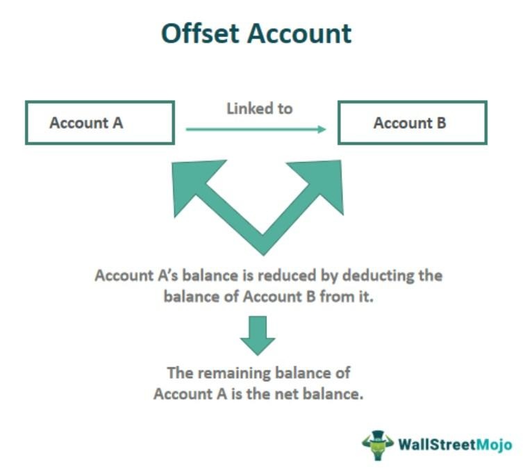

## Table of Contents

## What is an offset in finance and accounting?

An offset in finance and accounting is when one amount reduces or cancels out another amount. Imagine you owe someone $50, but they owe you $30. Instead of paying each other separately, you can offset the amounts. You would only need to pay them $20 because the $30 they owe you offsets part of what you owe them.

This concept is used a lot in businesses to simplify transactions and keep the books clean. For example, if a company has both debts and assets, they can offset these against each other on their balance sheet. This helps to show a clearer picture of the company's financial health. Offsetting is a common practice, but it must be done correctly according to accounting rules to ensure everything is reported accurately.

## How does offsetting work in basic accounting?

In basic accounting, offsetting means using one amount to reduce another amount. Imagine you have a business and you owe money to a supplier, but that same supplier also owes you money for something else. Instead of paying each other separately, you can offset these amounts. If you owe them $100 and they owe you $40, you can subtract the $40 from the $100. Now, you only need to pay them $60.

This helps keep your accounting simple and clear. On your balance sheet, you can show these offset amounts to give a better picture of your business's financial health. But, you need to follow the accounting rules carefully when you do this. Not all amounts can be offset, and it's important to do it right so your financial reports are accurate.

## Can you explain the difference between offsetting and netting?

Offsetting and netting are similar ideas in accounting, but they work a bit differently. Offsetting is when you use one amount to reduce another amount directly on your financial statements. For example, if you owe someone $100 and they owe you $40, you can show on your balance sheet that you only owe them $60 because the $40 offsets part of the $100. Offsetting happens within the same financial statement, making it easier to see the net effect of the amounts.

Netting, on the other hand, is when you calculate the difference between two amounts but don't necessarily show it on the financial statements. It's more about figuring out what you owe or are owed overall. Using the same example, if you owe $100 and are owed $40, netting would mean you figure out you need to pay $60, but this might not be reflected directly on your balance sheet. Instead, you might just use this net amount for internal calculations or when settling up with the other party.

Both offsetting and netting help simplify financial transactions, but offsetting directly affects how amounts are reported in your financial statements, while netting is more about the actual payment or calculation process.

## What are common examples of offsetting in everyday accounting?

In everyday accounting, a common example of offsetting is when a business owes money to a supplier but the supplier also owes money to the business. Let's say your company bought $500 worth of supplies from a supplier, but you also provided them with $200 worth of services. Instead of making two separate payments, you can offset the $200 against the $500. This means you only need to pay the supplier $300, which simplifies the transaction and keeps your accounting straightforward.

Another example is with employee advances and payroll. If an employee takes an advance of $300 from the company, but then earns $1,000 in their next paycheck, the company can offset the advance against the earnings. So instead of paying the employee the full $1,000, the company can deduct the $300 advance and pay them $700. This makes it easier to manage cash flows and ensures that the financial records accurately reflect what is owed and what has been paid.

## How do offsets affect financial statements?

Offsets can change how numbers look on financial statements. When you use an offset, you are taking one amount and using it to reduce another amount on the same statement. For example, if your company owes money to a supplier but the supplier also owes you money, you can show on your balance sheet that you only owe them the difference. This makes your financial statements simpler because you don't have to show both the amount you owe and the amount you are owed separately.

This can affect how people see your company's financial health. If you offset a lot, your balance sheet might look better because it shows lower amounts of debts or higher amounts of assets. But you need to be careful and follow accounting rules. Not all amounts can be offset, and doing it wrong can make your financial statements misleading. So, it's important to use offsets correctly to keep your financial statements accurate and trustworthy.

## What are the regulatory guidelines regarding offsetting in financial reporting?

Regulatory guidelines for offsetting in financial reporting are set by organizations like the International Accounting Standards Board (IASB) and the Financial Accounting Standards Board (FASB). These guidelines are meant to make sure that financial statements are clear and fair. According to the IASB's International Financial Reporting Standards (IFRS), specifically IAS 32, you can offset a financial asset and a financial liability only if you have a legal right to do so and you plan to settle them at the same time. The FASB's Generally Accepted Accounting Principles (GAAP) also have rules, like in ASC 210-20, which say similar things about when you can offset.

These rules are important because they help keep financial statements honest and easy to understand. If companies could offset any amounts they wanted, it might make their financial health look better than it really is. So, regulators want companies to follow strict rules to make sure they're not hiding problems. This helps investors and others trust the financial statements they see.

## How is offsetting applied in the context of derivatives and financial instruments?

In the world of derivatives and financial instruments, offsetting is used to manage risk and simplify financial statements. Imagine you have bought a derivative that might lose value if the stock market goes down. To protect yourself, you might also buy another derivative that gains value if the stock market falls. These two derivatives can offset each other's risks. On your financial statements, you can show the net effect of these two derivatives, which makes it easier to see your overall exposure to market changes.

Offsetting in derivatives must follow strict rules set by financial regulators. You can only offset if you have a legal right to do so and plan to settle both instruments at the same time. This helps keep your financial statements clear and fair. For example, if you have a futures contract that you owe money on and another one where you are owed money, you can only offset these amounts if the contracts allow it and you plan to settle them together. This practice helps investors and others understand your financial health better.

## What are the potential risks and benefits of using offsetting in financial management?

Using offsetting in financial management can have big benefits. It helps make your financial statements easier to understand by showing the net effect of what you owe and what you are owed. This can make your company look healthier to investors and others who look at your financials. Offsetting can also simplify how you handle payments with others. Instead of making lots of small payments back and forth, you can settle up with just one payment, which saves time and money.

But there are also risks to watch out for. If you offset amounts in the wrong way, you might end up with financial statements that don't show the true picture of your business. This can lead to trouble with regulators or make investors lose trust in your company. Also, if you rely too much on offsetting to make your financials look better, you might not see real problems in your business until it's too late. So, it's important to use offsetting carefully and follow the rules to keep your financial management honest and clear.

## Can you discuss the impact of offsetting on tax calculations?

Offsetting can affect how much tax you have to pay. When you offset amounts, like debts and credits, it changes the numbers on your financial statements. This can mean you owe less tax because you show a lower amount of income or a higher amount of expenses. For example, if your business owes money to a supplier but the supplier also owes you money, offsetting these amounts can reduce your taxable income. This is because you only have to pay tax on the net amount, not the gross amounts.

However, you need to be careful with offsetting when it comes to taxes. Tax rules can be strict about what you can and can't offset. If you offset amounts in a way that doesn't follow the tax laws, you might end up paying more in taxes or even get in trouble with the tax authorities. It's important to keep good records and maybe talk to a tax professional to make sure you're doing it right. This way, you can use offsetting to lower your tax bill without breaking any rules.

## How do international accounting standards, like IFRS, treat offsetting?

International accounting standards, like IFRS, have strict rules about when you can offset amounts on your financial statements. According to IFRS, specifically IAS 32, you can only offset a financial asset and a financial liability if you have a legal right to do so and you plan to settle them at the same time. This means that if you owe money to someone and they owe money to you, you can only show the difference on your financial statements if the law says you can and you are going to pay up together.

These rules are important because they help make sure that your financial statements are clear and honest. If everyone could offset any amounts they wanted, it might make their financial health look better than it really is. So, IFRS wants companies to follow these strict rules to keep their financial statements trustworthy. This helps investors and others understand a company's true financial situation.

## What are advanced strategies for optimizing offsetting in corporate finance?

In corporate finance, one advanced strategy for optimizing offsetting is to carefully manage intercompany transactions. When a company has different branches or subsidiaries, they often owe money to each other. By offsetting these amounts, the company can simplify its internal accounting and reduce the need for actual cash transfers between branches. This not only saves on transaction costs but also helps in presenting a cleaner and more consolidated view of the company's financial position on its balance sheet. To do this effectively, companies need to have strong internal communication and robust systems to track and manage these intercompany balances.

Another strategy is to use offsetting in managing financial derivatives and hedging activities. Companies often use derivatives to hedge against risks like currency fluctuations or [interest rate](/wiki/interest-rate-trading-strategies) changes. By offsetting gains and losses from these derivatives, a company can better manage its risk exposure and show a more accurate reflection of its financial health. This requires a deep understanding of the legal and regulatory frameworks around offsetting, as well as sophisticated financial modeling to predict and manage the outcomes of these hedging strategies. By doing so, companies can optimize their financial statements and potentially reduce their tax liabilities, as long as they adhere to the rules set by accounting standards like IFRS or GAAP.

## How can technology and software enhance the process of offsetting in accounting?

Technology and software can make offsetting in accounting a lot easier and more accurate. These tools can automatically find and match amounts that can be offset, like when you owe money to someone and they owe money to you. This saves time and reduces the chance of making mistakes. For example, accounting software can look at all your transactions and quickly figure out which ones can be offset against each other, so you don't have to do it all by hand. This is really helpful for big companies that have a lot of transactions to keep track of.

Also, technology can help make sure you're following the rules about offsetting. Many software programs are designed to follow accounting standards like IFRS or GAAP, so they will only let you offset amounts that are allowed by these rules. This helps keep your financial statements honest and clear. Plus, these tools often come with features that let you see reports and dashboards, making it easier to understand your financial situation and make smart decisions about offsetting.

## What are the core financial strategies in algorithmic trading?

Algorithmic trading involves deploying pre-programmed strategies to execute trades based on financial data and market signals. Three primary strategies employed in this field are [arbitrage](/wiki/arbitrage), [trend following](/wiki/trend-following), and market-making, each of which relies heavily on the precision of financial calculations and accounting data.

### Arbitrage

Arbitrage is a strategy that exploits price discrepancies in different markets or forms. The essence of arbitrage lies in buying low in one market and selling high in another, thus making a profit from the difference. This strategy necessitates meticulous accounting to track and calculate potential spreads in real-time, ensuring profitability against transaction costs and fees. Algorithms used in arbitrage must access up-to-date and accurate financial data to seize opportunities as price differences often exist only for short periods. For example, the arbitrage equation can be simplified as:

$$
\text{Profit} = (\text{Price in Market A} - \text{Price in Market B}) - \text{Transaction Costs}
$$

Real-time accounting ensures these variables are accurate, facilitating swift decision-making.

### Trend Following

Trend-following strategies capitalize on the directional movement of asset prices. These strategies analyze historical financial data to identify and predict trends, relying on moving averages and other statistical tools. Key to this approach is accurate historical data analysis, allowing the algorithm to determine entry and [exit](/wiki/exit-strategy) points along the trend's trajectory. A simple moving average (SMA) of an asset's price over a specified window could illustrate trend direction:

$$
\text{SMA} = \frac{1}{n} \sum_{i=0}^{n-1} \text{Price}[i]
$$

Here, $n$ represents the number of periods within the dataset. Accurate financial records inform these calculations, promoting optimal positioning based on trend dynamics.

### Market-Making

Market-making strategies provide [liquidity](/wiki/liquidity-risk-premium) to the market by continuously buying and selling securities, profiting from the spread between bid and ask prices. This strategy requires acute precision in accounting to maintain balanced positions and calculate spreads accurately. The accounting system should track inventory, calculate margins accurately, and adjust to market demand dynamics to profit consistently. Market makers require continuous data streams to adjust bid-ask spreads dynamically:

$$
\text{Spread} = \text{Ask Price} - \text{Bid Price}
$$

### Importance of Historical Financial Data Analysis

Historical data analysis underpins the effectiveness of each strategy. By examining past market behaviors, traders develop models that forecast future price movements and anomalies. Algorithms utilize this historical data to back-test strategies, assessing their performance before live implementation. This practice reduces risk by verifying theoretical models against real-world outcomes.

Overall, [algorithmic trading](/wiki/algorithmic-trading) relies on the interplay between precise financial calculations and robust data analysis to optimize execution and profitability. The integration of financial accounting provides a foundation for developing effective strategies, leveraging historical insights and real-time data for strategic decision-making.

## What is the Role of Offset Techniques in Financial Trading?

Offset strategies are essential mechanisms employed in financial trading to mitigate risks within investment portfolios. These strategies aim to counterbalance potential losses by adopting techniques that reduce exposure to adverse market movements.

One of the primary offset techniques is hedging, which involves taking a position in a financial instrument to offset potential losses in another. For example, an investor holding a stock position might purchase put options on the same stock to protect against a decline in its price. This protection allows the investor to mitigate losses while maintaining the stock position. Hedging can be achieved through various financial derivatives, such as options, futures, and swaps.

Diversification is another crucial offset technique, aiming to spread investments across different asset classes or financial instruments. By doing so, the overall portfolio risk is reduced, as the adverse performance of one asset can be offset by the favorable performance of another. Diversification strategies are particularly effective against idiosyncratic risks—those specific to individual assets—while systematic risks affecting the broader market require more sophisticated strategies.

Position sizing is a vital aspect of risk management, determining the appropriate amount of capital to allocate to each investment within a portfolio. By calculating the optimal position size, traders can ensure that individual trades do not disproportionately impact the portfolio, thereby reducing potential losses. This involves setting fixed risk percentages for each trade relative to the overall portfolio value, thus balancing the potential risk and reward.

Market [volatility](/wiki/volatility-trading-strategies) significantly impacts offset strategies, as fluctuations in asset prices can alter the risk profile of a portfolio. During periods of high volatility, offset strategies such as hedging and diversification become increasingly important, as they help stabilize the portfolio against sudden market changes. Algorithms play a crucial role in adjusting offset strategies by rapidly analyzing market data and executing trades to preserve financial stability. For instance, algorithmic trading systems can continuously assess market conditions and automatically adjust hedging positions or reallocate assets to maintain diversification.

One example of a mathematical approach to determine optimal position sizing is the Kelly Criterion, given by the formula:

$$
f^* = \frac{bp - q}{b}
$$

where:
- $f^*$ is the fraction of the portfolio to be bet,
- $b$ is the odds received on the wager (net odds),
- $p$ is the probability of winning,
- $q$ is the probability of losing (i.e., $1-p$).

In modern trading, Python can be employed to implement these quantitative models effectively. For example, position sizing could be coded as:

```python
def calculate_position_size(risk_per_trade, total_portfolio_value, stop_loss_distance):
    return (risk_per_trade * total_portfolio_value) / stop_loss_distance
```

In summary, offset techniques form a cornerstone of risk management in financial trading by utilizing hedging, diversification, and position sizing to balance risks and adapt to market volatility. The integration of algorithms enhances these strategies, ensuring investments remain insulated against frequent market fluctuations, thereby fostering financial stability.

## References & Further Reading

[1]: Bergstra, J., Bardenet, R., Bengio, Y., & Kégl, B. (2011). ["Algorithms for Hyper-Parameter Optimization."](https://dl.acm.org/doi/10.5555/2986459.2986743) Advances in Neural Information Processing Systems 24.

[2]: ["Advances in Financial Machine Learning"](https://www.amazon.com/Advances-Financial-Machine-Learning-Marcos/dp/1119482089) by Marcos Lopez de Prado

[3]: ["Evidence-Based Technical Analysis: Applying the Scientific Method and Statistical Inference to Trading Signals"](https://www.amazon.com/Evidence-Based-Technical-Analysis-Scientific-Statistical/dp/0470008741) by David Aronson

[4]: ["Machine Learning for Algorithmic Trading"](https://github.com/stefan-jansen/machine-learning-for-trading) by Stefan Jansen

[5]: ["Quantitative Trading: How to Build Your Own Algorithmic Trading Business"](https://www.amazon.com/Quantitative-Trading-Build-Algorithmic-Business/dp/1119800064) by Ernest P. Chan