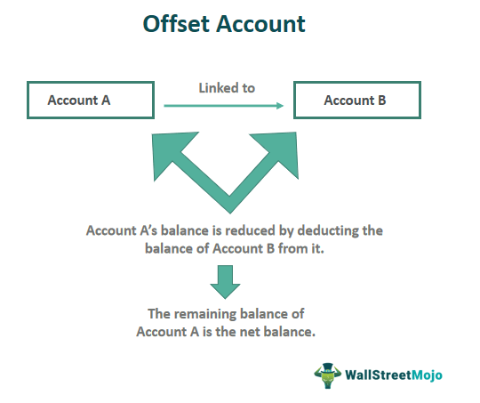

## Table of Contents

## What is an offsetting transaction?

An offsetting transaction is when you make a new trade to cancel out or reduce the effect of an earlier trade. Imagine you bought something and now you want to sell it to get back to where you started. That's an offsetting transaction. People often use these in financial markets to manage risk or to close out positions they no longer want to hold.

For example, if you bought 100 shares of a company and the price went up, you might decide to sell those 100 shares to lock in your profit. By selling the same amount of shares you bought, you offset your original purchase. This way, you end up with no shares and the profit from the price increase. Offsetting transactions are common in trading because they help people control their investments and manage potential losses.

## Why are offsetting transactions important in finance?

Offsetting transactions are important in finance because they help people manage their risks. When someone makes an investment, they might worry about losing money if the market goes down. By using an offsetting transaction, they can reduce or eliminate that risk. For example, if someone buys a stock and it starts to drop in value, they can sell the same amount of that stock to avoid further loss. This way, they can protect their money and feel more secure about their investments.

Another reason offsetting transactions are important is that they help people lock in profits. If an investment goes up in value, someone might want to keep that gain instead of risking it going down again. By selling the investment at a high price, they can offset their original purchase and keep the profit. This is a common strategy in trading because it allows people to take advantage of good market conditions and make the most out of their investments.

## Can you provide a simple example of an offsetting transaction?

Imagine you bought 50 shares of a company called ABC Corp for $10 each. A few weeks later, the price of ABC Corp's shares goes up to $15 each. You decide you want to keep the profit you've made, so you sell those 50 shares at the new price of $15 each. By selling the same number of shares you bought, you've made an offsetting transaction.

When you sold the shares, you offset your original purchase. You started with no shares and $500 (50 shares x $10 each). After selling, you still have no shares, but now you have $750 (50 shares x $15 each). The difference between what you paid and what you got back is your profit of $250. This simple example shows how offsetting transactions can help you lock in gains and manage your investments.

## How do offsetting transactions work in the context of derivatives?

In the world of derivatives, offsetting transactions are used to manage risk and close out positions. Imagine you bought a futures contract that promises to buy a certain amount of oil at a set price in the future. If the price of oil starts to go down, you might worry about losing money. To avoid that, you can make an offsetting transaction by selling a futures contract with the same terms as the one you bought. This way, you cancel out your original contract, and you don't have to worry about the falling price of oil anymore.

Offsetting transactions in derivatives can also help you lock in profits. Let's say the price of oil goes up instead, and your futures contract is now worth more than what you paid for it. You can sell a futures contract with the same terms to offset your original purchase. By doing this, you can keep the profit you made from the increase in oil prices. This strategy is common in trading derivatives because it helps people control their investments and manage their financial risks.

## What is the difference between an offsetting transaction and a hedging strategy?

An offsetting transaction and a hedging strategy both help people manage risk, but they work in different ways. An offsetting transaction is when you make a new trade to cancel out an earlier trade. For example, if you bought something and now you want to sell it to get back to where you started, that's an offsetting transaction. It's like hitting the undo button on your original trade. You use it to close out a position completely, either to lock in a profit or to avoid a loss.

A hedging strategy, on the other hand, is like putting on a safety net. Instead of canceling out your original trade, you make another trade that protects you from big losses if things go wrong. For example, if you own a stock and you're worried it might go down, you might buy an option that lets you sell the stock at a set price. This way, even if the stock price falls, you're protected. Hedging doesn't cancel out your original position; it just makes it safer. So, while offsetting transactions are about closing out positions, hedging is about reducing risk while keeping your original investment.

## How do offsetting transactions affect a company's financial statements?

When a company makes an offsetting transaction, it can change the numbers on its financial statements. For example, if a company bought some shares and then sold them to offset the purchase, the sale would show up on the income statement as revenue. If the company made a profit from the sale, that profit would increase the net income. On the other hand, if the company lost money, that loss would decrease the net income. The cash flow statement would also change because the money from selling the shares would show up as cash coming in.

Offsetting transactions can also affect the balance sheet. When a company first buys the shares, it shows up as an asset on the balance sheet. When the company sells those shares to offset the purchase, the asset goes away, and the cash from the sale appears instead. This changes the total assets and the cash balance on the balance sheet. If the company made a profit or loss from the transaction, that would also affect the equity section of the balance sheet, either increasing or decreasing the retained earnings.

## What are the tax implications of offsetting transactions?

When you make an offsetting transaction, it can affect how much tax you have to pay. If you make a profit from selling something you bought earlier, that profit is usually considered a capital gain. You'll have to pay taxes on that gain, but the rate depends on how long you held the asset. If you held it for less than a year, it's a short-term capital gain, and you'll pay your regular income tax rate. If you held it for more than a year, it's a long-term capital gain, and the tax rate is usually lower.

On the other hand, if you lose money on the offsetting transaction, you might be able to use that loss to reduce your taxes. This is called a capital loss. You can use capital losses to offset capital gains, which means you'll pay less tax on any profits you made from other investments. If your losses are more than your gains, you can even use some of the loss to reduce your regular income, up to a certain limit. This can help lower your overall tax bill.

## In what ways can offsetting transactions be used in risk management?

Offsetting transactions are a great way to manage risk because they let you undo a trade you made earlier. Imagine you bought some stock, and now you're worried it might lose value. You can sell that same stock to cancel out your original purchase. This way, if the stock price goes down, you won't lose money because you've already sold it. It's like hitting the undo button on your trade, helping you avoid losses and feel safer about your investments.

Offsetting transactions can also help you lock in profits. Let's say you bought some stock, and the price went up. You can sell the stock at the higher price to make sure you keep the profit. By doing this, you offset your original purchase and end up with no stock but with the money you made from the price increase. This is a common strategy in trading because it lets you take advantage of good market conditions and protect your gains.

## What are the regulatory considerations for offsetting transactions?

When you make offsetting transactions, you need to think about the rules that govern them. Different countries have different rules about how you can buy and sell things to cancel out earlier trades. For example, in the United States, the Securities and Exchange Commission (SEC) and the Commodity Futures Trading Commission (CFTC) have rules to make sure people don't use offsetting transactions to cheat or hide what they're doing. These rules are there to keep the market fair and to make sure everyone follows the same guidelines.

Another thing to consider is how offsetting transactions are reported. Some places require you to tell them about your trades, including offsetting ones, so they can keep track of what's happening in the market. This helps them spot any problems or unusual activity. It's important to know these rules because if you don't follow them, you could get in trouble or have to pay fines. So, always check the rules in your area before you make any offsetting transactions.

## How do offsetting transactions impact liquidity in financial markets?

When people make offsetting transactions, they can affect how easy it is to buy or sell things in the market. This is called liquidity. If lots of people are making offsetting transactions, it can make the market more liquid. That's because when someone wants to buy something, there are more people selling, and when someone wants to sell, there are more people buying. This makes it easier for everyone to trade without big changes in price.

On the other hand, if too many people are making offsetting transactions at the same time, it could make the market less liquid. Imagine everyone wants to sell the same thing at the same time to offset their earlier buys. There might not be enough people wanting to buy, so it becomes harder to sell. This can lead to bigger price changes and less smooth trading. So, offsetting transactions can help keep the market running smoothly, but they need to be balanced with other kinds of trading.

## Can you explain the role of offsetting transactions in algorithmic trading?

In algorithmic trading, computers use math and rules to make trades very quickly. Offsetting transactions are important because they help these computers manage risk and close out positions. Imagine a computer buys a stock and then the price starts to go down. The computer can use an offsetting transaction to sell the same stock and avoid losing money. This way, the computer can keep the market balanced and make sure it doesn't lose too much.

Offsetting transactions also help algorithmic trading systems lock in profits. If a computer buys a stock and the price goes up, it can sell the stock at the higher price to make a profit. By doing this, the computer offsets its original purchase and keeps the money it made from the price increase. This is a smart way for computers to take advantage of good market conditions and manage their investments without human help.

## What advanced strategies involve the use of offsetting transactions in complex financial instruments?

In the world of complex financial instruments like options and futures, offsetting transactions are often used in advanced strategies like delta hedging. Imagine you bought an option that gives you the right to buy a stock at a certain price. If the stock price starts to move a lot, you might worry about losing money. To manage this risk, you can make an offsetting transaction by buying or selling the stock itself. This helps balance out the changes in the option's value, making your investment safer. It's like putting on a seatbelt while driving; it doesn't stop the car, but it keeps you safe if something goes wrong.

Another advanced strategy is called pairs trading, where you buy one stock and sell another at the same time. The idea is that these two stocks move in opposite ways, so if one goes down, the other goes up. You can use offsetting transactions to close out these positions when you want to lock in your profit or cut your losses. For example, if the stock you bought goes up and the one you sold goes down, you can make offsetting transactions to sell the first stock and buy back the second. This way, you can take advantage of the price differences between the two stocks and manage your risk at the same time.

## References & Further Reading

[1]: Narang, R. K. (2013). ["Inside the Black Box: A Simple Guide to Quantitative and High Frequency Trading"](https://onlinelibrary.wiley.com/doi/book/10.1002/9781118662717). John Wiley & Sons.

[2]: Chan, E. (2009). ["Quantitative Trading: How to Build Your Own Algorithmic Trading Business"](https://github.com/ftvision/quant_trading_echan_book). John Wiley & Sons.

[3]: Lopez de Prado, M. (2018). ["Advances in Financial Machine Learning"](https://www.amazon.com/Advances-Financial-Machine-Learning-Marcos/dp/1119482089). Wiley.

[4]: Hunt, P. J., & Kennedy, J. E. (2004). ["Financial Derivatives in Theory and Practice"](https://onlinelibrary.wiley.com/doi/book/10.1002/0470863617). Wiley.

[5]: Jansen, S. (2020). ["Machine Learning for Algorithmic Trading: Predictive models to extract signals from market and alternative data for systematic trading strategies with Python"](https://www.amazon.com/Machine-Learning-Algorithmic-Trading-alternative/dp/1839217715). Packt Publishing.