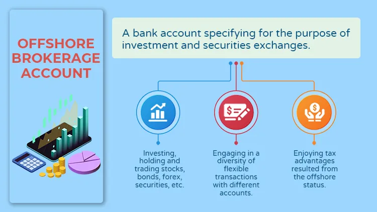

## Table of Contents

## What is offshore investment?

Offshore investment means putting your money into financial products or businesses in a different country than where you live. People do this for many reasons, like trying to pay less tax, protecting their money from problems in their home country, or finding better investment opportunities. For example, if you live in the United States, you might invest in a company in Singapore because you think it will grow faster than companies at home.

It's important to know that offshore investing can be tricky. Different countries have different rules about taxes and what you can and can't do with your money. Sometimes, it can be hard to keep track of everything, and you might need help from experts like lawyers or financial advisors. Also, there can be risks, like changes in the foreign country's laws or economic problems that could affect your investment. So, while offshore investing can be a good way to grow your money, it's important to be careful and do your homework first.

## Why do people consider offshore investments?

People think about offshore investments because they want to make their money grow or keep it safe. One big reason is to pay less in taxes. Some countries have lower tax rates or special rules that can help you keep more of your money. Another reason is to spread out risk. If something goes bad in your home country, like a big economic problem or a new law that affects your money, your investments in another country might be okay. It's like not putting all your eggs in one basket.

Also, people look for better investment chances. Sometimes, other countries have growing businesses or new markets that can make more money than what's available at home. For example, a country might have a booming tech industry or be building a lot of new things. By investing there, you could make more money than if you just kept your money in your home country. But, it's important to be careful because investing in another country can be complicated and there are risks, like changes in laws or economic troubles in that country.

## What are the common types of offshore investments?

Offshore investments come in many forms, but some common types include offshore bank accounts, mutual funds, and real estate. An offshore bank account is just a regular bank account in another country. People use these to save money in a different currency or to take advantage of better interest rates. Offshore mutual funds are similar to regular mutual funds, but they are managed in a different country. They can offer a way to invest in a variety of companies or industries that might not be available at home. Real estate is another popular choice. People buy property in another country to rent it out, hoping the value will go up over time.

Another type of offshore investment is investing in stocks or bonds from companies in other countries. This can be done directly or through an offshore broker. Some people also invest in hedge funds or private equity funds that are set up in offshore financial centers. These are usually for people with a lot of money who are looking for high returns, but they can also be riskier. Each type of investment has its own benefits and risks, so it's important to understand them before putting your money into any offshore investment.

## How does tax efficiency play a role in offshore investments?

Tax efficiency is a big reason why people choose offshore investments. Some countries have lower taxes or special rules that can help you keep more of your money. For example, if you invest in a country with lower capital gains tax, you might pay less tax on the money you make from selling your investments than you would at home. This can make a big difference in how much money you get to keep at the end of the day.

But, it's not always simple. Different countries have different tax laws, and what works in one place might not work in another. Also, many countries have rules to stop people from avoiding taxes by moving their money offshore. This means you have to be careful and might need to work with a tax advisor to make sure you're doing everything right. While offshore investments can help with tax efficiency, it's important to understand the rules and risks before you start.

## What are the potential risks associated with offshore investments?

Offshore investments can be risky because they involve putting your money into another country, which means you have to deal with different rules and laws. If the country changes its laws, like raising taxes or putting new restrictions on foreign investors, your investment could be affected. Also, if there's an economic problem in that country, like a recession or a currency crisis, your money could lose value. It's hard to keep track of everything happening in another country, so you might miss important news that could impact your investment.

Another risk is fraud or scams. Since offshore investments are less regulated than domestic ones, it's easier for bad people to set up fake investment schemes. If you invest in something that turns out to be a scam, you could lose all your money. Plus, if something goes wrong, it can be harder to get your money back because you're dealing with another country's legal system, which might not protect you as well as your home country's laws. So, while offshore investments can offer benefits, they come with these extra risks that you need to think about carefully.

## How can offshore investments impact my home country's tax obligations?

When you invest offshore, it can change how much tax you owe in your home country. Many countries have rules to stop people from avoiding taxes by moving their money to other places. So, even if you invest in another country, you might still have to pay taxes on that money back home. For example, if you make money from selling stocks in another country, you might have to report that income and pay taxes on it in your home country.

It's important to know the tax laws in your home country because they can be complicated. Some countries have agreements with other countries to share information about people's money, which makes it harder to hide income. If you don't report your offshore investments correctly, you could get in trouble and have to pay fines or even face legal action. Talking to a tax advisor can help you understand what you need to do to stay on the right side of the law.

## What are the legal and regulatory considerations for offshore investing?

Offshore investing involves different laws and rules than investing at home. Each country has its own set of regulations that you need to follow. For example, some countries have strict rules about who can invest and how much money they can move in and out. You also need to know about the laws in your home country because they might require you to report your offshore investments and pay taxes on any money you make. If you don't follow these rules, you could get in trouble, like having to pay fines or even facing legal action.

Another important thing to think about is how countries share information. Many countries have agreements to share details about people's money to stop tax evasion. This means that even if you invest in another country, your home country might still find out about it. It's a good idea to work with a lawyer or a financial advisor who knows about offshore investing. They can help you understand all the rules and make sure you're doing everything the right way.

## How do geopolitical factors influence offshore investment decisions?

Geopolitical factors can really change how you think about offshore investments. Things like political stability, international relations, and economic policies in the country where you want to invest can make a big difference. If a country has a lot of political problems or if there's tension with other countries, it might not be a safe place to put your money. For example, if a country is about to have an election and there's a chance of big changes in government, you might worry about what those changes could mean for your investments.

Also, economic sanctions or trade wars can affect your offshore investments. If one country puts sanctions on another, it can make it hard to move money in and out or to sell your investments. Trade wars can also hurt the economy of the country you're investing in, which could lower the value of your investments. So, it's important to keep an eye on what's happening in the world and how it might impact the places where you're thinking about investing your money.

## What are the differences between onshore and offshore investment strategies?

Onshore and offshore investment strategies differ mainly in where the money is invested and the rules you have to follow. Onshore investments are made within your home country, so you're dealing with familiar laws and regulations. This can be easier to manage because you understand the local tax rules and economic conditions. Onshore investments might include buying stocks, bonds, or real estate in your own country. The downside is that you're limited to the opportunities available at home, and you might have to pay higher taxes.

Offshore investments, on the other hand, involve putting your money into another country. This can open up new opportunities and sometimes lower taxes, but it also comes with more complexity. You have to learn about the laws and economic conditions of the foreign country, which can be challenging. Offshore investments might include opening a bank account abroad, investing in international mutual funds, or buying property in another country. While this can diversify your portfolio and potentially reduce your tax burden, it also carries risks like political instability or changes in foreign laws that could affect your investments.

Both strategies have their pros and cons. Onshore investing is often safer and easier to manage, but it might not offer the same tax advantages or investment opportunities as offshore investing. Offshore investing can be more rewarding but requires more careful planning and understanding of international laws and risks. Deciding which strategy to use depends on your financial goals, risk tolerance, and the amount of time you can spend managing your investments.

## How can one assess the credibility and safety of offshore investment jurisdictions?

To assess the credibility and safety of offshore investment jurisdictions, you need to look at a few things. First, check the political stability of the country. A place with a stable government and good relations with other countries is usually safer for your money. Also, see if the country has a good reputation for protecting investors. Some countries have strong laws and regulations that make sure your investments are safe and that you can get your money back if something goes wrong. You can find out about this by reading reports from financial organizations or talking to experts who know about that country.

Another important thing to look at is the country's economic health. If the economy is doing well and growing, it's more likely that your investments will do well too. But if the economy is struggling, your money might be at risk. Also, check if the country is involved in any international agreements to stop tax evasion and money laundering. These agreements can make it safer for you to invest there because they help keep everything transparent and fair. Talking to a financial advisor who knows about offshore investing can also help you figure out which jurisdictions are the most credible and safe for your money.

## What advanced strategies can be used to optimize offshore investment portfolios?

To make your offshore investment portfolio better, you can use a strategy called diversification. This means spreading your money across different countries and types of investments. For example, instead of putting all your money in one country or one kind of investment, you could invest in stocks in one country, real estate in another, and bonds in a third. This way, if something bad happens in one place, like a big economic problem, your whole portfolio won't be affected as much. Another smart move is to use currency hedging. This helps protect your money from changes in the value of different currencies. If you're worried that the currency of the country you're investing in might lose value, you can use financial tools to balance that risk.

Another advanced strategy is to use offshore trusts or foundations. These can help you manage your money in a way that might save on taxes and keep your investments private. For example, you can set up a trust in a country with good tax laws, and then move some of your money into it. This can help you pay less in taxes and keep your financial information safe. But, it's really important to work with a good lawyer or financial advisor when you're setting up these kinds of structures. They can help you make sure everything is done the right way and that you're following all the laws in both your home country and the country where you're investing.

## How do global economic trends affect the performance of offshore investments?

Global economic trends can really change how well your offshore investments do. If the world economy is doing well, with countries growing and people spending more money, your investments in different countries might go up in value. For example, if there's a big demand for tech products around the world, your investments in tech companies in other countries could make you a lot of money. But if the world economy is struggling, like during a global recession, your offshore investments might lose value. Countries might not be growing as much, and people might be spending less, which can hurt the companies you've invested in.

Another way global economic trends affect offshore investments is through changes in interest rates and currency values. If a country raises its interest rates, its currency might become stronger, which could be good or bad for your investments depending on where your money is. If the currency gets stronger, the value of your investments in that country might go up when you convert them back to your home currency. But if the currency gets weaker, your investments might be worth less. Also, if there's a big change in the world economy, like a trade war or a big drop in oil prices, it can cause big swings in currency values and interest rates, which can make your offshore investments more risky.

## References & Further Reading

[1]: Mitchell, A. (2011). ["Offshore Financial Centers and Regional Development"](https://www.imf.org/external/np/mae/oshore/2000/eng/back.htm). World Politics, 63(1), 51-90.

[2]: Lopez de Prado, M. (2018). ["Advances in Financial Machine Learning."](https://www.amazon.com/Advances-Financial-Machine-Learning-Marcos/dp/1119482089) Wiley.

[3]: Palan, R. (2010). ["Tax Havens: How Globalization Really Works"](https://www.jstor.org/stable/10.7591/j.ctt28545x) Cornell University Press.

[4]: Jansen, S. (2020). ["Machine Learning for Algorithmic Trading: Predictive models to extract signals from market and alternative data for systematic trading strategies with Python"](https://github.com/stefan-jansen/machine-learning-for-trading) Packt Publishing.

[5]: Godfrey, S. (2021). ["Global Offshore Financial Centers: Analysis and Evaluation"](https://www.sciencedirect.com/science/article/pii/S0016718597000225) Journal of International Financial Management & Accounting, Vol. 32, Issue 3.