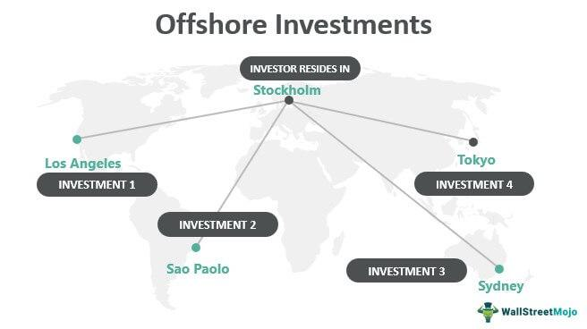

Offshore investing, a term commonly associated with the utilization of financial services in jurisdictions outside an investor's country of residence, has become a significant component of the modern financial landscape. This relevance stems from a range of benefits that offshore finance offers, such as tax efficiency, diversification, and access to broader market opportunities. Offshore finance encompasses financial activities and services conducted in foreign jurisdictions, often in regions with favorable regulatory environments. Its significance lies in its ability to provide opportunities for high-net-worth individuals and corporations to optimize their financial strategies by leveraging international platforms and legal structures.

The purpose of this article is to explore both the advantages and drawbacks of offshore investment while examining the role of algorithmic trading in this context. Algorithmic trading, characterized by the use of computer programs to execute trades at high speed and volume based on pre-defined criteria, has become increasingly important in enhancing the efficacy of offshore investments. Understanding the interplay between these two financial elements is crucial for investors aiming to optimize their investment strategies.

Offshore investing comes with both potential rewards and inherent risks, necessitating a comprehensive understanding of the various facets involved. On one hand, offshore investments can offer tax benefits, diversification of assets, and access to global markets. On the other hand, they are subject to regulatory challenges, compliance requirements, and geopolitical risks. Thus, individuals and corporations considering offshore investments must carefully assess both the potential benefits and the associated risks.

This article is structured to cover key aspects of offshore investing and algorithmic trading, including the definition and historical context of offshore finance, the advantages and challenges of offshore investments, the mechanics and benefits of algorithmic trading, and the pros and cons of integrating these approaches. By examining these topics, we aim to provide a balanced perspective on the strategic benefits and challenges of offshore investing in conjunction with algorithmic trading.

## Table of Contents

## What is Offshore Investing?

Offshore investing refers to the process of keeping money outside one's country of residence, typically to leverage financial, legal, or tax advantages offered by foreign jurisdictions. Offshore investments can encompass a variety of asset classes, including stocks, bonds, real estate, and mutual funds, allowing investors to diversify their portfolios beyond domestic markets.

The concept and practice of offshore investing have evolved over centuries. Historically, offshore financial centers (OFCs) emerged from regions with stable political environments and favorable banking regulations. These centers became known for providing investors from around the globe with opportunities to protect their wealth and access international markets. Notably, OFCs like Switzerland and Liechtenstein began attracting individuals seeking privacy and asset protection in the early 20th century. Over time, other regions like the Cayman Islands, Bermuda, and Singapore developed robust financial services industries, furthering their appeal as offshore investment hubs.

Several countries and regions distinguish themselves as prominent offshore investing destinations. The Cayman Islands, renowned for its zero-tax regime, hosts numerous hedge funds and financial institutions. Luxembourg offers a stable economic environment and comprehensive regulation for investment funds, while Singapore presents a gateway to Asian markets with its strategic location and advanced financial infrastructure. These jurisdictions have tailored their financial regulations to cater to global investors, often providing a high degree of privacy and sophisticated financial products.

Investors may choose to invest offshore for various reasons. Offshore jurisdictions often offer tax advantages, such as reduced income or capital gains taxes, which can result in significant savings. Risk diversification is another compelling motive; by allocating assets in different countries, investors can reduce exposure to economic or political uncertainties in their home country. Additionally, offshore investing grants access to international asset classes and markets that may not be available domestically, enabling a broader range of investment opportunities.

It is crucial to differentiate between legal offshore investing and illicit activities like tax evasion. Legal offshore investing involves transparent and compliant practices in accordance with both home and host country laws. Investors are obliged to disclose offshore assets to relevant tax authorities, adhering to regulations such as the Foreign Account Tax Compliance Act (FATCA) in the United States or the Common Reporting Standard (CRS) initiated by the OECD. Conversely, tax evasion involves deliberately concealing assets or income from tax authorities, an illegal act subject to severe penalties. Thus, while offshore investing offers various legitimate benefits, it requires careful navigation of legal obligations to ensure compliance.

## Advantages of Offshore Investing

Offshore investing offers several advantages that have made it an attractive option for many investors. One of the foremost benefits is tax efficiency. Many offshore jurisdictions provide favorable tax conditions, allowing investors to minimize their tax liabilities legally. These jurisdictions may offer low or zero tax rates on certain types of income, such as capital gains, dividends, or interests, subject to compliance with international laws and regulations.

Diversification is another significant advantage of offshore investing. By investing offshore, investors can spread their assets across various markets and financial instruments, reducing the risks associated with being heavily invested in a single domestic market. This geographic diversification can help mitigate country-specific economic or political risks and enhance the overall stability of an investment portfolio.

Access to international markets and diverse investment products is a key feature of offshore investing. Investors can tap into opportunities not available in their home countries, including emerging markets with high growth potential and specialized investment vehicles such as hedge funds or private equity funds. This access allows investors to potentially achieve higher returns by participating in opportunities with different risk and return profiles.

Privacy and confidentiality are often cited as motivations for offshore investing. Offshore jurisdictions typically have stringent privacy laws that protect the identity and financial information of investors. While transparency standards have evolved due to international anti-money laundering efforts, certain levels of confidentiality remain, making offshore accounts attractive to those concerned about privacy.

Finally, the potential for higher returns is an attractive feature of offshore investments. By accessing a broad range of international or emerging markets, investors can pursue higher yield opportunities not available domestically. These diverse landscapes often present investment opportunities with differing levels of risk, providing the potential for enhanced returns when carefully managed. However, it is crucial for investors to conduct thorough due diligence and remain informed of all associated risks to maximize the benefits of offshore investing.

## Risks and Challenges of Offshore Investing

Offshore investing presents a variety of risks and challenges that investors must consider carefully. One significant concern is regulatory scrutiny and frequent changes in international financial laws. Offshore jurisdictions are often under the microscope of global regulatory bodies like the Financial Action Task Force (FATF) and the Organization for Economic Co-operation and Development (OECD), which continuously update rules to combat money laundering and tax evasion. These changes can abruptly impact the legal standing and operational feasibility of offshore investments, requiring investors to stay constantly updated.

Managing offshore accounts also tends to be more complex and costly than domestic investments. This complexity arises from the need to navigate different legal systems, varied financial regulations, and often the requirement to engage multiple service providers such as international tax advisors, legal consultants, and local financial institutions. These additional services can significantly increase the overall cost of maintaining offshore investments, reducing the net benefit potential.

Investors face the risk of legal repercussions if compliance standards are not diligently followed. Non-compliance with international financial laws can result in severe penalties, including hefty fines, asset seizures, and even criminal charges. This risk is exacerbated by differences in legal standards across jurisdictions, necessitating precise understanding and adherence to each region's regulations to maintain the legal integrity of offshore investments.

Currency and geopolitical risks are inherent in international investments. Exchange rate fluctuations can affect the value of offshore assets, influencing investment returns. Geopolitical events such as political unrest, economic sanctions, or changes in government policies can also destabilize offshore markets, posing threats to the security and profitability of investments.

Furthermore, repatriating funds from offshore accounts presents distinct challenges. Investors must navigate varying foreign taxation policies that can affect the net proceeds of transferred funds. Understanding and managing these taxation differences is crucial to maximizing the benefits of offshore investment returns while ensuring compliance with both foreign and domestic tax laws.

To mitigate these risks, investors should conduct thorough due diligence and might consider engaging expert advisors familiar with the unique landscape of offshore investing. This approach helps ensure adherence to international laws, efficient cost management, and strategic navigation of geopolitical and currency risks.

## Understanding Algorithmic Trading in Offshore Finance

Algorithmic trading, often referred to as algo trading, has become a cornerstone of modern financial markets. By leveraging computer programs to execute trades based on predefined criteria, [algorithmic trading](/wiki/algorithmic-trading) enables investors to achieve improved execution speed and precision, along with a reduction in costs. The rise of high-frequency trading, the availability of substantial market data, and technological advancements have catalyzed its growth, making it a crucial component of offshore investments.

In the context of offshore investments, algorithmic trading offers unique advantages. Offshore accounts can benefit from the rapid execution capabilities of algorithms, facilitating transactions in diverse international markets without the delays that manual trading might involve. The strategic use of algorithms allows for the exploitation of [arbitrage](/wiki/arbitrage) opportunities across different financial markets worldwide. For instance, exchange rate fluctuations or discrepancies between commodity prices in various regions can be capitalized upon using algos designed for specific strategic objectives.

**Advantages of Algorithmic Trading in Offshore Accounts:**
1. **Efficiency and Speed**: Algorithms can process vast volumes of data swiftly, ensuring timely execution of trades to capture fleeting opportunities.
2. **Cost Reduction**: By automating trading processes, offshore investors can reduce transaction costs and brokerage commissions compared to traditional trading.
3. **Precision**: Algorithms can minimize human errors, ensuring more accurate trade execution, crucial when dealing with complex international markets.
4. **Strategic Flexibility**: Algorithms can be tailored for specific trading strategies, ranging from simple market making to complex statistical arbitrage.

However, algorithmic trading is not without its challenges and risks. One major concern is the technological dependency that comes with it. This reliance means that any system failure or latency issues could lead to significant financial losses. Furthermore, as misinterpretations of market data can occur, algorithms could potentially execute erroneous trades based on inaccurate inputs. The competitive nature of algorithmic trading further implies a need for substantial initial investments in both technological infrastructure and expertise.

Challenges include:
- **Technological Risks**: Failures in software or hardware can lead to erroneous trades, causing potential financial damage.
- **Market Risks**: Rapid changes in market conditions can render some algorithms ineffective, leading to unexpected losses.
- **Regulatory Risks**: Offshore jurisdictions may have varied regulations, necessitating thorough compliance to avoid legal complications.

A case study illustrating the application of algorithmic trading in offshore finance is the use of algorithms in the [forex](/wiki/forex-system) markets by international hedge funds. These funds employ sophisticated algorithms to exploit minute price differentials between currency pairs across multiple overseas exchanges. Despite thin profit margins on individual trades, the high [volume](/wiki/volume-trading-strategy) and speed achievable by algorithmic trading can yield substantial returns.

In conclusion, understanding the nuanced integration of algorithmic trading into offshore finance highlights its potential benefits but also underscores the necessity for careful management of its associated risks.

## Pros and Cons of Combining Offshore Investing and Algo Trading

The integration of algorithmic trading into offshore investment strategies offers a multitude of advantages primarily characterized by enhanced efficiency, speed, and data-driven decision-making. Algorithmic trading, which employs computer algorithms to execute investment strategies at high velocity, enables investors to capitalize quickly on market fluctuations. This rapid execution is particularly advantageous in offshore investing where accessing international markets is crucial for maximizing potential returns.

One significant benefit of algorithmic trading is the ability to process large data sets to identify optimal trading opportunities that might be invisible to the human eye. By using predictive models and [machine learning](/wiki/machine-learning) algorithms, investors can detect market trends and anomalies across different time zones, thus optimizing the asset allocation and timing of investments to enhance overall portfolio performance.

However, the integration does not come without challenges. A primary concern is the technological dependency that it necessitates. The reliance on complex algorithms means that any technological failure or error in the models could lead to substantial financial losses. Furthermore, the initial investment required for developing or acquiring sophisticated trading systems can be quite substantial, often limiting this strategy to larger, more established investors or financial firms.

Despite these challenges, there are notable examples of successful implementations of this strategy. Quantitative hedge funds, for instance, often use algorithmically-driven offshore strategies to exploit arbitrage opportunities across various global markets. These funds demonstrate the potential for high returns when algorithmic trading is effectively paired with the diversification benefits offered by offshore investing.

Balancing the risks and rewards of combining offshore investing and algorithmic trading involves a careful evaluation of one's technological infrastructure and risk management strategies. Investors must ensure robust compliance frameworks to mitigate legal and regulatory risks, as well as continuously update and refine algorithms to adapt to rapidly changing market conditions. In conclusion, while the combination of offshore investing and algorithmic trading presents significant opportunities for enhanced returns and diversification, it requires meticulous planning, substantial investment in technology, and comprehensive risk management to harness its full potential successfully.

## Conclusion

Offshore investing and algorithmic trading have become significant components in the contemporary financial landscape, offering both opportunities and challenges. Offshore investing allows for tax efficiency, diversification, access to international markets, and potential for higher returns. However, it also comes with complexities such as regulatory scrutiny, compliance issues, and geopolitical risks. Algorithmic trading, on the other hand, enhances the investment process through speed, efficiency, and data-driven decisions, yet it carries technological risks and requires a high initial investment.

It is crucial for investors to conduct thorough research and consult with financial experts to navigate these multifaceted domains effectively. Recognizing the balance between potential gains and inherent challenges is essential. As the regulatory environment continually evolves, maintaining compliance and staying informed about international financial laws is critical to avoiding legal repercussions.

Investors are encouraged to consider the strategic advantages of combining offshore investing with algorithmic trading, mindful of the associated risks. In doing so, they can optimize investment strategies while remaining vigilant against potential pitfalls. Exercising caution, due diligence, and strategic planning can help in leveraging the benefits of these powerful financial tools.

## References & Further Reading

[1]: Mitchell, A. (2011). ["Offshore Financial Centers and Regional Development"](https://www.imf.org/external/np/mae/oshore/2000/eng/back.htm). World Politics, 63(1), 51-90.

[2]: Lopez de Prado, M. (2018). ["Advances in Financial Machine Learning."](https://www.amazon.com/Advances-Financial-Machine-Learning-Marcos/dp/1119482089) Wiley.

[3]: Palan, R. (2010). ["Tax Havens: How Globalization Really Works"](https://www.jstor.org/stable/10.7591/j.ctt28545x) Cornell University Press.

[4]: Jansen, S. (2020). ["Machine Learning for Algorithmic Trading: Predictive models to extract signals from market and alternative data for systematic trading strategies with Python"](https://github.com/stefan-jansen/machine-learning-for-trading) Packt Publishing.

[5]: Godfrey, S. (2021). ["Global Offshore Financial Centers: Analysis and Evaluation"](https://www.sciencedirect.com/science/article/pii/S0016718597000225) Journal of International Financial Management & Accounting, Vol. 32, Issue 3.