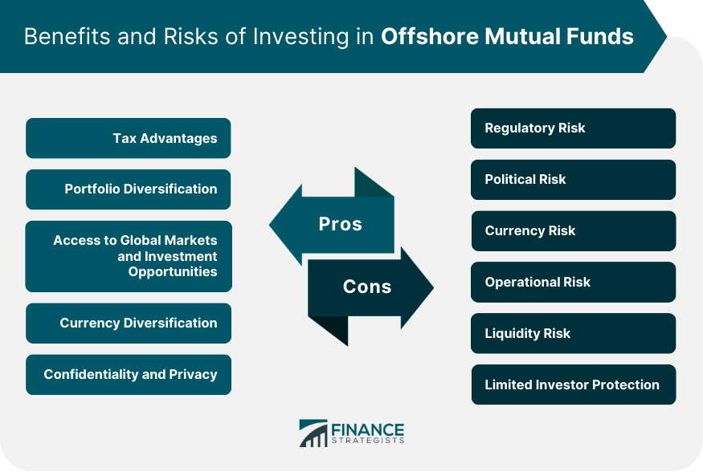

## Table of Contents

## What is an offshore mutual fund?

An offshore mutual fund is a type of investment fund that is registered and operated in a country different from where the investors live. These funds are often set up in places like the Cayman Islands, Luxembourg, or Ireland because these locations have favorable tax laws and regulations. This means that investors might pay less in taxes compared to investing in a fund in their home country.

People might choose offshore mutual funds for various reasons. One big reason is the potential for tax benefits. Another reason is to diversify their investments by putting money into different markets around the world. However, there are also risks involved. Since these funds are based in other countries, they can be harder to regulate and monitor, which might make them riskier. It's important for investors to do their research and understand these risks before investing.

## How does an offshore mutual fund differ from a domestic mutual fund?

An offshore mutual fund and a domestic mutual fund are similar in that they both pool money from many investors to buy a variety of investments like stocks, bonds, or other assets. The main difference is where they are based and operated. An offshore mutual fund is set up in a country outside of where the investor lives, often in places like the Cayman Islands or Luxembourg. On the other hand, a domestic mutual fund is based in the investor's home country, like the United States or the United Kingdom.

The location of these funds can lead to different benefits and risks. Offshore mutual funds often attract investors because they might offer tax advantages. For example, they might be located in countries with lower tax rates or more favorable tax treaties. This can mean that investors might pay less in taxes. However, there are also more risks with offshore funds. They can be harder to regulate and monitor because they are based in another country. This might make them riskier, and it's important for investors to understand these risks. Domestic mutual funds, while typically not offering the same tax benefits, are usually easier to oversee and may be seen as more secure because they are subject to the laws and regulations of the investor's home country.

## What are the potential benefits of investing in offshore mutual funds?

One big benefit of investing in offshore mutual funds is the chance to save on taxes. These funds are often set up in places like the Cayman Islands or Luxembourg, where the tax rules can be more favorable. This means that investors might not have to pay as much in taxes as they would if they invested in a fund in their own country. This can help them keep more of their earnings.

Another advantage is that offshore mutual funds can help investors spread their money across different markets around the world. This is called diversification, and it's a way to reduce risk. By putting money into different countries and types of investments, investors can protect themselves if one market does poorly. Offshore funds give them more options to do this, which can make their overall investment strategy stronger.

## What are the common risks associated with offshore mutual funds?

One common risk of offshore mutual funds is that they can be harder to keep an eye on. Since these funds are set up in other countries, they might not have to follow the same strict rules and regulations as funds in your home country. This can make it tougher for investors to know exactly what's going on with their money. If something goes wrong, it might be harder to get help or to get your money back.

Another risk is that offshore funds can be affected by political and economic changes in the countries where they are based. If there's a big change in the government or the economy of that country, it could impact the fund's performance. This kind of uncertainty can make investing in offshore funds riskier than sticking to funds in your own country.

Finally, there's also the risk of currency changes. When you invest in an offshore fund, you're often dealing with money in a different currency. If the value of that currency goes down compared to your own currency, it can reduce the value of your investment. This is something to think about, especially if you're not used to dealing with foreign currencies.

## How can offshore mutual funds help in diversifying an investment portfolio?

Offshore mutual funds can help diversify an investment portfolio by giving investors access to different markets around the world. When you invest in a fund that's based in another country, you're putting your money into different economies, industries, and companies than you might find at home. This can be a good way to spread out your risk. If one market or economy does badly, the others might do better, which can help protect your overall investment.

For example, if you live in the United States and you only invest in U.S. funds, all your money is tied to how the U.S. economy does. But if you also invest in an offshore mutual fund based in Europe or Asia, you're not putting all your eggs in one basket. This kind of diversification can make your portfolio stronger and more resilient to ups and downs in any single market. It's like having a safety net that can catch you if one part of your investments falls.

## What are the tax implications of investing in offshore mutual funds?

Investing in offshore mutual funds can sometimes help you save on taxes. These funds are often set up in countries with lower tax rates or special tax rules that can be more favorable than those in your home country. For example, if you live in a country with high taxes on investment earnings, an offshore fund might let you keep more of your profits. But remember, the tax rules can be different depending on where you live and where the fund is based. It's a good idea to talk to a tax advisor to understand how these funds might affect your taxes.

However, there are also some things to watch out for. Some countries have rules to stop people from avoiding taxes by investing offshore. These rules can mean you still have to pay taxes on your earnings from an offshore fund, even if the fund itself is in a low-tax country. Also, if you make money from an offshore fund, you might have to report it on your tax return back home. Not doing this properly can lead to fines or other problems. So, it's important to know the tax laws in your country and get advice if you're thinking about investing in offshore mutual funds.

## What regulatory considerations should be taken into account when investing in offshore mutual funds?

When you invest in offshore mutual funds, you need to think about the rules and regulations of the country where the fund is based. These funds often operate in places with less strict rules than your home country. This can be good because it might mean less paperwork and fewer restrictions. But it can also be risky. If something goes wrong with the fund, it might be harder to get help because the rules in that country might not protect you as well as the rules at home.

Another thing to consider is how your home country views offshore investments. Some countries have strict rules about investing in offshore funds to stop people from avoiding taxes or breaking other laws. You might need to report your offshore investments to your tax authority, and not doing this correctly can lead to fines or other problems. It's a good idea to understand the regulations in both the country where the fund is based and your own country before you invest. Talking to a financial advisor can help you navigate these rules and make sure you're doing everything right.

## How do geopolitical factors affect offshore mutual fund investments?

Geopolitical factors can have a big impact on offshore mutual fund investments. These funds are often based in countries that might be far away from where you live. If there's a change in the government or a big political event in that country, it can affect the fund's performance. For example, if a new government comes in and changes the rules about taxes or how businesses can operate, it could make the fund less profitable or even risky to keep your money in. Also, if there's tension or conflict between countries, it might make it harder for the fund to do well because it could affect the economy of the country where the fund is based.

Another thing to think about is how international relations can change the value of the currency where the fund is based. If the country where your offshore fund is located has a falling out with other countries, the value of its money might go down. This can reduce the value of your investment when you convert it back to your home currency. So, it's important to keep an eye on what's happening around the world because geopolitical events can shake things up and affect how well your offshore mutual fund does.

## What are the liquidity concerns with offshore mutual funds?

Offshore mutual funds can sometimes be harder to turn into cash quickly compared to funds in your own country. This is called [liquidity](/wiki/liquidity-risk-premium). When you want to sell your investment and get your money back, it might take longer if the fund is based in another country. This can be because the rules in that country might be different, or there might be fewer people buying and selling the fund's shares.

Another thing to think about is that if something big happens in the country where the fund is based, like a financial crisis or political changes, it could make it even harder to sell your investment quickly. During these times, people might want to pull their money out, but if everyone is trying to do this at the same time, it can slow things down. So, it's important to know that offshore funds might not be as easy to turn into cash as quickly as you might want.

## How can one assess the performance of an offshore mutual fund?

To assess the performance of an offshore mutual fund, you need to look at how well it has done over time. Start by checking the fund's historical returns. This tells you how much money the fund has made or lost in the past. You can compare these returns to other funds or to a benchmark, like a stock market index, to see if the fund is doing better or worse than expected. It's also helpful to look at the fund's performance during different market conditions. Did it do well when the market went up? How did it handle a downturn? This gives you a sense of how steady or risky the fund might be.

Another important thing to consider is the fees and costs of the fund. Offshore funds can have different fees than funds in your own country, and these can eat into your returns. Make sure to look at the expense ratio, which is the percentage of the fund's assets that go towards paying for its operation. Lower fees can mean more money in your pocket. Also, think about the fund manager's experience and track record. A good manager can make a big difference in how well the fund performs. By looking at all these factors together, you can get a clearer picture of whether an offshore mutual fund is a good investment for you.

## What are the best practices for managing an investment in offshore mutual funds?

Managing an investment in offshore mutual funds starts with understanding the risks and benefits. Since these funds are based in other countries, you need to keep an eye on what's happening in those places. Political changes, economic ups and downs, or shifts in currency values can all affect your investment. It's a good idea to diversify your investments, so you're not putting all your money into one fund or one country. This can help protect your money if one market does badly. Also, always check the fees and costs of the fund because they can eat into your returns.

Another important part of managing your offshore mutual fund investment is staying informed about the fund's performance. Look at the historical returns to see how the fund has done over time. Compare these returns to other funds or a benchmark like a stock market index to see if it's doing well. Pay attention to how the fund does in different market conditions, both good and bad. This can give you an idea of how risky the fund might be. Finally, consider talking to a financial advisor who knows about offshore investments. They can help you make smart choices and keep your investment on track.

## What advanced strategies can be used to mitigate risks in offshore mutual fund investments?

One advanced strategy to mitigate risks in offshore mutual fund investments is to use hedging. Hedging is like buying insurance for your investments. You can use financial tools like options or futures to protect your money from big changes in currency values or stock markets. For example, if you're worried about the currency where your offshore fund is based losing value, you can use a currency hedge to protect yourself. This can help make your investment safer, but it might also cost you some money in fees or lower returns.

Another strategy is to do a lot of research and keep a close eye on what's happening in the countries where your funds are based. This means watching the news for any political or economic changes that could affect your investment. You can also use tools like stop-loss orders, which automatically sell your investment if it drops to a certain price. This can help you limit your losses if the fund starts doing badly. It's also smart to spread your money across different types of investments and different countries. This way, if one fund or one country does poorly, you won't lose all your money.

## References & Further Reading

[1]: "Mutual Funds Offshore: A Look at the Benefits and Risks," Investment Company Institute. Available online: [www.ici.org](https://www.ici.org/doc-server/pdf%3Appr_18_summary_shareholder.pdf)

[2]: "International Diversification and the Multinational Corporation: Financial Management," by Alan C. Shapiro. Available in academic libraries or online databases.

[3]: The Economist, "The Promises and Pitfalls of Offshore Investments," February 2018. Available at: [www.economist.com](https://www.economist.com/weeklyedition/archive)

[4]: Van Duyn, A. (2015). "Algorithmic Trading: Pros and Cons," Financial Times. Available online: [www.ft.com](https://www.tejwin.com/en/insight/what-is-algorithmic-trading-a-beginners-guide-to-algorithmic-trading-including-tutorials-pros-and-cons-and-common-strategies/)

[5]: "Offshore Finance and State Power: British Corporate Taxation, 1929-1981," by Ronen Palan, available on JSTOR.