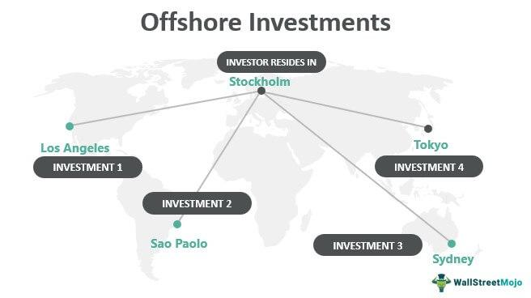

The global investment landscape is characterized by a rich tapestry of opportunities that cater to diverse investor needs and strategies. Among these opportunities, offshore mutual funds have gained prominence as a vital avenue for potential growth. Offshore mutual funds are investment vehicles domiciled in jurisdictions outside an investor's home country, often in regions renowned for their favorable tax regulations, such as the Cayman Islands and the Bahamas. These funds provide investors with exposure to international markets and offer the potential for tax-advantaged returns, making them an attractive component of a well-rounded investment portfolio.

As investors seek to optimize their portfolios, the financial advantages associated with offshore mutual funds warrant careful consideration. These funds not only offer opportunities for portfolio diversification across global markets but may also present tax benefits that enhance overall returns. Additionally, offshore funds can provide a measure of financial privacy and strategic asset protection, appealing to high-net-worth individuals concerned with confidentiality and liability management.

However, offshore mutual funds are not devoid of challenges. The promise of potentially lucrative returns comes with a set of inherent risks that investors must navigate. These risks arise from the less stringent regulatory environments typical of offshore domiciles, potentially exposing investors to political, legal, and currency volatility. Moreover, fraudulent activities can be more prevalent in jurisdictions with lax regulatory oversight, emphasizing the need for thorough due diligence before committing capital to offshore investments.

The advent of algorithmic trading introduces a sophisticated layer of management that can aid investors in navigating the complexities of offshore mutual funds. By leveraging advanced algorithms, investors can automate the buying and selling of securities within these funds, optimizing entry and exit strategies in response to real-time market data. Algorithmic trading contributes to risk mitigation and enhances liquidity management, especially crucial in highly volatile markets where quick decisions can significantly impact investment outcomes.

In summary, while offshore mutual funds present substantial opportunities for tax-efficient growth and diversification, they also pose significant challenges that demand diligent risk assessment and management. A well-informed investment strategy, potentially enhanced by algorithmic trading technologies, can improve the likelihood of success in this dynamic landscape. As investors contemplate engaging with offshore mutual funds, understanding both the financial benefits and the associated risks is imperative for making sound and strategic investment decisions.

## Table of Contents

## Understanding Offshore Mutual Funds

Offshore mutual funds are a type of investment fund registered or domiciled in a country different from the investor's own. These funds are commonly situated in jurisdictions known for favorable tax environments, often referred to as tax havens. Countries like the Bahamas and the Cayman Islands are popular choices due to their conducive tax laws and regulatory frameworks aimed at attracting foreign investment. By choosing such locations, offshore mutual funds can provide investors with exposure to a broad range of international markets while benefiting from potential tax advantages.

Investment in offshore mutual funds offers several distinct features, primarily due to the variations in governance and regulatory standards across different domiciles. The regulatory environment of these domiciles significantly impacts investor protection and potential returns. For instance, the regulations could be more lenient regarding disclosure and financial reporting, which may affect transparency. Consequently, while the potential for higher returns and tax efficiencies exists, it also introduces certain risks associated with lesser regulatory oversight.

Offshore mutual funds can be structured in various forms depending on legal and financial preferences. These structures include open-end funds, which allow investors to buy and sell shares on demand; offshore companies, which are corporate entities often used for holding and managing the investments; and unit trusts, which are trusts that pool investors' money to purchase securities. Each structure has unique governance, tax benefits, and investment flexibility, allowing investors to choose one that aligns with their financial objectives and risk tolerance.

Despite the enticing financial benefits, understanding the intricate rules governing offshore mutual funds in each domicile is crucial. The specific regulations influence the management of the funds and can dictate the extent of financial advantages an investor might reap. Therefore, investors must carefully consider these factors and perform comprehensive due diligence prior to investing in offshore mutual funds.

## Risks of Offshore Mutual Fund Investment

Investing in offshore mutual funds can present elevated risks compared to domestic options, primarily due to less stringent regulatory frameworks in their domiciles. These funds are often established in jurisdictions with favorable tax regulations but less rigorous oversight, which can lead to several potential risks that investors must evaluate thoroughly.

### Legal Changes, Political Instability, and Currency Volatility

One of the primary risks associated with offshore mutual fund investments is the susceptibility to legal changes and political instability. Countries that attract offshore investments often have evolving legal frameworks that can alter the taxation, reporting requirements, or the legality of certain investment practices. Sudden policy shifts can significantly impact the profitability and viability of offshore investments. 

Political instability in some offshore jurisdictions can lead to abrupt changes in financial policies or even the expropriation of assets, effectively rendering investments worthless. Moreover, the exposure to currency [volatility](/wiki/volatility-trading-strategies) is a crucial [factor](/wiki/factor-investing). Exchange rate fluctuations can erode the value of returns when converted back to the investor’s base currency. For example, an investor whose base currency is USD and who invests in a fund dominated in another currency faces currency risks that could diminish expected returns.

### Understanding Investment Terms

Investors often encounter complex structures and terms in offshore mutual funds, which can be difficult to fully understand without specialized knowledge. The lack of transparency regarding fees, holdings, and fund strategies can result in unexpected capital losses. Investors may enter agreements that contain clauses unfavorably altering investment outcomes or lock in periods that prevent timely exits during adverse conditions.

### Fraud Risk

Fraudulent activities in jurisdictions with relaxed financial regulations are a notable risk. The absence of strict regulatory oversight increases the likelihood of misrepresented fund performance and fraudulent schemes masquerading as legitimate funds. Due diligence becomes paramount, as investors must independently verify the legitimacy and track record of the offshore fund managers. 

### Due Diligence

Conducting thorough due diligence is essential for any investor considering offshore mutual fund investments. This involves meticulously examining the fund's legal framework, the regulatory environment of the domicile, the credibility of fund managers, and the political and economic backdrop of the domicile country. Comprehensive risk assessment can mitigate some of the inherent risks associated with these investments and ensure that investors make informed decisions.

In conclusion, while offshore mutual funds offer appealing tax advantages and diversification opportunities, the risks posed by legal, political, and economic factors necessitate a cautious and well-researched approach to investing.

## Financial Advantages of Offshore Mutual Funds

Offshore mutual funds present several financial advantages that make them appealing to investors looking to optimize their financial portfolios. One of the primary advantages of these funds is the potential for tax-free income and distributions. Many offshore jurisdictions offer favorable tax conditions that can defer or altogether eliminate taxes on capital gains, dividends, and interest income. This tax efficiency can significantly enhance an investor's net returns over time.

Access to diverse international markets is another compelling benefit of offshore mutual funds. By investing in these funds, individuals can achieve portfolio diversification, spreading investment risks across different regions and sectors. This geographical diversification can safeguard against market-specific downturns, thus stabilizing long-term investment performance.

Offshore jurisdictions are often characterized by lower operating costs and management fees, making offshore mutual funds more cost-efficient compared to their onshore counterparts. Reduced regulatory burdens and streamlined operational processes contribute to these cost savings. For example, lower corporate taxes and simplified regulatory requirements minimize overhead costs, allowing more of the investment’s returns to benefit the investor.

Additionally, offshore mutual funds possess the ability to reinvest their gains, which can maximize compound growth over time. The reinvestment of earnings means that investors can benefit from exponential growth as gains themselves earn returns in subsequent periods. This compounding effect, represented mathematically as $A = P \times (1 + r)^n$, where $A$ is the amount of money accumulated after $n$ years, $P$ is the principal amount, $r$ is the rate of return, and $n$ is the number of times the interest is compounded per year, can significantly enhance the growth potential of investments.

For high-net-worth individuals, offshore mutual funds offer strategic financial protection and confidentiality. Many jurisdictions safeguard investor information, providing a degree of anonymity that can be desirable for those looking to maintain financial privacy. This confidentiality can protect investors from potential risks associated with economic instability or unfavorable regulatory changes in their home countries.

In summary, the key financial advantages of offshore mutual funds—tax efficiency, market diversification, lower operational costs, reinvestment of gains, and financial confidentiality—make them an attractive option for investors aiming to maximize returns and manage risks in a global setting.

## The Role of Algorithmic Trading in Offshore Investments

Algorithmic trading plays a pivotal role in offshore investments by offering rapid and precise transaction capabilities. This is particularly important in offshore markets, which can be characterized by volatility and less stringent regulations. By leveraging [algorithmic trading](/wiki/algorithmic-trading), investors can manage large volumes of trades seamlessly and efficiently, without the need for continual human oversight.

One of the main advantages of algorithmic trading is the ability to process vast amounts of data and make split-second decisions. Algorithms are programmed to assess real-time market conditions and execute trades based on pre-defined criteria such as timing, price, or quantity. This capability is vital in offshore markets where price movements can be sudden and significant. For instance, an algorithm can be set to buy an asset when its price falls below a certain threshold and sell it when the price exceeds a specific target, optimizing entry and [exit](/wiki/exit-strategy) points to enhance profitability.

Moreover, risk management is another critical area where algorithmic trading is beneficial. Algorithms can incorporate risk management strategies such as stop-loss orders, which automatically sell a security when its price falls to a specified level, protecting investors from significant losses. This automated approach helps in managing the inherent risks of offshore investments, particularly in markets that may not offer robust investor protections.

Technology integration through algorithmic trading provides a competitive advantage in less regulated markets. The speed and efficiency of algorithmic trading mean that investors can capitalize on short-term opportunities that could be missed with traditional trading methods. Additionally, in environments where regulatory oversight is limited, algorithms can help maintain discipline in investment decisions, adhering to specified risk parameters and strategic objectives.

In conclusion, algorithmic trading significantly enhances the management and execution of offshore investments. Its ability to efficiently handle large trade volumes, optimize market entry and exit strategies, and incorporate risk management measures makes it an invaluable tool in navigating volatile offshore markets. As such, investors considering offshore mutual funds can greatly benefit from integrating algorithmic trading into their investment strategies.

## Conclusion

Offshore mutual funds present investors with notable opportunities, particularly in the form of tax advantages and exposure to diverse international markets. These benefits can significantly enhance portfolio diversification, which is a fundamental strategy to mitigate risk. By engaging with offshore funds, investors can leverage unique tax positions offered by jurisdictions known for their favorable fiscal policies, potentially increasing net returns.

Despite the apparent financial advantages, the investment in offshore mutual funds is accompanied by heightened risks. These include but are not limited to, less stringent regulatory environments that may lead to legal uncertainties, political instability in the domicile country, and currency fluctuations. Such factors necessitate rigorous management practices and thorough due diligence by investors. Without appropriate precautions, these risks can undermine the potential benefits, leading to possible financial loss.

Investors should carefully balance the advantages against the inherent risks associated with offshore investments. Incorporating advanced financial technologies, such as algorithmic trading, serves as a viable strategy to manage these risks. Algorithmic trading offers sophisticated mechanisms for executing trades efficiently, reducing human error, and optimizing entry and exit points in response to market conditions. This technological integration can be particularly beneficial in volatile offshore markets, where speed and precision are critical.

Furthermore, strategic guidance from financial advisors is invaluable for navigating the complexities of offshore investment landscapes. Advisors can help investors design well-informed strategies tailored to individual risk appetites and financial goals, potentially incorporating advanced technologies where appropriate. By employing a comprehensive approach that combines expert advice with cutting-edge trading technologies, investors can enhance their prospects for success and maximize the benefits of offshore mutual funds.

## References & Further Reading

[1]: "Mutual Funds Offshore: A Look at the Benefits and Risks," Investment Company Institute. Available online: [www.ici.org](https://www.ici.org/doc-server/pdf%3Appr_18_summary_shareholder.pdf)

[2]: "International Diversification and the Multinational Corporation: Financial Management," by Alan C. Shapiro. Available in academic libraries or online databases.

[3]: The Economist, "The Promises and Pitfalls of Offshore Investments," February 2018. Available at: [www.economist.com](https://www.economist.com/weeklyedition/archive)

[4]: Van Duyn, A. (2015). "Algorithmic Trading: Pros and Cons," Financial Times. Available online: [www.ft.com](https://www.tejwin.com/en/insight/what-is-algorithmic-trading-a-beginners-guide-to-algorithmic-trading-including-tutorials-pros-and-cons-and-common-strategies/)

[5]: "Offshore Finance and State Power: British Corporate Taxation, 1929-1981," by Ronen Palan, available on JSTOR.