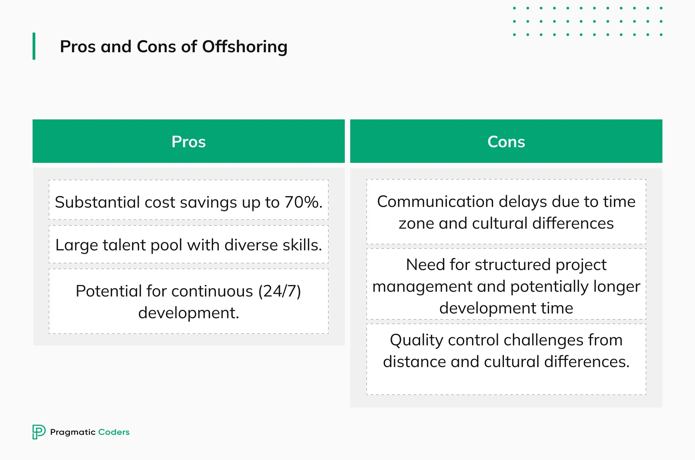

## Table of Contents

## What are offshore operations?

Offshore operations are activities that happen far out in the ocean, usually on special platforms or ships. These activities often involve drilling for oil and gas, which are important energy sources. Companies build these platforms in the ocean because there are big deposits of oil and gas under the seabed. The platforms are like small cities with everything the workers need to live and work there for long periods.

Working on these offshore platforms can be tough. The weather can be harsh, and the work is dangerous. Workers have to be very careful and follow strict safety rules. They also need special training to handle the equipment and deal with emergencies. Despite the challenges, offshore operations are important because they help supply the world with the energy it needs.

## What types of industries commonly engage in offshore operations?

The oil and gas industry is the main one that does offshore operations. They build big platforms out in the ocean to drill for oil and gas. These platforms are like small towns where people live and work. The oil and gas they find is very important because it gives us energy for our cars, homes, and factories.

Another industry that uses offshore operations is the wind energy industry. They put up big wind turbines in the ocean to make electricity from the wind. These wind farms can be far from land, and they need special boats and crews to build and take care of them. Wind energy is good for the environment because it doesn't use up oil or gas.

Fishing is also an industry that does offshore operations. Fishermen go out to sea in boats to catch fish and seafood. They can be gone for days or weeks at a time. The fish they catch is important for food all over the world.

## How do offshore operations function on a basic level?

Offshore operations start with finding a good spot in the ocean where there might be oil, gas, or other resources. Companies use special ships to explore the seabed and see if there are deposits worth drilling for. Once they find a good spot, they build a platform or use a ship that can drill into the seabed. These platforms are like small towns with living quarters, kitchens, and all the equipment needed to drill and process the oil or gas.

Once the drilling starts, the oil or gas comes up from the seabed and is processed on the platform. The workers on the platform take care of the drilling equipment, make sure everything is safe, and handle any problems that come up. The oil or gas is then sent through pipelines or on ships to places where it can be used. The workers usually stay on the platform for a few weeks at a time, working in shifts to keep everything running smoothly.

## What are the primary advantages of conducting offshore operations?

One big advantage of offshore operations is that they can find oil and gas in places where it's hard to get to on land. The ocean has a lot of oil and gas under the seabed, and offshore platforms can reach these deposits. This means we can get more energy from places we couldn't before. It's important because oil and gas are used for many things, like running cars and heating homes.

Another advantage is that offshore operations can help the environment. For example, offshore wind farms use the strong winds over the ocean to make electricity. This kind of energy is clean and doesn't use up oil or gas, so it's better for the planet. Also, by getting oil and gas from the ocean, we can save the land for other uses, like farming or building homes.

## What are the main disadvantages or challenges faced in offshore operations?

Offshore operations can be very dangerous. The weather out in the ocean can be rough, with big storms and high waves. This makes it hard and risky for workers to do their jobs. They have to be very careful and follow strict safety rules. If something goes wrong, like a fire or a leak, it can be hard to fix because they are so far from land. Accidents can hurt people and harm the environment, like when oil spills into the ocean and damages the water and wildlife.

Another challenge is that offshore operations are expensive. Building and maintaining platforms or ships in the ocean costs a lot of money. The equipment is special and needs to be strong enough to handle the tough conditions. Workers also need special training, which adds to the cost. All these expenses mean that companies have to be sure they will find enough oil, gas, or other resources to make it worth the investment. If they don't find enough, they could lose a lot of money.

Lastly, offshore operations can affect the environment. Drilling in the ocean can harm sea animals and their habitats. Oil spills are a big problem because they can spread over large areas and kill fish, birds, and other creatures. Even when everything goes right, the noise and activity from the platforms can disturb marine life. It's important for companies to be careful and follow rules to protect the ocean, but it's still a big challenge.

## How do companies select a location for offshore operations?

Companies start by looking for places in the ocean where they think there might be oil, gas, or other resources. They use special ships with equipment that can see under the seabed. This equipment helps them find out if there are big deposits of oil or gas. They also look at how deep the water is and how far the spot is from land. It's important to pick a spot where it's possible to build a platform or use a ship to drill.

Once they find a good spot, companies think about other things too. They check if the weather is usually safe for working in that area. They also look at the laws and rules of the country that owns the ocean area. Some places have strict rules about protecting the environment, and companies need to follow these rules. They also think about how much it will cost to build and run the operation. All these things help them decide if the spot is a good choice for offshore operations.

## What are the environmental impacts of offshore operations?

Offshore operations can harm the environment in different ways. One big problem is oil spills. When oil leaks from a platform or ship, it spreads over the ocean and can kill fish, birds, and other sea animals. The oil can also get into the water and make it hard for plants and animals to live. Drilling into the seabed can also disturb the ocean floor and harm the habitats of sea creatures. Even the noise from drilling and ships can bother whales and other animals that use sound to communicate and find food.

But it's not just about oil and gas. Offshore wind farms, which are good for the environment because they make clean energy, can also have impacts. Building the wind turbines can disturb the seabed and harm sea life. The turbines can also be dangerous for birds that fly into them. But compared to oil and gas, wind farms are usually better for the environment because they don't cause oil spills or use up non-renewable resources.

Companies try to reduce these impacts by following strict rules and using better technology. They work to make sure their operations are as safe as possible and do less harm to the ocean. But even with these efforts, offshore operations can still affect the environment in big ways.

## How do regulatory frameworks differ for offshore operations across countries?

Regulatory frameworks for offshore operations can be very different from one country to another. Some countries have strict rules to protect the environment and the safety of workers. For example, they might have laws that say how companies must handle oil spills or protect sea animals. These countries often check the operations regularly to make sure companies are following the rules. On the other hand, some countries might have fewer rules, which can make it easier for companies to start operations but might not protect the environment or workers as well.

The differences in regulations can also affect how much it costs to do offshore operations. In countries with strict rules, companies might have to spend more money on safety equipment and environmental protection. This can make operations more expensive but can also help prevent accidents and harm to the ocean. In countries with fewer rules, the costs might be lower, but there's a higher risk of problems like oil spills or accidents. So, companies have to think about these differences when deciding where to do their offshore operations.

## What technologies are used to enhance the efficiency of offshore operations?

Companies use a lot of new technology to make offshore operations better and safer. One important technology is called seismic imaging. It's like taking a picture of what's under the ocean floor. This helps companies find the best spots for drilling oil and gas. Another technology is called remote-operated vehicles, or ROVs. These are like underwater robots that can fix things or check on the equipment without people having to dive into the water. They make the work safer and can save time and money.

Another way technology helps is through automation. This means using computers and machines to do some of the work that people used to do. For example, some platforms have automatic systems that can control the drilling and keep everything running smoothly. This can make the operations more efficient and less likely to have problems. Also, new materials and designs for platforms and ships make them stronger and better at handling rough weather. All these technologies help companies get more oil and gas from the ocean in a safer and more efficient way.

## How do offshore operations affect local and global economies?

Offshore operations can help the local economy a lot. When companies build platforms or ships in the ocean, they need workers, supplies, and services. This means more jobs and money for people in nearby towns and cities. Stores and businesses that sell things to the workers or the companies can grow and make more money too. Sometimes, the government gets money from the companies through taxes or fees, which they can use to help the community. So, offshore operations can make the local economy stronger and give people more opportunities.

On a global level, offshore operations are important because they help supply the world with energy. Oil and gas from the ocean are used all over the world to run cars, heat homes, and power factories. This means countries that don't have their own oil and gas can still get what they need. But, the global economy can also be affected if something goes wrong, like an oil spill. These accidents can cost a lot of money to clean up and can hurt the environment, which can impact trade and tourism. So, while offshore operations can help the global economy by providing energy, they also come with risks that need to be managed carefully.

## What are the best practices for managing risks in offshore operations?

Managing risks in offshore operations is really important to keep everyone safe and protect the environment. One of the best ways to do this is by following strict safety rules. Companies need to make sure all their workers know these rules and practice them every day. They should also use the best equipment and check it often to make sure it's working right. Another good practice is having emergency plans ready. If something bad happens, like a fire or a spill, everyone needs to know what to do to fix it quickly and safely.

Training is also a big part of managing risks. Workers need to learn how to use all the equipment and what to do if something goes wrong. They should have regular drills to practice these skills. It's also important to keep learning and improving. Companies should always look for new ways to make their operations safer and better. By doing these things, they can lower the chances of accidents and keep their offshore operations running smoothly.

Lastly, it's important to work with the community and the government. Companies should talk to people who live nearby and listen to their concerns. They should also follow all the laws and rules set by the government. By working together, everyone can help make sure offshore operations are as safe and responsible as possible. This helps build trust and makes it easier to manage risks in the long run.

## How can companies ensure sustainable offshore operations in the future?

To make sure offshore operations stay sustainable in the future, companies need to focus on using less energy and making less waste. They can do this by using new technology that helps them find and get oil and gas in a smarter way. For example, they can use better drilling methods that use less power and cause less harm to the ocean. Companies should also try to recycle as much as they can and use renewable energy, like wind or solar power, to run their platforms. By doing these things, they can keep the ocean clean and use resources in a way that doesn't hurt the planet.

Another important way to keep offshore operations sustainable is by working with the community and following the rules. Companies should talk to people who live near the ocean and listen to what they have to say. They should also make sure they are following all the laws and rules about protecting the environment and keeping workers safe. By being open and working together, companies can make sure their operations are good for everyone. This helps them keep going in the long run and makes sure the ocean stays healthy for future generations.

## References & Further Reading

[1]: Desai, M., Fritz Foley, C., & Hines Jr, J. R. (2006). ["The demand for tax haven operations."](https://www.sciencedirect.com/science/article/pii/S0047272705001350) Journal of Public Economics, 90(3), 513-531.

[2]: Agarwal, V., & Naik, N. Y. (2004). ["Risks and portfolio decisions involving hedge funds."](https://www.jstor.org/stable/1262669) The Review of Financial Studies, 17(1), 63-98.

[3]: Hasbrouck, J. (2003). ["Intraday Price Formation in U.S. Equity Markets."](https://onlinelibrary.wiley.com/doi/10.1046/j.1540-6261.2003.00609.x) The Review of Financial Studies, 16(4), 743-784.

[4]: ["Global Solutions: Multinational Corporations and the Globalization of R&D"](https://www.sciencedirect.com/science/article/pii/S0167718719300049) by Dieter Ernst, Tom Ganiatsos, & Lynn Mytelka.

[5]: Jones, C. M. (2013). ["What do we know about high-frequency trading?"](https://www.wsj.com/public/resources/documents/HFT0324.pdf) Annual Review of Financial Economics, 5(1), 1-32.

[6]: Shapiro, A. C., & Hanouna, P. (2019). ["Multinational Financial Management"](https://books.google.com/books/about/Multinational_Financial_Management.html?id=gDLDDwAAQBAJ) by Wiley.

[7]: Ostrovsky, M. (2008). ["Information aggregation in dynamic markets with strategic traders."](https://web.stanford.edu/~ost/papers/aggregation.pdf) Econometrica, 76(3), 879-907.