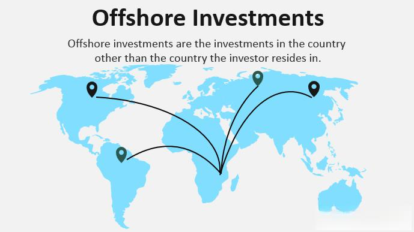

In the rapidly evolving world of business and finance, strategies like offshore operations and algorithmic trading have become integral tools for enhancing efficiency and profitability. These strategies, although disparate in their applications and mechanics, share the overarching goal of optimizing business performance. Offshore operations involve relocating certain business functions to foreign countries to capitalize on lower operational costs, favorable tax regulations, and strategic market positioning. Notable corporations, including Apple and Microsoft, have employed offshore strategies to increase efficiency and maximize profits. However, these benefits come with challenges such as navigating complex legal landscapes and managing potential reputational risks.

On the other hand, algorithmic trading leverages computer algorithms to execute trades based on predefined criteria, operating at speeds and precision levels beyond human capability. Algorithmic trading is lauded for its potential to significantly boost trading efficiency, accuracy, and objectivity, thus optimizing profit opportunities. However, it also demands substantial technological infrastructure and expertise, requiring constant system maintenance and oversight. 



Both offshore operations and algorithmic trading offer unique benefits but also continue to pose distinct challenges. For businesses considering these approaches, understanding their potential advantages and limitations is crucial. An informed strategy can help leverage these methods effectively, thereby aligning with broader financial and operational goals. This article offers insights into these complex strategies, exploring how businesses can implement them strategically while acknowledging their potential pitfalls.

## Table of Contents

## Offshore Business Strategy

Offshore operations refer to the strategy where businesses relocate certain activities to foreign countries to capitalize on advantages such as lower operational costs or favorable regulations. This strategic maneuver is often implemented by large corporations, including multinational giants like Apple and Microsoft, to optimize profitability and enhance operational efficiency.

The core appeal of offshore operations lies in their potential for substantial cost savings. Companies often target countries where labor and other operational costs are significantly lower, thereby reducing overall expenses. Furthermore, favorable tax conditions in various offshore jurisdictions can greatly diminish a company's tax liabilities. These economic benefits can be particularly compelling for companies operating in high-cost domestic environments.

However, the advantages of offshore operations must be weighed against the scrutiny and challenges they face, primarily related to concerns of tax avoidance. The strategic relocation of business activities can attract attention from regulatory and tax authorities, leading to potential legal and reputational risks. Companies employing offshore strategies must therefore adeptly navigate the complex legal landscapes of both their home and host countries to ensure compliance. This includes adhering to international laws and regulations that govern financial transparency and corporate taxation.

Despite these complexities, the strategic benefits of offshore operations—such as reduced operational costs and expanded access to global markets—often outweigh the challenges. The ability to tap into new customer bases abroad can be a significant driver for many companies. Expansion into foreign markets not only diversifies revenue streams but also strengthens the global presence and competitive position of a company.

In navigating these multifaceted dynamics, companies must undertake a thorough assessment of potential risks and rewards. This strategic analysis allows them to create a balanced approach, leveraging the benefits of offshore operations while mitigating associated challenges. Such strategic considerations are crucial for any business aiming to thrive in a competitive global marketplace.

## Pros of Offshore Operations

Offshore operations present several advantages for companies seeking to optimize their business processes and financial outcomes. 

**Cost Savings** represent one of the most prominent benefits, as businesses can substantially reduce expenses by relocating operations to countries with lower labor costs. For example, countries like India, China, and the Philippines are popular destinations due to their skilled yet cost-effective workforces. The disparity in labor costs between these countries and high-income nations allows companies to allocate resources more efficiently, enhancing overall profitability.

**Tax Benefits** are another significant advantage associated with offshore operations. Many offshore jurisdictions offer favorable tax conditions aimed at attracting foreign businesses. These may include lower corporate tax rates, tax exemptions, or even tax holidays, which can collectively reduce a company's overall tax liability. By strategically positioning entities in such jurisdictions, businesses can optimize their tax strategy and improve net income.

**Market Expansion** is facilitated through offshore operations as businesses gain access to new markets and customer bases. Establishing a physical presence in foreign countries allows companies to better understand local consumer behavior, preferences, and market conditions. This proximity can result in more effective marketing strategies and tailored products or services, leading to increased market share and revenue growth.

Moreover, **Asset Protection** is a crucial consideration for many businesses choosing offshore operations. Offshore jurisdictions are often equipped with robust legal frameworks that offer enhanced protection for business assets. Such legal protections may shield assets from potential legal challenges or economic instability in the company’s home country. By leveraging these legal benefits, businesses can safeguard their assets, ensuring more stable long-term operations.

In summary, the strategic use of offshore operations can offer compelling advantages, including cost savings, tax benefits, market expansion opportunities, and asset protection. These benefits can significantly contribute to a company's financial performance and global strategic positioning.

## Cons of Offshore Operations

Offshore operations present several challenges that businesses must address to ensure sustainable and ethical practices.

**Regulatory Compliance** is one of the largest hurdles for companies that engage in offshore activities. They need to adhere to legal standards and regulations, which can be intricate and vary significantly between home and host countries. For example, different jurisdictions have distinct tax laws, employment regulations, and environmental standards, requiring extensive legal expertise and constant monitoring to maintain compliance. Failure to comply can lead to severe penalties, legal disputes, and operational disruptions, adding layers of complexity to global operations.

**Reputational Risks** are substantial for businesses operating offshore, as these activities are frequently associated with tax evasion and avoidance strategies. This perception is fueled by high-profile media coverage and public scrutiny, which can damage a company's brand and customer trust. Organizations must demonstrate transparency and ethical conduct in their offshore dealings to mitigate such reputational damage. Engaging in third-party audits and maintaining open communication about offshore practices are essential strategies to safeguard their reputation.

**Cultural and Communication Barriers** can impede the effective implementation of offshore operations. Differences in language, business practices, and cultural norms between the company's headquarters and its offshore locations can lead to misunderstandings and inefficiencies. These barriers can be exacerbated by time zone differences, further complicating coordination and collaboration. To overcome these challenges, businesses frequently invest in cultural training and employ multilingual staff to improve communication and understand local nuances.

**Increased Scrutiny** from tax authorities and regulators is a reality for companies with offshore operations. These entities are often the target of rigorous investigations to ensure their compliance with international tax laws and regulatory standards. This scrutiny demands a robust internal compliance structure capable of providing detailed documentation and audit trails. Companies must balance the advantages of offshore operations with the resources needed to manage the resulting regulatory complexities and oversight.

## Algorithmic Trading

Algorithmic trading, often referred to as algo trading, employs computer algorithms to execute trades based on predefined criteria. This approach leverages technological advancements to provide a trading precision and speed that surpasses human capabilities. In traditional trading, the decision-making process and execution of trades can be hindered by human limitations such as reaction time and emotional influences. Algorithmic trading eliminates these factors by allowing traders to set algorithms that automatically analyze market variables and execute trades within milliseconds. This rapid execution optimizes the likelihood of capturing profitable opportunities.

The core advantage of algo trading lies in its efficiency. By utilizing sophisticated algorithms, traders can scan multiple markets and securities simultaneously, identifying and executing trades with minimal latency. For instance, high-frequency trading ([HFT](/wiki/high-frequency-trading-strategies)), a subset of algo trading, involves thousands of trades per second, a feat unachievable through manual trading methods.

To illustrate the complexity and precision that algorithms offer, consider a simple moving average crossover strategy, commonly used in [algorithmic trading](/wiki/algorithmic-trading). The basic idea is to trigger a buy signal when a short-term moving average crosses above a long-term moving average, and a sell signal when the opposite occurs. This can be implemented in Python as follows:

```python
import pandas as pd

def moving_average_strategy(data, short_window=40, long_window=100):
    signals = pd.DataFrame(index=data.index)
    signals['price'] = data['price']
    signals['short_mavg'] = data['price'].rolling(window=short_window, min_periods=1).mean()
    signals['long_mavg'] = data['price'].rolling(window=long_window, min_periods=1).mean()
    signals['signal'] = 0.0
    # Generate buy/sell signals
    signals['signal'][short_window:] = np.where(signals['short_mavg'][short_window:] 
                                                 > signals['long_mavg'][short_window:], 1.0, 0.0)
    # Calculate positions
    signals['positions'] = signals['signal'].diff()
    return signals

# Example usage with mock data
data = pd.DataFrame({'price': [100, 102, 101, 105, 110]})
signals = moving_average_strategy(data)
print(signals)
```

While algorithmic trading offers high efficiency, it necessitates a significant level of technical expertise and robust systems to manage effectively. Traders must continuously monitor their algorithms to ensure they function correctly in volatile market conditions and adapt to regulatory changes. Moreover, the design and implementation of these algorithms require a profound understanding of both financial markets and programming, making it necessary for traders to invest in acquiring or hiring specialized skills and technology.

In summary, algorithmic trading revolutionizes the trading landscape by providing unmatched speed and precision, freeing the process from human error and emotional bias. However, it comes with the responsibility of managing technical complexities and regulatory compliance to extract its full potential efficiently.

## Pros of Algorithmic Trading

Algorithmic trading, also known as algo trading, is a highly efficient form of trading that leverages computer algorithms to execute transactions based on predefined criteria. One of its primary advantages is the efficiency and speed with which trades are executed. Algorithms can analyze massive datasets and execute trades in milliseconds, allowing traders to capitalize on fleeting market opportunities that might be missed by human traders. This rapid execution can lead to more profits in a competitive trading environment.

Another significant advantage of algorithmic trading is its accuracy. By strictly adhering to preset algorithms, this method reduces the scope for human error, which can often occur due to fatigue or oversight in manual trading processes. Consequently, trades are executed with precision, adhering closely to the intended strategy without deviations caused by manual input.

Moreover, algorithmic trading eliminates the unpredictable nature of human emotions from the trading process. Human traders may experience emotional stress, leading to impulsive decisions that deviate from strategic plans. By removing emotional factors, algorithmic trading facilitates objective decision-making, adhering strictly to logic and statistical analyses embedded in the algorithm.

Backtesting capabilities offer an additional benefit, allowing traders to test their strategies against historical data before deploying them in live markets. This process helps traders refine and optimize their strategies by analyzing how they would have performed in the past. It reduces the inherent risks and increases the potential for profit by ensuring only the most robust strategies are implemented. For instance, traders can use Python libraries such as Pandas for data manipulation and [backtesting](/wiki/backtesting) scenarios. Here's a simple example illustrating how to run a backtest in Python:

```python
import pandas as pd

# Sample historical data
data = pd.DataFrame({
    'price': [100, 101, 102, 103, 102, 101],
    'volume': [10, 20, 15, 25, 30, 20]
})

# Simple moving average strategy
data['SMA'] = data['price'].rolling(window=3).mean()

# Generating buy/sell signals
data['Signal'] = 0
data.loc[data['price'] > data['SMA'], 'Signal'] = 1  # Buy
data.loc[data['price'] < data['SMA'], 'Signal'] = -1 # Sell

# Calculating returns based on signals
data['Strategy_Returns'] = data['Signal'].shift(1) * (data['price'].pct_change())

print(data)
```

This illustrative code snippet demonstrates calculating a simple moving average (SMA) and generating trading signals based on this indicator to backtest the strategy. Using such analytical tools helps ensure that algorithmic strategies are both data-driven and poised for success in real-time trading scenarios. 

Overall, the efficiency, accuracy, emotion-free decision-making, and backtesting capabilities make algorithmic trading an invaluable tool for modern traders aiming to optimize their trading strategies dynamically.

## Cons of Algorithmic Trading

Algorithmic trading, while efficient and precise, presents several challenges that traders and financial institutions must navigate carefully. One primary concern is the dependence on technology. Algo trading systems rely heavily on complex software and hardware infrastructures to execute trades swiftly. Any system failures, whether due to hardware malfunctions or software bugs, can result in halted trades and significant financial losses. As technological systems are not infallible, traders must implement robust fail-safes and contingency plans to mitigate the risks associated with technological dependence.

Over-optimization is another common pitfall in algorithmic trading. Traders often calibrate their algorithms using historical data to optimize performance. However, excessive fine-tuning can lead to overfitting, where the strategy is tailored too closely to past data patterns and may not perform well in real-time market conditions. This issue arises because the optimized parameters might capture noise rather than underlying market trends, thus providing unrealistic expectations of performance in live markets. To avoid this, traders must strike a balance between historical optimization and real-world applicability, perhaps incorporating techniques such as cross-validation or out-of-sample testing.

The need for constant monitoring of algorithmic trading systems cannot be overstated. Market environments can change rapidly, and unexpected events may disrupt algorithmic strategies. Continuous oversight is necessary to detect and address technical issues promptly, such as server downtimes or erroneous data feeds, and to manage any market anomalies that could impact trading performance. This vigilance ensures that any necessary adjustments are made swiftly to protect investments and maintain the integrity of trading operations.

Finally, regulatory challenges pose significant hurdles for algo traders. The use of algorithms in trading must comply with diverse regulatory standards across various jurisdictions. These regulations aim to ensure market stability and protect against abuses such as market manipulation and insider trading. Traders and firms must stay informed about regulatory changes and ensure their systems are adaptable to meet these requirements. Non-compliance can lead to penalties or legal actions, making it imperative for traders to invest in compliance infrastructure and expertise.

In conclusion, while algorithmic trading offers numerous advantages, its associated cons require careful attention and management. Traders must develop strategies that balance technological innovation with practical safeguards against its inherent risks.

## Conclusion

Offshore operations and algorithmic trading both provide distinctive advantages that can significantly enhance business efficiencies and profitability. These strategies, however, also come with their own set of challenges that necessitate careful consideration. When evaluating offshore operations, companies must weigh potential cost savings, tax benefits, and expansion opportunities against reputational risks and regulatory complexities. Similarly, algorithmic trading offers speed and precision in executing trades but demands robust technological infrastructure and constant monitoring to mitigate the risk of system failures or market anomalies.

Successful implementation of these strategies requires a deep understanding of both the internal and external environments. This encompasses navigating through complex legal landscapes for offshore operations and ensuring compliance with varying regulatory standards in algorithmic trading. Furthermore, as markets evolve, these strategies will increasingly influence the contours of global business operations, necessitating businesses to remain agile and informed.

Strategic planning and execution are critical to leveraging the full potential of these approaches. Businesses looking to adopt offshore operations or algorithmic trading should conduct thorough research and seek professional advice to align these strategies with their long-term objectives. Engaging with experts and continuous learning will be vital to overcoming the complexities and maximizing the benefits of these advanced business strategies.

## References & Further Reading

[1]: Desai, M., Fritz Foley, C., & Hines Jr, J. R. (2006). ["The demand for tax haven operations."](https://www.sciencedirect.com/science/article/pii/S0047272705001350) Journal of Public Economics, 90(3), 513-531.

[2]: Agarwal, V., & Naik, N. Y. (2004). ["Risks and portfolio decisions involving hedge funds."](https://www.jstor.org/stable/1262669) The Review of Financial Studies, 17(1), 63-98.

[3]: Hasbrouck, J. (2003). ["Intraday Price Formation in U.S. Equity Markets."](https://onlinelibrary.wiley.com/doi/10.1046/j.1540-6261.2003.00609.x) The Review of Financial Studies, 16(4), 743-784.

[4]: ["Global Solutions: Multinational Corporations and the Globalization of R&D"](https://www.sciencedirect.com/science/article/pii/S0167718719300049) by Dieter Ernst, Tom Ganiatsos, & Lynn Mytelka.

[5]: Jones, C. M. (2013). ["What do we know about high-frequency trading?"](https://www.wsj.com/public/resources/documents/HFT0324.pdf) Annual Review of Financial Economics, 5(1), 1-32.

[6]: Shapiro, A. C., & Hanouna, P. (2019). ["Multinational Financial Management"](https://books.google.com/books/about/Multinational_Financial_Management.html?id=gDLDDwAAQBAJ) by Wiley.

[7]: Ostrovsky, M. (2008). ["Information aggregation in dynamic markets with strategic traders."](https://web.stanford.edu/~ost/papers/aggregation.pdf) Econometrica, 76(3), 879-907.