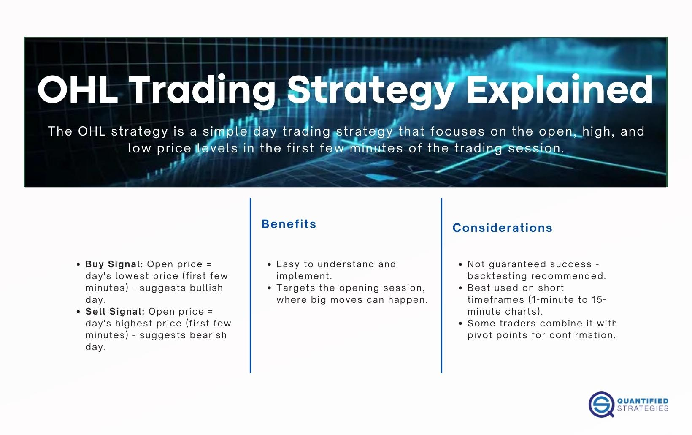

## Table of Contents

## What is OHL in trading?

OHL stands for Open, High, Low in trading. It represents three important price points of a financial instrument, like a stock or a currency, during a specific time period, usually a trading day. The "Open" is the price at which the instrument starts trading at the beginning of the period. The "High" is the highest price reached during that period, while the "Low" is the lowest price reached.

Traders and investors use OHL data to understand the price movement and volatility of an instrument. By looking at the open, high, and low prices, they can get a quick snapshot of how the instrument performed during the day. This information helps them make better decisions about buying or selling the instrument. For example, if the high is much higher than the open and close, it might indicate strong buying interest during the day.

## How does the OHL strategy work?

The OHL strategy in trading uses the open, high, and low prices of a day to help make decisions. Traders look at these three prices to see how a stock or other investment moved during the day. If the high price is a lot higher than the open and close prices, it might mean many people wanted to buy it that day. On the other hand, if the low price is much lower than the open and close, it might show that many people wanted to sell.

Using the OHL strategy, traders can decide when to buy or sell. For example, if a stock opens at a low price and then goes up to a new high, a trader might buy it, hoping it will keep going up. If the stock hits a high early in the day but then starts to fall, a trader might sell it to avoid losing money. By watching these price points, traders can try to make smart choices about their investments.

## What are the key components of an OHL chart?

An OHL chart shows three main pieces of information for a stock or other investment: the opening price, the highest price, and the lowest price during a day. The opening price is the first price the investment trades at when the market opens. The highest price is the most the investment reached during the day, and the lowest price is the least it reached.

These three prices help traders see how the investment moved during the day. If the high price is much higher than the open and close prices, it might mean a lot of people wanted to buy it. If the low price is much lower than the open and close, it might show many people wanted to sell. By looking at these prices, traders can make better choices about when to buy or sell the investment.

## Can you explain the significance of the opening price in OHL trading?

The opening price is important in OHL trading because it's the first price of the day. It tells traders where the stock starts trading when the market opens. If the opening price is much different from the closing price of the day before, it can show that something big might have happened overnight or that people are excited about the stock.

Traders use the opening price to make decisions. For example, if a stock opens at a high price and keeps going up, a trader might decide to buy it, hoping it will keep rising. If the stock opens high but then starts to fall, a trader might sell it to avoid losing money. The opening price helps traders see the mood of the market at the start of the day and plan their trades accordingly.

## How does the highest price of the day affect OHL trading decisions?

The highest price of the day is important in OHL trading because it shows the peak value that a stock reached during that time. If the high price is a lot higher than the opening and closing prices, it might mean that a lot of people wanted to buy the stock at some point during the day. This can tell traders that there was strong interest in the stock, which might make them think about buying it too, hoping that the price will keep going up.

On the other hand, if the stock hits a high early in the day but then starts to fall, traders might see this as a sign to sell. They might worry that the stock won't go any higher and want to sell before the price drops more. By watching the highest price, traders can get a good idea of how excited people are about the stock and make smarter choices about when to buy or sell.

## What role does the lowest price play in the OHL strategy?

The lowest price in the OHL strategy is important because it shows the least amount that a stock reached during the day. If the low price is a lot lower than the opening and closing prices, it might mean that a lot of people wanted to sell the stock at some point. This can tell traders that there was a lot of worry about the stock, which might make them think about selling it too, to avoid losing more money.

By looking at the lowest price, traders can understand how scared people were about the stock during the day. If the stock hits a low early in the day but then starts to go up, traders might see this as a good time to buy. They might think the stock is done going down and is ready to start going up again. Watching the lowest price helps traders make smart choices about when to buy or sell based on how the stock moved during the day.

## How can beginners start using the OHL trading strategy?

Beginners can start using the OHL trading strategy by first learning what the open, high, and low prices mean. The open price is the first price of the day, the high price is the highest the stock went, and the low price is the lowest it went. By looking at these three prices, beginners can see how the stock moved during the day. They can start by watching these prices for a few days to get a feel for how they change.

Once they understand the basics, beginners can start making simple trading decisions. For example, if a stock opens at a low price and then goes up to a new high, a beginner might decide to buy it, hoping it will keep going up. If the stock hits a high early in the day but then starts to fall, they might decide to sell it to avoid losing money. By practicing with small trades and keeping an eye on the open, high, and low prices, beginners can slowly get better at using the OHL strategy.

## What are common mistakes to avoid when using the OHL strategy?

One common mistake beginners make when using the OHL strategy is relying too much on just one day's prices. They might see a stock go from a low open to a high price and think it will keep going up, but the next day it could go down. It's important to look at more than one day's prices to see the bigger picture. Another mistake is not setting a stop-loss. A stop-loss is a price where you decide to sell if the stock goes down too much. Without it, you could lose a lot of money if the stock keeps falling after you buy it.

Another mistake is not understanding why the stock moved the way it did. The open, high, and low prices can tell you what happened, but not why. Maybe a company announced good news, or maybe there was bad news about the economy. Knowing the reasons behind the price changes can help you make better decisions. Also, beginners sometimes forget to think about other things like the overall market or news that might affect the stock. By looking at the bigger picture, you can avoid making trades based only on the OHL prices.

## How can the OHL strategy be integrated with other technical analysis tools?

The OHL strategy can be used with other technical analysis tools to make better trading decisions. One way to do this is by using moving averages. A moving average is a line that shows the average price of a stock over a certain number of days. By looking at the OHL prices along with the moving average, traders can see if the stock is going up or down over time. If the high price is above the moving average, it might mean the stock is in a good spot to keep going up. If the low price is below the moving average, it might be a sign to sell.

Another tool that works well with the OHL strategy is the Relative Strength Index (RSI). The RSI helps traders see if a stock is overbought or oversold. If the RSI is high and the stock's high price is also high, it might mean the stock is overbought and could go down soon. If the RSI is low and the stock's low price is also low, it might mean the stock is oversold and could go up. By using the OHL prices with the RSI, traders can get a better idea of when to buy or sell.

## What are advanced techniques for optimizing the OHL trading strategy?

One advanced technique for optimizing the OHL trading strategy is to use candlestick patterns. Candlestick patterns are shapes made by the open, high, low, and close prices on a chart. By looking at these patterns, traders can see if a stock might go up or down. For example, a "hammer" pattern, where the stock opens and closes near the high with a long lower wick, can mean the stock might go up soon. By combining these patterns with the OHL prices, traders can make better guesses about where the stock is headed.

Another technique is to use [volume](/wiki/volume-trading-strategy) data along with the OHL prices. Volume is the number of shares traded in a day. If the high price is high and the volume is also high, it might mean a lot of people are buying the stock, which could push the price up even more. If the low price is low and the volume is high, it might mean a lot of people are selling, which could push the price down. By looking at both the OHL prices and the volume, traders can get a better idea of how strong the buying or selling is and make smarter trading decisions.

## Can you discuss case studies where the OHL strategy was successfully applied?

In one case, a trader used the OHL strategy to make money on a tech stock. The stock opened at a low price one day, but then it went up to a new high. The trader saw this and decided to buy the stock, hoping it would keep going up. The next day, the stock opened near the high from the day before and kept going up. The trader sold the stock at a profit. By watching the open, high, and low prices, the trader made a smart choice and made money.

In another case, a trader used the OHL strategy to avoid losing money on a stock. The stock opened at a high price one day, but then it started to fall and hit a new low. The trader saw this and decided to sell the stock before it went down even more. The next day, the stock opened near the low from the day before and kept going down. The trader was glad they sold when they did because they didn't lose as much money. By paying attention to the open, high, and low prices, the trader made a good decision and saved money.

## What are the limitations and risks associated with the OHL trading strategy?

The OHL trading strategy has some limitations and risks that traders need to know about. One big problem is that it only looks at one day's prices. This can be tricky because what happens in one day might not tell the whole story. A stock might go up a lot in one day but then go down the next day. So, traders who only look at the OHL prices might miss out on seeing the bigger picture and make bad choices.

Another risk is that the OHL strategy doesn't explain why the prices changed. It can show you what happened, but not why. Maybe the stock went up because of good news about the company, or maybe it went down because of bad news about the economy. If traders don't know the reasons behind the price changes, they might make trades based on the wrong ideas. It's important to use the OHL strategy along with other tools and information to make the best decisions.

## References & Further Reading

[1]: Bergstra, J., Bardenet, R., Bengio, Y., & Kégl, B. (2011). ["Algorithms for Hyper-Parameter Optimization."](https://papers.nips.cc/paper/4443-algorithms-for-hyper-parameter-optimization) Advances in Neural Information Processing Systems 24.

[2]: ["Advances in Financial Machine Learning"](https://www.amazon.com/Advances-Financial-Machine-Learning-Marcos/dp/1119482089) by Marcos Lopez de Prado

[3]: ["Evidence-Based Technical Analysis: Applying the Scientific Method and Statistical Inference to Trading Signals"](https://www.amazon.com/Evidence-Based-Technical-Analysis-Scientific-Statistical/dp/0470008741) by David Aronson

[4]: ["Machine Learning for Algorithmic Trading"](https://github.com/stefan-jansen/machine-learning-for-trading) by Stefan Jansen

[5]: ["Quantitative Trading: How to Build Your Own Algorithmic Trading Business"](https://books.google.com/books/about/Quantitative_Trading.html?id=j70yEAAAQBAJ) by Ernest P. Chan