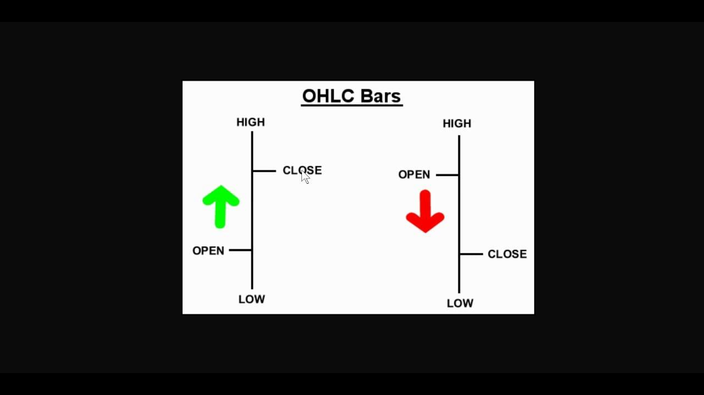

In today's fast-paced financial markets, traders and analysts utilize an array of tools and techniques to make informed decisions. Among these, the OHLC chart—representing Open, High, Low, and Close prices—emerges as a critical resource. The OHLC chart provides a visual representation of price movements over a specified period, offering invaluable insights into a security's trading behavior.

The importance of OHLC charts lies in their multifaceted applications across different types of analysis. In technical analysis, they form the foundation for identifying trends and price patterns. Financial analysts rely on these charts to assess market sentiment and price volatility, aiding in risk and return evaluations. Moreover, in algorithmic trading, the reliable data from OHLC charts underpins the development of trading algorithms which automate decision-making processes.



This article examines the significance of OHLC charts and how they are employed in strategies designed to capitalize on market opportunities. As fundamental components of analytical and trading practices, OHLC charts contribute significantly to informed decision-making in financial markets.

## Table of Contents

## What is an OHLC Chart?

The OHLC chart is a fundamental tool in the world of finance and trading, designed to visually represent the price movement of a security over a specified period. Central to this chart's utility are its four key data points: Open, High, Low, and Close prices.

1. **Open Price**: This is the price at which a security starts trading during a particular session. It serves as the initial reference point for traders and analysts attempting to understand market sentiment at the beginning of the trading period.

2. **High Price**: This reflects the highest price reached by the security within the time frame of the chart. It provides insight into the peak demand levels and potential resistance points during the trading period.

3. **Low Price**: Conversely, the low price indicates the lowest value at which the security was traded within the session. This data point can reveal levels of strong support and can serve as a crucial indicator for evaluating the asset's price floor.

4. **Close Price**: This is the final trading price at which the security is traded before the session concludes. The close price is often considered the most critical data point, as it reflects the market's final consensus on the asset's value for that period and is frequently used in various financial models and analyses.

The construction of OHLC charts, often resembling candlestick configurations, provides crucial insights into price patterns and market dynamics. These charts are paramount for identifying trends such as bullish (upward) or bearish (downward) movements, as well as potential reversals in trends. Understanding how to interpret these patterns enables traders and analysts to develop hypotheses about future price movements, thereby informing strategic trading and investment decisions.

## Technical Analysis Using OHLC Charts

Technical analysis is a systematic method for evaluating financial securities through the analysis of statistical data generated by market activities. Among the tools employed, OHLC charts serve as a vital component. These charts, with their representation of open, high, low, and close prices for specific time frames, aid in discerning trends and behaviors in market activity.

Patterns are a foundational aspect of technical analysis. OHLC charts facilitate the identification of patterns such as the "head and shoulders" and "wedges." The head and shoulders pattern is characterized by three peaks: the middle peak (head) being higher than the two equal peaks (shoulders) on either side. This pattern can signify a potential reversal of the current trend. Wedge patterns, on the other hand, are formed by converging trend lines and may indicate a continuation or reversal of the trend, depending on the direction of the wedge.

Beyond patterns, OHLC charts are instrumental for applying technical indicators, which provide additional insights into market dynamics. Moving averages, one of the most widely used indicators, smooth out price data to identify the direction of the trend. Simple Moving Average (SMA) is calculated as follows:

$$
\text{SMA} = \frac{\sum_{i=1}^{n} P_i}{n}
$$

where $P_i$ represents the close price at day $i$, and $n$ is the number of periods considered.

Another crucial indicator is the Relative Strength Index (RSI), which evaluates overbought or oversold conditions in the market. RSI is computed using the average of gains and losses over a specified period:

$$
\text{RSI} = 100 - \left(\frac{100}{1 + \frac{\text{Average Gain}}{\text{Average Loss}}}\right)
$$

By detecting such conditions, traders can make educated predictions about future price movements.

In summary, OHLC charts are a key tool in technical analysis, enabling traders to identify patterns, apply technical indicators, and forecast price trends. This contributes to a robust framework for attaining more tactical market decisions.

## Financial Analysis and OHLC Charts

In financial analysis, OHLC charts are instrumental in assessing the overall health and performance of an asset. They are crucial for providing insights into price [volatility](/wiki/volatility-trading-strategies) and market sentiment. Through the visualization of price data, these charts allow analysts to observe how asset prices fluctuate within a given period, which is indicative of market behavior.

OHLC charts facilitate the assessment of both risk levels and potential rewards when studied over extended periods. For instance, an analyst can identify periods of high volatility, which often correlate with increased risk but may also present significant opportunities for reward. By tracking the highs and lows of asset prices alongside their opening and closing values, trends such as bullish or bearish markets can be discerned, providing insights into market sentiment.

The data presented by OHLC charts are foundational in the computation of key financial metrics. For instance, volatility, a critical measure of risk, can be derived from standard deviation calculations of the asset's price changes. If $p_t$ represents the price at time $t$, the formula for historical volatility based on daily returns can be expressed as:

$$
\sigma = \sqrt{\frac{1}{N-1} \sum_{t=1}^{N} (r_t - \bar{r})^2}
$$

where $r_t = \ln\left(\frac{p_t}{p_{t-1}}\right)$ is the log return of the prices, $\bar{r}$ is the mean of these returns, and $N$ is the number of observations.

Furthermore, these charts aid in calculating other metrics such as moving averages, which are pivotal in smoothing price data, thus allowing for a clearer representation of trends over time. A simple moving average (SMA) can be calculated with Python as follows:

```python
def simple_moving_average(prices, window):
    return [sum(prices[i:i+window]) / window for i in range(len(prices) - window + 1)]

prices = [100, 102, 101, 105, 107]
window = 3
sma = simple_moving_average(prices, window)
print(sma)  # Output: [101.0, 102.66666666666667, 104.33333333333333]
```

The simplicity and clarity provided by OHLC charts enable investors to make informed, strategic decisions based on historical performance and anticipated future movements. Such clear visual representations and the resulting analytical outputs ensure that investors can evaluate the health and potential of assets more effectively, fostering sound investment choices.

## Algo Trading and the Role of OHLC Charts

Algorithmic trading, or algo trading, employs computer algorithms to automate trading decisions and execute trades with speed and precision that exceed human capabilities. The YesYesOpen-High-Low-Close (OHLC) chart functions as a cornerstone in many [algorithmic trading](/wiki/algorithmic-trading) systems due to its comprehensive representation of price movements over specific periods. 

OHLC charts provide essential raw data necessary for training and testing trading algorithms. They capture four vital price points: the opening price at the start of a trading session, the highest and lowest prices within the session, and the closing price. This data forms a historical record critical for identifying market patterns and behaviors, which can be employed in refining trading strategies. 

A variety of algorithmic strategies depend significantly on OHLC data. For instance, mean reversion strategies assume that asset prices will return to a mean or average level over time. This involves identifying when an asset's price deviates significantly from its historical average—a task well-suited to analysis with OHLC charts. Similarly, [momentum](/wiki/momentum) strategies, which base trades on the strength of price trends, rely heavily on the price data analyzed through OHLC charts.

Integrating OHLC charts into algorithmic systems enhances the ability to discover and exploit market opportunities, leveraging both historical trends and real-time data. Such integration not only facilitates the development of complex trading algorithms but also supports [backtesting](/wiki/backtesting), which simulates how a trading strategy would have performed over historical data. Utilizing a Python-based approach, for example, might involve libraries such as Pandas and NumPy to handle OHLC data and perform backtesting on trading hypotheses.

To illustrate, consider the implementation of a simple moving average crossover strategy using OHLC data. Python pseudocode for this might involve calculating short and long moving averages from the closing prices and generating trading signals when these averages cross:

```python
import pandas as pd

# Load OHLC data into a DataFrame
data = pd.read_csv('ohlc_data.csv')

# Define short and long moving averages
data['short_ma'] = data['Close'].rolling(window=20).mean()
data['long_ma'] = data['Close'].rolling(window=50).mean()

# Generate trading signals: Buy when short_ma crosses above long_ma
data['signal'] = 0
data['signal'][data['short_ma'] > data['long_ma']] = 1

# Calculate positions based on signals: 1 for buy, 0 for sell
data['position'] = data['signal'].diff()

print(data[['Close', 'short_ma', 'long_ma', 'position']])
```

This code calculates moving averages of the closing prices and highlights potential buy signals when the short-term moving average surpasses the long-term one. Such applications underscore the essential role of OHLC charts in enabling algorithmic trading systems to monitor, predict, and react to market developments effectively.

## Conclusion

OHLC charts are an indispensable tool for traders, analysts, and algorithmic trading systems. They fundamentally enhance the capability to understand and interpret market trends and behaviors. By providing detailed insights into price movements through their core components—Open, High, Low, and Close—they enable market participants to leverage this information for crafting sophisticated trading strategies. Such strategies are crucial for achieving profitable outcomes, as they help predict future price directions and identify potential reversals or continuations.

Whether employed in manual trading or integrated into automated systems, OHLC charts serve as a reliable source of market data. They facilitate a clearer understanding of market dynamics, which is essential for effective decision-making processes in financial markets. The structured OHLC format is not only easy to interpret but also rich with information crucial for technical analysis, risk assessment, and strategic planning.

Embracing the functionality of OHLC charts equips financial professionals with the ability to make more informed trading decisions. Their comprehensive representation of market activity, over any given timeframe, aids significantly in assessing the market's health and potential shifts in momentum. Thus, OHLC charts continue to be a cornerstone in the toolkit of those seeking to harness the complexities of modern financial markets.

## References & Further Reading

[1]: ["Technical Analysis of the Financial Markets: A Comprehensive Guide to Trading Methods and Applications"](https://www.amazon.com/Technical-Analysis-Financial-Markets-Comprehensive/dp/0735200661) by John J. Murphy

[2]: ["Japanese Candlestick Charting Techniques: A Contemporary Guide to the Ancient Investment Techniques of the Far East"](https://archive.org/details/japanesecandlest0000niso) by Steve Nison

[3]: Lo, A. W., & MacKinlay, A. C. (1999). ["A Non-Random Walk Down Wall Street"](https://www.jstor.org/stable/j.ctt7tccx) Princeton University Press.

[4]: Chan, E. P. (2009). ["Algorithmic Trading: Winning Strategies and Their Rationale"](https://github.com/ftvision/quant_trading_echan_book) John Wiley & Sons.

[5]: Murphy, J. J. (1999). ["Technical Analysis of the Financial Markets: A Comprehensive Guide to Trading Methods and Applications"](https://archive.org/details/technicalanalysi0000murp) New York Institute of Finance.

[6]: Marcos López de Prado (2018). ["Advances in Financial Machine Learning"](https://www.amazon.com/Advances-Financial-Machine-Learning-Marcos/dp/1119482089) John Wiley & Sons.