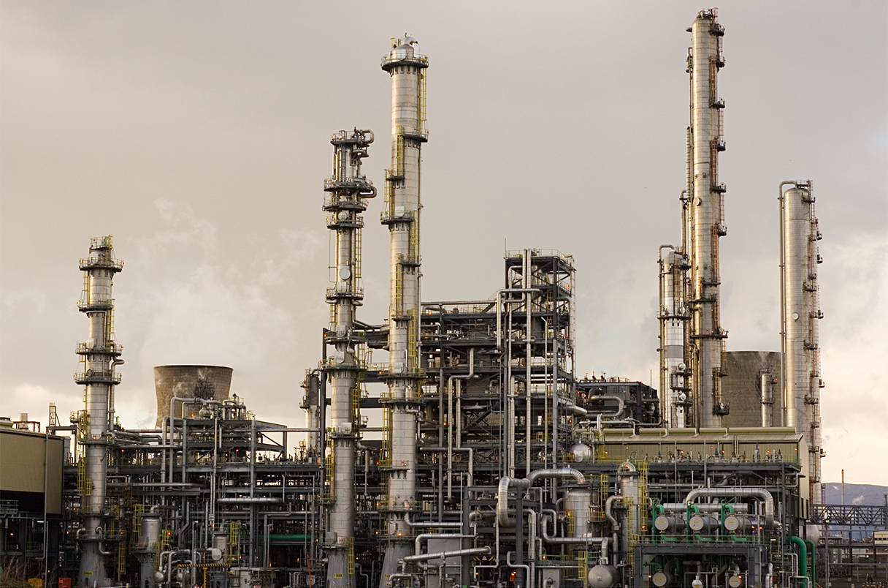

## Table of Contents

## What is the primary role of oil companies in the energy sector?

Oil companies play a big role in the energy sector. They find, take out, and sell oil and gas from the ground or under the sea. This oil and gas are very important because they give us energy for our cars, homes, and factories. Without oil companies, we would not have enough energy to do many things we do every day.

These companies also help the economy by creating jobs and making money. They build things like oil rigs and pipelines, which need a lot of workers. The money they make from selling oil and gas can help countries grow and develop. But, using oil and gas can also harm the environment, so oil companies need to be careful and find ways to be cleaner and safer.

## How does an oil refinery operate and what are its main components?

An oil refinery is like a big factory that turns crude oil into useful products like gasoline, diesel, and jet fuel. When the crude oil arrives at the refinery, it first goes into big tanks to be stored. Then, it is pumped into the first part of the refinery called the distillation unit. Here, the oil is heated up until it turns into a gas. This gas goes up a tall tower, and as it cools down, it turns back into liquid at different heights. Each height in the tower collects different parts of the oil, like gasoline at the top and heavier oils at the bottom.

After the distillation unit, the different parts of the oil go through more steps to be turned into the final products. For example, some parts might go to a cracking unit where they are broken down into smaller molecules to make more gasoline. Other parts might go to a reforming unit to change their structure and make them better for fuel. There are also treatment units that clean the products to remove any harmful stuff. All these steps together make sure that the oil is turned into safe and useful products that we can use every day.

The main components of an oil refinery include storage tanks, the distillation unit, cracking units, reforming units, and treatment units. Each of these parts plays a special role in turning [crude oil](/wiki/crude-oil) into the fuels and other products we need. The refinery works like a big puzzle, with each piece fitting together to make sure everything runs smoothly and safely.

## What are the different types of crude oil and how do they affect refinery operations?

Crude oil comes in different types, mainly light, medium, and heavy. Light crude oil is easier to turn into gasoline and other products because it has more of the stuff that refineries need. Medium crude oil is in the middle, not as easy to refine as light oil but not as hard as heavy oil. Heavy crude oil is thicker and harder to refine because it has more heavy stuff that needs to be broken down. The type of crude oil a refinery gets can change how it works and what products it can make.

When a refinery gets light crude oil, it can make more gasoline and other light products without needing to do a lot of extra work. This is good because it means the refinery can work faster and use less energy. But when a refinery gets heavy crude oil, it has to use more steps to break down the heavy stuff into useful products. This can take more time and energy, and sometimes the refinery might need special equipment to handle heavy oil. So, the type of crude oil affects how the refinery operates and how much it costs to turn the oil into useful products.

## What is the process of crude oil distillation and why is it important?

Crude oil distillation is the first big step in turning crude oil into useful products like gasoline and diesel. When crude oil comes to the refinery, it goes into a big tower called a distillation column. The oil is heated up until it turns into a gas. This gas goes up the tower, and as it goes up, it starts to cool down and turn back into a liquid. Different parts of the oil turn back into liquid at different heights in the tower. The lighter parts, like gasoline, turn back into liquid at the top, and the heavier parts, like tar, turn back into liquid at the bottom. This process separates the oil into different parts that can be used to make different products.

Distillation is really important because it's the starting point for making all the products we get from oil. Without distillation, we wouldn't be able to separate the oil into the parts we need. After distillation, each part of the oil goes through more steps to be turned into the final products we use every day. This process helps make sure we can get the most out of the oil and use it in the best way possible.

## How do oil companies manage the logistics of transporting crude oil to refineries?

Oil companies use different ways to move crude oil from where it's found to the refineries where it's turned into useful products. They often use pipelines, which are like big tubes that go underground or underwater. These pipelines can move a lot of oil over long distances safely and quickly. Sometimes, if the oil needs to go over the ocean or to a place where there are no pipelines, oil companies use big ships called tankers. These tankers can [carry](/wiki/carry-trading) a lot of oil, but it takes longer than using pipelines.

When the oil gets close to the refinery, it might be moved using trucks or trains. Trucks are good for short distances and can go places where pipelines can't reach. Trains can carry a lot of oil and are useful for moving it over land where there are no pipelines. Oil companies have to plan carefully to make sure the oil gets to the refinery on time and safely. They need to think about things like the weather, how much oil they need to move, and the best way to get it there.

## What are the environmental impacts of oil refining and how are they mitigated?

Oil refining can harm the environment in a few ways. It makes air pollution because it burns a lot of fuel to turn crude oil into products like gasoline. This pollution can make the air dirty and cause health problems for people. Oil refining also makes water pollution. Sometimes, the refinery might spill oil or chemicals into rivers or the ocean, which can hurt fish and other animals. Another problem is that oil refining makes greenhouse gases, which can make the Earth warmer and change the weather.

Oil companies try to fix these problems in different ways. They use special equipment to clean the air and water before they leave the refinery. They also try to find new ways to make less pollution, like using cleaner fuels or better technology. Sometimes, they have to follow rules from the government that say how much pollution they can make. By doing these things, oil companies can help make the environment safer and cleaner, even though refining oil will always have some impact on the environment.

## What are the key economic factors that influence oil refining operations?

The price of crude oil is a big [factor](/wiki/factor-investing) that affects oil refining operations. When the price of crude oil goes up, it costs more for refineries to buy the oil they need. This can make it harder for them to make money, especially if the price of the products they make, like gasoline, doesn't go up as much. Refineries also have to think about the cost of running their equipment and paying their workers. If these costs go up, it can make it harder for them to make a profit.

Another important factor is the demand for the products that refineries make. If more people want to buy gasoline or diesel, refineries can make more money. But if fewer people want these products, refineries might have to slow down or even stop working. The economy of the whole world can also affect refineries. If the economy is doing well, more people might be driving and using fuel, which is good for refineries. But if the economy is not doing well, people might use less fuel, which can be bad for refineries.

## How do advancements in technology impact the efficiency and output of refineries?

Advancements in technology help refineries work better and make more products. New technology can make the refining process faster and use less energy. For example, better computers and software help refineries keep track of everything and make smart choices about how to run their equipment. New kinds of machines, like better catalysts, can also help break down the oil into useful products more quickly and with less waste. All these improvements mean that refineries can make more gasoline, diesel, and other products without using more oil or energy.

Technology also helps refineries be safer and better for the environment. New systems can watch for problems and fix them before they cause trouble. This means fewer spills and less pollution. Also, new technology can help refineries use cleaner fuels and find ways to reuse waste. By using these new tools, refineries can make their operations safer and kinder to the environment while still making a lot of products.

## What are the safety protocols and regulations that govern oil refinery operations?

Oil refineries have to follow strict safety rules to keep workers and the environment safe. Governments make laws that say what refineries can and can't do. These laws cover things like how to handle dangerous chemicals, how to stop fires and explosions, and how to clean up spills. Refineries also have to train their workers on safety and make sure they know what to do in an emergency. They have to do regular checks to make sure everything is working right and fix any problems quickly.

There are also special groups that watch refineries to make sure they are following the rules. These groups can come to the refinery and check everything to make sure it's safe. If a refinery doesn't follow the rules, it can get in big trouble and have to pay a lot of money. So, refineries work hard to follow all the safety rules and keep everyone safe. They use special equipment and plans to make sure they can handle any problems that come up and keep the refinery running safely.

## How do oil companies integrate renewable energy sources into their operations?

Oil companies are starting to use renewable energy sources like wind, solar, and biofuels in their operations. They do this because they want to be less harmful to the environment and because people are asking for cleaner energy. For example, some oil companies put up wind turbines or solar panels at their refineries to make some of the electricity they need. This helps them use less oil and gas to run their equipment, which means they make less pollution. They also invest in biofuels, which are fuels made from plants, to mix with the gasoline and diesel they sell. This makes the fuels cleaner and helps reduce the amount of greenhouse gases that cars and trucks put into the air.

Another way oil companies use renewable energy is by buying it from other companies. They might sign deals to get electricity from big wind or solar farms instead of making it themselves. This helps them use more clean energy without having to build their own renewable energy projects. Some oil companies are also working on new technologies to capture and store carbon dioxide, which is a greenhouse gas. By using these technologies, they can take the carbon dioxide they make and put it underground instead of letting it go into the air. All these steps help oil companies move towards using more renewable energy and being kinder to the environment.

## What strategies do oil companies use to manage market volatility and supply chain disruptions?

Oil companies use different strategies to handle market ups and downs and problems with getting oil from one place to another. One big way they do this is by keeping a lot of oil in storage. This means they can still sell oil even if something goes wrong and they can't get new oil right away. They also make deals with other companies to share oil if one of them runs into trouble. This helps make sure they always have enough oil to sell, no matter what happens.

Another thing oil companies do is use special tools to guess what might happen in the future. They look at things like the weather, how much oil people are using, and what's happening in the world to try to predict if prices will go up or down. If they think prices will go up, they might buy more oil now to sell later. If they think prices will go down, they might sell more oil now before it loses value. This helps them make money even when the market is hard to predict.

## How do global political dynamics affect oil company strategies and refinery operations?

Global political dynamics can really change how oil companies work and how refineries run. When countries don't get along, it can make it hard for oil companies to move oil from one place to another. For example, if there's a war or if countries put up trade barriers, oil companies might not be able to get the oil they need. This can make them look for oil in different places or change how they move it. Also, if a country that makes a lot of oil has problems, like a revolution or new laws, it can make the price of oil go up or down a lot. Oil companies have to watch these things closely and be ready to change their plans.

Oil companies also have to think about what different countries want and need. Some countries might want to use more of their own oil instead of buying it from other places. This can make oil companies build refineries in those countries or change how they sell their oil. Other countries might have rules about how much pollution refineries can make, which can make oil companies use new technology or change how they work. All these things mean that oil companies have to be smart and flexible to keep making money and keeping their refineries running well.

## References & Further Reading

[1]: Yergin, D. (1991). ["The Prize: The Epic Quest for Oil, Money & Power"](https://www.amazon.com/Prize-Epic-Quest-Money-Power/dp/1439110123). Free Press.

[2]: McLean, B. & Elkind, P. (2003). ["The Smartest Guys in the Room: The Amazing Rise and Scandalous Fall of Enron"](https://books.google.com/books/about/The_Smartest_Guys_in_the_Room.html?id=MVt5AAAAQBAJ). Portfolio.

[3]: "Refining Processes." (n.d.). From the [U.S. Energy Information Administration (EIA)](https://www.eia.gov/energyexplained/oil-and-petroleum-products/refining-crude-oil-the-refining-process.php).

[4]: Hull, J. C. (2018). ["Options, Futures, and Other Derivatives"](https://www.semanticscholar.org/paper/Options%2C-Futures%2C-and-Other-Derivatives-Hull/89bdee500c8623864fc9eb7a471546aa713acc44). Pearson.

[5]: Aldridge, I. (2013). ["High-Frequency Trading: A Practical Guide to Algorithmic Strategies and Trading Systems"](https://books.google.com/books/about/High_Frequency_Trading.html?id=6l0DDQAAQBAJ). Wiley.

[6]: Financial Conduct Authority. (2012). ["Algorithmic Trading in UK Jurisdiction."](https://sam.gov/entity-registration)

[7]: "The Refining Industry." (n.d.). From the [International Energy Agency (IEA)](https://www.sciencedirect.com/science/article/pii/S2214629622000494).

[8]: Häyrynen, A., & Mäntysaari, J. (2020). ["Algorithmic Trading and Fluctuation Risks in Oil Markets"](https://www.researchgate.net/publication/378548435_Algorithmic_Trading_and_AI_A_Review_of_Strategies_and_Market_Impact). Investopedia.