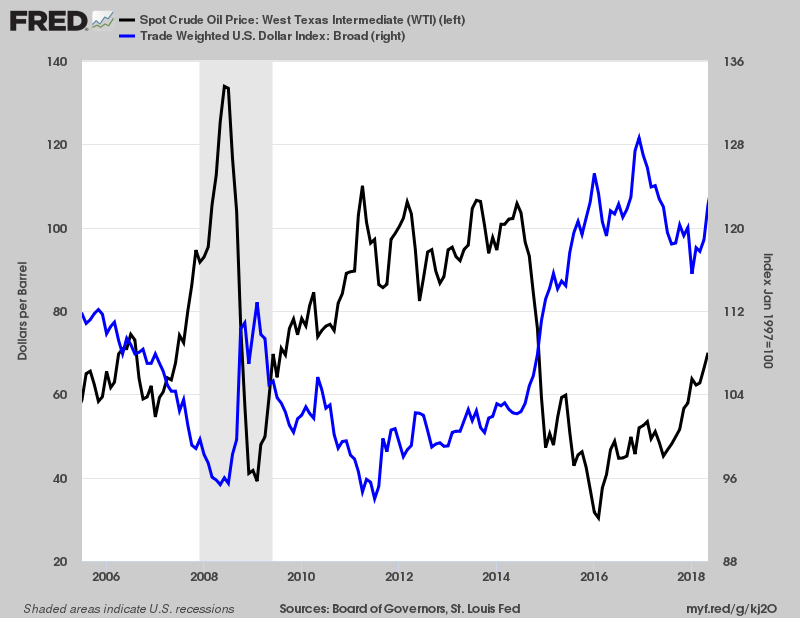

## Table of Contents

## What is the basic concept of oil-currency correlation?

The basic concept of oil-currency correlation is about how changes in oil prices can affect certain currencies. Many countries, especially those that produce a lot of oil, have their currencies closely tied to the price of oil. For example, if a country like Saudi Arabia or Russia exports a lot of oil, when oil prices go up, their currencies usually get stronger. This happens because they earn more money from selling oil, which can make their economy stronger and increase the demand for their currency.

On the other hand, countries that import a lot of oil, like Japan or many countries in Europe, can see their currencies weaken when oil prices go up. This is because they have to spend more money to buy the same amount of oil, which can put pressure on their economy and decrease the demand for their currency. So, the relationship between oil prices and currencies depends a lot on whether a country is an oil exporter or an oil importer.

## How does the price of oil affect the value of currencies?

The price of oil can have a big impact on the value of currencies, especially for countries that either produce a lot of oil or need to buy a lot of it. When oil prices go up, countries that produce and sell oil, like Saudi Arabia or Canada, usually see their currencies get stronger. This is because they make more money from selling oil, which can make their economy stronger. More people want to buy their currency to do business with them, which pushes the value of their currency up.

On the other hand, countries that have to buy a lot of oil, like Japan or many countries in Europe, can see their currencies get weaker when oil prices go up. This is because they have to spend more money to buy the same amount of oil, which can put pressure on their economy. When a country's economy is under pressure, people might not want to buy their currency as much, which can make the value of their currency go down. So, the way oil prices affect currencies depends a lot on whether a country is an oil exporter or an oil importer.

## Which currencies are most affected by changes in oil prices?

The currencies most affected by changes in oil prices are those of countries that produce a lot of oil, like Saudi Arabia, Russia, Canada, and Norway. When oil prices go up, these countries make more money from selling oil. This makes their economies stronger and more people want to buy their currencies. For example, if oil prices go up, the Canadian dollar or the Russian ruble might get stronger because Canada and Russia sell a lot of oil.

On the other hand, countries that need to buy a lot of oil, like Japan, India, and many countries in Europe, can see their currencies weaken when oil prices go up. This is because they have to spend more money to buy the same amount of oil, which can put pressure on their economies. For example, if oil prices go up, the Japanese yen or the Indian rupee might get weaker because Japan and India have to spend more on oil.

So, the currencies of oil-producing countries usually get stronger when oil prices rise, while the currencies of oil-importing countries tend to get weaker. This relationship is important for understanding how global oil prices can affect different economies around the world.

## What is the historical relationship between oil prices and the US dollar?

The relationship between oil prices and the US dollar has been pretty important over the years. Oil is usually bought and sold in US dollars, so when the US dollar gets stronger, it can make oil cheaper for countries that use other currencies. This is because they need fewer of their own dollars to buy the same amount of oil. On the other hand, when the US dollar gets weaker, oil can become more expensive for those countries because they need more of their own dollars to buy the same amount of oil.

Historically, there's been a kind of seesaw effect between oil prices and the US dollar. When oil prices go up, it can make the US dollar weaker. This happens because countries that produce oil, like Saudi Arabia or Russia, make more money and might buy more things from the US, which increases the demand for US dollars. But if oil prices go down, the US dollar can get stronger because those countries make less money and might not buy as much from the US. So, the value of the US dollar and oil prices can move in opposite directions a lot of the time.

## How do oil-exporting countries manage their currencies in relation to oil prices?

Oil-exporting countries often try to keep their currencies stable when oil prices go up and down. They do this by using something called a currency peg, where they tie their currency to the US dollar. This helps them because oil is sold in US dollars, so if their currency stays steady compared to the US dollar, they don't lose money when oil prices change. For example, countries like Saudi Arabia and the United Arab Emirates peg their currencies to the US dollar to keep things stable.

These countries also put money into special funds called sovereign wealth funds. When oil prices are high, they save some of the money they make from selling oil into these funds. Then, if oil prices drop, they can use the money in these funds to help their economy and keep their currency from getting too weak. By doing this, they can protect their economy from big swings in oil prices and keep their currency strong even when oil prices go down.

## What role do oil futures and speculative trading play in the oil-currency correlation?

Oil futures and speculative trading can make the relationship between oil prices and currencies even more complicated. Oil futures are contracts where people agree to buy or sell oil at a certain price in the future. Traders who think oil prices will go up might buy these futures, which can push oil prices higher even before the oil is actually sold. On the other hand, if traders think oil prices will go down, they might sell futures, which can push prices lower. This kind of trading can cause big swings in oil prices, which can then affect the value of currencies, especially for countries that produce or buy a lot of oil.

Speculative trading can also make the connection between oil and currencies stronger. When traders see that oil prices are going up, they might start buying the currencies of oil-producing countries, expecting those currencies to get stronger. This can make the currencies of countries like Saudi Arabia or Canada go up even more. But if traders think oil prices will fall, they might sell those currencies, which can make them weaker. So, the way traders bet on oil prices can have a big impact on how oil prices affect different currencies around the world.

## How have geopolitical events influenced the oil-currency correlation?

Geopolitical events can really shake up the relationship between oil prices and currencies. When there's trouble in places that produce a lot of oil, like wars or political problems, it can make people worried about whether oil will keep coming. This worry can push oil prices up because people want to buy oil now before it gets harder to get. When oil prices go up like this, the currencies of countries that produce oil, like Saudi Arabia or Russia, can get stronger because they make more money from selling oil. But countries that need to buy oil, like Japan or India, might see their currencies get weaker because they have to spend more money on oil.

Sometimes, big political decisions can also change how oil and currencies are connected. For example, if countries decide to stop buying oil from a certain place because of political reasons, it can mess up the usual flow of oil. This can make oil prices go up or down in unexpected ways, which can then affect currencies. If a country that produces oil suddenly can't sell as much because of these decisions, their currency might get weaker. On the other hand, if a country finds new ways to get oil because of these changes, their currency might get stronger. So, big political events can really mix things up and make the oil-currency connection more complicated.

## What economic theories explain the oil-currency correlation?

The oil-currency correlation can be explained by a few economic theories. One important theory is the terms of trade, which looks at how much a country can get for what it sells compared to what it has to pay for what it buys. For countries that sell a lot of oil, when oil prices go up, their terms of trade get better. They can buy more things from other countries with the money they make from selling oil. This makes their economy stronger and their currency more valuable. On the other hand, countries that need to buy a lot of oil have worse terms of trade when oil prices go up. They have to spend more money to get the same amount of oil, which can make their economy weaker and their currency less valuable.

Another theory is the balance of payments, which looks at the money coming into a country versus the money going out. When oil prices go up, oil-producing countries get more money from selling oil, which can improve their balance of payments. This extra money can make people want to buy their currency more, pushing its value up. For countries that import oil, higher oil prices mean they have to send more money out of the country to pay for oil, which can hurt their balance of payments. This can make people want to sell their currency more, pushing its value down. So, these economic theories help explain how changes in oil prices can lead to changes in currency values.

## How do central banks respond to fluctuations in oil prices to stabilize their currencies?

Central banks often step in to help keep their country's currency stable when oil prices go up and down. If oil prices go up a lot and make the currency weaker, the central bank might raise interest rates. Higher interest rates can make people want to buy the currency more because they can get a better return on their money. This can help make the currency stronger again. On the other hand, if oil prices drop and make the currency too strong, the central bank might lower interest rates. Lower interest rates can make people want to sell the currency because they can't get as good a return on their money, which can help keep the currency from getting too strong.

Central banks also use something called foreign exchange reserves to help manage their currency. These are big piles of money in different currencies that the central bank can use to buy or sell their own currency. If oil prices make their currency too weak, the central bank can use these reserves to buy their own currency, which can make it stronger. If oil prices make their currency too strong, the central bank can sell their own currency and buy other currencies, which can make their currency weaker. By doing these things, central banks try to keep their currency stable even when oil prices change a lot.

## What are the long-term trends in oil-currency correlation and what do they predict for the future?

Over the long term, the connection between oil prices and currencies has shown some clear trends. Countries that produce a lot of oil, like Saudi Arabia and Russia, tend to see their currencies get stronger when oil prices go up. This happens because they make more money from selling oil, which makes their economy stronger. On the other hand, countries that need to buy a lot of oil, like Japan and India, often see their currencies get weaker when oil prices go up. This is because they have to spend more money to buy the same amount of oil, which can put pressure on their economy. These trends have been pretty consistent over the years, showing that oil prices can have a big impact on currencies.

Looking into the future, the oil-currency correlation is likely to keep following these trends, but there are some new things to think about. More countries are trying to use less oil and more renewable energy, which might change how oil prices affect currencies. Also, big political events and changes in how oil is traded around the world can make the relationship between oil and currencies more complicated. So, while the basic trends might stay the same, the way oil prices affect currencies could get more unpredictable because of these new factors.

## How do global economic shifts, such as the rise of renewable energy, impact the oil-currency correlation?

The rise of renewable energy is starting to change how oil prices affect currencies. As more countries use less oil and more solar, wind, or other clean energy, they don't have to spend as much money on oil. This can make their currencies less sensitive to changes in oil prices. For countries that produce oil, like Saudi Arabia and Russia, this means their currencies might not get as strong when oil prices go up because other countries are buying less oil. So, the move towards renewable energy can weaken the connection between oil prices and currencies over time.

But it's not just about using less oil. The way the world is changing, with new technology and new ways of doing things, can also make the oil-currency connection more complicated. For example, if countries start trading oil in different currencies instead of just the US dollar, it could change how oil prices affect the US dollar and other currencies. Also, big changes in how the world economy works, like more countries trading with each other in new ways, can make it harder to predict how oil prices will affect currencies. So, while the basic idea of oil-currency correlation might stay the same, the rise of renewable energy and other global shifts can make things more unpredictable.

## What advanced econometric models are used to analyze and forecast the oil-currency correlation?

Advanced econometric models help us understand and predict how oil prices affect currencies. One popular model is the Vector Autoregression (VAR) model. This model looks at how different things, like oil prices and currency values, change together over time. It can tell us if a change in oil prices today might make a currency stronger or weaker tomorrow. Another model is the Error Correction Model (ECM), which is good at showing how oil prices and currencies move back to a normal relationship after they get out of whack. These models use a lot of math to find patterns in the data and help us make better guesses about what might happen next.

There are also more complicated models like the GARCH (Generalized Autoregressive Conditional Heteroskedasticity) model. This model is really good at understanding how the ups and downs in oil prices can make currency values change a lot. It helps us see how big the swings in currency values might be when oil prices go up and down. Plus, models like the Dynamic Conditional Correlation (DCC) model can show us how the relationship between oil prices and currencies changes over time. By using these advanced models, we can get a better idea of how oil prices might affect currencies in the future, even when the world is changing a lot.

## What is the Oil-Currency Correlation Explained?

Oil is primarily traded in the U.S. dollar, a practice that establishes a fundamental connection between oil prices and currency values. This relationship is pivotal as fluctuations in oil prices often influence the strength of currencies, particularly in countries that either export or import significant amounts of oil. 

For oil-exporting countries, such as Canada and Russia, the national income is heavily reliant on oil revenues. Consequently, their currencies, the Canadian dollar (CAD) and Russian ruble (RUB) respectively, exhibit sensitivity to changes in oil prices. When oil prices rise, these countries experience an increase in national revenue, potentially leading to an appreciation in their currency values. In contrast, a decrease in oil prices can lead to decreased revenues and a depreciation of the currency.

To understand this dynamic, consider the following simplified equation representing the balance of trade effect:

$$
\text{Currency Strength} \propto \text{Oil Revenue} - \text{Oil Import Expenditure}
$$

In this context, $\propto$ denotes proportionality. For oil-exporting countries, an increase in oil prices enhances oil revenue, improving the trade balance and potentially leading to currency appreciation. Conversely, for oil-importing countries, higher oil prices translate to increased import expenditure, which could weaken the local currency as more foreign currency is needed to purchase oil.

This correlation is consistent; however, it can be influenced by other factors such as economic policies, geopolitical events, and the overall sentiment within financial markets. Nonetheless, the intrinsic link between the U.S. dollar pricing of oil and national economies underscores the pivotal role oil prices play in determining currency value movements. As such, monitoring oil price trends is vital for [forex](/wiki/forex-system) traders and investors seeking to predict currency fluctuations and respond adeptly to market conditions.

## References & Further Reading

[1]: Bergstra, J., Bardenet, R., Bengio, Y., & Kégl, B. (2011). ["Algorithms for Hyper-Parameter Optimization."](https://dl.acm.org/doi/10.5555/2986459.2986743) Advances in Neural Information Processing Systems 24.

[2]: ["Advances in Financial Machine Learning"](https://www.amazon.com/Advances-Financial-Machine-Learning-Marcos/dp/1119482089) by Marcos Lopez de Prado

[3]: ["Evidence-Based Technical Analysis: Applying the Scientific Method and Statistical Inference to Trading Signals"](https://books.google.com/books/about/Evidence_Based_Technical_Analysis.html?id=MeoJAQAAMAAJ) by David Aronson

[4]: ["Machine Learning for Algorithmic Trading"](https://github.com/stefan-jansen/machine-learning-for-trading) by Stefan Jansen

[5]: ["Quantitative Trading: How to Build Your Own Algorithmic Trading Business"](https://www.amazon.com/Quantitative-Trading-Build-Algorithmic-Business/dp/1119800064) by Ernest P. Chan