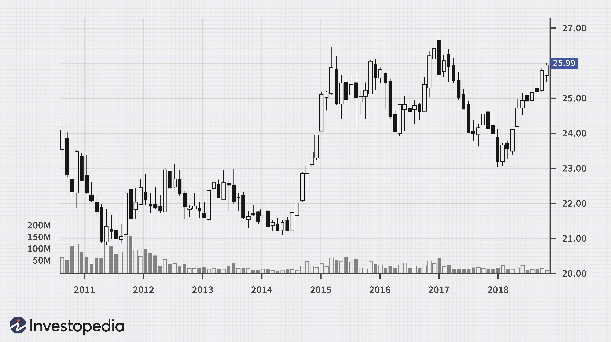

The fascinating interconnection between oil prices and currency values is a subject of great interest within the financial markets. As oil is a globally traded commodity predominantly priced in U.S. dollars, fluctuations in oil prices directly influence currency valuations. This interconnectedness becomes a crucial consideration for financial market participants who seek to understand the underlying mechanics driving these shifts. Recognizing and analyzing the correlation between oil prices and currency values can offer traders and investors strategic advantages by enhancing their ability to predict market dynamics and make informed decisions.

The study of this relationship is particularly relevant for economies heavily reliant on oil exports or imports. For countries that are major oil exporters, such as Canada and Russia, the price of oil plays a significant role in determining economic stability and currency strength. When oil prices rise, these countries often experience an increase in national income, subsequently bolstering their currency value. Conversely, for oil-importing nations, higher oil prices can result in increased costs, potentially weakening their respective currencies.



Understanding the historical and ongoing relationship between oil and currency markets provides valuable insights. Analyzing historical trends can reveal patterns of currency movements in response to oil price changes, while ongoing developments highlight the adaptive nature of economies and markets. Integrating algorithmic trading into this domain can further enhance investors' abilities to capitalize on fluctuations. Algorithmic trading utilizes computer algorithms to monitor real-time data, enabling rapid response to the dynamic interplay of oil prices and currency values. This marriage of technology and market analysis offers traders and investors a competitive edge by exploiting market inefficiencies and executing trades with precision.

In summary, the intricate relationship between oil and currency markets is a key area of focus for those engaged in financial trading and investment. By understanding this correlation and potentially leveraging algorithmic trading strategies, market participants can position themselves advantageously to navigate and capitalize on market movements.

## Table of Contents

## The Oil-Currency Correlation Explained

Oil is primarily traded in the U.S. dollar, a practice that establishes a fundamental connection between oil prices and currency values. This relationship is pivotal as fluctuations in oil prices often influence the strength of currencies, particularly in countries that either export or import significant amounts of oil. 

For oil-exporting countries, such as Canada and Russia, the national income is heavily reliant on oil revenues. Consequently, their currencies, the Canadian dollar (CAD) and Russian ruble (RUB) respectively, exhibit sensitivity to changes in oil prices. When oil prices rise, these countries experience an increase in national revenue, potentially leading to an appreciation in their currency values. In contrast, a decrease in oil prices can lead to decreased revenues and a depreciation of the currency.

To understand this dynamic, consider the following simplified equation representing the balance of trade effect:

$$
\text{Currency Strength} \propto \text{Oil Revenue} - \text{Oil Import Expenditure}
$$

In this context, $\propto$ denotes proportionality. For oil-exporting countries, an increase in oil prices enhances oil revenue, improving the trade balance and potentially leading to currency appreciation. Conversely, for oil-importing countries, higher oil prices translate to increased import expenditure, which could weaken the local currency as more foreign currency is needed to purchase oil.

This correlation is consistent; however, it can be influenced by other factors such as economic policies, geopolitical events, and the overall sentiment within financial markets. Nonetheless, the intrinsic link between the U.S. dollar pricing of oil and national economies underscores the pivotal role oil prices play in determining currency value movements. As such, monitoring oil price trends is vital for [forex](/wiki/forex-system) traders and investors seeking to predict currency fluctuations and respond adeptly to market conditions.

## Historical Development of Oil Correlations

Countries with substantial oil reserves have historically capitalized on fluctuations in oil prices to stimulate economic growth. During periods of rising oil prices, these nations often borrow against their oil reserves, leveraging expected future revenues to fund various economic initiatives. This strategy has enabled rapid development and infrastructural expansion. However, the volatile nature of oil markets can pose significant risks to economies overly reliant on oil exports.

The 2008 global financial crisis served as a stark reminder of the vulnerabilities tied to such over-reliance. The sharp downturn in economic activity resulted in a significant reduction in oil demand, leading to plummeting oil prices. Many countries that had heavily invested in oil revenues found themselves in financial distress, struggling to manage debts and maintain economic stability. This period highlighted the precarious balance these economies must navigate between benefiting from their oil wealth and mitigating the risks of dependency.

A similar scenario unfolded during the 2014 oil price collapse, triggered by a combination of increased production by oil-producing nations such as the United States and decreased global demand. This sudden drop in prices placed considerable pressure on oil-dependent economies, exposing fiscal and economic vulnerabilities. Countries with more diversified economies weathered the storm comparatively better, demonstrating resilience through alternative revenue streams and economic activities.

Diversification is a critical strategy for oil-exporting countries to mitigate the impact of oil price [volatility](/wiki/volatility-trading-strategies). By broadening their economic base, these nations can cushion against the shocks of fluctuating oil prices. This approach enables a more stable economic environment, reducing the risk of financial distress in the face of adverse market movements. The historical context underscores the necessity for oil-reliant countries to pursue economic diversification as a long-term strategy for sustainable growth and stability in an inherently volatile market.

## Impacts of Oil Price on Major Currencies

The impact of oil prices on major currencies is a significant aspect of forex trading, particularly for currencies of countries heavily involved in oil exports or imports. The USD/CAD currency pair is one such example, demonstrating high sensitivity to oil price movements. This sensitivity is largely due to Canada's role as a major oil exporter. When oil prices rise, the Canadian economy benefits from increased revenue, often leading to a strengthening of the Canadian dollar (CAD) against the U.S. dollar (USD). Conversely, when oil prices fall, the CAD often weakens against the USD, illustrating a positive correlation between oil prices and the value of the Canadian dollar.

Similarly, the Russian ruble exhibits a strong relationship with oil prices due to Russia's substantial reliance on energy exports, particularly oil and natural gas. Fluctuations in oil prices can lead to corresponding changes in the value of the ruble. When oil prices increase, Russia experiences a surge in export revenues, which can bolster the ruble. On the other hand, declining oil prices can strain the Russian economy and put downward pressure on the ruble.

These relationships between oil prices and currency values offer traders valuable insights for predicting movements in the forex market. By understanding the oil-currency correlation, traders can anticipate potential changes in currency pairs, such as USD/CAD or USD/RUB, and make informed trading decisions. For example, anticipating a rise in oil prices might prompt a trader to take a long position on the CAD against the USD, expecting the Canadian dollar to appreciate. Similarly, knowing the impact of oil price drops could lead a trader to short the Russian ruble, anticipating its depreciation.

To exploit these opportunities, traders might employ various strategies, including [algorithmic trading](/wiki/algorithmic-trading), to automate the analysis and execution of trades based on oil price fluctuations. This approach can enhance reaction time and decision-making accuracy, providing a strategic advantage in fast-moving forex markets. Understanding and leveraging oil price impacts on major currencies is thus a critical component for successful trading.

## Algorithmic Trading Strategies

Algorithmic trading employs sophisticated computer algorithms to analyze and capitalize on the correlation between oil prices and currency movements. These algorithms are designed to automatically execute trades based on predefined criteria linked to fluctuations in oil prices. For instance, a trader might set an algorithm to initiate a buy order on a currency pair such as USD/CAD when oil prices rise, given the historical correlation between the Canadian dollar and oil price movements.

The primary advantage of algorithmic trading lies in its speed and efficiency. Algorithms can process large volumes of data at incredible speeds, far surpassing human capabilities. This is particularly crucial in fast-moving markets where quick decision-making can be the difference between profit and loss. Moreover, algorithmic trading minimizes the emotional component of trading, which often leads to impulsive decisions in human traders.

For instance, consider a simple algorithm implemented in Python, using libraries such as pandas and NumPy for data handling:

```python
import pandas as pd
import numpy as np

# Sample function to execute trades based on oil price changes
def trade_on_oil_price(oil_prices, currency_pair_data, threshold):
    # Find the percentage change in oil prices
    oil_pct_change = oil_prices.pct_change() * 100

    # Generate buy/sell signals
    signals = np.where(oil_pct_change > threshold, "Buy", np.where(oil_pct_change < -threshold, "Sell", "Hold"))

    currency_pair_data['Signals'] = signals

    # Execute trades based on signals
    # This can be replaced with actual trading logic
    for index, signal in enumerate(currency_pair_data['Signals']):
        if signal == "Buy":
            print(f"Buying currency pair at index {index}")
        elif signal == "Sell":
            print(f"Selling currency pair at index {index}")

    return currency_pair_data

# Example usage with mock data
oil_prices = pd.Series([50, 52, 51, 55, 58])
currency_pair_data = pd.DataFrame({'Rates': [1.2, 1.21, 1.19, 1.23, 1.25]})

trade_on_oil_price(oil_prices, currency_pair_data, threshold=2)  # Threshold set at 2% change
```

This simple strategy calculates percentage changes in oil prices and generates trading signals ('Buy', 'Sell', 'Hold') based on a specified threshold. While rudimentary, this example illustrates how algorithms can be customized to exploit particular market conditions.

Moreover, with advancements in [machine learning](/wiki/machine-learning) and [artificial intelligence](/wiki/ai-artificial-intelligence), algorithmic trading can become more sophisticated, allowing for real-time adaptation to market conditions, predictive analytics, and even semi-autonomous trading systems that can refine strategies over time. As such, algorithmic trading serves as a potent vehicle for traders and investors seeking to harness the dynamism of the oil-currency relationship.

## Challenges and Opportunities

While correlations between oil prices and currency values can be consistent, they are not immune to various external influences. Geopolitical events, such as conflicts in major oil-producing regions, can drastically affect oil prices and, consequently, the strength of certain currencies. For instance, tensions in the Middle East often lead to spikes in oil prices, affecting currencies of oil-exporting and importing nations differently. Shifting market sentiments, driven by investor perceptions and economic forecasts, also play a crucial role in these correlations. Economic policies, including those related to oil production levels set by organizations like OPEC, directly impact oil supply and prices, further influencing currency values.

Algorithmic trading, which utilizes computational algorithms to identify and capitalize on these correlations, must be meticulously designed to consider these variables. The algorithms can leverage machine learning to adapt to new data, but they require robust models that can process diverse data inputs, including historical prices, geopolitical news, and economic indicators. Python, with libraries like pandas for data manipulation, scikit-learn for machine learning, and NumPy for numerical computations, is often used for developing these models.

```python
import pandas as pd
import numpy as np
from sklearn.ensemble import RandomForestRegressor
from sklearn.model_selection import train_test_split

# Example of an algorithmic model using Random Forest to predict currency movement based on oil prices
# Load your dataset, combining oil prices and currency values
data = pd.read_csv('oil_currency_data.csv')

# Features and target variable
X = data[['OilPrice', 'OtherRelevantFeatures']]
y = data['CurrencyValue']

# Split the data into training and testing sets
X_train, X_test, y_train, y_test = train_test_split(X, y, test_size=0.2, random_state=42)

# Initialize the model
model = RandomForestRegressor(n_estimators=100, random_state=42)

# Train the model
model.fit(X_train, y_train)

# Predict on the test data
predictions = model.predict(X_test)

# Evaluate model performance
errors = abs(predictions - y_test)
mean_error = np.mean(errors)

print(f'Mean Absolute Error: {mean_error}')
```

Despite these challenges, the opportunity for profit remains compelling. Successfully predicting currency movements linked to oil prices can yield substantial returns for traders who skillfully navigate the complexities of these markets. Traders must stay informed and adapt their strategies regularly to accommodate the multifaceted nature of oil-currency correlations. This presents a significant challenge, but also a pathway to potentially lucrative trading strategies.

## Conclusion

Understanding the correlation between oil prices and currency values can significantly enhance trading strategies by offering traders insights into potential market movements. Algorithmic trading stands out as a powerful tool in this context, enabling traders to swiftly react to changes in oil prices. These algorithms can process vast amounts of data, execute trades with high speed, and apply complex criteria to identify favorable trading opportunities, thereby increasing the likelihood of successful trades.

Algorithmic trading systems can incorporate real-time data on oil prices and currency values to generate trading signals. For example, a trader might use a Python script that continuously fetches live oil price data and currency exchange rates, executing trades based on predefined conditions such as:

```python
import requests

# Fetch live oil price data
def get_oil_price():
    response = requests.get("https://api.oilpricedata.com/live")
    return response.json()["price"]

# Fetch live currency exchange rate
def get_currency_rate(currency_pair):
    response = requests.get(f"https://api.forexdata.com/live?pair={currency_pair}")
    return response.json()["rate"]

# Simple trading logic
def trade_oil_currency(oil_threshold, currency_pair):
    oil_price = get_oil_price()
    currency_rate = get_currency_rate(currency_pair)

    if oil_price > oil_threshold:
        # Execute a buy order if oil price is above the threshold
        print("Execute buy order for", currency_pair)
    else:
        # Execute a sell order otherwise
        print("Execute sell order for", currency_pair)

# Example usage
trade_oil_currency(70, "USD/CAD")
```

For those willing to navigate the complexities of the market, trading based on oil-currency correlations presents not only a substantial challenge but also a substantial opportunity for reward. However, traders must consider additional variables such as geopolitical events, economic policies, and market sentiments, which can influence these correlations. Successful trading strategies, therefore, require a comprehensive understanding of these factors and constant adaptation to rapidly changing market conditions. Achieving this balance can yield significant profits and establish a competitive edge in the financial markets.

## References & Further Reading

[1]: Bergstra, J., Bardenet, R., Bengio, Y., & Kégl, B. (2011). ["Algorithms for Hyper-Parameter Optimization."](https://dl.acm.org/doi/10.5555/2986459.2986743) Advances in Neural Information Processing Systems 24.

[2]: ["Advances in Financial Machine Learning"](https://www.amazon.com/Advances-Financial-Machine-Learning-Marcos/dp/1119482089) by Marcos Lopez de Prado

[3]: ["Evidence-Based Technical Analysis: Applying the Scientific Method and Statistical Inference to Trading Signals"](https://books.google.com/books/about/Evidence_Based_Technical_Analysis.html?id=MeoJAQAAMAAJ) by David Aronson

[4]: ["Machine Learning for Algorithmic Trading"](https://github.com/stefan-jansen/machine-learning-for-trading) by Stefan Jansen

[5]: ["Quantitative Trading: How to Build Your Own Algorithmic Trading Business"](https://www.amazon.com/Quantitative-Trading-Build-Algorithmic-Business/dp/1119800064) by Ernest P. Chan